# Boro Player Predictions - Current Market Value

## 1. Business Understanding

* Determine Busines Objectives
* Situation Assessment
* Determine Data Mining Goal
* Produce Project Plan

The aim of this project is to see if we can use data on players at Middlesbrough Football Club to make preditions about the player's and the team's current and future performance.

We have player data from Transfermarkt, ESPN, WhoScored and Fly Me To The Moon (fanzine).

"Performance" could be measured in many different ways: Results on the pitch, market value, fan popularity, churn, ...

A number of key performance metrics will be investigated in turn, looking at how predictable each is...

1) Current market value

2) Current fan popularity

3) Current performance rating

... and more TBC ...

## 2. Data Understanding

* Collect Initial Data
* Describe Data
* Explore Data
* Verify Data Quality

    Loading Transfermarkt general information...
    tmk_cnt_mbr_all_0910.csv
    tmk_cnt_mbr_all_1011.csv
    tmk_cnt_mbr_all_1112.csv
    tmk_cnt_mbr_all_1213.csv
    tmk_cnt_mbr_all_1314.csv
    tmk_cnt_mbr_all_1415.csv
    tmk_cnt_mbr_all_1516.csv
    tmk_cnt_mbr_all_1617.csv
    tmk_cnt_mbr_all_1718.csv
    tmk_cnt_mbr_all_1819.csv
    tmk_cnt_mbr_all_1920.csv
    

    Random sample of records...
    

<table border="1" class="dataframe">
  <thead>
    <tr style="text-align: right;">
      <th></th>
      <th>Shirt number</th>
      <th>Position</th>
      <th>Name</th>
      <th>Date of birth</th>
      <th>Height</th>
      <th>Foot</th>
      <th>Joined</th>
      <th>Contract expires</th>
      <th>Market value</th>
      <th>Season</th>
      <th>Position group</th>
      <th>Age</th>
    </tr>
  </thead>
  <tbody>
    <tr>
      <th>240</th>
      <td>NaN</td>
      <td>Centre Forward</td>
      <td>Bartholomew Ogbeche</td>
      <td>1984-10-01</td>
      <td>178.0</td>
      <td>both</td>
      <td>2011-10-01</td>
      <td>NaT</td>
      <td>0.450</td>
      <td>11/12</td>
      <td>F</td>
      <td>26</td>
    </tr>
    <tr>
      <th>518</th>
      <td>7.0</td>
      <td>Central Midfield</td>
      <td>Grant Leadbitter</td>
      <td>1986-01-07</td>
      <td>177.0</td>
      <td>right</td>
      <td>2012-07-01</td>
      <td>2017-06-30</td>
      <td>1.500</td>
      <td>15/16</td>
      <td>M</td>
      <td>30</td>
    </tr>
    <tr>
      <th>611</th>
      <td>NaN</td>
      <td>Keeper</td>
      <td>Tomás Mejías</td>
      <td>1989-01-30</td>
      <td>195.0</td>
      <td>right</td>
      <td>2014-07-05</td>
      <td>2018-06-30</td>
      <td>0.225</td>
      <td>17/18</td>
      <td>G</td>
      <td>29</td>
    </tr>
    <tr>
      <th>28</th>
      <td>NaN</td>
      <td>Left-Back</td>
      <td>Andrew Taylor</td>
      <td>1986-08-01</td>
      <td>178.0</td>
      <td>left</td>
      <td>2005-07-01</td>
      <td>NaT</td>
      <td>1.880</td>
      <td>09/10</td>
      <td>D</td>
      <td>22</td>
    </tr>
    <tr>
      <th>274</th>
      <td>NaN</td>
      <td>Right-Back</td>
      <td>Justin Hoyte</td>
      <td>1984-11-20</td>
      <td>180.0</td>
      <td>right</td>
      <td>2008-08-01</td>
      <td>NaT</td>
      <td>1.130</td>
      <td>12/13</td>
      <td>D</td>
      <td>27</td>
    </tr>
    <tr>
      <th>48</th>
      <td>NaN</td>
      <td>Defensive Midfield</td>
      <td>Isaiah Osbourne</td>
      <td>1987-11-05</td>
      <td>188.0</td>
      <td>right</td>
      <td>2009-11-06</td>
      <td>NaT</td>
      <td>0.375</td>
      <td>09/10</td>
      <td>M</td>
      <td>21</td>
    </tr>
    <tr>
      <th>618</th>
      <td>NaN</td>
      <td>Centre-Back</td>
      <td>Daniel Ayala</td>
      <td>1990-11-07</td>
      <td>190.0</td>
      <td>right</td>
      <td>2014-01-24</td>
      <td>2020-06-30</td>
      <td>1.800</td>
      <td>17/18</td>
      <td>D</td>
      <td>27</td>
    </tr>
    <tr>
      <th>198</th>
      <td>NaN</td>
      <td>Left-Back</td>
      <td>Joe Bennett</td>
      <td>1990-03-28</td>
      <td>177.0</td>
      <td>left</td>
      <td>2008-07-01</td>
      <td>NaT</td>
      <td>0.188</td>
      <td>11/12</td>
      <td>D</td>
      <td>21</td>
    </tr>
  </tbody>
</table>

    Summary of whole data source...
    

<table border="1" class="dataframe">
  <thead>
    <tr style="text-align: right;">
      <th></th>
      <th>Shirt number</th>
      <th>Position</th>
      <th>Name</th>
      <th>Date of birth</th>
      <th>Height</th>
      <th>Foot</th>
      <th>Joined</th>
      <th>Contract expires</th>
      <th>Market value</th>
      <th>Season</th>
      <th>Position group</th>
      <th>Age</th>
    </tr>
  </thead>
  <tbody>
    <tr>
      <th>count</th>
      <td>101.000</td>
      <td>364</td>
      <td>364</td>
      <td>364</td>
      <td>356.000</td>
      <td>324</td>
      <td>351</td>
      <td>169</td>
      <td>330.000</td>
      <td>364</td>
      <td>364</td>
      <td>364.000</td>
    </tr>
    <tr>
      <th>unique</th>
      <td>NaN</td>
      <td>19</td>
      <td>171</td>
      <td>169</td>
      <td>NaN</td>
      <td>3</td>
      <td>126</td>
      <td>12</td>
      <td>NaN</td>
      <td>11</td>
      <td>4</td>
      <td>NaN</td>
    </tr>
    <tr>
      <th>top</th>
      <td>NaN</td>
      <td>Centre Back</td>
      <td>Ben Gibson</td>
      <td>1993-01-15 00:00:00</td>
      <td>NaN</td>
      <td>right</td>
      <td>2010-07-01 00:00:00</td>
      <td>2020-06-30 00:00:00</td>
      <td>NaN</td>
      <td>09/10</td>
      <td>M</td>
      <td>NaN</td>
    </tr>
    <tr>
      <th>freq</th>
      <td>NaN</td>
      <td>53</td>
      <td>9</td>
      <td>9</td>
      <td>NaN</td>
      <td>201</td>
      <td>31</td>
      <td>28</td>
      <td>NaN</td>
      <td>47</td>
      <td>134</td>
      <td>NaN</td>
    </tr>
    <tr>
      <th>first</th>
      <td>NaN</td>
      <td>NaN</td>
      <td>NaN</td>
      <td>1973-08-27 00:00:00</td>
      <td>NaN</td>
      <td>NaN</td>
      <td>2000-07-01 00:00:00</td>
      <td>2016-05-31 00:00:00</td>
      <td>NaN</td>
      <td>NaN</td>
      <td>NaN</td>
      <td>NaN</td>
    </tr>
    <tr>
      <th>last</th>
      <td>NaN</td>
      <td>NaN</td>
      <td>NaN</td>
      <td>2000-08-09 00:00:00</td>
      <td>NaN</td>
      <td>NaN</td>
      <td>2020-01-31 00:00:00</td>
      <td>2023-06-30 00:00:00</td>
      <td>NaN</td>
      <td>NaN</td>
      <td>NaN</td>
      <td>NaN</td>
    </tr>
    <tr>
      <th>mean</th>
      <td>17.495</td>
      <td>NaN</td>
      <td>NaN</td>
      <td>NaN</td>
      <td>183.287</td>
      <td>NaN</td>
      <td>NaN</td>
      <td>NaN</td>
      <td>1.696</td>
      <td>NaN</td>
      <td>NaN</td>
      <td>24.827</td>
    </tr>
    <tr>
      <th>std</th>
      <td>10.850</td>
      <td>NaN</td>
      <td>NaN</td>
      <td>NaN</td>
      <td>6.029</td>
      <td>NaN</td>
      <td>NaN</td>
      <td>NaN</td>
      <td>1.776</td>
      <td>NaN</td>
      <td>NaN</td>
      <td>4.697</td>
    </tr>
    <tr>
      <th>min</th>
      <td>1.000</td>
      <td>NaN</td>
      <td>NaN</td>
      <td>NaN</td>
      <td>167.000</td>
      <td>NaN</td>
      <td>NaN</td>
      <td>NaN</td>
      <td>0.038</td>
      <td>NaN</td>
      <td>NaN</td>
      <td>16.000</td>
    </tr>
    <tr>
      <th>25%</th>
      <td>8.000</td>
      <td>NaN</td>
      <td>NaN</td>
      <td>NaN</td>
      <td>179.000</td>
      <td>NaN</td>
      <td>NaN</td>
      <td>NaN</td>
      <td>0.375</td>
      <td>NaN</td>
      <td>NaN</td>
      <td>21.000</td>
    </tr>
    <tr>
      <th>50%</th>
      <td>18.000</td>
      <td>NaN</td>
      <td>NaN</td>
      <td>NaN</td>
      <td>183.000</td>
      <td>NaN</td>
      <td>NaN</td>
      <td>NaN</td>
      <td>1.130</td>
      <td>NaN</td>
      <td>NaN</td>
      <td>25.000</td>
    </tr>
    <tr>
      <th>75%</th>
      <td>25.000</td>
      <td>NaN</td>
      <td>NaN</td>
      <td>NaN</td>
      <td>188.000</td>
      <td>NaN</td>
      <td>NaN</td>
      <td>NaN</td>
      <td>2.250</td>
      <td>NaN</td>
      <td>NaN</td>
      <td>28.000</td>
    </tr>
    <tr>
      <th>max</th>
      <td>40.000</td>
      <td>NaN</td>
      <td>NaN</td>
      <td>NaN</td>
      <td>199.000</td>
      <td>NaN</td>
      <td>NaN</td>
      <td>NaN</td>
      <td>10.800</td>
      <td>NaN</td>
      <td>NaN</td>
      <td>40.000</td>
    </tr>
  </tbody>
</table>

**ANALYSIS:** So the data is looking broadly in good shape, but there are a few missing values to consider...

<table border="1" class="dataframe">
  <thead>
    <tr style="text-align: right;">
      <th></th>
      <th>% populated</th>
    </tr>
  </thead>
  <tbody>
    <tr>
      <th>Shirt number</th>
      <td>27.747</td>
    </tr>
    <tr>
      <th>Position</th>
      <td>100.000</td>
    </tr>
    <tr>
      <th>Name</th>
      <td>100.000</td>
    </tr>
    <tr>
      <th>Date of birth</th>
      <td>100.000</td>
    </tr>
    <tr>
      <th>Height</th>
      <td>97.802</td>
    </tr>
    <tr>
      <th>Foot</th>
      <td>89.011</td>
    </tr>
    <tr>
      <th>Joined</th>
      <td>96.429</td>
    </tr>
    <tr>
      <th>Contract expires</th>
      <td>46.429</td>
    </tr>
    <tr>
      <th>Market value</th>
      <td>90.659</td>
    </tr>
    <tr>
      <th>Season</th>
      <td>100.000</td>
    </tr>
    <tr>
      <th>Position group</th>
      <td>100.000</td>
    </tr>
    <tr>
      <th>Age</th>
      <td>100.000</td>
    </tr>
  </tbody>
</table>

    Players with missing Joined dates...
    

<table border="1" class="dataframe">
  <thead>
    <tr style="text-align: right;">
      <th></th>
      <th>156</th>
      <th>220</th>
      <th>300</th>
      <th>374</th>
      <th>454</th>
      <th>26</th>
      <th>120</th>
      <th>194</th>
      <th>266</th>
      <th>348</th>
      <th>416</th>
      <th>490</th>
      <th>547</th>
      <th>616</th>
      <th>24</th>
      <th>122</th>
      <th>282</th>
      <th>364</th>
      <th>440</th>
      <th>512</th>
      <th>60</th>
      <th>154</th>
      <th>218</th>
      <th>298</th>
      <th>102</th>
      <th>182</th>
      <th>250</th>
      <th>334</th>
      <th>406</th>
      <th>482</th>
      <th>542</th>
      <th>92</th>
      <th>174</th>
      <th>242</th>
      <th>322</th>
      <th>396</th>
      <th>476</th>
    </tr>
  </thead>
  <tbody>
    <tr>
      <th>Name</th>
      <td>Adam Reach</td>
      <td>Adam Reach</td>
      <td>Adam Reach</td>
      <td>Adam Reach</td>
      <td>Adam Reach</td>
      <td>Ben Gibson</td>
      <td>Ben Gibson</td>
      <td>Ben Gibson</td>
      <td>Ben Gibson</td>
      <td>Ben Gibson</td>
      <td>Ben Gibson</td>
      <td>Ben Gibson</td>
      <td>Ben Gibson</td>
      <td>Ben Gibson</td>
      <td>Bruno Pilatos</td>
      <td>Bruno Pilatos</td>
      <td>Bryn Morris</td>
      <td>Bryn Morris</td>
      <td>Bryn Morris</td>
      <td>Bryn Morris</td>
      <td>Cameron Park</td>
      <td>Cameron Park</td>
      <td>Cameron Park</td>
      <td>Cameron Park</td>
      <td>Connor Ripley</td>
      <td>Connor Ripley</td>
      <td>Connor Ripley</td>
      <td>Connor Ripley</td>
      <td>Connor Ripley</td>
      <td>Connor Ripley</td>
      <td>Connor Ripley</td>
      <td>Luke Williams</td>
      <td>Luke Williams</td>
      <td>Luke Williams</td>
      <td>Luke Williams</td>
      <td>Luke Williams</td>
      <td>Luke Williams</td>
    </tr>
    <tr>
      <th>Season</th>
      <td>10/11</td>
      <td>11/12</td>
      <td>12/13</td>
      <td>13/14</td>
      <td>14/15</td>
      <td>09/10</td>
      <td>10/11</td>
      <td>11/12</td>
      <td>12/13</td>
      <td>13/14</td>
      <td>14/15</td>
      <td>15/16</td>
      <td>16/17</td>
      <td>17/18</td>
      <td>09/10</td>
      <td>10/11</td>
      <td>12/13</td>
      <td>13/14</td>
      <td>14/15</td>
      <td>15/16</td>
      <td>09/10</td>
      <td>10/11</td>
      <td>11/12</td>
      <td>12/13</td>
      <td>10/11</td>
      <td>11/12</td>
      <td>12/13</td>
      <td>13/14</td>
      <td>14/15</td>
      <td>15/16</td>
      <td>16/17</td>
      <td>09/10</td>
      <td>10/11</td>
      <td>11/12</td>
      <td>12/13</td>
      <td>13/14</td>
      <td>14/15</td>
    </tr>
    <tr>
      <th>Joined</th>
      <td>NaT</td>
      <td>2011-07-01 00:00:00</td>
      <td>2011-07-01 00:00:00</td>
      <td>2011-07-01 00:00:00</td>
      <td>2011-07-01 00:00:00</td>
      <td>NaT</td>
      <td>2010-07-01 00:00:00</td>
      <td>2010-07-01 00:00:00</td>
      <td>2010-07-01 00:00:00</td>
      <td>2010-07-01 00:00:00</td>
      <td>2010-07-01 00:00:00</td>
      <td>2010-07-01 00:00:00</td>
      <td>2011-07-01 00:00:00</td>
      <td>2011-07-01 00:00:00</td>
      <td>NaT</td>
      <td>2010-07-01 00:00:00</td>
      <td>NaT</td>
      <td>2014-01-01 00:00:00</td>
      <td>2014-01-01 00:00:00</td>
      <td>2014-01-01 00:00:00</td>
      <td>NaT</td>
      <td>NaT</td>
      <td>2011-07-01 00:00:00</td>
      <td>2011-07-01 00:00:00</td>
      <td>NaT</td>
      <td>2011-07-01 00:00:00</td>
      <td>2011-07-01 00:00:00</td>
      <td>2011-07-01 00:00:00</td>
      <td>2011-07-01 00:00:00</td>
      <td>2011-07-01 00:00:00</td>
      <td>2011-07-01 00:00:00</td>
      <td>NaT</td>
      <td>2010-07-01 00:00:00</td>
      <td>2010-07-01 00:00:00</td>
      <td>2010-07-01 00:00:00</td>
      <td>2010-07-01 00:00:00</td>
      <td>2010-07-01 00:00:00</td>
    </tr>
  </tbody>
</table>

    Players with missing Contract expires dates...
    

<table border="1" class="dataframe">
  <thead>
    <tr style="text-align: right;">
      <th></th>
      <th>156</th>
      <th>220</th>
      <th>300</th>
      <th>374</th>
      <th>454</th>
      <th>26</th>
      <th>120</th>
      <th>194</th>
      <th>266</th>
      <th>348</th>
      <th>416</th>
      <th>490</th>
      <th>547</th>
      <th>616</th>
      <th>282</th>
      <th>364</th>
      <th>440</th>
      <th>512</th>
      <th>102</th>
      <th>182</th>
      <th>250</th>
      <th>334</th>
      <th>406</th>
      <th>482</th>
      <th>542</th>
      <th>384</th>
      <th>466</th>
      <th>470</th>
      <th>603</th>
      <th>661</th>
      <th>330</th>
      <th>400</th>
      <th>486</th>
      <th>611</th>
      <th>726</th>
    </tr>
  </thead>
  <tbody>
    <tr>
      <th>Name</th>
      <td>Adam Reach</td>
      <td>Adam Reach</td>
      <td>Adam Reach</td>
      <td>Adam Reach</td>
      <td>Adam Reach</td>
      <td>Ben Gibson</td>
      <td>Ben Gibson</td>
      <td>Ben Gibson</td>
      <td>Ben Gibson</td>
      <td>Ben Gibson</td>
      <td>Ben Gibson</td>
      <td>Ben Gibson</td>
      <td>Ben Gibson</td>
      <td>Ben Gibson</td>
      <td>Bryn Morris</td>
      <td>Bryn Morris</td>
      <td>Bryn Morris</td>
      <td>Bryn Morris</td>
      <td>Connor Ripley</td>
      <td>Connor Ripley</td>
      <td>Connor Ripley</td>
      <td>Connor Ripley</td>
      <td>Connor Ripley</td>
      <td>Connor Ripley</td>
      <td>Connor Ripley</td>
      <td>Lee Tomlin</td>
      <td>Lee Tomlin</td>
      <td>Patrick Bamford</td>
      <td>Patrick Bamford</td>
      <td>Patrick Bamford</td>
      <td>Tomás Mejías</td>
      <td>Tomás Mejías</td>
      <td>Tomás Mejías</td>
      <td>Tomás Mejías</td>
      <td>Tomás Mejías</td>
    </tr>
    <tr>
      <th>Season</th>
      <td>10/11</td>
      <td>11/12</td>
      <td>12/13</td>
      <td>13/14</td>
      <td>14/15</td>
      <td>09/10</td>
      <td>10/11</td>
      <td>11/12</td>
      <td>12/13</td>
      <td>13/14</td>
      <td>14/15</td>
      <td>15/16</td>
      <td>16/17</td>
      <td>17/18</td>
      <td>12/13</td>
      <td>13/14</td>
      <td>14/15</td>
      <td>15/16</td>
      <td>10/11</td>
      <td>11/12</td>
      <td>12/13</td>
      <td>13/14</td>
      <td>14/15</td>
      <td>15/16</td>
      <td>16/17</td>
      <td>13/14</td>
      <td>14/15</td>
      <td>14/15</td>
      <td>16/17</td>
      <td>17/18</td>
      <td>13/14</td>
      <td>14/15</td>
      <td>15/16</td>
      <td>17/18</td>
      <td>19/20</td>
    </tr>
    <tr>
      <th>Contract expires</th>
      <td>NaT</td>
      <td>2019-06-30 00:00:00</td>
      <td>2019-06-30 00:00:00</td>
      <td>2019-06-30 00:00:00</td>
      <td>2019-06-30 00:00:00</td>
      <td>NaT</td>
      <td>2019-06-30 00:00:00</td>
      <td>2019-06-30 00:00:00</td>
      <td>2019-06-30 00:00:00</td>
      <td>2019-06-30 00:00:00</td>
      <td>2019-06-30 00:00:00</td>
      <td>2019-06-30 00:00:00</td>
      <td>2021-06-30 00:00:00</td>
      <td>2022-06-30 00:00:00</td>
      <td>NaT</td>
      <td>2016-06-30 00:00:00</td>
      <td>2016-06-30 00:00:00</td>
      <td>2016-06-30 00:00:00</td>
      <td>NaT</td>
      <td>NaT</td>
      <td>NaT</td>
      <td>NaT</td>
      <td>NaT</td>
      <td>2018-06-30 00:00:00</td>
      <td>2018-06-30 00:00:00</td>
      <td>NaT</td>
      <td>2017-06-30 00:00:00</td>
      <td>NaT</td>
      <td>2021-06-30 00:00:00</td>
      <td>2021-06-30 00:00:00</td>
      <td>NaT</td>
      <td>2018-06-30 00:00:00</td>
      <td>2018-06-30 00:00:00</td>
      <td>2018-06-30 00:00:00</td>
      <td>2021-06-30 00:00:00</td>
    </tr>
  </tbody>
</table>

**ANALYSIS:** _Possibly_ we could back fill some missing `Joined` and `Contract expires` dates but this might have some undesired consequences because the date _might_ not be valid for that particular season. We'll leave them as Nulls for now.

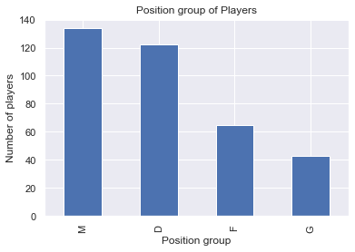

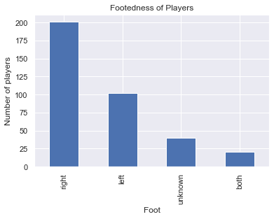

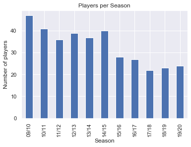

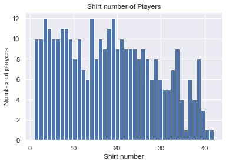

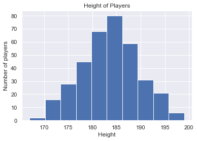

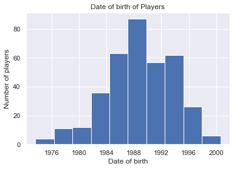

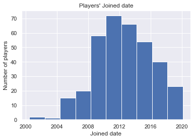

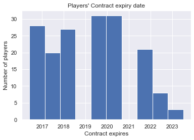

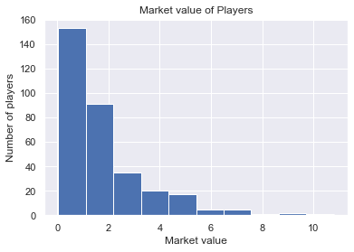

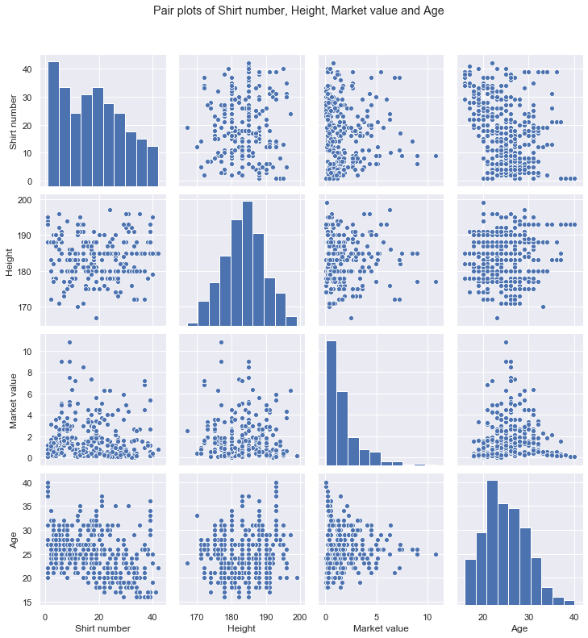

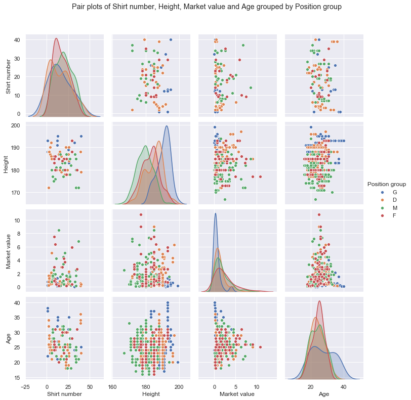

    C:\Users\adeacon\AppData\Local\Continuum\miniconda3\envs\tbir\lib\site-packages\seaborn\distributions.py:283: UserWarning: Data must have variance to compute a kernel density estimate.
      warnings.warn(msg, UserWarning)
    

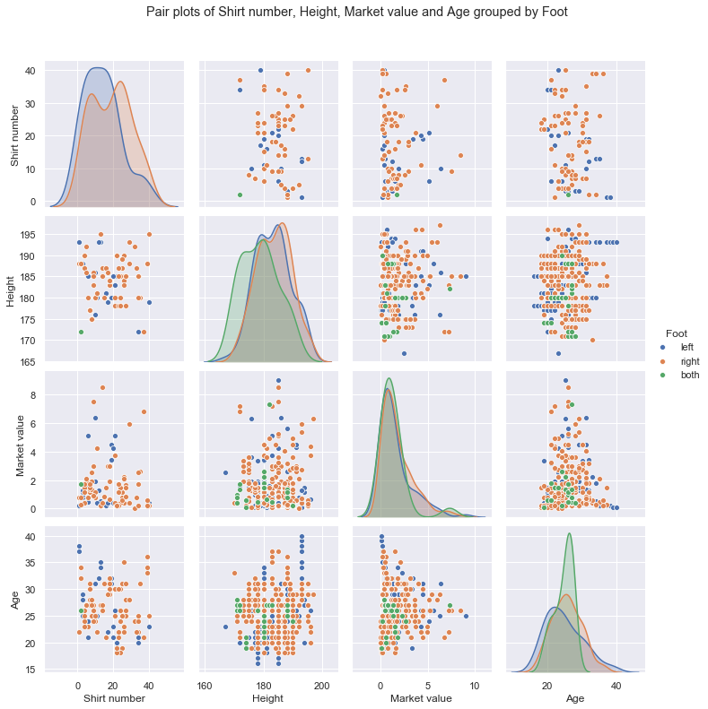

    Loading Transfermarkt performance summary...
    tmk_psm_mbr_chm_0910.csv
    tmk_psm_mbr_chm_1011.csv
    tmk_psm_mbr_chm_1112.csv
    tmk_psm_mbr_chm_1213.csv
    tmk_psm_mbr_chm_1314.csv
    tmk_psm_mbr_chm_1415.csv
    tmk_psm_mbr_chm_1516.csv
    tmk_psm_mbr_chm_1718.csv
    tmk_psm_mbr_chm_1819.csv
    tmk_psm_mbr_chm_1920.csv
    tmk_psm_mbr_cpo_1415.csv
    tmk_psm_mbr_cpo_1718.csv
    tmk_psm_mbr_fac_0910.csv
    tmk_psm_mbr_fac_1011.csv
    tmk_psm_mbr_fac_1112.csv
    tmk_psm_mbr_fac_1213.csv
    tmk_psm_mbr_fac_1314.csv
    tmk_psm_mbr_fac_1415.csv
    tmk_psm_mbr_fac_1516.csv
    tmk_psm_mbr_fac_1617.csv
    tmk_psm_mbr_fac_1718.csv
    tmk_psm_mbr_fac_1819.csv
    tmk_psm_mbr_fac_1920.csv
    tmk_psm_mbr_lec_0910.csv
    tmk_psm_mbr_lec_1011.csv
    tmk_psm_mbr_lec_1112.csv
    tmk_psm_mbr_lec_1213.csv
    tmk_psm_mbr_lec_1314.csv
    tmk_psm_mbr_lec_1415.csv
    tmk_psm_mbr_lec_1516.csv
    tmk_psm_mbr_lec_1617.csv
    tmk_psm_mbr_lec_1718.csv
    tmk_psm_mbr_lec_1819.csv
    tmk_psm_mbr_lec_1920.csv
    tmk_psm_mbr_prm_1617.csv
    

    Random sample of records...
    

<table border="1" class="dataframe">
  <thead>
    <tr style="text-align: right;">
      <th></th>
      <th>Shirt number</th>
      <th>Position</th>
      <th>Name</th>
      <th>Age</th>
      <th>In squad</th>
      <th>Games started</th>
      <th>Goals</th>
      <th>Assists</th>
      <th>Yellow cards</th>
      <th>Second yellow cards</th>
      <th>Red cards</th>
      <th>Substitutions on</th>
      <th>Substitutions off</th>
      <th>PPG</th>
      <th>Minutes played</th>
      <th>Season</th>
      <th>Competition</th>
      <th>Position group</th>
    </tr>
  </thead>
  <tbody>
    <tr>
      <th>665</th>
      <td>5.0</td>
      <td>Right-Back</td>
      <td>Ryan Shotton</td>
      <td>30.0</td>
      <td>0.0</td>
      <td>33.0</td>
      <td>0.0</td>
      <td>1.0</td>
      <td>6.0</td>
      <td>0.0</td>
      <td>0.0</td>
      <td>1.0</td>
      <td>4.0</td>
      <td>1.58</td>
      <td>2787.0</td>
      <td>18/19</td>
      <td>Championship</td>
      <td>D</td>
    </tr>
    <tr>
      <th>977</th>
      <td>NaN</td>
      <td>Centre Back</td>
      <td>Chris Riggott</td>
      <td>28.0</td>
      <td>1.0</td>
      <td>1.0</td>
      <td>0.0</td>
      <td>0.0</td>
      <td>0.0</td>
      <td>0.0</td>
      <td>0.0</td>
      <td>0.0</td>
      <td>0.0</td>
      <td>0.00</td>
      <td>90.0</td>
      <td>09/10</td>
      <td>FA Cup</td>
      <td>D</td>
    </tr>
    <tr>
      <th>331</th>
      <td>NaN</td>
      <td>Centre Forward</td>
      <td>Lukas Jutkiewicz</td>
      <td>23.0</td>
      <td>29.0</td>
      <td>24.0</td>
      <td>8.0</td>
      <td>4.0</td>
      <td>1.0</td>
      <td>0.0</td>
      <td>0.0</td>
      <td>6.0</td>
      <td>10.0</td>
      <td>1.08</td>
      <td>1527.0</td>
      <td>12/13</td>
      <td>Championship</td>
      <td>F</td>
    </tr>
    <tr>
      <th>693</th>
      <td>8.0</td>
      <td>Defensive Midfield</td>
      <td>Adam Clayton</td>
      <td>30.0</td>
      <td>0.0</td>
      <td>35.0</td>
      <td>0.0</td>
      <td>0.0</td>
      <td>11.0</td>
      <td>0.0</td>
      <td>0.0</td>
      <td>6.0</td>
      <td>8.0</td>
      <td>1.63</td>
      <td>2481.0</td>
      <td>18/19</td>
      <td>Championship</td>
      <td>M</td>
    </tr>
    <tr>
      <th>1288</th>
      <td>4.0</td>
      <td>Centre Back</td>
      <td>Rhys Williams</td>
      <td>24.0</td>
      <td>1.0</td>
      <td>1.0</td>
      <td>0.0</td>
      <td>0.0</td>
      <td>0.0</td>
      <td>0.0</td>
      <td>0.0</td>
      <td>0.0</td>
      <td>0.0</td>
      <td>0.00</td>
      <td>90.0</td>
      <td>13/14</td>
      <td>FA Cup</td>
      <td>D</td>
    </tr>
    <tr>
      <th>2489</th>
      <td>NaN</td>
      <td>Centre-Back</td>
      <td>Sam Stubbs</td>
      <td>20.0</td>
      <td>2.0</td>
      <td>0.0</td>
      <td>0.0</td>
      <td>0.0</td>
      <td>0.0</td>
      <td>0.0</td>
      <td>0.0</td>
      <td>0.0</td>
      <td>0.0</td>
      <td>0.00</td>
      <td>0.0</td>
      <td>18/19</td>
      <td>League Cup</td>
      <td>D</td>
    </tr>
    <tr>
      <th>1123</th>
      <td>NaN</td>
      <td>Keeper</td>
      <td>Luke Coddington</td>
      <td>16.0</td>
      <td>0.0</td>
      <td>0.0</td>
      <td>0.0</td>
      <td>0.0</td>
      <td>0.0</td>
      <td>0.0</td>
      <td>0.0</td>
      <td>0.0</td>
      <td>0.0</td>
      <td>0.00</td>
      <td>0.0</td>
      <td>11/12</td>
      <td>FA Cup</td>
      <td>G</td>
    </tr>
    <tr>
      <th>2471</th>
      <td>4.0</td>
      <td>Centre-Back</td>
      <td>Daniel Ayala</td>
      <td>28.0</td>
      <td>4.0</td>
      <td>3.0</td>
      <td>0.0</td>
      <td>1.0</td>
      <td>0.0</td>
      <td>0.0</td>
      <td>0.0</td>
      <td>0.0</td>
      <td>2.0</td>
      <td>3.00</td>
      <td>197.0</td>
      <td>18/19</td>
      <td>League Cup</td>
      <td>D</td>
    </tr>
  </tbody>
</table>

    Summary of whole data source...
    

<table border="1" class="dataframe">
  <thead>
    <tr style="text-align: right;">
      <th></th>
      <th>Shirt number</th>
      <th>Position</th>
      <th>Name</th>
      <th>Age</th>
      <th>In squad</th>
      <th>Games started</th>
      <th>Goals</th>
      <th>Assists</th>
      <th>Yellow cards</th>
      <th>Second yellow cards</th>
      <th>Red cards</th>
      <th>Substitutions on</th>
      <th>Substitutions off</th>
      <th>PPG</th>
      <th>Minutes played</th>
      <th>Season</th>
      <th>Competition</th>
      <th>Position group</th>
    </tr>
  </thead>
  <tbody>
    <tr>
      <th>count</th>
      <td>532.000</td>
      <td>1262</td>
      <td>1262</td>
      <td>1262.000</td>
      <td>1262.000</td>
      <td>1262.000</td>
      <td>1262.000</td>
      <td>1262.000</td>
      <td>1262.000</td>
      <td>1262.000</td>
      <td>1262.000</td>
      <td>1262.000</td>
      <td>1262.000</td>
      <td>1262.000</td>
      <td>1262.000</td>
      <td>1262</td>
      <td>1262</td>
      <td>1262</td>
    </tr>
    <tr>
      <th>unique</th>
      <td>NaN</td>
      <td>20</td>
      <td>199</td>
      <td>NaN</td>
      <td>NaN</td>
      <td>NaN</td>
      <td>NaN</td>
      <td>NaN</td>
      <td>NaN</td>
      <td>NaN</td>
      <td>NaN</td>
      <td>NaN</td>
      <td>NaN</td>
      <td>NaN</td>
      <td>NaN</td>
      <td>11</td>
      <td>5</td>
      <td>4</td>
    </tr>
    <tr>
      <th>top</th>
      <td>NaN</td>
      <td>Centre Back</td>
      <td>Ben Gibson</td>
      <td>NaN</td>
      <td>NaN</td>
      <td>NaN</td>
      <td>NaN</td>
      <td>NaN</td>
      <td>NaN</td>
      <td>NaN</td>
      <td>NaN</td>
      <td>NaN</td>
      <td>NaN</td>
      <td>NaN</td>
      <td>NaN</td>
      <td>14/15</td>
      <td>League Cup</td>
      <td>M</td>
    </tr>
    <tr>
      <th>freq</th>
      <td>NaN</td>
      <td>176</td>
      <td>29</td>
      <td>NaN</td>
      <td>NaN</td>
      <td>NaN</td>
      <td>NaN</td>
      <td>NaN</td>
      <td>NaN</td>
      <td>NaN</td>
      <td>NaN</td>
      <td>NaN</td>
      <td>NaN</td>
      <td>NaN</td>
      <td>NaN</td>
      <td>160</td>
      <td>403</td>
      <td>465</td>
    </tr>
    <tr>
      <th>mean</th>
      <td>17.060</td>
      <td>NaN</td>
      <td>NaN</td>
      <td>24.679</td>
      <td>6.629</td>
      <td>5.971</td>
      <td>0.544</td>
      <td>0.419</td>
      <td>0.706</td>
      <td>0.018</td>
      <td>0.020</td>
      <td>1.160</td>
      <td>1.160</td>
      <td>0.871</td>
      <td>433.809</td>
      <td>NaN</td>
      <td>NaN</td>
      <td>NaN</td>
    </tr>
    <tr>
      <th>std</th>
      <td>10.906</td>
      <td>NaN</td>
      <td>NaN</td>
      <td>4.688</td>
      <td>11.956</td>
      <td>10.931</td>
      <td>1.683</td>
      <td>1.241</td>
      <td>1.843</td>
      <td>0.145</td>
      <td>0.145</td>
      <td>2.769</td>
      <td>2.822</td>
      <td>1.029</td>
      <td>847.415</td>
      <td>NaN</td>
      <td>NaN</td>
      <td>NaN</td>
    </tr>
    <tr>
      <th>min</th>
      <td>1.000</td>
      <td>NaN</td>
      <td>NaN</td>
      <td>16.000</td>
      <td>0.000</td>
      <td>0.000</td>
      <td>0.000</td>
      <td>0.000</td>
      <td>0.000</td>
      <td>0.000</td>
      <td>0.000</td>
      <td>0.000</td>
      <td>0.000</td>
      <td>0.000</td>
      <td>0.000</td>
      <td>NaN</td>
      <td>NaN</td>
      <td>NaN</td>
    </tr>
    <tr>
      <th>25%</th>
      <td>7.000</td>
      <td>NaN</td>
      <td>NaN</td>
      <td>21.000</td>
      <td>0.000</td>
      <td>0.000</td>
      <td>0.000</td>
      <td>0.000</td>
      <td>0.000</td>
      <td>0.000</td>
      <td>0.000</td>
      <td>0.000</td>
      <td>0.000</td>
      <td>0.000</td>
      <td>0.000</td>
      <td>NaN</td>
      <td>NaN</td>
      <td>NaN</td>
    </tr>
    <tr>
      <th>50%</th>
      <td>17.000</td>
      <td>NaN</td>
      <td>NaN</td>
      <td>24.000</td>
      <td>1.000</td>
      <td>1.000</td>
      <td>0.000</td>
      <td>0.000</td>
      <td>0.000</td>
      <td>0.000</td>
      <td>0.000</td>
      <td>0.000</td>
      <td>0.000</td>
      <td>0.000</td>
      <td>90.000</td>
      <td>NaN</td>
      <td>NaN</td>
      <td>NaN</td>
    </tr>
    <tr>
      <th>75%</th>
      <td>25.000</td>
      <td>NaN</td>
      <td>NaN</td>
      <td>28.000</td>
      <td>4.000</td>
      <td>3.000</td>
      <td>0.000</td>
      <td>0.000</td>
      <td>0.000</td>
      <td>0.000</td>
      <td>0.000</td>
      <td>1.000</td>
      <td>1.000</td>
      <td>1.560</td>
      <td>270.000</td>
      <td>NaN</td>
      <td>NaN</td>
      <td>NaN</td>
    </tr>
    <tr>
      <th>max</th>
      <td>42.000</td>
      <td>NaN</td>
      <td>NaN</td>
      <td>40.000</td>
      <td>46.000</td>
      <td>46.000</td>
      <td>17.000</td>
      <td>11.000</td>
      <td>13.000</td>
      <td>2.000</td>
      <td>2.000</td>
      <td>20.000</td>
      <td>23.000</td>
      <td>3.000</td>
      <td>4140.000</td>
      <td>NaN</td>
      <td>NaN</td>
      <td>NaN</td>
    </tr>
  </tbody>
</table>

**ANALYSIS:** So the data is looking broadly in good shape

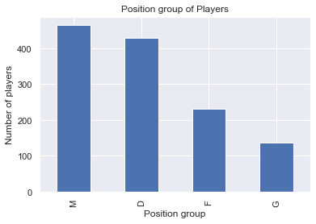

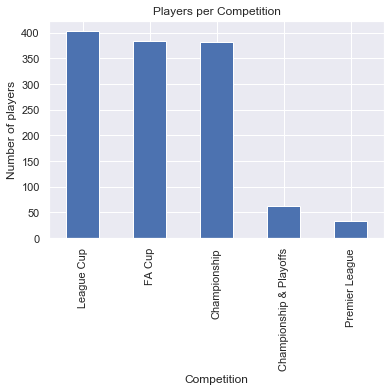

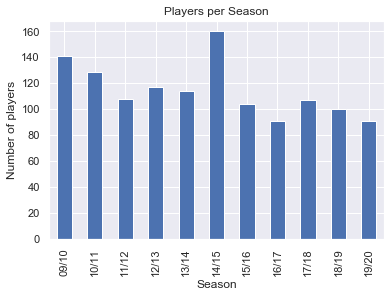

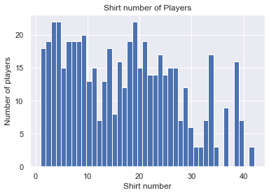

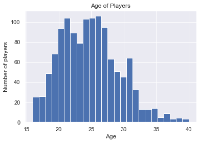

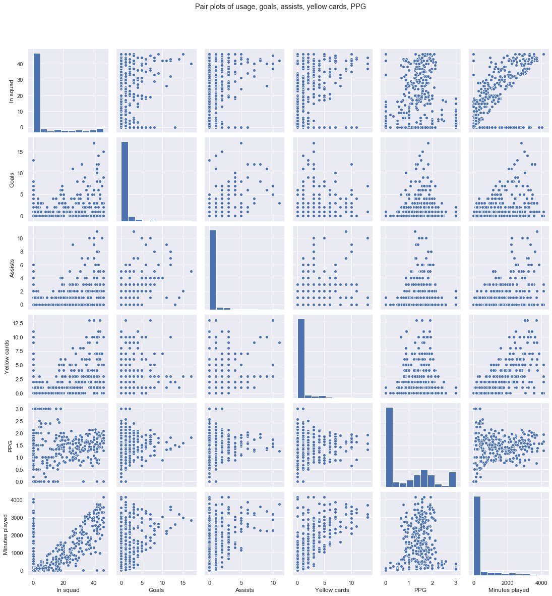

    C:\Users\adeacon\AppData\Local\Continuum\miniconda3\envs\tbir\lib\site-packages\seaborn\distributions.py:283: UserWarning: Data must have variance to compute a kernel density estimate.
      warnings.warn(msg, UserWarning)
    

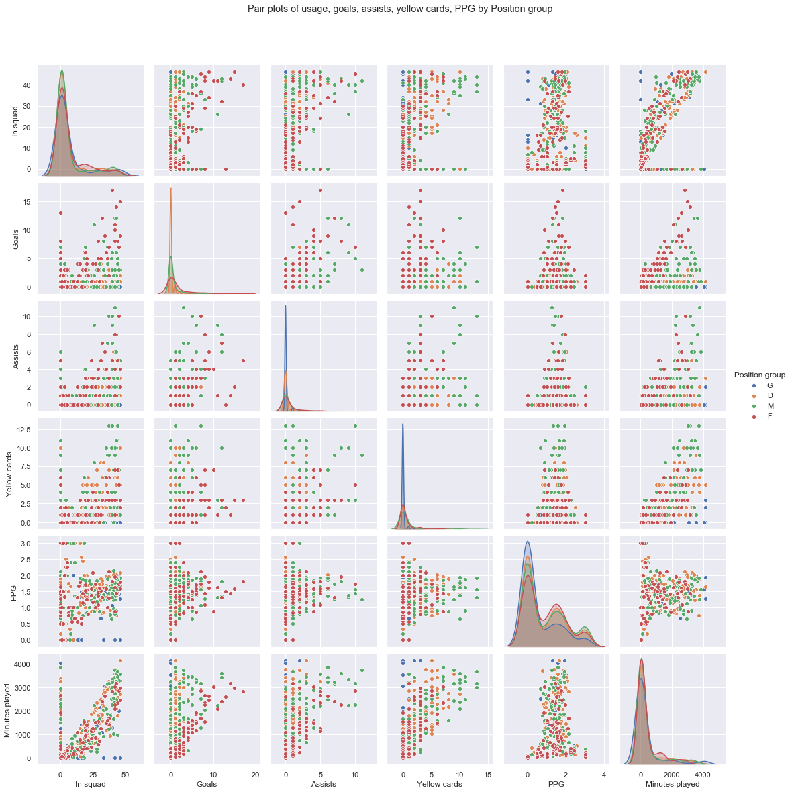

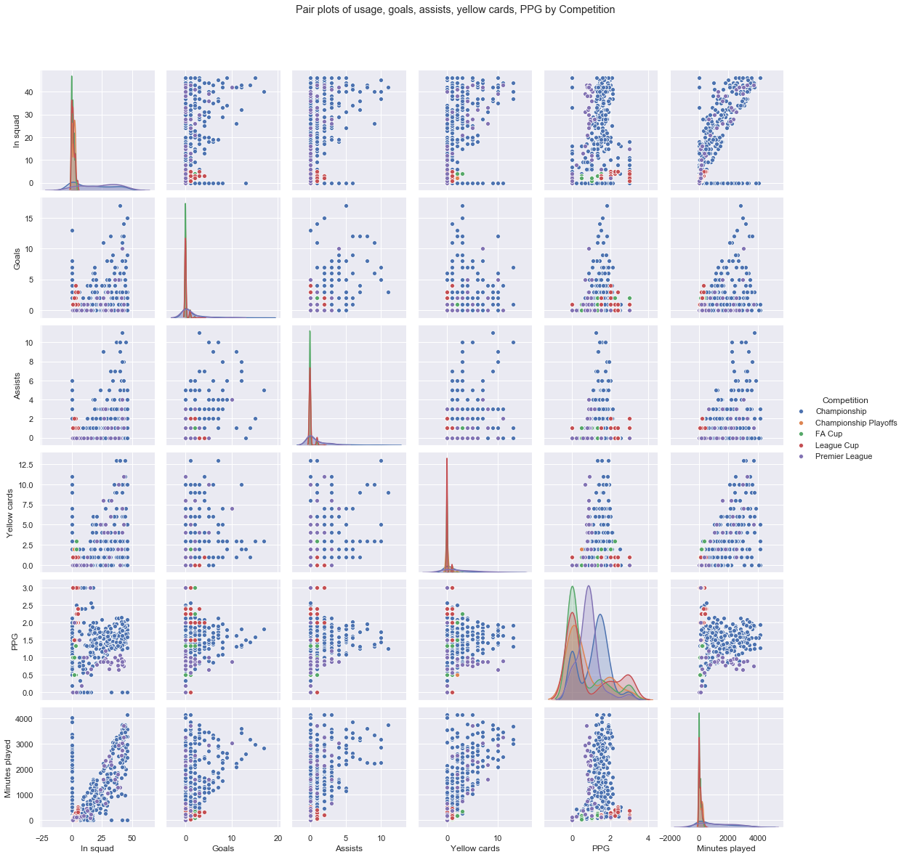

## 3. Data Preperation

* Select Data
* Clean Data
* Construct Data
* Integrate Data
* Format Data

    Final dataset created with index from Brad Jones (09/10) to Rudy Gestede (19/20).
    

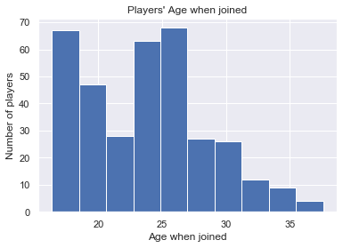

**ANALYSIS:** Most players join in their teens or mid-twenties.

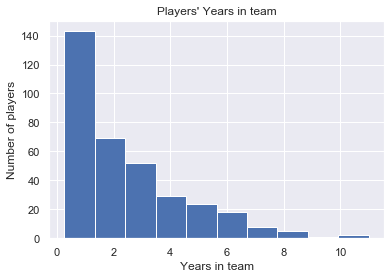

**ANALYSIS:** I'm going to leave out `Position`, `Date of birth`, `Joined`, and `Contract expires` from the model for now. `Contract expires` is populated in less than half of records. The others are encoded in derived features now.

<s>**ANALYSIS:** `Foot` and `Position group` will be one-hot encoded</s>

    Index(['Shirt number', 'Position', 'Name', 'Age', 'In squad', 'Games started',
           'Goals', 'Assists', 'Yellow cards', 'Second yellow cards', 'Red cards',
           'Substitutions on', 'Substitutions off', 'PPG', 'Minutes played',
           'Season', 'Competition', 'Position group'],
          dtype='object')

    Signature: psm_agg(x)
    Docstring: <no docstring>
    File:      c:\users\adeacon\documents\github\the-ball-is-round\notebooks\<ipython-input-43-eea62cfa5409>
    Type:      function
    

    <ipython-input-43-eea62cfa5409>:24: RuntimeWarning: invalid value encountered in double_scalars
      d["PPG"] = ((x["PPG"] * x["Appearances"]).sum() / x["Appearances"].sum())
    <ipython-input-43-eea62cfa5409>:26: RuntimeWarning: invalid value encountered in double_scalars
      d["Goals p90"] = x["Goals"].sum() * 90 / x["Minutes played"].sum()
    <ipython-input-43-eea62cfa5409>:27: RuntimeWarning: invalid value encountered in double_scalars
      d["Assists p90"] = x["Assists"].sum() * 90 / x["Minutes played"].sum()
    <ipython-input-43-eea62cfa5409>:28: RuntimeWarning: invalid value encountered in double_scalars
      d["Yellow cards p90"] = x["Yellow cards"].sum() * 90 / x["Minutes played"].sum()
    

    Random sample of records...
    

<table border="1" class="dataframe">
  <thead>
    <tr style="text-align: right;">
      <th></th>
      <th>Age</th>
      <th>Age when joined</th>
      <th>Appearances</th>
      <th>Assists</th>
      <th>Assists p90</th>
      <th>Competition</th>
      <th>Foot</th>
      <th>Games started</th>
      <th>Goals</th>
      <th>Goals p90</th>
      <th>Height</th>
      <th>In squad</th>
      <th>Market value</th>
      <th>Minutes played</th>
      <th>PPG</th>
      <th>Position group</th>
      <th>Red cards</th>
      <th>Second yellow cards</th>
      <th>Shirt number</th>
      <th>Substitutions off</th>
      <th>Substitutions on</th>
      <th>Years in team</th>
      <th>Yellow cards</th>
      <th>Yellow cards p90</th>
    </tr>
    <tr>
      <th>Player key</th>
      <th></th>
      <th></th>
      <th></th>
      <th></th>
      <th></th>
      <th></th>
      <th></th>
      <th></th>
      <th></th>
      <th></th>
      <th></th>
      <th></th>
      <th></th>
      <th></th>
      <th></th>
      <th></th>
      <th></th>
      <th></th>
      <th></th>
      <th></th>
      <th></th>
      <th></th>
      <th></th>
      <th></th>
    </tr>
  </thead>
  <tbody>
    <tr>
      <th>Barry Robson (11/12)</th>
      <td>32.0</td>
      <td>31.152</td>
      <td>39.0</td>
      <td>10.0</td>
      <td>0.272</td>
      <td>Championship, FA Cup, League Cup</td>
      <td>left</td>
      <td>39.0</td>
      <td>9.0</td>
      <td>0.244</td>
      <td>180.0</td>
      <td>39.0</td>
      <td>1.13</td>
      <td>3314.0</td>
      <td>1.592</td>
      <td>M</td>
      <td>1.0</td>
      <td>0.0</td>
      <td>0.0</td>
      <td>11.0</td>
      <td>0.0</td>
      <td>2.497</td>
      <td>13.0</td>
      <td>0.353</td>
    </tr>
    <tr>
      <th>Adam Jackson (13/14)</th>
      <td>19.0</td>
      <td>NaN</td>
      <td>0.0</td>
      <td>0.0</td>
      <td>0.000</td>
      <td>Championship</td>
      <td>NaN</td>
      <td>0.0</td>
      <td>0.0</td>
      <td>0.000</td>
      <td>NaN</td>
      <td>2.0</td>
      <td>NaN</td>
      <td>0.0</td>
      <td>0.000</td>
      <td>D</td>
      <td>0.0</td>
      <td>0.0</td>
      <td>0.0</td>
      <td>0.0</td>
      <td>0.0</td>
      <td>NaN</td>
      <td>0.0</td>
      <td>0.000</td>
    </tr>
    <tr>
      <th>Stewart Downing (17/18)</th>
      <td>33.0</td>
      <td>30.982</td>
      <td>53.0</td>
      <td>7.0</td>
      <td>0.174</td>
      <td>Championship, Championship Playoffs, FA Cup, L...</td>
      <td>left</td>
      <td>47.0</td>
      <td>3.0</td>
      <td>0.075</td>
      <td>180.0</td>
      <td>47.0</td>
      <td>2.25</td>
      <td>3616.0</td>
      <td>1.701</td>
      <td>M</td>
      <td>0.0</td>
      <td>0.0</td>
      <td>19.0</td>
      <td>19.0</td>
      <td>6.0</td>
      <td>2.960</td>
      <td>1.0</td>
      <td>0.025</td>
    </tr>
    <tr>
      <th>Marvin Johnson (17/18)</th>
      <td>27.0</td>
      <td>26.749</td>
      <td>30.0</td>
      <td>2.0</td>
      <td>0.243</td>
      <td>Championship, Championship Playoffs, FA Cup, L...</td>
      <td>left</td>
      <td>18.0</td>
      <td>1.0</td>
      <td>0.121</td>
      <td>178.0</td>
      <td>25.0</td>
      <td>1.80</td>
      <td>741.0</td>
      <td>1.684</td>
      <td>M</td>
      <td>0.0</td>
      <td>0.0</td>
      <td>21.0</td>
      <td>2.0</td>
      <td>12.0</td>
      <td>0.832</td>
      <td>0.0</td>
      <td>0.000</td>
    </tr>
    <tr>
      <th>Richard Smallwood (14/15)</th>
      <td>23.0</td>
      <td>19.505</td>
      <td>2.0</td>
      <td>0.0</td>
      <td>0.000</td>
      <td>Championship, Championship Playoffs, FA Cup, L...</td>
      <td>NaN</td>
      <td>1.0</td>
      <td>0.0</td>
      <td>0.000</td>
      <td>180.0</td>
      <td>2.0</td>
      <td>0.45</td>
      <td>20.0</td>
      <td>3.000</td>
      <td>M</td>
      <td>0.0</td>
      <td>0.0</td>
      <td>0.0</td>
      <td>0.0</td>
      <td>1.0</td>
      <td>4.999</td>
      <td>0.0</td>
      <td>0.000</td>
    </tr>
  </tbody>
</table>

    Summary of whole dataset...
    

<table border="1" class="dataframe">
  <thead>
    <tr style="text-align: right;">
      <th></th>
      <th>Age</th>
      <th>Age when joined</th>
      <th>Appearances</th>
      <th>Assists</th>
      <th>Assists p90</th>
      <th>Competition</th>
      <th>Foot</th>
      <th>Games started</th>
      <th>Goals</th>
      <th>Goals p90</th>
      <th>Height</th>
      <th>In squad</th>
      <th>Market value</th>
      <th>Minutes played</th>
      <th>PPG</th>
      <th>Position group</th>
      <th>Red cards</th>
      <th>Second yellow cards</th>
      <th>Shirt number</th>
      <th>Substitutions off</th>
      <th>Substitutions on</th>
      <th>Years in team</th>
      <th>Yellow cards</th>
      <th>Yellow cards p90</th>
    </tr>
  </thead>
  <tbody>
    <tr>
      <th>count</th>
      <td>443.000</td>
      <td>351.000</td>
      <td>443.000</td>
      <td>443.000</td>
      <td>443.000</td>
      <td>443</td>
      <td>324</td>
      <td>443.000</td>
      <td>443.000</td>
      <td>443.000</td>
      <td>356.000</td>
      <td>443.000</td>
      <td>330.000</td>
      <td>443.000</td>
      <td>443.000</td>
      <td>443</td>
      <td>443.000</td>
      <td>443.000</td>
      <td>443.000</td>
      <td>443.000</td>
      <td>443.000</td>
      <td>351.000</td>
      <td>443.000</td>
      <td>443.000</td>
    </tr>
    <tr>
      <th>unique</th>
      <td>NaN</td>
      <td>NaN</td>
      <td>NaN</td>
      <td>NaN</td>
      <td>NaN</td>
      <td>12</td>
      <td>3</td>
      <td>NaN</td>
      <td>NaN</td>
      <td>NaN</td>
      <td>NaN</td>
      <td>NaN</td>
      <td>NaN</td>
      <td>NaN</td>
      <td>NaN</td>
      <td>4</td>
      <td>NaN</td>
      <td>NaN</td>
      <td>NaN</td>
      <td>NaN</td>
      <td>NaN</td>
      <td>NaN</td>
      <td>NaN</td>
      <td>NaN</td>
    </tr>
    <tr>
      <th>top</th>
      <td>NaN</td>
      <td>NaN</td>
      <td>NaN</td>
      <td>NaN</td>
      <td>NaN</td>
      <td>Championship, FA Cup, League Cup</td>
      <td>right</td>
      <td>NaN</td>
      <td>NaN</td>
      <td>NaN</td>
      <td>NaN</td>
      <td>NaN</td>
      <td>NaN</td>
      <td>NaN</td>
      <td>NaN</td>
      <td>M</td>
      <td>NaN</td>
      <td>NaN</td>
      <td>NaN</td>
      <td>NaN</td>
      <td>NaN</td>
      <td>NaN</td>
      <td>NaN</td>
      <td>NaN</td>
    </tr>
    <tr>
      <th>freq</th>
      <td>NaN</td>
      <td>NaN</td>
      <td>NaN</td>
      <td>NaN</td>
      <td>NaN</td>
      <td>274</td>
      <td>201</td>
      <td>NaN</td>
      <td>NaN</td>
      <td>NaN</td>
      <td>NaN</td>
      <td>NaN</td>
      <td>NaN</td>
      <td>NaN</td>
      <td>NaN</td>
      <td>167</td>
      <td>NaN</td>
      <td>NaN</td>
      <td>NaN</td>
      <td>NaN</td>
      <td>NaN</td>
      <td>NaN</td>
      <td>NaN</td>
      <td>NaN</td>
    </tr>
    <tr>
      <th>mean</th>
      <td>24.546</td>
      <td>23.871</td>
      <td>20.316</td>
      <td>1.194</td>
      <td>0.070</td>
      <td>NaN</td>
      <td>NaN</td>
      <td>17.011</td>
      <td>1.551</td>
      <td>0.095</td>
      <td>183.287</td>
      <td>18.885</td>
      <td>1.696</td>
      <td>1235.817</td>
      <td>1.267</td>
      <td>NaN</td>
      <td>0.056</td>
      <td>0.052</td>
      <td>6.693</td>
      <td>3.305</td>
      <td>3.305</td>
      <td>2.447</td>
      <td>2.011</td>
      <td>0.104</td>
    </tr>
    <tr>
      <th>std</th>
      <td>4.634</td>
      <td>4.734</td>
      <td>18.172</td>
      <td>2.061</td>
      <td>0.138</td>
      <td>NaN</td>
      <td>NaN</td>
      <td>15.678</td>
      <td>2.949</td>
      <td>0.184</td>
      <td>6.029</td>
      <td>17.263</td>
      <td>1.776</td>
      <td>1257.427</td>
      <td>0.841</td>
      <td>NaN</td>
      <td>0.250</td>
      <td>0.242</td>
      <td>10.723</td>
      <td>4.534</td>
      <td>4.421</td>
      <td>2.006</td>
      <td>2.957</td>
      <td>0.162</td>
    </tr>
    <tr>
      <th>min</th>
      <td>16.000</td>
      <td>16.356</td>
      <td>0.000</td>
      <td>0.000</td>
      <td>0.000</td>
      <td>NaN</td>
      <td>NaN</td>
      <td>0.000</td>
      <td>0.000</td>
      <td>0.000</td>
      <td>167.000</td>
      <td>0.000</td>
      <td>0.038</td>
      <td>0.000</td>
      <td>0.000</td>
      <td>NaN</td>
      <td>0.000</td>
      <td>0.000</td>
      <td>0.000</td>
      <td>0.000</td>
      <td>0.000</td>
      <td>0.266</td>
      <td>0.000</td>
      <td>0.000</td>
    </tr>
    <tr>
      <th>25%</th>
      <td>21.000</td>
      <td>19.409</td>
      <td>2.000</td>
      <td>0.000</td>
      <td>0.000</td>
      <td>NaN</td>
      <td>NaN</td>
      <td>2.000</td>
      <td>0.000</td>
      <td>0.000</td>
      <td>179.000</td>
      <td>3.000</td>
      <td>0.375</td>
      <td>96.000</td>
      <td>0.769</td>
      <td>NaN</td>
      <td>0.000</td>
      <td>0.000</td>
      <td>0.000</td>
      <td>0.000</td>
      <td>0.000</td>
      <td>0.913</td>
      <td>0.000</td>
      <td>0.000</td>
    </tr>
    <tr>
      <th>50%</th>
      <td>24.000</td>
      <td>23.907</td>
      <td>17.000</td>
      <td>0.000</td>
      <td>0.000</td>
      <td>NaN</td>
      <td>NaN</td>
      <td>14.000</td>
      <td>0.000</td>
      <td>0.000</td>
      <td>183.000</td>
      <td>15.000</td>
      <td>1.130</td>
      <td>828.000</td>
      <td>1.357</td>
      <td>NaN</td>
      <td>0.000</td>
      <td>0.000</td>
      <td>0.000</td>
      <td>2.000</td>
      <td>1.000</td>
      <td>1.960</td>
      <td>1.000</td>
      <td>0.026</td>
    </tr>
    <tr>
      <th>75%</th>
      <td>27.000</td>
      <td>26.555</td>
      <td>37.000</td>
      <td>2.000</td>
      <td>0.107</td>
      <td>NaN</td>
      <td>NaN</td>
      <td>29.000</td>
      <td>2.000</td>
      <td>0.110</td>
      <td>188.000</td>
      <td>34.000</td>
      <td>2.250</td>
      <td>2124.000</td>
      <td>1.702</td>
      <td>NaN</td>
      <td>0.000</td>
      <td>0.000</td>
      <td>11.000</td>
      <td>5.000</td>
      <td>5.000</td>
      <td>3.422</td>
      <td>3.000</td>
      <td>0.174</td>
    </tr>
    <tr>
      <th>max</th>
      <td>40.000</td>
      <td>37.608</td>
      <td>73.000</td>
      <td>12.000</td>
      <td>1.406</td>
      <td>NaN</td>
      <td>NaN</td>
      <td>53.000</td>
      <td>19.000</td>
      <td>1.593</td>
      <td>199.000</td>
      <td>55.000</td>
      <td>10.800</td>
      <td>4770.000</td>
      <td>3.000</td>
      <td>NaN</td>
      <td>2.000</td>
      <td>2.000</td>
      <td>42.000</td>
      <td>27.000</td>
      <td>22.000</td>
      <td>10.998</td>
      <td>13.000</td>
      <td>1.800</td>
    </tr>
  </tbody>
</table>

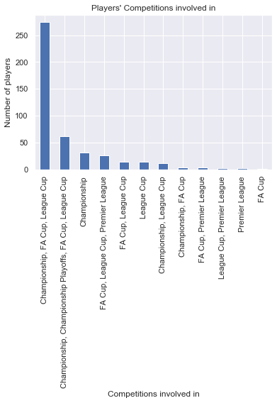

<table id="T_9b2634ee_bd3c_11ea_8bef_74d83eb26131" ><thead>    <tr>        <th class="blank level0" ></th>        <th class="col_heading level0 col0" >Age</th>        <th class="col_heading level0 col1" >Age when joined</th>        <th class="col_heading level0 col2" >Appearances</th>        <th class="col_heading level0 col3" >Assists</th>        <th class="col_heading level0 col4" >Assists p90</th>        <th class="col_heading level0 col5" >Games started</th>        <th class="col_heading level0 col6" >Goals</th>        <th class="col_heading level0 col7" >Goals p90</th>        <th class="col_heading level0 col8" >Height</th>        <th class="col_heading level0 col9" >In squad</th>        <th class="col_heading level0 col10" >Market value</th>        <th class="col_heading level0 col11" >Minutes played</th>        <th class="col_heading level0 col12" >PPG</th>        <th class="col_heading level0 col13" >Red cards</th>        <th class="col_heading level0 col14" >Second yellow cards</th>        <th class="col_heading level0 col15" >Shirt number</th>        <th class="col_heading level0 col16" >Substitutions off</th>        <th class="col_heading level0 col17" >Substitutions on</th>        <th class="col_heading level0 col18" >Years in team</th>        <th class="col_heading level0 col19" >Yellow cards</th>        <th class="col_heading level0 col20" >Yellow cards p90</th>    </tr></thead><tbody>
                <tr>
                        <th id="T_9b2634ee_bd3c_11ea_8bef_74d83eb26131level0_row0" class="row_heading level0 row0" >Age</th>
                        <td id="T_9b2634ee_bd3c_11ea_8bef_74d83eb26131row0_col0" class="data row0 col0" >1.000</td>
                        <td id="T_9b2634ee_bd3c_11ea_8bef_74d83eb26131row0_col1" class="data row0 col1" >0.901</td>
                        <td id="T_9b2634ee_bd3c_11ea_8bef_74d83eb26131row0_col2" class="data row0 col2" >0.259</td>
                        <td id="T_9b2634ee_bd3c_11ea_8bef_74d83eb26131row0_col3" class="data row0 col3" >0.125</td>
                        <td id="T_9b2634ee_bd3c_11ea_8bef_74d83eb26131row0_col4" class="data row0 col4" >-0.026</td>
                        <td id="T_9b2634ee_bd3c_11ea_8bef_74d83eb26131row0_col5" class="data row0 col5" >0.288</td>
                        <td id="T_9b2634ee_bd3c_11ea_8bef_74d83eb26131row0_col6" class="data row0 col6" >0.102</td>
                        <td id="T_9b2634ee_bd3c_11ea_8bef_74d83eb26131row0_col7" class="data row0 col7" >0.061</td>
                        <td id="T_9b2634ee_bd3c_11ea_8bef_74d83eb26131row0_col8" class="data row0 col8" >0.113</td>
                        <td id="T_9b2634ee_bd3c_11ea_8bef_74d83eb26131row0_col9" class="data row0 col9" >0.221</td>
                        <td id="T_9b2634ee_bd3c_11ea_8bef_74d83eb26131row0_col10" class="data row0 col10" >0.117</td>
                        <td id="T_9b2634ee_bd3c_11ea_8bef_74d83eb26131row0_col11" class="data row0 col11" >0.304</td>
                        <td id="T_9b2634ee_bd3c_11ea_8bef_74d83eb26131row0_col12" class="data row0 col12" >0.160</td>
                        <td id="T_9b2634ee_bd3c_11ea_8bef_74d83eb26131row0_col13" class="data row0 col13" >0.116</td>
                        <td id="T_9b2634ee_bd3c_11ea_8bef_74d83eb26131row0_col14" class="data row0 col14" >-0.003</td>
                        <td id="T_9b2634ee_bd3c_11ea_8bef_74d83eb26131row0_col15" class="data row0 col15" >0.181</td>
                        <td id="T_9b2634ee_bd3c_11ea_8bef_74d83eb26131row0_col16" class="data row0 col16" >0.152</td>
                        <td id="T_9b2634ee_bd3c_11ea_8bef_74d83eb26131row0_col17" class="data row0 col17" >0.040</td>
                        <td id="T_9b2634ee_bd3c_11ea_8bef_74d83eb26131row0_col18" class="data row0 col18" >0.067</td>
                        <td id="T_9b2634ee_bd3c_11ea_8bef_74d83eb26131row0_col19" class="data row0 col19" >0.237</td>
                        <td id="T_9b2634ee_bd3c_11ea_8bef_74d83eb26131row0_col20" class="data row0 col20" >0.189</td>
            </tr>
            <tr>
                        <th id="T_9b2634ee_bd3c_11ea_8bef_74d83eb26131level0_row1" class="row_heading level0 row1" >Age when joined</th>
                        <td id="T_9b2634ee_bd3c_11ea_8bef_74d83eb26131row1_col0" class="data row1 col0" >0.901</td>
                        <td id="T_9b2634ee_bd3c_11ea_8bef_74d83eb26131row1_col1" class="data row1 col1" >1.000</td>
                        <td id="T_9b2634ee_bd3c_11ea_8bef_74d83eb26131row1_col2" class="data row1 col2" >0.132</td>
                        <td id="T_9b2634ee_bd3c_11ea_8bef_74d83eb26131row1_col3" class="data row1 col3" >0.078</td>
                        <td id="T_9b2634ee_bd3c_11ea_8bef_74d83eb26131row1_col4" class="data row1 col4" >-0.068</td>
                        <td id="T_9b2634ee_bd3c_11ea_8bef_74d83eb26131row1_col5" class="data row1 col5" >0.148</td>
                        <td id="T_9b2634ee_bd3c_11ea_8bef_74d83eb26131row1_col6" class="data row1 col6" >0.090</td>
                        <td id="T_9b2634ee_bd3c_11ea_8bef_74d83eb26131row1_col7" class="data row1 col7" >0.051</td>
                        <td id="T_9b2634ee_bd3c_11ea_8bef_74d83eb26131row1_col8" class="data row1 col8" >0.066</td>
                        <td id="T_9b2634ee_bd3c_11ea_8bef_74d83eb26131row1_col9" class="data row1 col9" >0.101</td>
                        <td id="T_9b2634ee_bd3c_11ea_8bef_74d83eb26131row1_col10" class="data row1 col10" >0.137</td>
                        <td id="T_9b2634ee_bd3c_11ea_8bef_74d83eb26131row1_col11" class="data row1 col11" >0.152</td>
                        <td id="T_9b2634ee_bd3c_11ea_8bef_74d83eb26131row1_col12" class="data row1 col12" >0.085</td>
                        <td id="T_9b2634ee_bd3c_11ea_8bef_74d83eb26131row1_col13" class="data row1 col13" >0.054</td>
                        <td id="T_9b2634ee_bd3c_11ea_8bef_74d83eb26131row1_col14" class="data row1 col14" >-0.051</td>
                        <td id="T_9b2634ee_bd3c_11ea_8bef_74d83eb26131row1_col15" class="data row1 col15" >0.173</td>
                        <td id="T_9b2634ee_bd3c_11ea_8bef_74d83eb26131row1_col16" class="data row1 col16" >0.114</td>
                        <td id="T_9b2634ee_bd3c_11ea_8bef_74d83eb26131row1_col17" class="data row1 col17" >0.017</td>
                        <td id="T_9b2634ee_bd3c_11ea_8bef_74d83eb26131row1_col18" class="data row1 col18" >-0.361</td>
                        <td id="T_9b2634ee_bd3c_11ea_8bef_74d83eb26131row1_col19" class="data row1 col19" >0.141</td>
                        <td id="T_9b2634ee_bd3c_11ea_8bef_74d83eb26131row1_col20" class="data row1 col20" >0.149</td>
            </tr>
            <tr>
                        <th id="T_9b2634ee_bd3c_11ea_8bef_74d83eb26131level0_row2" class="row_heading level0 row2" >Appearances</th>
                        <td id="T_9b2634ee_bd3c_11ea_8bef_74d83eb26131row2_col0" class="data row2 col0" >0.259</td>
                        <td id="T_9b2634ee_bd3c_11ea_8bef_74d83eb26131row2_col1" class="data row2 col1" >0.132</td>
                        <td id="T_9b2634ee_bd3c_11ea_8bef_74d83eb26131row2_col2" class="data row2 col2" >1.000</td>
                        <td id="T_9b2634ee_bd3c_11ea_8bef_74d83eb26131row2_col3" class="data row2 col3" >0.610</td>
                        <td id="T_9b2634ee_bd3c_11ea_8bef_74d83eb26131row2_col4" class="data row2 col4" >0.212</td>
                        <td id="T_9b2634ee_bd3c_11ea_8bef_74d83eb26131row2_col5" class="data row2 col5" >0.977</td>
                        <td id="T_9b2634ee_bd3c_11ea_8bef_74d83eb26131row2_col6" class="data row2 col6" >0.578</td>
                        <td id="T_9b2634ee_bd3c_11ea_8bef_74d83eb26131row2_col7" class="data row2 col7" >0.243</td>
                        <td id="T_9b2634ee_bd3c_11ea_8bef_74d83eb26131row2_col8" class="data row2 col8" >-0.170</td>
                        <td id="T_9b2634ee_bd3c_11ea_8bef_74d83eb26131row2_col9" class="data row2 col9" >0.763</td>
                        <td id="T_9b2634ee_bd3c_11ea_8bef_74d83eb26131row2_col10" class="data row2 col10" >0.345</td>
                        <td id="T_9b2634ee_bd3c_11ea_8bef_74d83eb26131row2_col11" class="data row2 col11" >0.893</td>
                        <td id="T_9b2634ee_bd3c_11ea_8bef_74d83eb26131row2_col12" class="data row2 col12" >0.278</td>
                        <td id="T_9b2634ee_bd3c_11ea_8bef_74d83eb26131row2_col13" class="data row2 col13" >0.219</td>
                        <td id="T_9b2634ee_bd3c_11ea_8bef_74d83eb26131row2_col14" class="data row2 col14" >0.176</td>
                        <td id="T_9b2634ee_bd3c_11ea_8bef_74d83eb26131row2_col15" class="data row2 col15" >0.247</td>
                        <td id="T_9b2634ee_bd3c_11ea_8bef_74d83eb26131row2_col16" class="data row2 col16" >0.690</td>
                        <td id="T_9b2634ee_bd3c_11ea_8bef_74d83eb26131row2_col17" class="data row2 col17" >0.647</td>
                        <td id="T_9b2634ee_bd3c_11ea_8bef_74d83eb26131row2_col18" class="data row2 col18" >0.032</td>
                        <td id="T_9b2634ee_bd3c_11ea_8bef_74d83eb26131row2_col19" class="data row2 col19" >0.656</td>
                        <td id="T_9b2634ee_bd3c_11ea_8bef_74d83eb26131row2_col20" class="data row2 col20" >0.277</td>
            </tr>
            <tr>
                        <th id="T_9b2634ee_bd3c_11ea_8bef_74d83eb26131level0_row3" class="row_heading level0 row3" >Assists</th>
                        <td id="T_9b2634ee_bd3c_11ea_8bef_74d83eb26131row3_col0" class="data row3 col0" >0.125</td>
                        <td id="T_9b2634ee_bd3c_11ea_8bef_74d83eb26131row3_col1" class="data row3 col1" >0.078</td>
                        <td id="T_9b2634ee_bd3c_11ea_8bef_74d83eb26131row3_col2" class="data row3 col2" >0.610</td>
                        <td id="T_9b2634ee_bd3c_11ea_8bef_74d83eb26131row3_col3" class="data row3 col3" >1.000</td>
                        <td id="T_9b2634ee_bd3c_11ea_8bef_74d83eb26131row3_col4" class="data row3 col4" >0.508</td>
                        <td id="T_9b2634ee_bd3c_11ea_8bef_74d83eb26131row3_col5" class="data row3 col5" >0.612</td>
                        <td id="T_9b2634ee_bd3c_11ea_8bef_74d83eb26131row3_col6" class="data row3 col6" >0.594</td>
                        <td id="T_9b2634ee_bd3c_11ea_8bef_74d83eb26131row3_col7" class="data row3 col7" >0.272</td>
                        <td id="T_9b2634ee_bd3c_11ea_8bef_74d83eb26131row3_col8" class="data row3 col8" >-0.245</td>
                        <td id="T_9b2634ee_bd3c_11ea_8bef_74d83eb26131row3_col9" class="data row3 col9" >0.483</td>
                        <td id="T_9b2634ee_bd3c_11ea_8bef_74d83eb26131row3_col10" class="data row3 col10" >0.176</td>
                        <td id="T_9b2634ee_bd3c_11ea_8bef_74d83eb26131row3_col11" class="data row3 col11" >0.572</td>
                        <td id="T_9b2634ee_bd3c_11ea_8bef_74d83eb26131row3_col12" class="data row3 col12" >0.168</td>
                        <td id="T_9b2634ee_bd3c_11ea_8bef_74d83eb26131row3_col13" class="data row3 col13" >0.238</td>
                        <td id="T_9b2634ee_bd3c_11ea_8bef_74d83eb26131row3_col14" class="data row3 col14" >0.061</td>
                        <td id="T_9b2634ee_bd3c_11ea_8bef_74d83eb26131row3_col15" class="data row3 col15" >0.127</td>
                        <td id="T_9b2634ee_bd3c_11ea_8bef_74d83eb26131row3_col16" class="data row3 col16" >0.584</td>
                        <td id="T_9b2634ee_bd3c_11ea_8bef_74d83eb26131row3_col17" class="data row3 col17" >0.339</td>
                        <td id="T_9b2634ee_bd3c_11ea_8bef_74d83eb26131row3_col18" class="data row3 col18" >-0.015</td>
                        <td id="T_9b2634ee_bd3c_11ea_8bef_74d83eb26131row3_col19" class="data row3 col19" >0.469</td>
                        <td id="T_9b2634ee_bd3c_11ea_8bef_74d83eb26131row3_col20" class="data row3 col20" >0.172</td>
            </tr>
            <tr>
                        <th id="T_9b2634ee_bd3c_11ea_8bef_74d83eb26131level0_row4" class="row_heading level0 row4" >Assists p90</th>
                        <td id="T_9b2634ee_bd3c_11ea_8bef_74d83eb26131row4_col0" class="data row4 col0" >-0.026</td>
                        <td id="T_9b2634ee_bd3c_11ea_8bef_74d83eb26131row4_col1" class="data row4 col1" >-0.068</td>
                        <td id="T_9b2634ee_bd3c_11ea_8bef_74d83eb26131row4_col2" class="data row4 col2" >0.212</td>
                        <td id="T_9b2634ee_bd3c_11ea_8bef_74d83eb26131row4_col3" class="data row4 col3" >0.508</td>
                        <td id="T_9b2634ee_bd3c_11ea_8bef_74d83eb26131row4_col4" class="data row4 col4" >1.000</td>
                        <td id="T_9b2634ee_bd3c_11ea_8bef_74d83eb26131row4_col5" class="data row4 col5" >0.176</td>
                        <td id="T_9b2634ee_bd3c_11ea_8bef_74d83eb26131row4_col6" class="data row4 col6" >0.264</td>
                        <td id="T_9b2634ee_bd3c_11ea_8bef_74d83eb26131row4_col7" class="data row4 col7" >0.276</td>
                        <td id="T_9b2634ee_bd3c_11ea_8bef_74d83eb26131row4_col8" class="data row4 col8" >-0.206</td>
                        <td id="T_9b2634ee_bd3c_11ea_8bef_74d83eb26131row4_col9" class="data row4 col9" >0.150</td>
                        <td id="T_9b2634ee_bd3c_11ea_8bef_74d83eb26131row4_col10" class="data row4 col10" >0.063</td>
                        <td id="T_9b2634ee_bd3c_11ea_8bef_74d83eb26131row4_col11" class="data row4 col11" >0.120</td>
                        <td id="T_9b2634ee_bd3c_11ea_8bef_74d83eb26131row4_col12" class="data row4 col12" >0.267</td>
                        <td id="T_9b2634ee_bd3c_11ea_8bef_74d83eb26131row4_col13" class="data row4 col13" >0.091</td>
                        <td id="T_9b2634ee_bd3c_11ea_8bef_74d83eb26131row4_col14" class="data row4 col14" >0.005</td>
                        <td id="T_9b2634ee_bd3c_11ea_8bef_74d83eb26131row4_col15" class="data row4 col15" >0.048</td>
                        <td id="T_9b2634ee_bd3c_11ea_8bef_74d83eb26131row4_col16" class="data row4 col16" >0.269</td>
                        <td id="T_9b2634ee_bd3c_11ea_8bef_74d83eb26131row4_col17" class="data row4 col17" >0.247</td>
                        <td id="T_9b2634ee_bd3c_11ea_8bef_74d83eb26131row4_col18" class="data row4 col18" >-0.032</td>
                        <td id="T_9b2634ee_bd3c_11ea_8bef_74d83eb26131row4_col19" class="data row4 col19" >0.100</td>
                        <td id="T_9b2634ee_bd3c_11ea_8bef_74d83eb26131row4_col20" class="data row4 col20" >0.034</td>
            </tr>
            <tr>
                        <th id="T_9b2634ee_bd3c_11ea_8bef_74d83eb26131level0_row5" class="row_heading level0 row5" >Games started</th>
                        <td id="T_9b2634ee_bd3c_11ea_8bef_74d83eb26131row5_col0" class="data row5 col0" >0.288</td>
                        <td id="T_9b2634ee_bd3c_11ea_8bef_74d83eb26131row5_col1" class="data row5 col1" >0.148</td>
                        <td id="T_9b2634ee_bd3c_11ea_8bef_74d83eb26131row5_col2" class="data row5 col2" >0.977</td>
                        <td id="T_9b2634ee_bd3c_11ea_8bef_74d83eb26131row5_col3" class="data row5 col3" >0.612</td>
                        <td id="T_9b2634ee_bd3c_11ea_8bef_74d83eb26131row5_col4" class="data row5 col4" >0.176</td>
                        <td id="T_9b2634ee_bd3c_11ea_8bef_74d83eb26131row5_col5" class="data row5 col5" >1.000</td>
                        <td id="T_9b2634ee_bd3c_11ea_8bef_74d83eb26131row5_col6" class="data row5 col6" >0.538</td>
                        <td id="T_9b2634ee_bd3c_11ea_8bef_74d83eb26131row5_col7" class="data row5 col7" >0.181</td>
                        <td id="T_9b2634ee_bd3c_11ea_8bef_74d83eb26131row5_col8" class="data row5 col8" >-0.123</td>
                        <td id="T_9b2634ee_bd3c_11ea_8bef_74d83eb26131row5_col9" class="data row5 col9" >0.769</td>
                        <td id="T_9b2634ee_bd3c_11ea_8bef_74d83eb26131row5_col10" class="data row5 col10" >0.349</td>
                        <td id="T_9b2634ee_bd3c_11ea_8bef_74d83eb26131row5_col11" class="data row5 col11" >0.968</td>
                        <td id="T_9b2634ee_bd3c_11ea_8bef_74d83eb26131row5_col12" class="data row5 col12" >0.266</td>
                        <td id="T_9b2634ee_bd3c_11ea_8bef_74d83eb26131row5_col13" class="data row5 col13" >0.216</td>
                        <td id="T_9b2634ee_bd3c_11ea_8bef_74d83eb26131row5_col14" class="data row5 col14" >0.194</td>
                        <td id="T_9b2634ee_bd3c_11ea_8bef_74d83eb26131row5_col15" class="data row5 col15" >0.213</td>
                        <td id="T_9b2634ee_bd3c_11ea_8bef_74d83eb26131row5_col16" class="data row5 col16" >0.633</td>
                        <td id="T_9b2634ee_bd3c_11ea_8bef_74d83eb26131row5_col17" class="data row5 col17" >0.468</td>
                        <td id="T_9b2634ee_bd3c_11ea_8bef_74d83eb26131row5_col18" class="data row5 col18" >0.083</td>
                        <td id="T_9b2634ee_bd3c_11ea_8bef_74d83eb26131row5_col19" class="data row5 col19" >0.705</td>
                        <td id="T_9b2634ee_bd3c_11ea_8bef_74d83eb26131row5_col20" class="data row5 col20" >0.278</td>
            </tr>
            <tr>
                        <th id="T_9b2634ee_bd3c_11ea_8bef_74d83eb26131level0_row6" class="row_heading level0 row6" >Goals</th>
                        <td id="T_9b2634ee_bd3c_11ea_8bef_74d83eb26131row6_col0" class="data row6 col0" >0.102</td>
                        <td id="T_9b2634ee_bd3c_11ea_8bef_74d83eb26131row6_col1" class="data row6 col1" >0.090</td>
                        <td id="T_9b2634ee_bd3c_11ea_8bef_74d83eb26131row6_col2" class="data row6 col2" >0.578</td>
                        <td id="T_9b2634ee_bd3c_11ea_8bef_74d83eb26131row6_col3" class="data row6 col3" >0.594</td>
                        <td id="T_9b2634ee_bd3c_11ea_8bef_74d83eb26131row6_col4" class="data row6 col4" >0.264</td>
                        <td id="T_9b2634ee_bd3c_11ea_8bef_74d83eb26131row6_col5" class="data row6 col5" >0.538</td>
                        <td id="T_9b2634ee_bd3c_11ea_8bef_74d83eb26131row6_col6" class="data row6 col6" >1.000</td>
                        <td id="T_9b2634ee_bd3c_11ea_8bef_74d83eb26131row6_col7" class="data row6 col7" >0.594</td>
                        <td id="T_9b2634ee_bd3c_11ea_8bef_74d83eb26131row6_col8" class="data row6 col8" >-0.158</td>
                        <td id="T_9b2634ee_bd3c_11ea_8bef_74d83eb26131row6_col9" class="data row6 col9" >0.388</td>
                        <td id="T_9b2634ee_bd3c_11ea_8bef_74d83eb26131row6_col10" class="data row6 col10" >0.304</td>
                        <td id="T_9b2634ee_bd3c_11ea_8bef_74d83eb26131row6_col11" class="data row6 col11" >0.456</td>
                        <td id="T_9b2634ee_bd3c_11ea_8bef_74d83eb26131row6_col12" class="data row6 col12" >0.140</td>
                        <td id="T_9b2634ee_bd3c_11ea_8bef_74d83eb26131row6_col13" class="data row6 col13" >0.093</td>
                        <td id="T_9b2634ee_bd3c_11ea_8bef_74d83eb26131row6_col14" class="data row6 col14" >0.042</td>
                        <td id="T_9b2634ee_bd3c_11ea_8bef_74d83eb26131row6_col15" class="data row6 col15" >0.096</td>
                        <td id="T_9b2634ee_bd3c_11ea_8bef_74d83eb26131row6_col16" class="data row6 col16" >0.649</td>
                        <td id="T_9b2634ee_bd3c_11ea_8bef_74d83eb26131row6_col17" class="data row6 col17" >0.469</td>
                        <td id="T_9b2634ee_bd3c_11ea_8bef_74d83eb26131row6_col18" class="data row6 col18" >-0.106</td>
                        <td id="T_9b2634ee_bd3c_11ea_8bef_74d83eb26131row6_col19" class="data row6 col19" >0.334</td>
                        <td id="T_9b2634ee_bd3c_11ea_8bef_74d83eb26131row6_col20" class="data row6 col20" >0.133</td>
            </tr>
            <tr>
                        <th id="T_9b2634ee_bd3c_11ea_8bef_74d83eb26131level0_row7" class="row_heading level0 row7" >Goals p90</th>
                        <td id="T_9b2634ee_bd3c_11ea_8bef_74d83eb26131row7_col0" class="data row7 col0" >0.061</td>
                        <td id="T_9b2634ee_bd3c_11ea_8bef_74d83eb26131row7_col1" class="data row7 col1" >0.051</td>
                        <td id="T_9b2634ee_bd3c_11ea_8bef_74d83eb26131row7_col2" class="data row7 col2" >0.243</td>
                        <td id="T_9b2634ee_bd3c_11ea_8bef_74d83eb26131row7_col3" class="data row7 col3" >0.272</td>
                        <td id="T_9b2634ee_bd3c_11ea_8bef_74d83eb26131row7_col4" class="data row7 col4" >0.276</td>
                        <td id="T_9b2634ee_bd3c_11ea_8bef_74d83eb26131row7_col5" class="data row7 col5" >0.181</td>
                        <td id="T_9b2634ee_bd3c_11ea_8bef_74d83eb26131row7_col6" class="data row7 col6" >0.594</td>
                        <td id="T_9b2634ee_bd3c_11ea_8bef_74d83eb26131row7_col7" class="data row7 col7" >1.000</td>
                        <td id="T_9b2634ee_bd3c_11ea_8bef_74d83eb26131row7_col8" class="data row7 col8" >-0.149</td>
                        <td id="T_9b2634ee_bd3c_11ea_8bef_74d83eb26131row7_col9" class="data row7 col9" >0.117</td>
                        <td id="T_9b2634ee_bd3c_11ea_8bef_74d83eb26131row7_col10" class="data row7 col10" >0.257</td>
                        <td id="T_9b2634ee_bd3c_11ea_8bef_74d83eb26131row7_col11" class="data row7 col11" >0.096</td>
                        <td id="T_9b2634ee_bd3c_11ea_8bef_74d83eb26131row7_col12" class="data row7 col12" >0.239</td>
                        <td id="T_9b2634ee_bd3c_11ea_8bef_74d83eb26131row7_col13" class="data row7 col13" >0.017</td>
                        <td id="T_9b2634ee_bd3c_11ea_8bef_74d83eb26131row7_col14" class="data row7 col14" >-0.001</td>
                        <td id="T_9b2634ee_bd3c_11ea_8bef_74d83eb26131row7_col15" class="data row7 col15" >0.001</td>
                        <td id="T_9b2634ee_bd3c_11ea_8bef_74d83eb26131row7_col16" class="data row7 col16" >0.326</td>
                        <td id="T_9b2634ee_bd3c_11ea_8bef_74d83eb26131row7_col17" class="data row7 col17" >0.359</td>
                        <td id="T_9b2634ee_bd3c_11ea_8bef_74d83eb26131row7_col18" class="data row7 col18" >-0.148</td>
                        <td id="T_9b2634ee_bd3c_11ea_8bef_74d83eb26131row7_col19" class="data row7 col19" >0.063</td>
                        <td id="T_9b2634ee_bd3c_11ea_8bef_74d83eb26131row7_col20" class="data row7 col20" >0.039</td>
            </tr>
            <tr>
                        <th id="T_9b2634ee_bd3c_11ea_8bef_74d83eb26131level0_row8" class="row_heading level0 row8" >Height</th>
                        <td id="T_9b2634ee_bd3c_11ea_8bef_74d83eb26131row8_col0" class="data row8 col0" >0.113</td>
                        <td id="T_9b2634ee_bd3c_11ea_8bef_74d83eb26131row8_col1" class="data row8 col1" >0.066</td>
                        <td id="T_9b2634ee_bd3c_11ea_8bef_74d83eb26131row8_col2" class="data row8 col2" >-0.170</td>
                        <td id="T_9b2634ee_bd3c_11ea_8bef_74d83eb26131row8_col3" class="data row8 col3" >-0.245</td>
                        <td id="T_9b2634ee_bd3c_11ea_8bef_74d83eb26131row8_col4" class="data row8 col4" >-0.206</td>
                        <td id="T_9b2634ee_bd3c_11ea_8bef_74d83eb26131row8_col5" class="data row8 col5" >-0.123</td>
                        <td id="T_9b2634ee_bd3c_11ea_8bef_74d83eb26131row8_col6" class="data row8 col6" >-0.158</td>
                        <td id="T_9b2634ee_bd3c_11ea_8bef_74d83eb26131row8_col7" class="data row8 col7" >-0.149</td>
                        <td id="T_9b2634ee_bd3c_11ea_8bef_74d83eb26131row8_col8" class="data row8 col8" >1.000</td>
                        <td id="T_9b2634ee_bd3c_11ea_8bef_74d83eb26131row8_col9" class="data row8 col9" >-0.082</td>
                        <td id="T_9b2634ee_bd3c_11ea_8bef_74d83eb26131row8_col10" class="data row8 col10" >-0.067</td>
                        <td id="T_9b2634ee_bd3c_11ea_8bef_74d83eb26131row8_col11" class="data row8 col11" >-0.053</td>
                        <td id="T_9b2634ee_bd3c_11ea_8bef_74d83eb26131row8_col12" class="data row8 col12" >0.008</td>
                        <td id="T_9b2634ee_bd3c_11ea_8bef_74d83eb26131row8_col13" class="data row8 col13" >0.010</td>
                        <td id="T_9b2634ee_bd3c_11ea_8bef_74d83eb26131row8_col14" class="data row8 col14" >-0.006</td>
                        <td id="T_9b2634ee_bd3c_11ea_8bef_74d83eb26131row8_col15" class="data row8 col15" >0.048</td>
                        <td id="T_9b2634ee_bd3c_11ea_8bef_74d83eb26131row8_col16" class="data row8 col16" >-0.300</td>
                        <td id="T_9b2634ee_bd3c_11ea_8bef_74d83eb26131row8_col17" class="data row8 col17" >-0.253</td>
                        <td id="T_9b2634ee_bd3c_11ea_8bef_74d83eb26131row8_col18" class="data row8 col18" >0.064</td>
                        <td id="T_9b2634ee_bd3c_11ea_8bef_74d83eb26131row8_col19" class="data row8 col19" >-0.161</td>
                        <td id="T_9b2634ee_bd3c_11ea_8bef_74d83eb26131row8_col20" class="data row8 col20" >-0.053</td>
            </tr>
            <tr>
                        <th id="T_9b2634ee_bd3c_11ea_8bef_74d83eb26131level0_row9" class="row_heading level0 row9" >In squad</th>
                        <td id="T_9b2634ee_bd3c_11ea_8bef_74d83eb26131row9_col0" class="data row9 col0" >0.221</td>
                        <td id="T_9b2634ee_bd3c_11ea_8bef_74d83eb26131row9_col1" class="data row9 col1" >0.101</td>
                        <td id="T_9b2634ee_bd3c_11ea_8bef_74d83eb26131row9_col2" class="data row9 col2" >0.763</td>
                        <td id="T_9b2634ee_bd3c_11ea_8bef_74d83eb26131row9_col3" class="data row9 col3" >0.483</td>
                        <td id="T_9b2634ee_bd3c_11ea_8bef_74d83eb26131row9_col4" class="data row9 col4" >0.150</td>
                        <td id="T_9b2634ee_bd3c_11ea_8bef_74d83eb26131row9_col5" class="data row9 col5" >0.769</td>
                        <td id="T_9b2634ee_bd3c_11ea_8bef_74d83eb26131row9_col6" class="data row9 col6" >0.388</td>
                        <td id="T_9b2634ee_bd3c_11ea_8bef_74d83eb26131row9_col7" class="data row9 col7" >0.117</td>
                        <td id="T_9b2634ee_bd3c_11ea_8bef_74d83eb26131row9_col8" class="data row9 col8" >-0.082</td>
                        <td id="T_9b2634ee_bd3c_11ea_8bef_74d83eb26131row9_col9" class="data row9 col9" >1.000</td>
                        <td id="T_9b2634ee_bd3c_11ea_8bef_74d83eb26131row9_col10" class="data row9 col10" >0.051</td>
                        <td id="T_9b2634ee_bd3c_11ea_8bef_74d83eb26131row9_col11" class="data row9 col11" >0.733</td>
                        <td id="T_9b2634ee_bd3c_11ea_8bef_74d83eb26131row9_col12" class="data row9 col12" >0.303</td>
                        <td id="T_9b2634ee_bd3c_11ea_8bef_74d83eb26131row9_col13" class="data row9 col13" >0.150</td>
                        <td id="T_9b2634ee_bd3c_11ea_8bef_74d83eb26131row9_col14" class="data row9 col14" >0.185</td>
                        <td id="T_9b2634ee_bd3c_11ea_8bef_74d83eb26131row9_col15" class="data row9 col15" >0.094</td>
                        <td id="T_9b2634ee_bd3c_11ea_8bef_74d83eb26131row9_col16" class="data row9 col16" >0.471</td>
                        <td id="T_9b2634ee_bd3c_11ea_8bef_74d83eb26131row9_col17" class="data row9 col17" >0.410</td>
                        <td id="T_9b2634ee_bd3c_11ea_8bef_74d83eb26131row9_col18" class="data row9 col18" >0.072</td>
                        <td id="T_9b2634ee_bd3c_11ea_8bef_74d83eb26131row9_col19" class="data row9 col19" >0.527</td>
                        <td id="T_9b2634ee_bd3c_11ea_8bef_74d83eb26131row9_col20" class="data row9 col20" >0.249</td>
            </tr>
            <tr>
                        <th id="T_9b2634ee_bd3c_11ea_8bef_74d83eb26131level0_row10" class="row_heading level0 row10" >Market value</th>
                        <td id="T_9b2634ee_bd3c_11ea_8bef_74d83eb26131row10_col0" class="data row10 col0" >0.117</td>
                        <td id="T_9b2634ee_bd3c_11ea_8bef_74d83eb26131row10_col1" class="data row10 col1" >0.137</td>
                        <td id="T_9b2634ee_bd3c_11ea_8bef_74d83eb26131row10_col2" class="data row10 col2" >0.345</td>
                        <td id="T_9b2634ee_bd3c_11ea_8bef_74d83eb26131row10_col3" class="data row10 col3" >0.176</td>
                        <td id="T_9b2634ee_bd3c_11ea_8bef_74d83eb26131row10_col4" class="data row10 col4" >0.063</td>
                        <td id="T_9b2634ee_bd3c_11ea_8bef_74d83eb26131row10_col5" class="data row10 col5" >0.349</td>
                        <td id="T_9b2634ee_bd3c_11ea_8bef_74d83eb26131row10_col6" class="data row10 col6" >0.304</td>
                        <td id="T_9b2634ee_bd3c_11ea_8bef_74d83eb26131row10_col7" class="data row10 col7" >0.257</td>
                        <td id="T_9b2634ee_bd3c_11ea_8bef_74d83eb26131row10_col8" class="data row10 col8" >-0.067</td>
                        <td id="T_9b2634ee_bd3c_11ea_8bef_74d83eb26131row10_col9" class="data row10 col9" >0.051</td>
                        <td id="T_9b2634ee_bd3c_11ea_8bef_74d83eb26131row10_col10" class="data row10 col10" >1.000</td>
                        <td id="T_9b2634ee_bd3c_11ea_8bef_74d83eb26131row10_col11" class="data row10 col11" >0.321</td>
                        <td id="T_9b2634ee_bd3c_11ea_8bef_74d83eb26131row10_col12" class="data row10 col12" >0.017</td>
                        <td id="T_9b2634ee_bd3c_11ea_8bef_74d83eb26131row10_col13" class="data row10 col13" >0.085</td>
                        <td id="T_9b2634ee_bd3c_11ea_8bef_74d83eb26131row10_col14" class="data row10 col14" >-0.033</td>
                        <td id="T_9b2634ee_bd3c_11ea_8bef_74d83eb26131row10_col15" class="data row10 col15" >0.210</td>
                        <td id="T_9b2634ee_bd3c_11ea_8bef_74d83eb26131row10_col16" class="data row10 col16" >0.314</td>
                        <td id="T_9b2634ee_bd3c_11ea_8bef_74d83eb26131row10_col17" class="data row10 col17" >0.164</td>
                        <td id="T_9b2634ee_bd3c_11ea_8bef_74d83eb26131row10_col18" class="data row10 col18" >-0.141</td>
                        <td id="T_9b2634ee_bd3c_11ea_8bef_74d83eb26131row10_col19" class="data row10 col19" >0.275</td>
                        <td id="T_9b2634ee_bd3c_11ea_8bef_74d83eb26131row10_col20" class="data row10 col20" >0.117</td>
            </tr>
            <tr>
                        <th id="T_9b2634ee_bd3c_11ea_8bef_74d83eb26131level0_row11" class="row_heading level0 row11" >Minutes played</th>
                        <td id="T_9b2634ee_bd3c_11ea_8bef_74d83eb26131row11_col0" class="data row11 col0" >0.304</td>
                        <td id="T_9b2634ee_bd3c_11ea_8bef_74d83eb26131row11_col1" class="data row11 col1" >0.152</td>
                        <td id="T_9b2634ee_bd3c_11ea_8bef_74d83eb26131row11_col2" class="data row11 col2" >0.893</td>
                        <td id="T_9b2634ee_bd3c_11ea_8bef_74d83eb26131row11_col3" class="data row11 col3" >0.572</td>
                        <td id="T_9b2634ee_bd3c_11ea_8bef_74d83eb26131row11_col4" class="data row11 col4" >0.120</td>
                        <td id="T_9b2634ee_bd3c_11ea_8bef_74d83eb26131row11_col5" class="data row11 col5" >0.968</td>
                        <td id="T_9b2634ee_bd3c_11ea_8bef_74d83eb26131row11_col6" class="data row11 col6" >0.456</td>
                        <td id="T_9b2634ee_bd3c_11ea_8bef_74d83eb26131row11_col7" class="data row11 col7" >0.096</td>
                        <td id="T_9b2634ee_bd3c_11ea_8bef_74d83eb26131row11_col8" class="data row11 col8" >-0.053</td>
                        <td id="T_9b2634ee_bd3c_11ea_8bef_74d83eb26131row11_col9" class="data row11 col9" >0.733</td>
                        <td id="T_9b2634ee_bd3c_11ea_8bef_74d83eb26131row11_col10" class="data row11 col10" >0.321</td>
                        <td id="T_9b2634ee_bd3c_11ea_8bef_74d83eb26131row11_col11" class="data row11 col11" >1.000</td>
                        <td id="T_9b2634ee_bd3c_11ea_8bef_74d83eb26131row11_col12" class="data row11 col12" >0.235</td>
                        <td id="T_9b2634ee_bd3c_11ea_8bef_74d83eb26131row11_col13" class="data row11 col13" >0.192</td>
                        <td id="T_9b2634ee_bd3c_11ea_8bef_74d83eb26131row11_col14" class="data row11 col14" >0.200</td>
                        <td id="T_9b2634ee_bd3c_11ea_8bef_74d83eb26131row11_col15" class="data row11 col15" >0.163</td>
                        <td id="T_9b2634ee_bd3c_11ea_8bef_74d83eb26131row11_col16" class="data row11 col16" >0.501</td>
                        <td id="T_9b2634ee_bd3c_11ea_8bef_74d83eb26131row11_col17" class="data row11 col17" >0.237</td>
                        <td id="T_9b2634ee_bd3c_11ea_8bef_74d83eb26131row11_col18" class="data row11 col18" >0.139</td>
                        <td id="T_9b2634ee_bd3c_11ea_8bef_74d83eb26131row11_col19" class="data row11 col19" >0.717</td>
                        <td id="T_9b2634ee_bd3c_11ea_8bef_74d83eb26131row11_col20" class="data row11 col20" >0.256</td>
            </tr>
            <tr>
                        <th id="T_9b2634ee_bd3c_11ea_8bef_74d83eb26131level0_row12" class="row_heading level0 row12" >PPG</th>
                        <td id="T_9b2634ee_bd3c_11ea_8bef_74d83eb26131row12_col0" class="data row12 col0" >0.160</td>
                        <td id="T_9b2634ee_bd3c_11ea_8bef_74d83eb26131row12_col1" class="data row12 col1" >0.085</td>
                        <td id="T_9b2634ee_bd3c_11ea_8bef_74d83eb26131row12_col2" class="data row12 col2" >0.278</td>
                        <td id="T_9b2634ee_bd3c_11ea_8bef_74d83eb26131row12_col3" class="data row12 col3" >0.168</td>
                        <td id="T_9b2634ee_bd3c_11ea_8bef_74d83eb26131row12_col4" class="data row12 col4" >0.267</td>
                        <td id="T_9b2634ee_bd3c_11ea_8bef_74d83eb26131row12_col5" class="data row12 col5" >0.266</td>
                        <td id="T_9b2634ee_bd3c_11ea_8bef_74d83eb26131row12_col6" class="data row12 col6" >0.140</td>
                        <td id="T_9b2634ee_bd3c_11ea_8bef_74d83eb26131row12_col7" class="data row12 col7" >0.239</td>
                        <td id="T_9b2634ee_bd3c_11ea_8bef_74d83eb26131row12_col8" class="data row12 col8" >0.008</td>
                        <td id="T_9b2634ee_bd3c_11ea_8bef_74d83eb26131row12_col9" class="data row12 col9" >0.303</td>
                        <td id="T_9b2634ee_bd3c_11ea_8bef_74d83eb26131row12_col10" class="data row12 col10" >0.017</td>
                        <td id="T_9b2634ee_bd3c_11ea_8bef_74d83eb26131row12_col11" class="data row12 col11" >0.235</td>
                        <td id="T_9b2634ee_bd3c_11ea_8bef_74d83eb26131row12_col12" class="data row12 col12" >1.000</td>
                        <td id="T_9b2634ee_bd3c_11ea_8bef_74d83eb26131row12_col13" class="data row12 col13" >0.029</td>
                        <td id="T_9b2634ee_bd3c_11ea_8bef_74d83eb26131row12_col14" class="data row12 col14" >0.059</td>
                        <td id="T_9b2634ee_bd3c_11ea_8bef_74d83eb26131row12_col15" class="data row12 col15" >0.075</td>
                        <td id="T_9b2634ee_bd3c_11ea_8bef_74d83eb26131row12_col16" class="data row12 col16" >0.184</td>
                        <td id="T_9b2634ee_bd3c_11ea_8bef_74d83eb26131row12_col17" class="data row12 col17" >0.202</td>
                        <td id="T_9b2634ee_bd3c_11ea_8bef_74d83eb26131row12_col18" class="data row12 col18" >0.039</td>
                        <td id="T_9b2634ee_bd3c_11ea_8bef_74d83eb26131row12_col19" class="data row12 col19" >0.156</td>
                        <td id="T_9b2634ee_bd3c_11ea_8bef_74d83eb26131row12_col20" class="data row12 col20" >0.150</td>
            </tr>
            <tr>
                        <th id="T_9b2634ee_bd3c_11ea_8bef_74d83eb26131level0_row13" class="row_heading level0 row13" >Red cards</th>
                        <td id="T_9b2634ee_bd3c_11ea_8bef_74d83eb26131row13_col0" class="data row13 col0" >0.116</td>
                        <td id="T_9b2634ee_bd3c_11ea_8bef_74d83eb26131row13_col1" class="data row13 col1" >0.054</td>
                        <td id="T_9b2634ee_bd3c_11ea_8bef_74d83eb26131row13_col2" class="data row13 col2" >0.219</td>
                        <td id="T_9b2634ee_bd3c_11ea_8bef_74d83eb26131row13_col3" class="data row13 col3" >0.238</td>
                        <td id="T_9b2634ee_bd3c_11ea_8bef_74d83eb26131row13_col4" class="data row13 col4" >0.091</td>
                        <td id="T_9b2634ee_bd3c_11ea_8bef_74d83eb26131row13_col5" class="data row13 col5" >0.216</td>
                        <td id="T_9b2634ee_bd3c_11ea_8bef_74d83eb26131row13_col6" class="data row13 col6" >0.093</td>
                        <td id="T_9b2634ee_bd3c_11ea_8bef_74d83eb26131row13_col7" class="data row13 col7" >0.017</td>
                        <td id="T_9b2634ee_bd3c_11ea_8bef_74d83eb26131row13_col8" class="data row13 col8" >0.010</td>
                        <td id="T_9b2634ee_bd3c_11ea_8bef_74d83eb26131row13_col9" class="data row13 col9" >0.150</td>
                        <td id="T_9b2634ee_bd3c_11ea_8bef_74d83eb26131row13_col10" class="data row13 col10" >0.085</td>
                        <td id="T_9b2634ee_bd3c_11ea_8bef_74d83eb26131row13_col11" class="data row13 col11" >0.192</td>
                        <td id="T_9b2634ee_bd3c_11ea_8bef_74d83eb26131row13_col12" class="data row13 col12" >0.029</td>
                        <td id="T_9b2634ee_bd3c_11ea_8bef_74d83eb26131row13_col13" class="data row13 col13" >1.000</td>
                        <td id="T_9b2634ee_bd3c_11ea_8bef_74d83eb26131row13_col14" class="data row13 col14" >-0.011</td>
                        <td id="T_9b2634ee_bd3c_11ea_8bef_74d83eb26131row13_col15" class="data row13 col15" >0.133</td>
                        <td id="T_9b2634ee_bd3c_11ea_8bef_74d83eb26131row13_col16" class="data row13 col16" >0.179</td>
                        <td id="T_9b2634ee_bd3c_11ea_8bef_74d83eb26131row13_col17" class="data row13 col17" >0.134</td>
                        <td id="T_9b2634ee_bd3c_11ea_8bef_74d83eb26131row13_col18" class="data row13 col18" >0.109</td>
                        <td id="T_9b2634ee_bd3c_11ea_8bef_74d83eb26131row13_col19" class="data row13 col19" >0.238</td>
                        <td id="T_9b2634ee_bd3c_11ea_8bef_74d83eb26131row13_col20" class="data row13 col20" >0.153</td>
            </tr>
            <tr>
                        <th id="T_9b2634ee_bd3c_11ea_8bef_74d83eb26131level0_row14" class="row_heading level0 row14" >Second yellow cards</th>
                        <td id="T_9b2634ee_bd3c_11ea_8bef_74d83eb26131row14_col0" class="data row14 col0" >-0.003</td>
                        <td id="T_9b2634ee_bd3c_11ea_8bef_74d83eb26131row14_col1" class="data row14 col1" >-0.051</td>
                        <td id="T_9b2634ee_bd3c_11ea_8bef_74d83eb26131row14_col2" class="data row14 col2" >0.176</td>
                        <td id="T_9b2634ee_bd3c_11ea_8bef_74d83eb26131row14_col3" class="data row14 col3" >0.061</td>
                        <td id="T_9b2634ee_bd3c_11ea_8bef_74d83eb26131row14_col4" class="data row14 col4" >0.005</td>
                        <td id="T_9b2634ee_bd3c_11ea_8bef_74d83eb26131row14_col5" class="data row14 col5" >0.194</td>
                        <td id="T_9b2634ee_bd3c_11ea_8bef_74d83eb26131row14_col6" class="data row14 col6" >0.042</td>
                        <td id="T_9b2634ee_bd3c_11ea_8bef_74d83eb26131row14_col7" class="data row14 col7" >-0.001</td>
                        <td id="T_9b2634ee_bd3c_11ea_8bef_74d83eb26131row14_col8" class="data row14 col8" >-0.006</td>
                        <td id="T_9b2634ee_bd3c_11ea_8bef_74d83eb26131row14_col9" class="data row14 col9" >0.185</td>
                        <td id="T_9b2634ee_bd3c_11ea_8bef_74d83eb26131row14_col10" class="data row14 col10" >-0.033</td>
                        <td id="T_9b2634ee_bd3c_11ea_8bef_74d83eb26131row14_col11" class="data row14 col11" >0.200</td>
                        <td id="T_9b2634ee_bd3c_11ea_8bef_74d83eb26131row14_col12" class="data row14 col12" >0.059</td>
                        <td id="T_9b2634ee_bd3c_11ea_8bef_74d83eb26131row14_col13" class="data row14 col13" >-0.011</td>
                        <td id="T_9b2634ee_bd3c_11ea_8bef_74d83eb26131row14_col14" class="data row14 col14" >1.000</td>
                        <td id="T_9b2634ee_bd3c_11ea_8bef_74d83eb26131row14_col15" class="data row14 col15" >0.036</td>
                        <td id="T_9b2634ee_bd3c_11ea_8bef_74d83eb26131row14_col16" class="data row14 col16" >0.060</td>
                        <td id="T_9b2634ee_bd3c_11ea_8bef_74d83eb26131row14_col17" class="data row14 col17" >0.034</td>
                        <td id="T_9b2634ee_bd3c_11ea_8bef_74d83eb26131row14_col18" class="data row14 col18" >0.059</td>
                        <td id="T_9b2634ee_bd3c_11ea_8bef_74d83eb26131row14_col19" class="data row14 col19" >0.275</td>
                        <td id="T_9b2634ee_bd3c_11ea_8bef_74d83eb26131row14_col20" class="data row14 col20" >0.138</td>
            </tr>
            <tr>
                        <th id="T_9b2634ee_bd3c_11ea_8bef_74d83eb26131level0_row15" class="row_heading level0 row15" >Shirt number</th>
                        <td id="T_9b2634ee_bd3c_11ea_8bef_74d83eb26131row15_col0" class="data row15 col0" >0.181</td>
                        <td id="T_9b2634ee_bd3c_11ea_8bef_74d83eb26131row15_col1" class="data row15 col1" >0.173</td>
                        <td id="T_9b2634ee_bd3c_11ea_8bef_74d83eb26131row15_col2" class="data row15 col2" >0.247</td>
                        <td id="T_9b2634ee_bd3c_11ea_8bef_74d83eb26131row15_col3" class="data row15 col3" >0.127</td>
                        <td id="T_9b2634ee_bd3c_11ea_8bef_74d83eb26131row15_col4" class="data row15 col4" >0.048</td>
                        <td id="T_9b2634ee_bd3c_11ea_8bef_74d83eb26131row15_col5" class="data row15 col5" >0.213</td>
                        <td id="T_9b2634ee_bd3c_11ea_8bef_74d83eb26131row15_col6" class="data row15 col6" >0.096</td>
                        <td id="T_9b2634ee_bd3c_11ea_8bef_74d83eb26131row15_col7" class="data row15 col7" >0.001</td>
                        <td id="T_9b2634ee_bd3c_11ea_8bef_74d83eb26131row15_col8" class="data row15 col8" >0.048</td>
                        <td id="T_9b2634ee_bd3c_11ea_8bef_74d83eb26131row15_col9" class="data row15 col9" >0.094</td>
                        <td id="T_9b2634ee_bd3c_11ea_8bef_74d83eb26131row15_col10" class="data row15 col10" >0.210</td>
                        <td id="T_9b2634ee_bd3c_11ea_8bef_74d83eb26131row15_col11" class="data row15 col11" >0.163</td>
                        <td id="T_9b2634ee_bd3c_11ea_8bef_74d83eb26131row15_col12" class="data row15 col12" >0.075</td>
                        <td id="T_9b2634ee_bd3c_11ea_8bef_74d83eb26131row15_col13" class="data row15 col13" >0.133</td>
                        <td id="T_9b2634ee_bd3c_11ea_8bef_74d83eb26131row15_col14" class="data row15 col14" >0.036</td>
                        <td id="T_9b2634ee_bd3c_11ea_8bef_74d83eb26131row15_col15" class="data row15 col15" >1.000</td>
                        <td id="T_9b2634ee_bd3c_11ea_8bef_74d83eb26131row15_col16" class="data row15 col16" >0.175</td>
                        <td id="T_9b2634ee_bd3c_11ea_8bef_74d83eb26131row15_col17" class="data row15 col17" >0.259</td>
                        <td id="T_9b2634ee_bd3c_11ea_8bef_74d83eb26131row15_col18" class="data row15 col18" >-0.217</td>
                        <td id="T_9b2634ee_bd3c_11ea_8bef_74d83eb26131row15_col19" class="data row15 col19" >0.105</td>
                        <td id="T_9b2634ee_bd3c_11ea_8bef_74d83eb26131row15_col20" class="data row15 col20" >0.087</td>
            </tr>
            <tr>
                        <th id="T_9b2634ee_bd3c_11ea_8bef_74d83eb26131level0_row16" class="row_heading level0 row16" >Substitutions off</th>
                        <td id="T_9b2634ee_bd3c_11ea_8bef_74d83eb26131row16_col0" class="data row16 col0" >0.152</td>
                        <td id="T_9b2634ee_bd3c_11ea_8bef_74d83eb26131row16_col1" class="data row16 col1" >0.114</td>
                        <td id="T_9b2634ee_bd3c_11ea_8bef_74d83eb26131row16_col2" class="data row16 col2" >0.690</td>
                        <td id="T_9b2634ee_bd3c_11ea_8bef_74d83eb26131row16_col3" class="data row16 col3" >0.584</td>
                        <td id="T_9b2634ee_bd3c_11ea_8bef_74d83eb26131row16_col4" class="data row16 col4" >0.269</td>
                        <td id="T_9b2634ee_bd3c_11ea_8bef_74d83eb26131row16_col5" class="data row16 col5" >0.633</td>
                        <td id="T_9b2634ee_bd3c_11ea_8bef_74d83eb26131row16_col6" class="data row16 col6" >0.649</td>
                        <td id="T_9b2634ee_bd3c_11ea_8bef_74d83eb26131row16_col7" class="data row16 col7" >0.326</td>
                        <td id="T_9b2634ee_bd3c_11ea_8bef_74d83eb26131row16_col8" class="data row16 col8" >-0.300</td>
                        <td id="T_9b2634ee_bd3c_11ea_8bef_74d83eb26131row16_col9" class="data row16 col9" >0.471</td>
                        <td id="T_9b2634ee_bd3c_11ea_8bef_74d83eb26131row16_col10" class="data row16 col10" >0.314</td>
                        <td id="T_9b2634ee_bd3c_11ea_8bef_74d83eb26131row16_col11" class="data row16 col11" >0.501</td>
                        <td id="T_9b2634ee_bd3c_11ea_8bef_74d83eb26131row16_col12" class="data row16 col12" >0.184</td>
                        <td id="T_9b2634ee_bd3c_11ea_8bef_74d83eb26131row16_col13" class="data row16 col13" >0.179</td>
                        <td id="T_9b2634ee_bd3c_11ea_8bef_74d83eb26131row16_col14" class="data row16 col14" >0.060</td>
                        <td id="T_9b2634ee_bd3c_11ea_8bef_74d83eb26131row16_col15" class="data row16 col15" >0.175</td>
                        <td id="T_9b2634ee_bd3c_11ea_8bef_74d83eb26131row16_col16" class="data row16 col16" >1.000</td>
                        <td id="T_9b2634ee_bd3c_11ea_8bef_74d83eb26131row16_col17" class="data row16 col17" >0.592</td>
                        <td id="T_9b2634ee_bd3c_11ea_8bef_74d83eb26131row16_col18" class="data row16 col18" >-0.101</td>
                        <td id="T_9b2634ee_bd3c_11ea_8bef_74d83eb26131row16_col19" class="data row16 col19" >0.418</td>
                        <td id="T_9b2634ee_bd3c_11ea_8bef_74d83eb26131row16_col20" class="data row16 col20" >0.211</td>
            </tr>
            <tr>
                        <th id="T_9b2634ee_bd3c_11ea_8bef_74d83eb26131level0_row17" class="row_heading level0 row17" >Substitutions on</th>
                        <td id="T_9b2634ee_bd3c_11ea_8bef_74d83eb26131row17_col0" class="data row17 col0" >0.040</td>
                        <td id="T_9b2634ee_bd3c_11ea_8bef_74d83eb26131row17_col1" class="data row17 col1" >0.017</td>
                        <td id="T_9b2634ee_bd3c_11ea_8bef_74d83eb26131row17_col2" class="data row17 col2" >0.647</td>
                        <td id="T_9b2634ee_bd3c_11ea_8bef_74d83eb26131row17_col3" class="data row17 col3" >0.339</td>
                        <td id="T_9b2634ee_bd3c_11ea_8bef_74d83eb26131row17_col4" class="data row17 col4" >0.247</td>
                        <td id="T_9b2634ee_bd3c_11ea_8bef_74d83eb26131row17_col5" class="data row17 col5" >0.468</td>
                        <td id="T_9b2634ee_bd3c_11ea_8bef_74d83eb26131row17_col6" class="data row17 col6" >0.469</td>
                        <td id="T_9b2634ee_bd3c_11ea_8bef_74d83eb26131row17_col7" class="data row17 col7" >0.359</td>
                        <td id="T_9b2634ee_bd3c_11ea_8bef_74d83eb26131row17_col8" class="data row17 col8" >-0.253</td>
                        <td id="T_9b2634ee_bd3c_11ea_8bef_74d83eb26131row17_col9" class="data row17 col9" >0.410</td>
                        <td id="T_9b2634ee_bd3c_11ea_8bef_74d83eb26131row17_col10" class="data row17 col10" >0.164</td>
                        <td id="T_9b2634ee_bd3c_11ea_8bef_74d83eb26131row17_col11" class="data row17 col11" >0.237</td>
                        <td id="T_9b2634ee_bd3c_11ea_8bef_74d83eb26131row17_col12" class="data row17 col12" >0.202</td>
                        <td id="T_9b2634ee_bd3c_11ea_8bef_74d83eb26131row17_col13" class="data row17 col13" >0.134</td>
                        <td id="T_9b2634ee_bd3c_11ea_8bef_74d83eb26131row17_col14" class="data row17 col14" >0.034</td>
                        <td id="T_9b2634ee_bd3c_11ea_8bef_74d83eb26131row17_col15" class="data row17 col15" >0.259</td>
                        <td id="T_9b2634ee_bd3c_11ea_8bef_74d83eb26131row17_col16" class="data row17 col16" >0.592</td>
                        <td id="T_9b2634ee_bd3c_11ea_8bef_74d83eb26131row17_col17" class="data row17 col17" >1.000</td>
                        <td id="T_9b2634ee_bd3c_11ea_8bef_74d83eb26131row17_col18" class="data row17 col18" >-0.158</td>
                        <td id="T_9b2634ee_bd3c_11ea_8bef_74d83eb26131row17_col19" class="data row17 col19" >0.196</td>
                        <td id="T_9b2634ee_bd3c_11ea_8bef_74d83eb26131row17_col20" class="data row17 col20" >0.154</td>
            </tr>
            <tr>
                        <th id="T_9b2634ee_bd3c_11ea_8bef_74d83eb26131level0_row18" class="row_heading level0 row18" >Years in team</th>
                        <td id="T_9b2634ee_bd3c_11ea_8bef_74d83eb26131row18_col0" class="data row18 col0" >0.067</td>
                        <td id="T_9b2634ee_bd3c_11ea_8bef_74d83eb26131row18_col1" class="data row18 col1" >-0.361</td>
                        <td id="T_9b2634ee_bd3c_11ea_8bef_74d83eb26131row18_col2" class="data row18 col2" >0.032</td>
                        <td id="T_9b2634ee_bd3c_11ea_8bef_74d83eb26131row18_col3" class="data row18 col3" >-0.015</td>
                        <td id="T_9b2634ee_bd3c_11ea_8bef_74d83eb26131row18_col4" class="data row18 col4" >-0.032</td>
                        <td id="T_9b2634ee_bd3c_11ea_8bef_74d83eb26131row18_col5" class="data row18 col5" >0.083</td>
                        <td id="T_9b2634ee_bd3c_11ea_8bef_74d83eb26131row18_col6" class="data row18 col6" >-0.106</td>
                        <td id="T_9b2634ee_bd3c_11ea_8bef_74d83eb26131row18_col7" class="data row18 col7" >-0.148</td>
                        <td id="T_9b2634ee_bd3c_11ea_8bef_74d83eb26131row18_col8" class="data row18 col8" >0.064</td>
                        <td id="T_9b2634ee_bd3c_11ea_8bef_74d83eb26131row18_col9" class="data row18 col9" >0.072</td>
                        <td id="T_9b2634ee_bd3c_11ea_8bef_74d83eb26131row18_col10" class="data row18 col10" >-0.141</td>
                        <td id="T_9b2634ee_bd3c_11ea_8bef_74d83eb26131row18_col11" class="data row18 col11" >0.139</td>
                        <td id="T_9b2634ee_bd3c_11ea_8bef_74d83eb26131row18_col12" class="data row18 col12" >0.039</td>
                        <td id="T_9b2634ee_bd3c_11ea_8bef_74d83eb26131row18_col13" class="data row18 col13" >0.109</td>
                        <td id="T_9b2634ee_bd3c_11ea_8bef_74d83eb26131row18_col14" class="data row18 col14" >0.059</td>
                        <td id="T_9b2634ee_bd3c_11ea_8bef_74d83eb26131row18_col15" class="data row18 col15" >-0.217</td>
                        <td id="T_9b2634ee_bd3c_11ea_8bef_74d83eb26131row18_col16" class="data row18 col16" >-0.101</td>
                        <td id="T_9b2634ee_bd3c_11ea_8bef_74d83eb26131row18_col17" class="data row18 col17" >-0.158</td>
                        <td id="T_9b2634ee_bd3c_11ea_8bef_74d83eb26131row18_col18" class="data row18 col18" >1.000</td>
                        <td id="T_9b2634ee_bd3c_11ea_8bef_74d83eb26131row18_col19" class="data row18 col19" >0.047</td>
                        <td id="T_9b2634ee_bd3c_11ea_8bef_74d83eb26131row18_col20" class="data row18 col20" >-0.090</td>
            </tr>
            <tr>
                        <th id="T_9b2634ee_bd3c_11ea_8bef_74d83eb26131level0_row19" class="row_heading level0 row19" >Yellow cards</th>
                        <td id="T_9b2634ee_bd3c_11ea_8bef_74d83eb26131row19_col0" class="data row19 col0" >0.237</td>
                        <td id="T_9b2634ee_bd3c_11ea_8bef_74d83eb26131row19_col1" class="data row19 col1" >0.141</td>
                        <td id="T_9b2634ee_bd3c_11ea_8bef_74d83eb26131row19_col2" class="data row19 col2" >0.656</td>
                        <td id="T_9b2634ee_bd3c_11ea_8bef_74d83eb26131row19_col3" class="data row19 col3" >0.469</td>
                        <td id="T_9b2634ee_bd3c_11ea_8bef_74d83eb26131row19_col4" class="data row19 col4" >0.100</td>
                        <td id="T_9b2634ee_bd3c_11ea_8bef_74d83eb26131row19_col5" class="data row19 col5" >0.705</td>
                        <td id="T_9b2634ee_bd3c_11ea_8bef_74d83eb26131row19_col6" class="data row19 col6" >0.334</td>
                        <td id="T_9b2634ee_bd3c_11ea_8bef_74d83eb26131row19_col7" class="data row19 col7" >0.063</td>
                        <td id="T_9b2634ee_bd3c_11ea_8bef_74d83eb26131row19_col8" class="data row19 col8" >-0.161</td>
                        <td id="T_9b2634ee_bd3c_11ea_8bef_74d83eb26131row19_col9" class="data row19 col9" >0.527</td>
                        <td id="T_9b2634ee_bd3c_11ea_8bef_74d83eb26131row19_col10" class="data row19 col10" >0.275</td>
                        <td id="T_9b2634ee_bd3c_11ea_8bef_74d83eb26131row19_col11" class="data row19 col11" >0.717</td>
                        <td id="T_9b2634ee_bd3c_11ea_8bef_74d83eb26131row19_col12" class="data row19 col12" >0.156</td>
                        <td id="T_9b2634ee_bd3c_11ea_8bef_74d83eb26131row19_col13" class="data row19 col13" >0.238</td>
                        <td id="T_9b2634ee_bd3c_11ea_8bef_74d83eb26131row19_col14" class="data row19 col14" >0.275</td>
                        <td id="T_9b2634ee_bd3c_11ea_8bef_74d83eb26131row19_col15" class="data row19 col15" >0.105</td>
                        <td id="T_9b2634ee_bd3c_11ea_8bef_74d83eb26131row19_col16" class="data row19 col16" >0.418</td>
                        <td id="T_9b2634ee_bd3c_11ea_8bef_74d83eb26131row19_col17" class="data row19 col17" >0.196</td>
                        <td id="T_9b2634ee_bd3c_11ea_8bef_74d83eb26131row19_col18" class="data row19 col18" >0.047</td>
                        <td id="T_9b2634ee_bd3c_11ea_8bef_74d83eb26131row19_col19" class="data row19 col19" >1.000</td>
                        <td id="T_9b2634ee_bd3c_11ea_8bef_74d83eb26131row19_col20" class="data row19 col20" >0.554</td>
            </tr>
            <tr>
                        <th id="T_9b2634ee_bd3c_11ea_8bef_74d83eb26131level0_row20" class="row_heading level0 row20" >Yellow cards p90</th>
                        <td id="T_9b2634ee_bd3c_11ea_8bef_74d83eb26131row20_col0" class="data row20 col0" >0.189</td>
                        <td id="T_9b2634ee_bd3c_11ea_8bef_74d83eb26131row20_col1" class="data row20 col1" >0.149</td>
                        <td id="T_9b2634ee_bd3c_11ea_8bef_74d83eb26131row20_col2" class="data row20 col2" >0.277</td>
                        <td id="T_9b2634ee_bd3c_11ea_8bef_74d83eb26131row20_col3" class="data row20 col3" >0.172</td>
                        <td id="T_9b2634ee_bd3c_11ea_8bef_74d83eb26131row20_col4" class="data row20 col4" >0.034</td>
                        <td id="T_9b2634ee_bd3c_11ea_8bef_74d83eb26131row20_col5" class="data row20 col5" >0.278</td>
                        <td id="T_9b2634ee_bd3c_11ea_8bef_74d83eb26131row20_col6" class="data row20 col6" >0.133</td>
                        <td id="T_9b2634ee_bd3c_11ea_8bef_74d83eb26131row20_col7" class="data row20 col7" >0.039</td>
                        <td id="T_9b2634ee_bd3c_11ea_8bef_74d83eb26131row20_col8" class="data row20 col8" >-0.053</td>
                        <td id="T_9b2634ee_bd3c_11ea_8bef_74d83eb26131row20_col9" class="data row20 col9" >0.249</td>
                        <td id="T_9b2634ee_bd3c_11ea_8bef_74d83eb26131row20_col10" class="data row20 col10" >0.117</td>
                        <td id="T_9b2634ee_bd3c_11ea_8bef_74d83eb26131row20_col11" class="data row20 col11" >0.256</td>
                        <td id="T_9b2634ee_bd3c_11ea_8bef_74d83eb26131row20_col12" class="data row20 col12" >0.150</td>
                        <td id="T_9b2634ee_bd3c_11ea_8bef_74d83eb26131row20_col13" class="data row20 col13" >0.153</td>
                        <td id="T_9b2634ee_bd3c_11ea_8bef_74d83eb26131row20_col14" class="data row20 col14" >0.138</td>
                        <td id="T_9b2634ee_bd3c_11ea_8bef_74d83eb26131row20_col15" class="data row20 col15" >0.087</td>
                        <td id="T_9b2634ee_bd3c_11ea_8bef_74d83eb26131row20_col16" class="data row20 col16" >0.211</td>
                        <td id="T_9b2634ee_bd3c_11ea_8bef_74d83eb26131row20_col17" class="data row20 col17" >0.154</td>
                        <td id="T_9b2634ee_bd3c_11ea_8bef_74d83eb26131row20_col18" class="data row20 col18" >-0.090</td>
                        <td id="T_9b2634ee_bd3c_11ea_8bef_74d83eb26131row20_col19" class="data row20 col19" >0.554</td>
                        <td id="T_9b2634ee_bd3c_11ea_8bef_74d83eb26131row20_col20" class="data row20 col20" >1.000</td>
            </tr>
    </tbody></table>

**ANALYSIS**: I'll remove `Games started` and `Age when joined` as they are closely correlated with other features.

    Index(['Age', 'Age when joined', 'Appearances', 'Assists', 'Assists p90',
           'Competition', 'Foot', 'Games started', 'Goals', 'Goals p90', 'Height',
           'In squad', 'Market value', 'Minutes played', 'PPG', 'Position group',
           'Red cards', 'Second yellow cards', 'Shirt number', 'Substitutions off',
           'Substitutions on', 'Years in team', 'Yellow cards',
           'Yellow cards p90'],
          dtype='object')

    (443, 24)

## 4. Modelling

* Select Modelling Technique
* Generate Test Design
* Build Model
* Assess Model

    
    
    Selected numeric features are: ['Shirt number', 'Height', 'Age', 'Years in team', 'In squad', 'Appearances', 'Substitutions on', 'Substitutions off', 'Goals', 'Assists', 'Yellow cards', 'Second yellow cards', 'Red cards', 'PPG', 'Minutes played', 'Goals p90', 'Assists p90', 'Yellow cards p90']
    

    
    
    Selected categorical features are: ['Foot', 'Position group', 'Competition']
    

    
    
    Dropping nulls during data preparation: False
    

    
    
    Train data has shape: (297, 21)
    Test data has shape: (33, 21)
    

    
    
    Full model grid-space to tune hyperparameters across...
    

    GridSearchCV(cv=KFold(n_splits=10, random_state=4, shuffle=True),
                 error_score=nan,
                 estimator=Pipeline(memory=None,
                                    steps=[('preprocessor',
                                            ColumnTransformer(n_jobs=None,
                                                              remainder='drop',
                                                              sparse_threshold=0.3,
                                                              transformer_weights=None,
                                                              transformers=[('num',
                                                                             Pipeline(memory=None,
                                                                                      steps=[('imputer',
                                                                                              SimpleImputer(add_indicator=False,
                                                                                                            copy=True,
                                                                                                            fill_value=None,
                                                                                                            miss...
                                                                  min_weight_fraction_leaf=0.0,
                                                                  n_estimators=100,
                                                                  n_jobs=None,
                                                                  oob_score=False,
                                                                  random_state=None,
                                                                  verbose=0,
                                                                  warm_start=False))],
                                    verbose=False),
                 iid='deprecated', n_jobs=None,
                 param_grid={'estimator__max_depth': [5, 10, 20, 30],
                             'estimator__n_estimators': [10, 100, 200],
                             'estimator__random_state': [4]},
                 pre_dispatch='2*n_jobs', refit=True, return_train_score=False,
                 scoring=None, verbose=0)

    
    
    Final tuned model...
    

    Pipeline(memory=None,
             steps=[('preprocessor',
                     ColumnTransformer(n_jobs=None, remainder='drop',
                                       sparse_threshold=0.3,
                                       transformer_weights=None,
                                       transformers=[('num',
                                                      Pipeline(memory=None,
                                                               steps=[('imputer',
                                                                       SimpleImputer(add_indicator=False,
                                                                                     copy=True,
                                                                                     fill_value=None,
                                                                                     missing_values=nan,
                                                                                     strategy='median',
                                                                                     verbose=0)),
                                                                      ('scaler',
                                                                       MinMaxScaler(copy=True,
                                                                                    feature_ran...
                     RandomForestRegressor(bootstrap=True, ccp_alpha=0.0,
                                           criterion='mse', max_depth=20,
                                           max_features='auto', max_leaf_nodes=None,
                                           max_samples=None,
                                           min_impurity_decrease=0.0,
                                           min_impurity_split=None,
                                           min_samples_leaf=1, min_samples_split=2,
                                           min_weight_fraction_leaf=0.0,
                                           n_estimators=100, n_jobs=None,
                                           oob_score=False, random_state=4,
                                           verbose=0, warm_start=False))],
             verbose=False)

## 5. Evaluation

* Evaluate Results
* Review Process
* Determine Next Steps

    Model scores
    

<table border="1" class="dataframe">
  <thead>
    <tr style="text-align: right;">
      <th></th>
      <th>Train</th>
      <th>Test</th>
    </tr>
  </thead>
  <tbody>
    <tr>
      <th>MedAE</th>
      <td>0.259</td>
      <td>0.796</td>
    </tr>
    <tr>
      <th>RMSE</th>
      <td>0.583</td>
      <td>1.712</td>
    </tr>
    <tr>
      <th>R^2</th>
      <td>0.889</td>
      <td>0.261</td>
    </tr>
  </tbody>
</table>

**ANALYSIS:** Switching from linear regression models to a random forest ensemble has massively improved the training scores... and also caused a smaller uptick in test scores. Seems like I'm heading in the right direction...

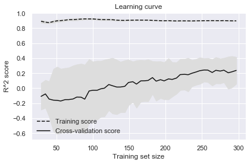

**ANALYSIS:** Scores are converging slowly now so more data could well help.

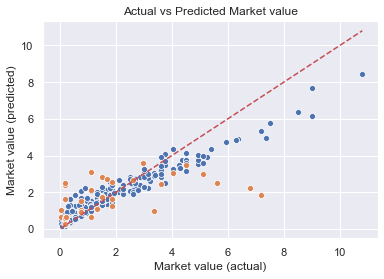

**ANALYSIS:** Our predictions are still undershooting in general but we're getting closer all the time!

    Signature: show_significant_features(features, labels)
    Docstring: <no docstring>
    File:      c:\users\adeacon\documents\github\the-ball-is-round\notebooks\<ipython-input-71-4bcda03899f7>
    Type:      function
    

    
    Significant training features:
    Minutes played       0.190 +/- 0.013
    Shirt number         0.152 +/- 0.015
    In squad             0.119 +/- 0.012
    Goals                0.117 +/- 0.012
    Age                  0.112 +/- 0.009
    Appearances          0.099 +/- 0.008
    Goals p90            0.091 +/- 0.008
    Years in team        0.088 +/- 0.008
    PPG                  0.074 +/- 0.009
    Position group       0.067 +/- 0.008
    Height               0.058 +/- 0.005
    Yellow cards         0.039 +/- 0.004
    Competition          0.039 +/- 0.004
    Substitutions off    0.037 +/- 0.003
    Yellow cards p90     0.035 +/- 0.003
    Assists p90          0.034 +/- 0.005
    Foot                 0.023 +/- 0.004
    Substitutions on     0.022 +/- 0.002
    Assists              0.008 +/- 0.001
    Red cards            0.001 +/- 0.000
    Second yellow cards  0.001 +/- 0.000
    
    Significant testing features:
    Minutes played       0.084 +/- 0.041
    Yellow cards         0.031 +/- 0.011
    Assists              0.016 +/- 0.005
    

**ANALYSIS:** `Minutes played`, `Shirt number`(!?), `In squad`, `Goals` and `Age` are particularly influencing the model. Of those, only `Minutes played` - along with `Yellow cards` and `Assists` - are generalising to new predictions.

## 6. Deployment

* Plan Deployment
* Plan Monitoring and Maintenance
* Produce Final Report
* Review Project

    Summary of whole dataset (with predictions)...
    

<table border="1" class="dataframe">
  <thead>
    <tr style="text-align: right;">
      <th></th>
      <th>Age</th>
      <th>Age when joined</th>
      <th>Appearances</th>
      <th>Assists</th>
      <th>Assists p90</th>
      <th>Competition</th>
      <th>Foot</th>
      <th>Games started</th>
      <th>Goals</th>
      <th>Goals p90</th>
      <th>Height</th>
      <th>In squad</th>
      <th>Market value</th>
      <th>Minutes played</th>
      <th>PPG</th>
      <th>Position group</th>
      <th>Red cards</th>
      <th>Second yellow cards</th>
      <th>Shirt number</th>
      <th>Substitutions off</th>
      <th>Substitutions on</th>
      <th>Years in team</th>
      <th>Yellow cards</th>
      <th>Yellow cards p90</th>
      <th>Market value (prediction)</th>
    </tr>
  </thead>
  <tbody>
    <tr>
      <th>count</th>
      <td>443.000</td>
      <td>351.000</td>
      <td>443.000</td>
      <td>443.000</td>
      <td>443.000</td>
      <td>443</td>
      <td>324</td>
      <td>443.000</td>
      <td>443.000</td>
      <td>443.000</td>
      <td>356.000</td>
      <td>443.000</td>
      <td>330.000</td>
      <td>443.000</td>
      <td>443.000</td>
      <td>443</td>
      <td>443.000</td>
      <td>443.000</td>
      <td>443.000</td>
      <td>443.000</td>
      <td>443.000</td>
      <td>351.000</td>
      <td>443.000</td>
      <td>443.000</td>
      <td>443.000</td>
    </tr>
    <tr>
      <th>unique</th>
      <td>NaN</td>
      <td>NaN</td>
      <td>NaN</td>
      <td>NaN</td>
      <td>NaN</td>
      <td>12</td>
      <td>3</td>
      <td>NaN</td>
      <td>NaN</td>
      <td>NaN</td>
      <td>NaN</td>
      <td>NaN</td>
      <td>NaN</td>
      <td>NaN</td>
      <td>NaN</td>
      <td>4</td>
      <td>NaN</td>
      <td>NaN</td>
      <td>NaN</td>
      <td>NaN</td>
      <td>NaN</td>
      <td>NaN</td>
      <td>NaN</td>
      <td>NaN</td>
      <td>NaN</td>
    </tr>
    <tr>
      <th>top</th>
      <td>NaN</td>
      <td>NaN</td>
      <td>NaN</td>
      <td>NaN</td>
      <td>NaN</td>
      <td>Championship, FA Cup, League Cup</td>
      <td>right</td>
      <td>NaN</td>
      <td>NaN</td>
      <td>NaN</td>
      <td>NaN</td>
      <td>NaN</td>
      <td>NaN</td>
      <td>NaN</td>
      <td>NaN</td>
      <td>M</td>
      <td>NaN</td>
      <td>NaN</td>
      <td>NaN</td>
      <td>NaN</td>
      <td>NaN</td>
      <td>NaN</td>
      <td>NaN</td>
      <td>NaN</td>
      <td>NaN</td>
    </tr>
    <tr>
      <th>freq</th>
      <td>NaN</td>
      <td>NaN</td>
      <td>NaN</td>
      <td>NaN</td>
      <td>NaN</td>
      <td>274</td>
      <td>201</td>
      <td>NaN</td>
      <td>NaN</td>
      <td>NaN</td>
      <td>NaN</td>
      <td>NaN</td>
      <td>NaN</td>
      <td>NaN</td>
      <td>NaN</td>
      <td>167</td>
      <td>NaN</td>
      <td>NaN</td>
      <td>NaN</td>
      <td>NaN</td>
      <td>NaN</td>
      <td>NaN</td>
      <td>NaN</td>
      <td>NaN</td>
      <td>NaN</td>
    </tr>
    <tr>
      <th>mean</th>
      <td>24.546</td>
      <td>23.871</td>
      <td>20.316</td>
      <td>1.194</td>
      <td>0.070</td>
      <td>NaN</td>
      <td>NaN</td>
      <td>17.011</td>
      <td>1.551</td>
      <td>0.095</td>
      <td>183.287</td>
      <td>18.885</td>
      <td>1.696</td>
      <td>1235.817</td>
      <td>1.267</td>
      <td>NaN</td>
      <td>0.056</td>
      <td>0.052</td>
      <td>6.693</td>
      <td>3.305</td>
      <td>3.305</td>
      <td>2.447</td>
      <td>2.011</td>
      <td>0.104</td>
      <td>1.509</td>
    </tr>
    <tr>
      <th>std</th>
      <td>4.634</td>
      <td>4.734</td>
      <td>18.172</td>
      <td>2.061</td>
      <td>0.138</td>
      <td>NaN</td>
      <td>NaN</td>
      <td>15.678</td>
      <td>2.949</td>
      <td>0.184</td>
      <td>6.029</td>
      <td>17.263</td>
      <td>1.776</td>
      <td>1257.427</td>
      <td>0.841</td>
      <td>NaN</td>
      <td>0.250</td>
      <td>0.242</td>
      <td>10.723</td>
      <td>4.534</td>
      <td>4.421</td>
      <td>2.006</td>
      <td>2.957</td>
      <td>0.162</td>
      <td>1.201</td>
    </tr>
    <tr>
      <th>min</th>
      <td>16.000</td>
      <td>16.356</td>
      <td>0.000</td>
      <td>0.000</td>
      <td>0.000</td>
      <td>NaN</td>
      <td>NaN</td>
      <td>0.000</td>
      <td>0.000</td>
      <td>0.000</td>
      <td>167.000</td>
      <td>0.000</td>
      <td>0.038</td>
      <td>0.000</td>
      <td>0.000</td>
      <td>NaN</td>
      <td>0.000</td>
      <td>0.000</td>
      <td>0.000</td>
      <td>0.000</td>
      <td>0.000</td>
      <td>0.266</td>
      <td>0.000</td>
      <td>0.000</td>
      <td>0.150</td>
    </tr>
    <tr>
      <th>25%</th>
      <td>21.000</td>
      <td>19.409</td>
      <td>2.000</td>
      <td>0.000</td>
      <td>0.000</td>
      <td>NaN</td>
      <td>NaN</td>
      <td>2.000</td>
      <td>0.000</td>
      <td>0.000</td>
      <td>179.000</td>
      <td>3.000</td>
      <td>0.375</td>
      <td>96.000</td>
      <td>0.769</td>
      <td>NaN</td>
      <td>0.000</td>
      <td>0.000</td>
      <td>0.000</td>
      <td>0.000</td>
      <td>0.000</td>
      <td>0.913</td>
      <td>0.000</td>
      <td>0.000</td>
      <td>0.636</td>
    </tr>
    <tr>
      <th>50%</th>
      <td>24.000</td>
      <td>23.907</td>
      <td>17.000</td>
      <td>0.000</td>
      <td>0.000</td>
      <td>NaN</td>
      <td>NaN</td>
      <td>14.000</td>
      <td>0.000</td>
      <td>0.000</td>
      <td>183.000</td>
      <td>15.000</td>
      <td>1.130</td>
      <td>828.000</td>
      <td>1.357</td>
      <td>NaN</td>
      <td>0.000</td>
      <td>0.000</td>
      <td>0.000</td>
      <td>2.000</td>
      <td>1.000</td>
      <td>1.960</td>
      <td>1.000</td>
      <td>0.026</td>
      <td>1.203</td>
    </tr>
    <tr>
      <th>75%</th>
      <td>27.000</td>
      <td>26.555</td>
      <td>37.000</td>
      <td>2.000</td>
      <td>0.107</td>
      <td>NaN</td>
      <td>NaN</td>
      <td>29.000</td>
      <td>2.000</td>
      <td>0.110</td>
      <td>188.000</td>
      <td>34.000</td>
      <td>2.250</td>
      <td>2124.000</td>
      <td>1.702</td>
      <td>NaN</td>
      <td>0.000</td>
      <td>0.000</td>
      <td>11.000</td>
      <td>5.000</td>
      <td>5.000</td>
      <td>3.422</td>
      <td>3.000</td>
      <td>0.174</td>
      <td>2.022</td>
    </tr>
    <tr>
      <th>max</th>
      <td>40.000</td>
      <td>37.608</td>
      <td>73.000</td>
      <td>12.000</td>
      <td>1.406</td>
      <td>NaN</td>
      <td>NaN</td>
      <td>53.000</td>
      <td>19.000</td>
      <td>1.593</td>
      <td>199.000</td>
      <td>55.000</td>
      <td>10.800</td>
      <td>4770.000</td>
      <td>3.000</td>
      <td>NaN</td>
      <td>2.000</td>
      <td>2.000</td>
      <td>42.000</td>
      <td>27.000</td>
      <td>22.000</td>
      <td>10.998</td>
      <td>13.000</td>
      <td>1.800</td>
      <td>8.436</td>
    </tr>
  </tbody>
</table>

    Summary of unseen records in dataset (no labels)...
    

<table border="1" class="dataframe">
  <thead>
    <tr style="text-align: right;">
      <th></th>
      <th>Age</th>
      <th>Age when joined</th>
      <th>Appearances</th>
      <th>Assists</th>
      <th>Assists p90</th>
      <th>Competition</th>
      <th>Foot</th>
      <th>Games started</th>
      <th>Goals</th>
      <th>Goals p90</th>
      <th>Height</th>
      <th>In squad</th>
      <th>Market value</th>
      <th>Minutes played</th>
      <th>PPG</th>
      <th>Position group</th>
      <th>Red cards</th>
      <th>Second yellow cards</th>
      <th>Shirt number</th>
      <th>Substitutions off</th>
      <th>Substitutions on</th>
      <th>Years in team</th>
      <th>Yellow cards</th>
      <th>Yellow cards p90</th>
      <th>Market value (prediction)</th>
    </tr>
  </thead>
  <tbody>
    <tr>
      <th>count</th>
      <td>113.000</td>
      <td>21.000</td>
      <td>113.000</td>
      <td>113.000</td>
      <td>113.000</td>
      <td>113</td>
      <td>22</td>
      <td>113.000</td>
      <td>113.00</td>
      <td>113.000</td>
      <td>28.000</td>
      <td>113.000</td>
      <td>0.0</td>
      <td>113.000</td>
      <td>113.000</td>
      <td>113</td>
      <td>113.000</td>
      <td>113.0</td>
      <td>113.000</td>
      <td>113.000</td>
      <td>113.000</td>
      <td>21.000</td>
      <td>113.000</td>
      <td>113.000</td>
      <td>113.000</td>
    </tr>
    <tr>
      <th>unique</th>
      <td>NaN</td>
      <td>NaN</td>
      <td>NaN</td>
      <td>NaN</td>
      <td>NaN</td>
      <td>11</td>
      <td>2</td>
      <td>NaN</td>
      <td>NaN</td>
      <td>NaN</td>
      <td>NaN</td>
      <td>NaN</td>
      <td>NaN</td>
      <td>NaN</td>
      <td>NaN</td>
      <td>4</td>
      <td>NaN</td>
      <td>NaN</td>
      <td>NaN</td>
      <td>NaN</td>
      <td>NaN</td>
      <td>NaN</td>
      <td>NaN</td>
      <td>NaN</td>
      <td>NaN</td>
    </tr>
    <tr>
      <th>top</th>
      <td>NaN</td>
      <td>NaN</td>
      <td>NaN</td>
      <td>NaN</td>
      <td>NaN</td>
      <td>Championship, FA Cup, League Cup</td>
      <td>left</td>
      <td>NaN</td>
      <td>NaN</td>
      <td>NaN</td>
      <td>NaN</td>
      <td>NaN</td>
      <td>NaN</td>
      <td>NaN</td>
      <td>NaN</td>
      <td>M</td>
      <td>NaN</td>
      <td>NaN</td>
      <td>NaN</td>
      <td>NaN</td>
      <td>NaN</td>
      <td>NaN</td>
      <td>NaN</td>
      <td>NaN</td>
      <td>NaN</td>
    </tr>
    <tr>
      <th>freq</th>
      <td>NaN</td>
      <td>NaN</td>
      <td>NaN</td>
      <td>NaN</td>
      <td>NaN</td>
      <td>37</td>
      <td>12</td>
      <td>NaN</td>
      <td>NaN</td>
      <td>NaN</td>
      <td>NaN</td>
      <td>NaN</td>
      <td>NaN</td>
      <td>NaN</td>
      <td>NaN</td>
      <td>48</td>
      <td>NaN</td>
      <td>NaN</td>
      <td>NaN</td>
      <td>NaN</td>
      <td>NaN</td>
      <td>NaN</td>
      <td>NaN</td>
      <td>NaN</td>
      <td>NaN</td>
    </tr>
    <tr>
      <th>mean</th>
      <td>21.673</td>
      <td>18.725</td>
      <td>6.726</td>
      <td>0.319</td>
      <td>0.047</td>
      <td>NaN</td>
      <td>NaN</td>
      <td>5.204</td>
      <td>0.54</td>
      <td>0.078</td>
      <td>182.179</td>
      <td>6.903</td>
      <td>NaN</td>
      <td>338.035</td>
      <td>1.047</td>
      <td>NaN</td>
      <td>0.009</td>
      <td>0.0</td>
      <td>1.257</td>
      <td>1.230</td>
      <td>1.522</td>
      <td>1.486</td>
      <td>0.504</td>
      <td>0.042</td>
      <td>0.949</td>
    </tr>
    <tr>
      <th>std</th>
      <td>4.281</td>
      <td>1.370</td>
      <td>9.135</td>
      <td>1.046</td>
      <td>0.177</td>
      <td>NaN</td>
      <td>NaN</td>
      <td>7.339</td>
      <td>1.50</td>
      <td>0.211</td>
      <td>5.683</td>
      <td>8.596</td>
      <td>NaN</td>
      <td>535.757</td>
      <td>1.114</td>
      <td>NaN</td>
      <td>0.094</td>
      <td>0.0</td>
      <td>5.726</td>
      <td>2.546</td>
      <td>2.543</td>
      <td>0.997</td>
      <td>1.303</td>
      <td>0.097</td>
      <td>0.740</td>
    </tr>
    <tr>
      <th>min</th>
      <td>16.000</td>
      <td>17.054</td>
      <td>0.000</td>
      <td>0.000</td>
      <td>0.000</td>
      <td>NaN</td>
      <td>NaN</td>
      <td>0.000</td>
      <td>0.00</td>
      <td>0.000</td>
      <td>172.000</td>
      <td>0.000</td>
      <td>NaN</td>
      <td>0.000</td>
      <td>0.000</td>
      <td>NaN</td>
      <td>0.000</td>
      <td>0.0</td>
      <td>0.000</td>
      <td>0.000</td>
      <td>0.000</td>
      <td>0.334</td>
      <td>0.000</td>
      <td>0.000</td>
      <td>0.235</td>
    </tr>
    <tr>
      <th>25%</th>
      <td>19.000</td>
      <td>17.687</td>
      <td>0.000</td>
      <td>0.000</td>
      <td>0.000</td>
      <td>NaN</td>
      <td>NaN</td>
      <td>0.000</td>
      <td>0.00</td>
      <td>0.000</td>
      <td>178.000</td>
      <td>1.000</td>
      <td>NaN</td>
      <td>0.000</td>
      <td>0.000</td>
      <td>NaN</td>
      <td>0.000</td>
      <td>0.0</td>
      <td>0.000</td>
      <td>0.000</td>
      <td>0.000</td>
      <td>0.991</td>
      <td>0.000</td>
      <td>0.000</td>
      <td>0.370</td>
    </tr>
    <tr>
      <th>50%</th>
      <td>20.000</td>
      <td>18.404</td>
      <td>2.000</td>
      <td>0.000</td>
      <td>0.000</td>
      <td>NaN</td>
      <td>NaN</td>
      <td>2.000</td>
      <td>0.00</td>
      <td>0.000</td>
      <td>182.500</td>
      <td>3.000</td>
      <td>NaN</td>
      <td>77.000</td>
      <td>0.830</td>
      <td>NaN</td>
      <td>0.000</td>
      <td>0.0</td>
      <td>0.000</td>
      <td>0.000</td>
      <td>0.000</td>
      <td>0.999</td>
      <td>0.000</td>
      <td>0.000</td>
      <td>0.803</td>
    </tr>
    <tr>
      <th>75%</th>
      <td>24.000</td>
      <td>19.056</td>
      <td>9.000</td>
      <td>0.000</td>
      <td>0.000</td>
      <td>NaN</td>
      <td>NaN</td>
      <td>7.000</td>
      <td>0.00</td>
      <td>0.000</td>
      <td>185.000</td>
      <td>11.000</td>
      <td>NaN</td>
      <td>387.000</td>
      <td>1.858</td>
      <td>NaN</td>
      <td>0.000</td>
      <td>0.0</td>
      <td>0.000</td>
      <td>1.000</td>
      <td>2.000</td>
      <td>2.001</td>
      <td>0.000</td>
      <td>0.000</td>
      <td>1.264</td>
    </tr>
    <tr>
      <th>max</th>
      <td>33.000</td>
      <td>21.881</td>
      <td>35.000</td>
      <td>9.000</td>
      <td>1.406</td>
      <td>NaN</td>
      <td>NaN</td>
      <td>28.000</td>
      <td>11.00</td>
      <td>1.593</td>
      <td>196.000</td>
      <td>33.000</td>
      <td>NaN</td>
      <td>2520.000</td>
      <td>3.000</td>
      <td>NaN</td>
      <td>1.000</td>
      <td>0.0</td>
      <td>34.000</td>
      <td>14.000</td>
      <td>14.000</td>
      <td>4.000</td>
      <td>7.000</td>
      <td>0.500</td>
      <td>4.882</td>
    </tr>
  </tbody>
</table>

**ANALYSIS:** The player's missing actual Market values are mostly young players who haven't been used much.

~~**ANALYSIS:** The model seems to particularly struggle with young players who we don't have much information about.~~
