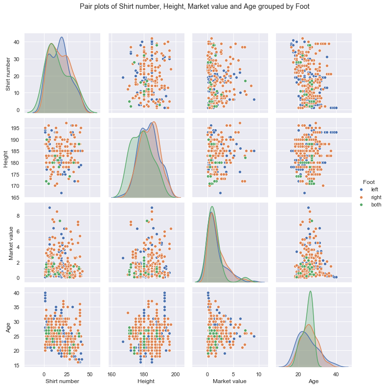
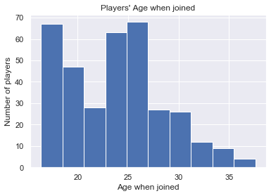
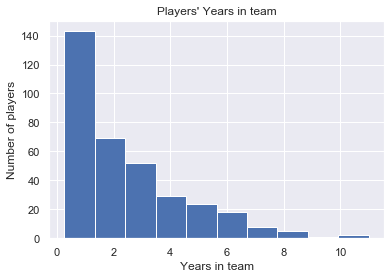
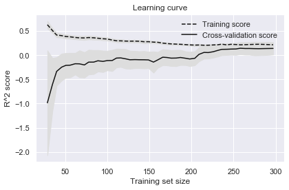
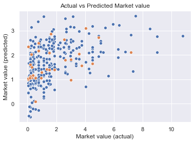
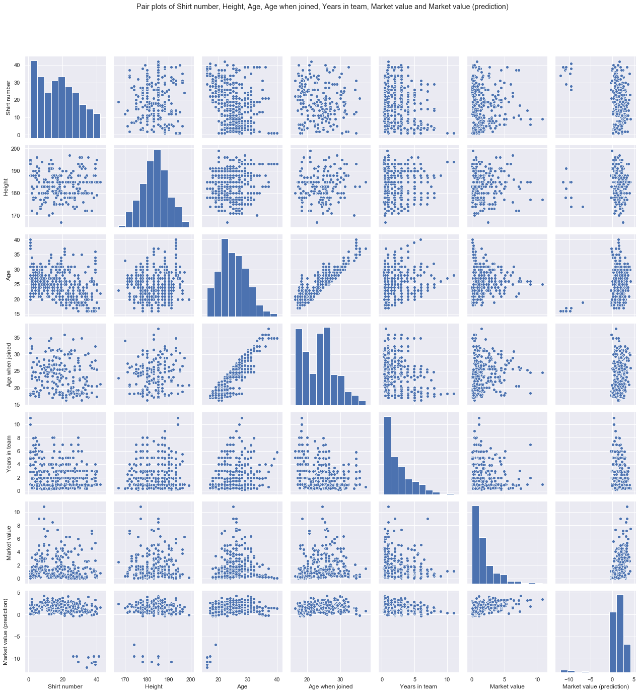

# Boro Player Predictions - Current Market Value

## 1. Business Understanding

* Determine Busines Objectives
* Situation Assessment
* Determine Data Mining Goal
* Produce Project Plan

The aim of this project is to see if we can use data on players at Middlesbrough Football Club to make preditions about the player's and the team's current and future performance.

We have player data from Transfermarkt, ESPN, WhoScored and Fly Me To The Moon (fanzine).

"Performance" could be measured in many different ways: Results on the pitch, market value, fan popularity, churn, ...

A number of key performance metrics will be investigated in turn, looking at how predictable each is...

1) Current market value

2) Current fan popularity

3) Current performance rating

... and more TBC ...

## 2. Data Understanding

* Collect Initial Data
* Describe Data
* Explore Data
* Verify Data Quality

    Loading Transfermarkt general information...
    tmk_cnt_mbr_all_0910.csv
    tmk_cnt_mbr_all_1011.csv
    tmk_cnt_mbr_all_1112.csv
    tmk_cnt_mbr_all_1213.csv
    tmk_cnt_mbr_all_1314.csv
    tmk_cnt_mbr_all_1415.csv
    tmk_cnt_mbr_all_1516.csv
    tmk_cnt_mbr_all_1617.csv
    tmk_cnt_mbr_all_1718.csv
    tmk_cnt_mbr_all_1819.csv
    tmk_cnt_mbr_all_1920.csv
    

    Random sample of records...
    

<table border="1" class="dataframe">
  <thead>
    <tr style="text-align: right;">
      <th></th>
      <th>Shirt number</th>
      <th>Position</th>
      <th>Name</th>
      <th>Date of birth</th>
      <th>Height</th>
      <th>Foot</th>
      <th>Joined</th>
      <th>Contract expires</th>
      <th>Market value</th>
      <th>Season</th>
      <th>Position group</th>
      <th>Age</th>
    </tr>
  </thead>
  <tbody>
    <tr>
      <th>240</th>
      <td>16.0</td>
      <td>Centre Forward</td>
      <td>Bartholomew Ogbeche</td>
      <td>1984-10-01</td>
      <td>178.0</td>
      <td>both</td>
      <td>2011-10-01</td>
      <td>NaT</td>
      <td>0.450</td>
      <td>11/12</td>
      <td>F</td>
      <td>26</td>
    </tr>
    <tr>
      <th>518</th>
      <td>7.0</td>
      <td>Central Midfield</td>
      <td>Grant Leadbitter</td>
      <td>1986-01-07</td>
      <td>177.0</td>
      <td>right</td>
      <td>2012-07-01</td>
      <td>2017-06-30</td>
      <td>1.500</td>
      <td>15/16</td>
      <td>M</td>
      <td>30</td>
    </tr>
    <tr>
      <th>611</th>
      <td>13.0</td>
      <td>Keeper</td>
      <td>Tomás Mejías</td>
      <td>1989-01-30</td>
      <td>195.0</td>
      <td>right</td>
      <td>2014-07-05</td>
      <td>2018-06-30</td>
      <td>0.225</td>
      <td>17/18</td>
      <td>G</td>
      <td>29</td>
    </tr>
    <tr>
      <th>28</th>
      <td>3.0</td>
      <td>Left-Back</td>
      <td>Andrew Taylor</td>
      <td>1986-08-01</td>
      <td>178.0</td>
      <td>left</td>
      <td>2005-07-01</td>
      <td>NaT</td>
      <td>1.880</td>
      <td>09/10</td>
      <td>D</td>
      <td>22</td>
    </tr>
    <tr>
      <th>274</th>
      <td>2.0</td>
      <td>Right-Back</td>
      <td>Justin Hoyte</td>
      <td>1984-11-20</td>
      <td>180.0</td>
      <td>right</td>
      <td>2008-08-01</td>
      <td>NaT</td>
      <td>1.130</td>
      <td>12/13</td>
      <td>D</td>
      <td>27</td>
    </tr>
    <tr>
      <th>48</th>
      <td>34.0</td>
      <td>Defensive Midfield</td>
      <td>Isaiah Osbourne</td>
      <td>1987-11-05</td>
      <td>188.0</td>
      <td>right</td>
      <td>2009-11-06</td>
      <td>NaT</td>
      <td>0.375</td>
      <td>09/10</td>
      <td>M</td>
      <td>21</td>
    </tr>
    <tr>
      <th>618</th>
      <td>4.0</td>
      <td>Centre-Back</td>
      <td>Daniel Ayala</td>
      <td>1990-11-07</td>
      <td>190.0</td>
      <td>right</td>
      <td>2014-01-24</td>
      <td>2020-06-30</td>
      <td>1.800</td>
      <td>17/18</td>
      <td>D</td>
      <td>27</td>
    </tr>
    <tr>
      <th>198</th>
      <td>3.0</td>
      <td>Left-Back</td>
      <td>Joe Bennett</td>
      <td>1990-03-28</td>
      <td>177.0</td>
      <td>left</td>
      <td>2008-07-01</td>
      <td>NaT</td>
      <td>0.188</td>
      <td>11/12</td>
      <td>D</td>
      <td>21</td>
    </tr>
  </tbody>
</table>

    Summary of whole data source...
    

<table border="1" class="dataframe">
  <thead>
    <tr style="text-align: right;">
      <th></th>
      <th>Shirt number</th>
      <th>Position</th>
      <th>Name</th>
      <th>Date of birth</th>
      <th>Height</th>
      <th>Foot</th>
      <th>Joined</th>
      <th>Contract expires</th>
      <th>Market value</th>
      <th>Season</th>
      <th>Position group</th>
      <th>Age</th>
    </tr>
  </thead>
  <tbody>
    <tr>
      <th>count</th>
      <td>333.000000</td>
      <td>364</td>
      <td>364</td>
      <td>364</td>
      <td>356.000000</td>
      <td>324</td>
      <td>351</td>
      <td>169</td>
      <td>330.000000</td>
      <td>364</td>
      <td>364</td>
      <td>364.000000</td>
    </tr>
    <tr>
      <th>unique</th>
      <td>NaN</td>
      <td>19</td>
      <td>172</td>
      <td>169</td>
      <td>NaN</td>
      <td>3</td>
      <td>126</td>
      <td>12</td>
      <td>NaN</td>
      <td>11</td>
      <td>4</td>
      <td>NaN</td>
    </tr>
    <tr>
      <th>top</th>
      <td>NaN</td>
      <td>Centre Back</td>
      <td>Ben Gibson</td>
      <td>1993-01-15 00:00:00</td>
      <td>NaN</td>
      <td>right</td>
      <td>2010-07-01 00:00:00</td>
      <td>2020-06-30 00:00:00</td>
      <td>NaN</td>
      <td>09/10</td>
      <td>M</td>
      <td>NaN</td>
    </tr>
    <tr>
      <th>freq</th>
      <td>NaN</td>
      <td>53</td>
      <td>9</td>
      <td>9</td>
      <td>NaN</td>
      <td>201</td>
      <td>31</td>
      <td>28</td>
      <td>NaN</td>
      <td>47</td>
      <td>134</td>
      <td>NaN</td>
    </tr>
    <tr>
      <th>first</th>
      <td>NaN</td>
      <td>NaN</td>
      <td>NaN</td>
      <td>1973-08-27 00:00:00</td>
      <td>NaN</td>
      <td>NaN</td>
      <td>2000-07-01 00:00:00</td>
      <td>2016-05-31 00:00:00</td>
      <td>NaN</td>
      <td>NaN</td>
      <td>NaN</td>
      <td>NaN</td>
    </tr>
    <tr>
      <th>last</th>
      <td>NaN</td>
      <td>NaN</td>
      <td>NaN</td>
      <td>2000-08-09 00:00:00</td>
      <td>NaN</td>
      <td>NaN</td>
      <td>2020-01-31 00:00:00</td>
      <td>2023-06-30 00:00:00</td>
      <td>NaN</td>
      <td>NaN</td>
      <td>NaN</td>
      <td>NaN</td>
    </tr>
    <tr>
      <th>mean</th>
      <td>18.054054</td>
      <td>NaN</td>
      <td>NaN</td>
      <td>NaN</td>
      <td>183.286517</td>
      <td>NaN</td>
      <td>NaN</td>
      <td>NaN</td>
      <td>1.696327</td>
      <td>NaN</td>
      <td>NaN</td>
      <td>24.826923</td>
    </tr>
    <tr>
      <th>std</th>
      <td>11.018471</td>
      <td>NaN</td>
      <td>NaN</td>
      <td>NaN</td>
      <td>6.028752</td>
      <td>NaN</td>
      <td>NaN</td>
      <td>NaN</td>
      <td>1.776398</td>
      <td>NaN</td>
      <td>NaN</td>
      <td>4.696900</td>
    </tr>
    <tr>
      <th>min</th>
      <td>1.000000</td>
      <td>NaN</td>
      <td>NaN</td>
      <td>NaN</td>
      <td>167.000000</td>
      <td>NaN</td>
      <td>NaN</td>
      <td>NaN</td>
      <td>0.038000</td>
      <td>NaN</td>
      <td>NaN</td>
      <td>16.000000</td>
    </tr>
    <tr>
      <th>25%</th>
      <td>8.000000</td>
      <td>NaN</td>
      <td>NaN</td>
      <td>NaN</td>
      <td>179.000000</td>
      <td>NaN</td>
      <td>NaN</td>
      <td>NaN</td>
      <td>0.375000</td>
      <td>NaN</td>
      <td>NaN</td>
      <td>21.000000</td>
    </tr>
    <tr>
      <th>50%</th>
      <td>18.000000</td>
      <td>NaN</td>
      <td>NaN</td>
      <td>NaN</td>
      <td>183.000000</td>
      <td>NaN</td>
      <td>NaN</td>
      <td>NaN</td>
      <td>1.130000</td>
      <td>NaN</td>
      <td>NaN</td>
      <td>25.000000</td>
    </tr>
    <tr>
      <th>75%</th>
      <td>26.000000</td>
      <td>NaN</td>
      <td>NaN</td>
      <td>NaN</td>
      <td>188.000000</td>
      <td>NaN</td>
      <td>NaN</td>
      <td>NaN</td>
      <td>2.250000</td>
      <td>NaN</td>
      <td>NaN</td>
      <td>28.000000</td>
    </tr>
    <tr>
      <th>max</th>
      <td>42.000000</td>
      <td>NaN</td>
      <td>NaN</td>
      <td>NaN</td>
      <td>199.000000</td>
      <td>NaN</td>
      <td>NaN</td>
      <td>NaN</td>
      <td>10.800000</td>
      <td>NaN</td>
      <td>NaN</td>
      <td>40.000000</td>
    </tr>
  </tbody>
</table>

**ANALYSIS:** So the data is looking broadly in good shape, but there are a few missing values to consider...

<table border="1" class="dataframe">
  <thead>
    <tr style="text-align: right;">
      <th></th>
      <th>% populated</th>
    </tr>
  </thead>
  <tbody>
    <tr>
      <th>Shirt number</th>
      <td>91.483516</td>
    </tr>
    <tr>
      <th>Position</th>
      <td>100.000000</td>
    </tr>
    <tr>
      <th>Name</th>
      <td>100.000000</td>
    </tr>
    <tr>
      <th>Date of birth</th>
      <td>100.000000</td>
    </tr>
    <tr>
      <th>Height</th>
      <td>97.802198</td>
    </tr>
    <tr>
      <th>Foot</th>
      <td>89.010989</td>
    </tr>
    <tr>
      <th>Joined</th>
      <td>96.428571</td>
    </tr>
    <tr>
      <th>Contract expires</th>
      <td>46.428571</td>
    </tr>
    <tr>
      <th>Market value</th>
      <td>90.659341</td>
    </tr>
    <tr>
      <th>Season</th>
      <td>100.000000</td>
    </tr>
    <tr>
      <th>Position group</th>
      <td>100.000000</td>
    </tr>
    <tr>
      <th>Age</th>
      <td>100.000000</td>
    </tr>
  </tbody>
</table>

**ANALYSIS:** Only `Joined` has large gaps. Let's look at it in more detail...

    Players with missing Joined dates...
    

<table border="1" class="dataframe">
  <thead>
    <tr style="text-align: right;">
      <th></th>
      <th>156</th>
      <th>220</th>
      <th>300</th>
      <th>374</th>
      <th>454</th>
      <th>26</th>
      <th>120</th>
      <th>194</th>
      <th>266</th>
      <th>348</th>
      <th>416</th>
      <th>490</th>
      <th>547</th>
      <th>616</th>
      <th>24</th>
      <th>122</th>
      <th>282</th>
      <th>364</th>
      <th>440</th>
      <th>512</th>
      <th>60</th>
      <th>154</th>
      <th>218</th>
      <th>298</th>
      <th>102</th>
      <th>182</th>
      <th>250</th>
      <th>334</th>
      <th>406</th>
      <th>482</th>
      <th>542</th>
      <th>92</th>
      <th>174</th>
      <th>242</th>
      <th>322</th>
      <th>396</th>
      <th>476</th>
    </tr>
  </thead>
  <tbody>
    <tr>
      <th>Name</th>
      <td>Adam Reach</td>
      <td>Adam Reach</td>
      <td>Adam Reach</td>
      <td>Adam Reach</td>
      <td>Adam Reach</td>
      <td>Ben Gibson</td>
      <td>Ben Gibson</td>
      <td>Ben Gibson</td>
      <td>Ben Gibson</td>
      <td>Ben Gibson</td>
      <td>Ben Gibson</td>
      <td>Ben Gibson</td>
      <td>Ben Gibson</td>
      <td>Ben Gibson</td>
      <td>Bruno Pilatos</td>
      <td>Bruno Pilatos</td>
      <td>Bryn Morris</td>
      <td>Bryn Morris</td>
      <td>Bryn Morris</td>
      <td>Bryn Morris</td>
      <td>Cameron Park</td>
      <td>Cameron Park</td>
      <td>Cameron Park</td>
      <td>Cameron Park</td>
      <td>Connor Ripley</td>
      <td>Connor Ripley</td>
      <td>Connor Ripley</td>
      <td>Connor Ripley</td>
      <td>Connor Ripley</td>
      <td>Connor Ripley</td>
      <td>Connor Ripley</td>
      <td>Luke Williams</td>
      <td>Luke Williams</td>
      <td>Luke Williams</td>
      <td>Luke Williams</td>
      <td>Luke Williams</td>
      <td>Luke Williams</td>
    </tr>
    <tr>
      <th>Season</th>
      <td>10/11</td>
      <td>11/12</td>
      <td>12/13</td>
      <td>13/14</td>
      <td>14/15</td>
      <td>09/10</td>
      <td>10/11</td>
      <td>11/12</td>
      <td>12/13</td>
      <td>13/14</td>
      <td>14/15</td>
      <td>15/16</td>
      <td>16/17</td>
      <td>17/18</td>
      <td>09/10</td>
      <td>10/11</td>
      <td>12/13</td>
      <td>13/14</td>
      <td>14/15</td>
      <td>15/16</td>
      <td>09/10</td>
      <td>10/11</td>
      <td>11/12</td>
      <td>12/13</td>
      <td>10/11</td>
      <td>11/12</td>
      <td>12/13</td>
      <td>13/14</td>
      <td>14/15</td>
      <td>15/16</td>
      <td>16/17</td>
      <td>09/10</td>
      <td>10/11</td>
      <td>11/12</td>
      <td>12/13</td>
      <td>13/14</td>
      <td>14/15</td>
    </tr>
    <tr>
      <th>Joined</th>
      <td>NaT</td>
      <td>2011-07-01 00:00:00</td>
      <td>2011-07-01 00:00:00</td>
      <td>2011-07-01 00:00:00</td>
      <td>2011-07-01 00:00:00</td>
      <td>NaT</td>
      <td>2010-07-01 00:00:00</td>
      <td>2010-07-01 00:00:00</td>
      <td>2010-07-01 00:00:00</td>
      <td>2010-07-01 00:00:00</td>
      <td>2010-07-01 00:00:00</td>
      <td>2010-07-01 00:00:00</td>
      <td>2011-07-01 00:00:00</td>
      <td>2011-07-01 00:00:00</td>
      <td>NaT</td>
      <td>2010-07-01 00:00:00</td>
      <td>NaT</td>
      <td>2014-01-01 00:00:00</td>
      <td>2014-01-01 00:00:00</td>
      <td>2014-01-01 00:00:00</td>
      <td>NaT</td>
      <td>NaT</td>
      <td>2011-07-01 00:00:00</td>
      <td>2011-07-01 00:00:00</td>
      <td>NaT</td>
      <td>2011-07-01 00:00:00</td>
      <td>2011-07-01 00:00:00</td>
      <td>2011-07-01 00:00:00</td>
      <td>2011-07-01 00:00:00</td>
      <td>2011-07-01 00:00:00</td>
      <td>2011-07-01 00:00:00</td>
      <td>NaT</td>
      <td>2010-07-01 00:00:00</td>
      <td>2010-07-01 00:00:00</td>
      <td>2010-07-01 00:00:00</td>
      <td>2010-07-01 00:00:00</td>
      <td>2010-07-01 00:00:00</td>
    </tr>
  </tbody>
</table>

**ANALYSIS:** _Possibly_ we could back fill some missing `Joined` dates but this might have some downstream consequences because the date _might_ exceed the end of that season. We'll leave them as Nulls for now.

## 3. Data Preperation

* Select Data
* Clean Data
* Construct Data
* Integrate Data
* Format Data

    Final dataset created with index from Brad Jones (09/10) to Rudy Gestede (19/20).
    

**ANALYSIS:** Most players join in their teens or mid-twenties.

**ANALYSIS:** I'm going to leave out `Shirt number`, `Position`, `Name`, `Date of birth`, `Joined`, `Season` and `Contract expires` from the model for now. `Contract expires` is populated in less than half of records. The others can be discarded for simplicity of model.

<s>**ANALYSIS:** `Foot` and `Position group` will be one-hot encoded</s>

    Random sample of records...
    

<table border="1" class="dataframe">
  <thead>
    <tr style="text-align: right;">
      <th></th>
      <th>Height</th>
      <th>Foot</th>
      <th>Market value</th>
      <th>Position group</th>
      <th>Age</th>
      <th>Age when joined</th>
      <th>Years in team</th>
    </tr>
    <tr>
      <th>Player key</th>
      <th></th>
      <th></th>
      <th></th>
      <th></th>
      <th></th>
      <th></th>
      <th></th>
    </tr>
  </thead>
  <tbody>
    <tr>
      <th>Bartholomew Ogbeche (11/12)</th>
      <td>178.0</td>
      <td>both</td>
      <td>0.450</td>
      <td>F</td>
      <td>26</td>
      <td>26.998501</td>
      <td>0.750187</td>
    </tr>
    <tr>
      <th>Grant Leadbitter  (15/16)</th>
      <td>177.0</td>
      <td>right</td>
      <td>1.500</td>
      <td>M</td>
      <td>30</td>
      <td>26.481037</td>
      <td>4.000082</td>
    </tr>
    <tr>
      <th>Tomás Mejías (17/18)</th>
      <td>195.0</td>
      <td>right</td>
      <td>0.225</td>
      <td>G</td>
      <td>29</td>
      <td>25.426942</td>
      <td>3.989131</td>
    </tr>
    <tr>
      <th>Andrew Taylor (09/10)</th>
      <td>178.0</td>
      <td>left</td>
      <td>1.880</td>
      <td>D</td>
      <td>22</td>
      <td>18.916200</td>
      <td>4.999418</td>
    </tr>
    <tr>
      <th>Justin Hoyte (12/13)</th>
      <td>180.0</td>
      <td>right</td>
      <td>1.130</td>
      <td>D</td>
      <td>27</td>
      <td>23.696585</td>
      <td>4.914543</td>
    </tr>
  </tbody>
</table>

    Summary of whole dataset...
    

<table border="1" class="dataframe">
  <thead>
    <tr style="text-align: right;">
      <th></th>
      <th>Height</th>
      <th>Foot</th>
      <th>Market value</th>
      <th>Position group</th>
      <th>Age</th>
      <th>Age when joined</th>
      <th>Years in team</th>
    </tr>
  </thead>
  <tbody>
    <tr>
      <th>count</th>
      <td>356.000000</td>
      <td>324</td>
      <td>330.000000</td>
      <td>364</td>
      <td>364.000000</td>
      <td>351.000000</td>
      <td>351.000000</td>
    </tr>
    <tr>
      <th>unique</th>
      <td>NaN</td>
      <td>3</td>
      <td>NaN</td>
      <td>4</td>
      <td>NaN</td>
      <td>NaN</td>
      <td>NaN</td>
    </tr>
    <tr>
      <th>top</th>
      <td>NaN</td>
      <td>right</td>
      <td>NaN</td>
      <td>M</td>
      <td>NaN</td>
      <td>NaN</td>
      <td>NaN</td>
    </tr>
    <tr>
      <th>freq</th>
      <td>NaN</td>
      <td>201</td>
      <td>NaN</td>
      <td>134</td>
      <td>NaN</td>
      <td>NaN</td>
      <td>NaN</td>
    </tr>
    <tr>
      <th>mean</th>
      <td>183.286517</td>
      <td>NaN</td>
      <td>1.696327</td>
      <td>NaN</td>
      <td>24.826923</td>
      <td>23.871039</td>
      <td>2.447119</td>
    </tr>
    <tr>
      <th>std</th>
      <td>6.028752</td>
      <td>NaN</td>
      <td>1.776398</td>
      <td>NaN</td>
      <td>4.696900</td>
      <td>4.733915</td>
      <td>2.005552</td>
    </tr>
    <tr>
      <th>min</th>
      <td>167.000000</td>
      <td>NaN</td>
      <td>0.038000</td>
      <td>NaN</td>
      <td>16.000000</td>
      <td>16.356256</td>
      <td>0.265577</td>
    </tr>
    <tr>
      <th>25%</th>
      <td>179.000000</td>
      <td>NaN</td>
      <td>0.375000</td>
      <td>NaN</td>
      <td>21.000000</td>
      <td>19.409023</td>
      <td>0.913092</td>
    </tr>
    <tr>
      <th>50%</th>
      <td>183.000000</td>
      <td>NaN</td>
      <td>1.130000</td>
      <td>NaN</td>
      <td>25.000000</td>
      <td>23.907404</td>
      <td>1.960341</td>
    </tr>
    <tr>
      <th>75%</th>
      <td>188.000000</td>
      <td>NaN</td>
      <td>2.250000</td>
      <td>NaN</td>
      <td>28.000000</td>
      <td>26.554960</td>
      <td>3.422384</td>
    </tr>
    <tr>
      <th>max</th>
      <td>199.000000</td>
      <td>NaN</td>
      <td>10.800000</td>
      <td>NaN</td>
      <td>40.000000</td>
      <td>37.607891</td>
      <td>10.998172</td>
    </tr>
  </tbody>
</table>

## 4. Modelling

* Select Modelling Technique
* Generate Test Design
* Build Model
* Assess Model

    
    
    Selected numeric features are: ['Height', 'Age', 'Age when joined', 'Years in team']
    

    
    
    Selected categorical features are: ['Foot', 'Position group']
    

    
    
    Dropping nulls during data preparation: True
    

    
    
    Train data has shape: (270, 6)
    Test data has shape: (30, 6)
    

    
    
    Full model grid-space to tune hyperparameters across...
    

    GridSearchCV(cv=KFold(n_splits=10, random_state=4, shuffle=True),
                 error_score=nan,
                 estimator=Pipeline(memory=None,
                                    steps=[('preprocessor',
                                            ColumnTransformer(n_jobs=None,
                                                              remainder='drop',
                                                              sparse_threshold=0.3,
                                                              transformer_weights=None,
                                                              transformers=[('num',
                                                                             Pipeline(memory=None,
                                                                                      steps=[('scaler',
                                                                                              MinMaxScaler(copy=True,
                                                                                                           feature_range=(0,
                                                                                                                          1)))],
                                                                                      verbose=False),
                                                                             ['He...
                                                                             ['Foot',
                                                                              'Position '
                                                                              'group'])],
                                                              verbose=False)),
                                           ('estimator',
                                            LinearRegression(copy_X=True,
                                                             fit_intercept=True,
                                                             n_jobs=None,
                                                             normalize=False))],
                                    verbose=False),
                 iid='deprecated', n_jobs=None,
                 param_grid={'estimator__fit_intercept': [True, False],
                             'estimator__normalize': [True, False]},
                 pre_dispatch='2*n_jobs', refit=True, return_train_score=False,
                 scoring=None, verbose=0)

    
    
    Final tuned model...
    

    Pipeline(memory=None,
             steps=[('preprocessor',
                     ColumnTransformer(n_jobs=None, remainder='drop',
                                       sparse_threshold=0.3,
                                       transformer_weights=None,
                                       transformers=[('num',
                                                      Pipeline(memory=None,
                                                               steps=[('scaler',
                                                                       MinMaxScaler(copy=True,
                                                                                    feature_range=(0,
                                                                                                   1)))],
                                                               verbose=False),
                                                      ['Height', 'Age',
                                                       'Age when joined',
                                                       'Years in team']),
                                                     ('cat',
                                                      Pipeline(memory=None,
                                                               steps=[('onehot',
                                                                       OneHotEncoder(categories='auto',
                                                                                     drop=None,
                                                                                     dtype=<class 'numpy.float64'>,
                                                                                     handle_unknown='ignore',
                                                                                     sparse=True))],
                                                               verbose=False),
                                                      ['Foot', 'Position group'])],
                                       verbose=False)),
                    ('estimator',
                     LinearRegression(copy_X=True, fit_intercept=True, n_jobs=None,
                                      normalize=True))],
             verbose=False)

## 5. Evaluation

* Evaluate Results
* Review Process
* Determine Next Steps

    Model scores
    

<table border="1" class="dataframe">
  <thead>
    <tr style="text-align: right;">
      <th></th>
      <th>Train</th>
      <th>Test</th>
    </tr>
  </thead>
  <tbody>
    <tr>
      <th>MedAE</th>
      <td>0.854035</td>
      <td>1.119165</td>
    </tr>
    <tr>
      <th>RMSE</th>
      <td>1.450077</td>
      <td>1.907297</td>
    </tr>
    <tr>
      <th>R^2</th>
      <td>0.206937</td>
      <td>0.072271</td>
    </tr>
  </tbody>
</table>

**ANALYSIS:** The metrics aren't great - even just on the training data - but it's a baseline. The only way is up (I Hope!) :)

**ANALYSIS:** The model seems pretty weak in general but we can say the learning curves have largely converged so adding extra training samples is unlikely to improve the model.

**ANALYSIS:** Confirming our scoring visually, it looks pretty weak correlation between actual and predicted values. Note also the model is not able to predict anything much above £4m even though some of the data exceeded £10m.

    Effect of each feature on the model
    

<table border="1" class="dataframe">
  <thead>
    <tr style="text-align: right;">
      <th></th>
      <th>effect</th>
      <th>error</th>
    </tr>
  </thead>
  <tbody>
    <tr>
      <th>Height</th>
      <td>0.80</td>
      <td>5.300000e-01</td>
    </tr>
    <tr>
      <th>Age</th>
      <td>20.95</td>
      <td>4.250000e+00</td>
    </tr>
    <tr>
      <th>Age when joined</th>
      <td>-19.56</td>
      <td>4.200000e+00</td>
    </tr>
    <tr>
      <th>Years in team</th>
      <td>-10.44</td>
      <td>2.240000e+00</td>
    </tr>
    <tr>
      <th>Foot_both</th>
      <td>-0.26</td>
      <td>7.791053e+13</td>
    </tr>
    <tr>
      <th>Foot_left</th>
      <td>-0.08</td>
      <td>7.791053e+13</td>
    </tr>
    <tr>
      <th>Foot_right</th>
      <td>0.15</td>
      <td>7.791053e+13</td>
    </tr>
    <tr>
      <th>Position group_D</th>
      <td>-0.11</td>
      <td>6.127557e+13</td>
    </tr>
    <tr>
      <th>Position group_F</th>
      <td>0.49</td>
      <td>6.127557e+13</td>
    </tr>
    <tr>
      <th>Position group_G</th>
      <td>-1.33</td>
      <td>6.127557e+13</td>
    </tr>
    <tr>
      <th>Position group_M</th>
      <td>0.43</td>
      <td>6.127557e+13</td>
    </tr>
  </tbody>
</table>

**ANALYSIS:** The individual features which appear to have most effect are `Age`, `Age when joined` and `Years in team`. Perhaps the most we can say is old players are cheap.

## 6. Deployment

* Plan Deployment
* Plan Monitoring and Maintenance
* Produce Final Report
* Review Project

    Summary of whole dataset (with predictions)...
    

<table border="1" class="dataframe">
  <thead>
    <tr style="text-align: right;">
      <th></th>
      <th>Height</th>
      <th>Foot</th>
      <th>Market value</th>
      <th>Position group</th>
      <th>Age</th>
      <th>Age when joined</th>
      <th>Years in team</th>
      <th>Market value (prediction)</th>
    </tr>
  </thead>
  <tbody>
    <tr>
      <th>count</th>
      <td>356.000000</td>
      <td>324</td>
      <td>330.000000</td>
      <td>364</td>
      <td>364.000000</td>
      <td>351.000000</td>
      <td>351.000000</td>
      <td>314.000000</td>
    </tr>
    <tr>
      <th>unique</th>
      <td>NaN</td>
      <td>3</td>
      <td>NaN</td>
      <td>4</td>
      <td>NaN</td>
      <td>NaN</td>
      <td>NaN</td>
      <td>NaN</td>
    </tr>
    <tr>
      <th>top</th>
      <td>NaN</td>
      <td>right</td>
      <td>NaN</td>
      <td>M</td>
      <td>NaN</td>
      <td>NaN</td>
      <td>NaN</td>
      <td>NaN</td>
    </tr>
    <tr>
      <th>freq</th>
      <td>NaN</td>
      <td>201</td>
      <td>NaN</td>
      <td>134</td>
      <td>NaN</td>
      <td>NaN</td>
      <td>NaN</td>
      <td>NaN</td>
    </tr>
    <tr>
      <th>mean</th>
      <td>183.286517</td>
      <td>NaN</td>
      <td>1.696327</td>
      <td>NaN</td>
      <td>24.826923</td>
      <td>23.871039</td>
      <td>2.447119</td>
      <td>1.805932</td>
    </tr>
    <tr>
      <th>std</th>
      <td>6.028752</td>
      <td>NaN</td>
      <td>1.776398</td>
      <td>NaN</td>
      <td>4.696900</td>
      <td>4.733915</td>
      <td>2.005552</td>
      <td>0.702179</td>
    </tr>
    <tr>
      <th>min</th>
      <td>167.000000</td>
      <td>NaN</td>
      <td>0.038000</td>
      <td>NaN</td>
      <td>16.000000</td>
      <td>16.356256</td>
      <td>0.265577</td>
      <td>-0.312500</td>
    </tr>
    <tr>
      <th>25%</th>
      <td>179.000000</td>
      <td>NaN</td>
      <td>0.375000</td>
      <td>NaN</td>
      <td>21.000000</td>
      <td>19.409023</td>
      <td>0.913092</td>
      <td>1.312500</td>
    </tr>
    <tr>
      <th>50%</th>
      <td>183.000000</td>
      <td>NaN</td>
      <td>1.130000</td>
      <td>NaN</td>
      <td>25.000000</td>
      <td>23.907404</td>
      <td>1.960341</td>
      <td>1.875000</td>
    </tr>
    <tr>
      <th>75%</th>
      <td>188.000000</td>
      <td>NaN</td>
      <td>2.250000</td>
      <td>NaN</td>
      <td>28.000000</td>
      <td>26.554960</td>
      <td>3.422384</td>
      <td>2.359375</td>
    </tr>
    <tr>
      <th>max</th>
      <td>199.000000</td>
      <td>NaN</td>
      <td>10.800000</td>
      <td>NaN</td>
      <td>40.000000</td>
      <td>37.607891</td>
      <td>10.998172</td>
      <td>3.437500</td>
    </tr>
  </tbody>
</table>

**ANALYSIS:** As we saw during data preparation there's no clear correlations with continuous features at work. Further our predictions don't even particularly correlate with the actual values.

    Summary of unseen records in dataset (no labels)...
    

<table border="1" class="dataframe">
  <thead>
    <tr style="text-align: right;">
      <th></th>
      <th>Height</th>
      <th>Foot</th>
      <th>Market value</th>
      <th>Position group</th>
      <th>Age</th>
      <th>Age when joined</th>
      <th>Years in team</th>
      <th>Market value (prediction)</th>
    </tr>
  </thead>
  <tbody>
    <tr>
      <th>count</th>
      <td>14.000000</td>
      <td>14</td>
      <td>0.0</td>
      <td>14</td>
      <td>14.000000</td>
      <td>14.000000</td>
      <td>14.000000</td>
      <td>14.000000</td>
    </tr>
    <tr>
      <th>unique</th>
      <td>NaN</td>
      <td>2</td>
      <td>NaN</td>
      <td>3</td>
      <td>NaN</td>
      <td>NaN</td>
      <td>NaN</td>
      <td>NaN</td>
    </tr>
    <tr>
      <th>top</th>
      <td>NaN</td>
      <td>left</td>
      <td>NaN</td>
      <td>M</td>
      <td>NaN</td>
      <td>NaN</td>
      <td>NaN</td>
      <td>NaN</td>
    </tr>
    <tr>
      <th>freq</th>
      <td>NaN</td>
      <td>8</td>
      <td>NaN</td>
      <td>7</td>
      <td>NaN</td>
      <td>NaN</td>
      <td>NaN</td>
      <td>NaN</td>
    </tr>
    <tr>
      <th>mean</th>
      <td>182.357143</td>
      <td>NaN</td>
      <td>NaN</td>
      <td>NaN</td>
      <td>19.071429</td>
      <td>19.023565</td>
      <td>1.622210</td>
      <td>1.566964</td>
    </tr>
    <tr>
      <th>std</th>
      <td>6.159510</td>
      <td>NaN</td>
      <td>NaN</td>
      <td>NaN</td>
      <td>1.268814</td>
      <td>1.503815</td>
      <td>1.080341</td>
      <td>0.351392</td>
    </tr>
    <tr>
      <th>min</th>
      <td>172.000000</td>
      <td>NaN</td>
      <td>NaN</td>
      <td>NaN</td>
      <td>17.000000</td>
      <td>17.456895</td>
      <td>0.334025</td>
      <td>0.812500</td>
    </tr>
    <tr>
      <th>25%</th>
      <td>180.000000</td>
      <td>NaN</td>
      <td>NaN</td>
      <td>NaN</td>
      <td>18.000000</td>
      <td>18.063341</td>
      <td>0.878184</td>
      <td>1.437500</td>
    </tr>
    <tr>
      <th>50%</th>
      <td>184.000000</td>
      <td>NaN</td>
      <td>NaN</td>
      <td>NaN</td>
      <td>19.000000</td>
      <td>18.404211</td>
      <td>1.002074</td>
      <td>1.562500</td>
    </tr>
    <tr>
      <th>75%</th>
      <td>185.000000</td>
      <td>NaN</td>
      <td>NaN</td>
      <td>NaN</td>
      <td>20.000000</td>
      <td>19.996304</td>
      <td>2.001410</td>
      <td>1.796875</td>
    </tr>
    <tr>
      <th>max</th>
      <td>196.000000</td>
      <td>NaN</td>
      <td>NaN</td>
      <td>NaN</td>
      <td>21.000000</td>
      <td>21.881353</td>
      <td>4.000082</td>
      <td>2.062500</td>
    </tr>
  </tbody>
</table>

<table border="1" class="dataframe">
  <thead>
    <tr style="text-align: right;">
      <th></th>
      <th>Connor Ripley (11/12)</th>
    </tr>
  </thead>
  <tbody>
    <tr>
      <th>Height</th>
      <td>191</td>
    </tr>
    <tr>
      <th>Foot</th>
      <td>NaN</td>
    </tr>
    <tr>
      <th>Market value</th>
      <td>NaN</td>
    </tr>
    <tr>
      <th>Position group</th>
      <td>G</td>
    </tr>
    <tr>
      <th>Age</th>
      <td>18</td>
    </tr>
    <tr>
      <th>Age when joined</th>
      <td>18.3768</td>
    </tr>
    <tr>
      <th>Years in team</th>
      <td>1.00207</td>
    </tr>
    <tr>
      <th>Market value (prediction)</th>
      <td>NaN</td>
    </tr>
  </tbody>
</table>

**ANALYSIS:** The player's missing actual Market values are all young players (17-21). The predictions are typically quite small which is as expected at least. <s>Poor Connor Ripley (11/12) gets a negative value!</s>
