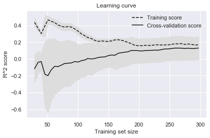
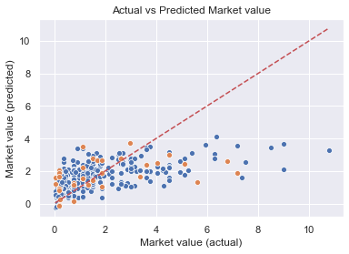
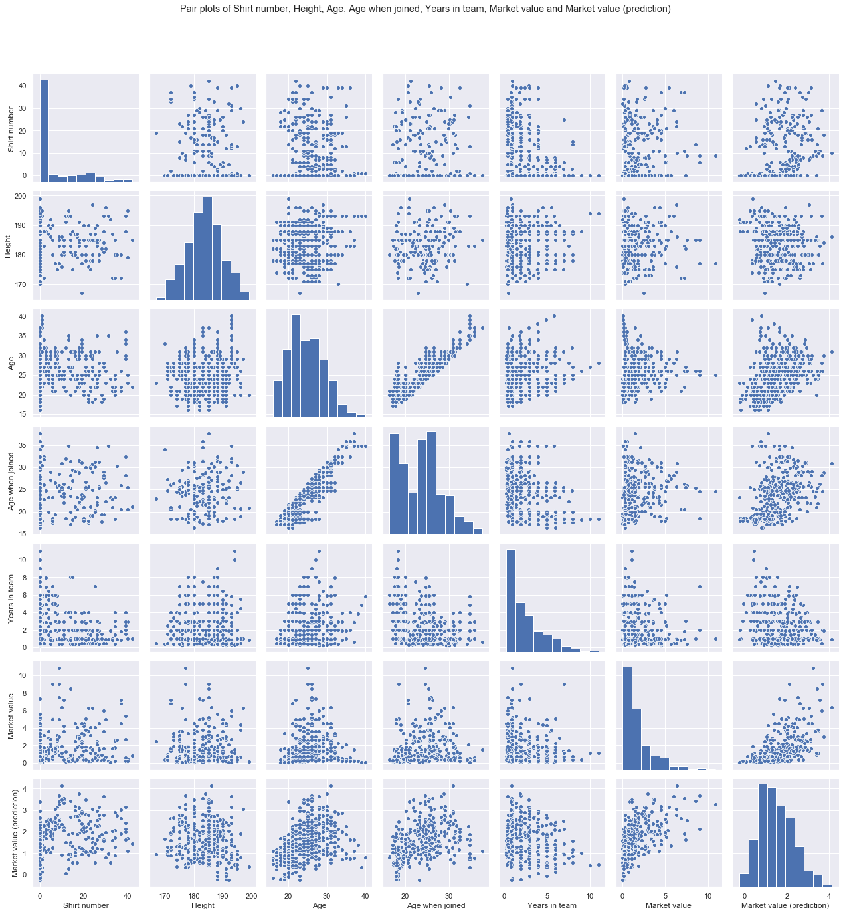

# Boro Player Predictions - Current Market Value

## 1. Business Understanding

* Determine Busines Objectives
* Situation Assessment
* Determine Data Mining Goal
* Produce Project Plan

The aim of this project is to see if we can use data on players at Middlesbrough Football Club to make preditions about the player's and the team's current and future performance.

We have player data from Transfermarkt, ESPN, WhoScored and Fly Me To The Moon (fanzine).

"Performance" could be measured in many different ways: Results on the pitch, market value, fan popularity, churn, ...

A number of key performance metrics will be investigated in turn, looking at how predictable each is...

1) Current market value

2) Current fan popularity

3) Current performance rating

... and more TBC ...

## 2. Data Understanding

* Collect Initial Data
* Describe Data
* Explore Data
* Verify Data Quality

    Loading Transfermarkt general information...
    tmk_cnt_mbr_all_0910.csv
    tmk_cnt_mbr_all_1011.csv
    tmk_cnt_mbr_all_1112.csv
    tmk_cnt_mbr_all_1213.csv
    tmk_cnt_mbr_all_1314.csv
    tmk_cnt_mbr_all_1415.csv
    tmk_cnt_mbr_all_1516.csv
    tmk_cnt_mbr_all_1617.csv
    tmk_cnt_mbr_all_1718.csv
    tmk_cnt_mbr_all_1819.csv
    tmk_cnt_mbr_all_1920.csv
    

    Random sample of records...
    

<table border="1" class="dataframe">
  <thead>
    <tr style="text-align: right;">
      <th></th>
      <th>Shirt number</th>
      <th>Position</th>
      <th>Name</th>
      <th>Date of birth</th>
      <th>Height</th>
      <th>Foot</th>
      <th>Joined</th>
      <th>Contract expires</th>
      <th>Market value</th>
      <th>Season</th>
      <th>Position group</th>
      <th>Age</th>
    </tr>
  </thead>
  <tbody>
    <tr>
      <th>240</th>
      <td>NaN</td>
      <td>Centre Forward</td>
      <td>Bartholomew Ogbeche</td>
      <td>1984-10-01</td>
      <td>178.0</td>
      <td>both</td>
      <td>2011-10-01</td>
      <td>NaT</td>
      <td>0.450</td>
      <td>11/12</td>
      <td>F</td>
      <td>26</td>
    </tr>
    <tr>
      <th>518</th>
      <td>7.0</td>
      <td>Central Midfield</td>
      <td>Grant Leadbitter</td>
      <td>1986-01-07</td>
      <td>177.0</td>
      <td>right</td>
      <td>2012-07-01</td>
      <td>2017-06-30</td>
      <td>1.500</td>
      <td>15/16</td>
      <td>M</td>
      <td>30</td>
    </tr>
    <tr>
      <th>611</th>
      <td>NaN</td>
      <td>Keeper</td>
      <td>Tomás Mejías</td>
      <td>1989-01-30</td>
      <td>195.0</td>
      <td>right</td>
      <td>2014-07-05</td>
      <td>2018-06-30</td>
      <td>0.225</td>
      <td>17/18</td>
      <td>G</td>
      <td>29</td>
    </tr>
    <tr>
      <th>28</th>
      <td>NaN</td>
      <td>Left-Back</td>
      <td>Andrew Taylor</td>
      <td>1986-08-01</td>
      <td>178.0</td>
      <td>left</td>
      <td>2005-07-01</td>
      <td>NaT</td>
      <td>1.880</td>
      <td>09/10</td>
      <td>D</td>
      <td>22</td>
    </tr>
    <tr>
      <th>274</th>
      <td>NaN</td>
      <td>Right-Back</td>
      <td>Justin Hoyte</td>
      <td>1984-11-20</td>
      <td>180.0</td>
      <td>right</td>
      <td>2008-08-01</td>
      <td>NaT</td>
      <td>1.130</td>
      <td>12/13</td>
      <td>D</td>
      <td>27</td>
    </tr>
    <tr>
      <th>48</th>
      <td>NaN</td>
      <td>Defensive Midfield</td>
      <td>Isaiah Osbourne</td>
      <td>1987-11-05</td>
      <td>188.0</td>
      <td>right</td>
      <td>2009-11-06</td>
      <td>NaT</td>
      <td>0.375</td>
      <td>09/10</td>
      <td>M</td>
      <td>21</td>
    </tr>
    <tr>
      <th>618</th>
      <td>NaN</td>
      <td>Centre-Back</td>
      <td>Daniel Ayala</td>
      <td>1990-11-07</td>
      <td>190.0</td>
      <td>right</td>
      <td>2014-01-24</td>
      <td>2020-06-30</td>
      <td>1.800</td>
      <td>17/18</td>
      <td>D</td>
      <td>27</td>
    </tr>
    <tr>
      <th>198</th>
      <td>NaN</td>
      <td>Left-Back</td>
      <td>Joe Bennett</td>
      <td>1990-03-28</td>
      <td>177.0</td>
      <td>left</td>
      <td>2008-07-01</td>
      <td>NaT</td>
      <td>0.188</td>
      <td>11/12</td>
      <td>D</td>
      <td>21</td>
    </tr>
  </tbody>
</table>

    Summary of whole data source...
    

<table border="1" class="dataframe">
  <thead>
    <tr style="text-align: right;">
      <th></th>
      <th>Shirt number</th>
      <th>Position</th>
      <th>Name</th>
      <th>Date of birth</th>
      <th>Height</th>
      <th>Foot</th>
      <th>Joined</th>
      <th>Contract expires</th>
      <th>Market value</th>
      <th>Season</th>
      <th>Position group</th>
      <th>Age</th>
    </tr>
  </thead>
  <tbody>
    <tr>
      <th>count</th>
      <td>101.00000</td>
      <td>364</td>
      <td>364</td>
      <td>364</td>
      <td>356.000000</td>
      <td>324</td>
      <td>351</td>
      <td>169</td>
      <td>330.000000</td>
      <td>364</td>
      <td>364</td>
      <td>364.000000</td>
    </tr>
    <tr>
      <th>unique</th>
      <td>NaN</td>
      <td>19</td>
      <td>171</td>
      <td>169</td>
      <td>NaN</td>
      <td>3</td>
      <td>126</td>
      <td>12</td>
      <td>NaN</td>
      <td>11</td>
      <td>4</td>
      <td>NaN</td>
    </tr>
    <tr>
      <th>top</th>
      <td>NaN</td>
      <td>Centre Back</td>
      <td>Ben Gibson</td>
      <td>1993-01-15 00:00:00</td>
      <td>NaN</td>
      <td>right</td>
      <td>2010-07-01 00:00:00</td>
      <td>2020-06-30 00:00:00</td>
      <td>NaN</td>
      <td>09/10</td>
      <td>M</td>
      <td>NaN</td>
    </tr>
    <tr>
      <th>freq</th>
      <td>NaN</td>
      <td>53</td>
      <td>9</td>
      <td>9</td>
      <td>NaN</td>
      <td>201</td>
      <td>31</td>
      <td>28</td>
      <td>NaN</td>
      <td>47</td>
      <td>134</td>
      <td>NaN</td>
    </tr>
    <tr>
      <th>first</th>
      <td>NaN</td>
      <td>NaN</td>
      <td>NaN</td>
      <td>1973-08-27 00:00:00</td>
      <td>NaN</td>
      <td>NaN</td>
      <td>2000-07-01 00:00:00</td>
      <td>2016-05-31 00:00:00</td>
      <td>NaN</td>
      <td>NaN</td>
      <td>NaN</td>
      <td>NaN</td>
    </tr>
    <tr>
      <th>last</th>
      <td>NaN</td>
      <td>NaN</td>
      <td>NaN</td>
      <td>2000-08-09 00:00:00</td>
      <td>NaN</td>
      <td>NaN</td>
      <td>2020-01-31 00:00:00</td>
      <td>2023-06-30 00:00:00</td>
      <td>NaN</td>
      <td>NaN</td>
      <td>NaN</td>
      <td>NaN</td>
    </tr>
    <tr>
      <th>mean</th>
      <td>17.49505</td>
      <td>NaN</td>
      <td>NaN</td>
      <td>NaN</td>
      <td>183.286517</td>
      <td>NaN</td>
      <td>NaN</td>
      <td>NaN</td>
      <td>1.696327</td>
      <td>NaN</td>
      <td>NaN</td>
      <td>24.826923</td>
    </tr>
    <tr>
      <th>std</th>
      <td>10.85046</td>
      <td>NaN</td>
      <td>NaN</td>
      <td>NaN</td>
      <td>6.028752</td>
      <td>NaN</td>
      <td>NaN</td>
      <td>NaN</td>
      <td>1.776398</td>
      <td>NaN</td>
      <td>NaN</td>
      <td>4.696900</td>
    </tr>
    <tr>
      <th>min</th>
      <td>1.00000</td>
      <td>NaN</td>
      <td>NaN</td>
      <td>NaN</td>
      <td>167.000000</td>
      <td>NaN</td>
      <td>NaN</td>
      <td>NaN</td>
      <td>0.038000</td>
      <td>NaN</td>
      <td>NaN</td>
      <td>16.000000</td>
    </tr>
    <tr>
      <th>25%</th>
      <td>8.00000</td>
      <td>NaN</td>
      <td>NaN</td>
      <td>NaN</td>
      <td>179.000000</td>
      <td>NaN</td>
      <td>NaN</td>
      <td>NaN</td>
      <td>0.375000</td>
      <td>NaN</td>
      <td>NaN</td>
      <td>21.000000</td>
    </tr>
    <tr>
      <th>50%</th>
      <td>18.00000</td>
      <td>NaN</td>
      <td>NaN</td>
      <td>NaN</td>
      <td>183.000000</td>
      <td>NaN</td>
      <td>NaN</td>
      <td>NaN</td>
      <td>1.130000</td>
      <td>NaN</td>
      <td>NaN</td>
      <td>25.000000</td>
    </tr>
    <tr>
      <th>75%</th>
      <td>25.00000</td>
      <td>NaN</td>
      <td>NaN</td>
      <td>NaN</td>
      <td>188.000000</td>
      <td>NaN</td>
      <td>NaN</td>
      <td>NaN</td>
      <td>2.250000</td>
      <td>NaN</td>
      <td>NaN</td>
      <td>28.000000</td>
    </tr>
    <tr>
      <th>max</th>
      <td>40.00000</td>
      <td>NaN</td>
      <td>NaN</td>
      <td>NaN</td>
      <td>199.000000</td>
      <td>NaN</td>
      <td>NaN</td>
      <td>NaN</td>
      <td>10.800000</td>
      <td>NaN</td>
      <td>NaN</td>
      <td>40.000000</td>
    </tr>
  </tbody>
</table>

**ANALYSIS:** So the data is looking broadly in good shape, but there are a few missing values to consider...

<table border="1" class="dataframe">
  <thead>
    <tr style="text-align: right;">
      <th></th>
      <th>% populated</th>
    </tr>
  </thead>
  <tbody>
    <tr>
      <th>Shirt number</th>
      <td>27.747253</td>
    </tr>
    <tr>
      <th>Position</th>
      <td>100.000000</td>
    </tr>
    <tr>
      <th>Name</th>
      <td>100.000000</td>
    </tr>
    <tr>
      <th>Date of birth</th>
      <td>100.000000</td>
    </tr>
    <tr>
      <th>Height</th>
      <td>97.802198</td>
    </tr>
    <tr>
      <th>Foot</th>
      <td>89.010989</td>
    </tr>
    <tr>
      <th>Joined</th>
      <td>96.428571</td>
    </tr>
    <tr>
      <th>Contract expires</th>
      <td>46.428571</td>
    </tr>
    <tr>
      <th>Market value</th>
      <td>90.659341</td>
    </tr>
    <tr>
      <th>Season</th>
      <td>100.000000</td>
    </tr>
    <tr>
      <th>Position group</th>
      <td>100.000000</td>
    </tr>
    <tr>
      <th>Age</th>
      <td>100.000000</td>
    </tr>
  </tbody>
</table>

    Players with missing Joined dates...
    

<table border="1" class="dataframe">
  <thead>
    <tr style="text-align: right;">
      <th></th>
      <th>156</th>
      <th>220</th>
      <th>300</th>
      <th>374</th>
      <th>454</th>
      <th>26</th>
      <th>120</th>
      <th>194</th>
      <th>266</th>
      <th>348</th>
      <th>416</th>
      <th>490</th>
      <th>547</th>
      <th>616</th>
      <th>24</th>
      <th>122</th>
      <th>282</th>
      <th>364</th>
      <th>440</th>
      <th>512</th>
      <th>60</th>
      <th>154</th>
      <th>218</th>
      <th>298</th>
      <th>102</th>
      <th>182</th>
      <th>250</th>
      <th>334</th>
      <th>406</th>
      <th>482</th>
      <th>542</th>
      <th>92</th>
      <th>174</th>
      <th>242</th>
      <th>322</th>
      <th>396</th>
      <th>476</th>
    </tr>
  </thead>
  <tbody>
    <tr>
      <th>Name</th>
      <td>Adam Reach</td>
      <td>Adam Reach</td>
      <td>Adam Reach</td>
      <td>Adam Reach</td>
      <td>Adam Reach</td>
      <td>Ben Gibson</td>
      <td>Ben Gibson</td>
      <td>Ben Gibson</td>
      <td>Ben Gibson</td>
      <td>Ben Gibson</td>
      <td>Ben Gibson</td>
      <td>Ben Gibson</td>
      <td>Ben Gibson</td>
      <td>Ben Gibson</td>
      <td>Bruno Pilatos</td>
      <td>Bruno Pilatos</td>
      <td>Bryn Morris</td>
      <td>Bryn Morris</td>
      <td>Bryn Morris</td>
      <td>Bryn Morris</td>
      <td>Cameron Park</td>
      <td>Cameron Park</td>
      <td>Cameron Park</td>
      <td>Cameron Park</td>
      <td>Connor Ripley</td>
      <td>Connor Ripley</td>
      <td>Connor Ripley</td>
      <td>Connor Ripley</td>
      <td>Connor Ripley</td>
      <td>Connor Ripley</td>
      <td>Connor Ripley</td>
      <td>Luke Williams</td>
      <td>Luke Williams</td>
      <td>Luke Williams</td>
      <td>Luke Williams</td>
      <td>Luke Williams</td>
      <td>Luke Williams</td>
    </tr>
    <tr>
      <th>Season</th>
      <td>10/11</td>
      <td>11/12</td>
      <td>12/13</td>
      <td>13/14</td>
      <td>14/15</td>
      <td>09/10</td>
      <td>10/11</td>
      <td>11/12</td>
      <td>12/13</td>
      <td>13/14</td>
      <td>14/15</td>
      <td>15/16</td>
      <td>16/17</td>
      <td>17/18</td>
      <td>09/10</td>
      <td>10/11</td>
      <td>12/13</td>
      <td>13/14</td>
      <td>14/15</td>
      <td>15/16</td>
      <td>09/10</td>
      <td>10/11</td>
      <td>11/12</td>
      <td>12/13</td>
      <td>10/11</td>
      <td>11/12</td>
      <td>12/13</td>
      <td>13/14</td>
      <td>14/15</td>
      <td>15/16</td>
      <td>16/17</td>
      <td>09/10</td>
      <td>10/11</td>
      <td>11/12</td>
      <td>12/13</td>
      <td>13/14</td>
      <td>14/15</td>
    </tr>
    <tr>
      <th>Joined</th>
      <td>NaT</td>
      <td>2011-07-01 00:00:00</td>
      <td>2011-07-01 00:00:00</td>
      <td>2011-07-01 00:00:00</td>
      <td>2011-07-01 00:00:00</td>
      <td>NaT</td>
      <td>2010-07-01 00:00:00</td>
      <td>2010-07-01 00:00:00</td>
      <td>2010-07-01 00:00:00</td>
      <td>2010-07-01 00:00:00</td>
      <td>2010-07-01 00:00:00</td>
      <td>2010-07-01 00:00:00</td>
      <td>2011-07-01 00:00:00</td>
      <td>2011-07-01 00:00:00</td>
      <td>NaT</td>
      <td>2010-07-01 00:00:00</td>
      <td>NaT</td>
      <td>2014-01-01 00:00:00</td>
      <td>2014-01-01 00:00:00</td>
      <td>2014-01-01 00:00:00</td>
      <td>NaT</td>
      <td>NaT</td>
      <td>2011-07-01 00:00:00</td>
      <td>2011-07-01 00:00:00</td>
      <td>NaT</td>
      <td>2011-07-01 00:00:00</td>
      <td>2011-07-01 00:00:00</td>
      <td>2011-07-01 00:00:00</td>
      <td>2011-07-01 00:00:00</td>
      <td>2011-07-01 00:00:00</td>
      <td>2011-07-01 00:00:00</td>
      <td>NaT</td>
      <td>2010-07-01 00:00:00</td>
      <td>2010-07-01 00:00:00</td>
      <td>2010-07-01 00:00:00</td>
      <td>2010-07-01 00:00:00</td>
      <td>2010-07-01 00:00:00</td>
    </tr>
  </tbody>
</table>

    Players with missing Contract expires dates...
    

<table border="1" class="dataframe">
  <thead>
    <tr style="text-align: right;">
      <th></th>
      <th>156</th>
      <th>220</th>
      <th>300</th>
      <th>374</th>
      <th>454</th>
      <th>26</th>
      <th>120</th>
      <th>194</th>
      <th>266</th>
      <th>348</th>
      <th>416</th>
      <th>490</th>
      <th>547</th>
      <th>616</th>
      <th>282</th>
      <th>364</th>
      <th>440</th>
      <th>512</th>
      <th>102</th>
      <th>182</th>
      <th>250</th>
      <th>334</th>
      <th>406</th>
      <th>482</th>
      <th>542</th>
      <th>384</th>
      <th>466</th>
      <th>470</th>
      <th>603</th>
      <th>661</th>
      <th>330</th>
      <th>400</th>
      <th>486</th>
      <th>611</th>
      <th>726</th>
    </tr>
  </thead>
  <tbody>
    <tr>
      <th>Name</th>
      <td>Adam Reach</td>
      <td>Adam Reach</td>
      <td>Adam Reach</td>
      <td>Adam Reach</td>
      <td>Adam Reach</td>
      <td>Ben Gibson</td>
      <td>Ben Gibson</td>
      <td>Ben Gibson</td>
      <td>Ben Gibson</td>
      <td>Ben Gibson</td>
      <td>Ben Gibson</td>
      <td>Ben Gibson</td>
      <td>Ben Gibson</td>
      <td>Ben Gibson</td>
      <td>Bryn Morris</td>
      <td>Bryn Morris</td>
      <td>Bryn Morris</td>
      <td>Bryn Morris</td>
      <td>Connor Ripley</td>
      <td>Connor Ripley</td>
      <td>Connor Ripley</td>
      <td>Connor Ripley</td>
      <td>Connor Ripley</td>
      <td>Connor Ripley</td>
      <td>Connor Ripley</td>
      <td>Lee Tomlin</td>
      <td>Lee Tomlin</td>
      <td>Patrick Bamford</td>
      <td>Patrick Bamford</td>
      <td>Patrick Bamford</td>
      <td>Tomás Mejías</td>
      <td>Tomás Mejías</td>
      <td>Tomás Mejías</td>
      <td>Tomás Mejías</td>
      <td>Tomás Mejías</td>
    </tr>
    <tr>
      <th>Season</th>
      <td>10/11</td>
      <td>11/12</td>
      <td>12/13</td>
      <td>13/14</td>
      <td>14/15</td>
      <td>09/10</td>
      <td>10/11</td>
      <td>11/12</td>
      <td>12/13</td>
      <td>13/14</td>
      <td>14/15</td>
      <td>15/16</td>
      <td>16/17</td>
      <td>17/18</td>
      <td>12/13</td>
      <td>13/14</td>
      <td>14/15</td>
      <td>15/16</td>
      <td>10/11</td>
      <td>11/12</td>
      <td>12/13</td>
      <td>13/14</td>
      <td>14/15</td>
      <td>15/16</td>
      <td>16/17</td>
      <td>13/14</td>
      <td>14/15</td>
      <td>14/15</td>
      <td>16/17</td>
      <td>17/18</td>
      <td>13/14</td>
      <td>14/15</td>
      <td>15/16</td>
      <td>17/18</td>
      <td>19/20</td>
    </tr>
    <tr>
      <th>Contract expires</th>
      <td>NaT</td>
      <td>2019-06-30 00:00:00</td>
      <td>2019-06-30 00:00:00</td>
      <td>2019-06-30 00:00:00</td>
      <td>2019-06-30 00:00:00</td>
      <td>NaT</td>
      <td>2019-06-30 00:00:00</td>
      <td>2019-06-30 00:00:00</td>
      <td>2019-06-30 00:00:00</td>
      <td>2019-06-30 00:00:00</td>
      <td>2019-06-30 00:00:00</td>
      <td>2019-06-30 00:00:00</td>
      <td>2021-06-30 00:00:00</td>
      <td>2022-06-30 00:00:00</td>
      <td>NaT</td>
      <td>2016-06-30 00:00:00</td>
      <td>2016-06-30 00:00:00</td>
      <td>2016-06-30 00:00:00</td>
      <td>NaT</td>
      <td>NaT</td>
      <td>NaT</td>
      <td>NaT</td>
      <td>NaT</td>
      <td>2018-06-30 00:00:00</td>
      <td>2018-06-30 00:00:00</td>
      <td>NaT</td>
      <td>2017-06-30 00:00:00</td>
      <td>NaT</td>
      <td>2021-06-30 00:00:00</td>
      <td>2021-06-30 00:00:00</td>
      <td>NaT</td>
      <td>2018-06-30 00:00:00</td>
      <td>2018-06-30 00:00:00</td>
      <td>2018-06-30 00:00:00</td>
      <td>2021-06-30 00:00:00</td>
    </tr>
  </tbody>
</table>

**ANALYSIS:** _Possibly_ we could back fill some missing `Joined` and `Contract expires` dates but this might have some undesired consequences because the date _might_ not be valid for that particular season. We'll leave them as Nulls for now.

    C:\Users\adeacon\AppData\Local\Continuum\miniconda3\envs\tbir\lib\site-packages\seaborn\distributions.py:283: UserWarning: Data must have variance to compute a kernel density estimate.
      warnings.warn(msg, UserWarning)
    

    Loading Transfermarkt performance summary...
    tmk_psm_mbr_chm_0910.csv
    tmk_psm_mbr_chm_1011.csv
    tmk_psm_mbr_chm_1112.csv
    tmk_psm_mbr_chm_1213.csv
    tmk_psm_mbr_chm_1314.csv
    tmk_psm_mbr_chm_1415.csv
    tmk_psm_mbr_chm_1516.csv
    tmk_psm_mbr_chm_1718.csv
    tmk_psm_mbr_chm_1819.csv
    tmk_psm_mbr_chm_1920.csv
    tmk_psm_mbr_cpo_1415.csv
    tmk_psm_mbr_cpo_1718.csv
    tmk_psm_mbr_fac_0910.csv
    tmk_psm_mbr_fac_1011.csv
    tmk_psm_mbr_fac_1112.csv
    tmk_psm_mbr_fac_1213.csv
    tmk_psm_mbr_fac_1314.csv
    tmk_psm_mbr_fac_1415.csv
    tmk_psm_mbr_fac_1516.csv
    tmk_psm_mbr_fac_1617.csv
    tmk_psm_mbr_fac_1718.csv
    tmk_psm_mbr_fac_1819.csv
    tmk_psm_mbr_fac_1920.csv
    tmk_psm_mbr_lec_0910.csv
    tmk_psm_mbr_lec_1011.csv
    tmk_psm_mbr_lec_1112.csv
    tmk_psm_mbr_lec_1213.csv
    tmk_psm_mbr_lec_1314.csv
    tmk_psm_mbr_lec_1415.csv
    tmk_psm_mbr_lec_1516.csv
    tmk_psm_mbr_lec_1617.csv
    tmk_psm_mbr_lec_1718.csv
    tmk_psm_mbr_lec_1819.csv
    tmk_psm_mbr_lec_1920.csv
    tmk_psm_mbr_prm_1617.csv
    

    Random sample of records...
    

<table border="1" class="dataframe">
  <thead>
    <tr style="text-align: right;">
      <th></th>
      <th>Shirt number</th>
      <th>Position</th>
      <th>Name</th>
      <th>Age</th>
      <th>In squad</th>
      <th>Games started</th>
      <th>Goals</th>
      <th>Assists</th>
      <th>Yellow cards</th>
      <th>Second yellow cards</th>
      <th>Red cards</th>
      <th>Substitutions on</th>
      <th>Substitutions off</th>
      <th>PPG</th>
      <th>Minutes played</th>
      <th>Season</th>
      <th>Competition</th>
      <th>Position group</th>
    </tr>
  </thead>
  <tbody>
    <tr>
      <th>665</th>
      <td>5.0</td>
      <td>Right-Back</td>
      <td>Ryan Shotton</td>
      <td>30.0</td>
      <td>0.0</td>
      <td>33.0</td>
      <td>0.0</td>
      <td>1.0</td>
      <td>6.0</td>
      <td>0.0</td>
      <td>0.0</td>
      <td>1.0</td>
      <td>4.0</td>
      <td>1.58</td>
      <td>2787.0</td>
      <td>18/19</td>
      <td>Championship</td>
      <td>D</td>
    </tr>
    <tr>
      <th>977</th>
      <td>NaN</td>
      <td>Centre Back</td>
      <td>Chris Riggott</td>
      <td>28.0</td>
      <td>1.0</td>
      <td>1.0</td>
      <td>0.0</td>
      <td>0.0</td>
      <td>0.0</td>
      <td>0.0</td>
      <td>0.0</td>
      <td>0.0</td>
      <td>0.0</td>
      <td>0.00</td>
      <td>90.0</td>
      <td>09/10</td>
      <td>FA Cup</td>
      <td>D</td>
    </tr>
    <tr>
      <th>331</th>
      <td>NaN</td>
      <td>Centre Forward</td>
      <td>Lukas Jutkiewicz</td>
      <td>23.0</td>
      <td>29.0</td>
      <td>24.0</td>
      <td>8.0</td>
      <td>4.0</td>
      <td>1.0</td>
      <td>0.0</td>
      <td>0.0</td>
      <td>6.0</td>
      <td>10.0</td>
      <td>1.08</td>
      <td>1527.0</td>
      <td>12/13</td>
      <td>Championship</td>
      <td>F</td>
    </tr>
    <tr>
      <th>693</th>
      <td>8.0</td>
      <td>Defensive Midfield</td>
      <td>Adam Clayton</td>
      <td>30.0</td>
      <td>0.0</td>
      <td>35.0</td>
      <td>0.0</td>
      <td>0.0</td>
      <td>11.0</td>
      <td>0.0</td>
      <td>0.0</td>
      <td>6.0</td>
      <td>8.0</td>
      <td>1.63</td>
      <td>2481.0</td>
      <td>18/19</td>
      <td>Championship</td>
      <td>M</td>
    </tr>
    <tr>
      <th>1288</th>
      <td>4.0</td>
      <td>Centre Back</td>
      <td>Rhys Williams</td>
      <td>24.0</td>
      <td>1.0</td>
      <td>1.0</td>
      <td>0.0</td>
      <td>0.0</td>
      <td>0.0</td>
      <td>0.0</td>
      <td>0.0</td>
      <td>0.0</td>
      <td>0.0</td>
      <td>0.00</td>
      <td>90.0</td>
      <td>13/14</td>
      <td>FA Cup</td>
      <td>D</td>
    </tr>
    <tr>
      <th>2489</th>
      <td>NaN</td>
      <td>Centre-Back</td>
      <td>Sam Stubbs</td>
      <td>20.0</td>
      <td>2.0</td>
      <td>0.0</td>
      <td>0.0</td>
      <td>0.0</td>
      <td>0.0</td>
      <td>0.0</td>
      <td>0.0</td>
      <td>0.0</td>
      <td>0.0</td>
      <td>0.00</td>
      <td>0.0</td>
      <td>18/19</td>
      <td>League Cup</td>
      <td>D</td>
    </tr>
    <tr>
      <th>1123</th>
      <td>NaN</td>
      <td>Keeper</td>
      <td>Luke Coddington</td>
      <td>16.0</td>
      <td>0.0</td>
      <td>0.0</td>
      <td>0.0</td>
      <td>0.0</td>
      <td>0.0</td>
      <td>0.0</td>
      <td>0.0</td>
      <td>0.0</td>
      <td>0.0</td>
      <td>0.00</td>
      <td>0.0</td>
      <td>11/12</td>
      <td>FA Cup</td>
      <td>G</td>
    </tr>
    <tr>
      <th>2471</th>
      <td>4.0</td>
      <td>Centre-Back</td>
      <td>Daniel Ayala</td>
      <td>28.0</td>
      <td>4.0</td>
      <td>3.0</td>
      <td>0.0</td>
      <td>1.0</td>
      <td>0.0</td>
      <td>0.0</td>
      <td>0.0</td>
      <td>0.0</td>
      <td>2.0</td>
      <td>3.00</td>
      <td>197.0</td>
      <td>18/19</td>
      <td>League Cup</td>
      <td>D</td>
    </tr>
  </tbody>
</table>

    Summary of whole data source...
    

<table border="1" class="dataframe">
  <thead>
    <tr style="text-align: right;">
      <th></th>
      <th>Shirt number</th>
      <th>Position</th>
      <th>Name</th>
      <th>Age</th>
      <th>In squad</th>
      <th>Games started</th>
      <th>Goals</th>
      <th>Assists</th>
      <th>Yellow cards</th>
      <th>Second yellow cards</th>
      <th>Red cards</th>
      <th>Substitutions on</th>
      <th>Substitutions off</th>
      <th>PPG</th>
      <th>Minutes played</th>
      <th>Season</th>
      <th>Competition</th>
      <th>Position group</th>
    </tr>
  </thead>
  <tbody>
    <tr>
      <th>count</th>
      <td>532.000000</td>
      <td>1262</td>
      <td>1262</td>
      <td>1262.000000</td>
      <td>1262.000000</td>
      <td>1262.000000</td>
      <td>1262.000000</td>
      <td>1262.000000</td>
      <td>1262.000000</td>
      <td>1262.000000</td>
      <td>1262.000000</td>
      <td>1262.000000</td>
      <td>1262.000000</td>
      <td>1262.000000</td>
      <td>1262.000000</td>
      <td>1262</td>
      <td>1262</td>
      <td>1262</td>
    </tr>
    <tr>
      <th>unique</th>
      <td>NaN</td>
      <td>20</td>
      <td>199</td>
      <td>NaN</td>
      <td>NaN</td>
      <td>NaN</td>
      <td>NaN</td>
      <td>NaN</td>
      <td>NaN</td>
      <td>NaN</td>
      <td>NaN</td>
      <td>NaN</td>
      <td>NaN</td>
      <td>NaN</td>
      <td>NaN</td>
      <td>11</td>
      <td>5</td>
      <td>4</td>
    </tr>
    <tr>
      <th>top</th>
      <td>NaN</td>
      <td>Centre Back</td>
      <td>Ben Gibson</td>
      <td>NaN</td>
      <td>NaN</td>
      <td>NaN</td>
      <td>NaN</td>
      <td>NaN</td>
      <td>NaN</td>
      <td>NaN</td>
      <td>NaN</td>
      <td>NaN</td>
      <td>NaN</td>
      <td>NaN</td>
      <td>NaN</td>
      <td>14/15</td>
      <td>League Cup</td>
      <td>M</td>
    </tr>
    <tr>
      <th>freq</th>
      <td>NaN</td>
      <td>176</td>
      <td>29</td>
      <td>NaN</td>
      <td>NaN</td>
      <td>NaN</td>
      <td>NaN</td>
      <td>NaN</td>
      <td>NaN</td>
      <td>NaN</td>
      <td>NaN</td>
      <td>NaN</td>
      <td>NaN</td>
      <td>NaN</td>
      <td>NaN</td>
      <td>160</td>
      <td>403</td>
      <td>465</td>
    </tr>
    <tr>
      <th>mean</th>
      <td>17.060150</td>
      <td>NaN</td>
      <td>NaN</td>
      <td>24.679081</td>
      <td>6.629160</td>
      <td>5.971474</td>
      <td>0.544374</td>
      <td>0.419176</td>
      <td>0.706022</td>
      <td>0.018225</td>
      <td>0.019810</td>
      <td>1.160063</td>
      <td>1.160063</td>
      <td>0.870642</td>
      <td>433.809033</td>
      <td>NaN</td>
      <td>NaN</td>
      <td>NaN</td>
    </tr>
    <tr>
      <th>std</th>
      <td>10.905697</td>
      <td>NaN</td>
      <td>NaN</td>
      <td>4.687628</td>
      <td>11.956319</td>
      <td>10.930571</td>
      <td>1.683294</td>
      <td>1.241388</td>
      <td>1.842733</td>
      <td>0.145187</td>
      <td>0.144979</td>
      <td>2.769447</td>
      <td>2.822205</td>
      <td>1.028689</td>
      <td>847.415074</td>
      <td>NaN</td>
      <td>NaN</td>
      <td>NaN</td>
    </tr>
    <tr>
      <th>min</th>
      <td>1.000000</td>
      <td>NaN</td>
      <td>NaN</td>
      <td>16.000000</td>
      <td>0.000000</td>
      <td>0.000000</td>
      <td>0.000000</td>
      <td>0.000000</td>
      <td>0.000000</td>
      <td>0.000000</td>
      <td>0.000000</td>
      <td>0.000000</td>
      <td>0.000000</td>
      <td>0.000000</td>
      <td>0.000000</td>
      <td>NaN</td>
      <td>NaN</td>
      <td>NaN</td>
    </tr>
    <tr>
      <th>25%</th>
      <td>7.000000</td>
      <td>NaN</td>
      <td>NaN</td>
      <td>21.000000</td>
      <td>0.000000</td>
      <td>0.000000</td>
      <td>0.000000</td>
      <td>0.000000</td>
      <td>0.000000</td>
      <td>0.000000</td>
      <td>0.000000</td>
      <td>0.000000</td>
      <td>0.000000</td>
      <td>0.000000</td>
      <td>0.000000</td>
      <td>NaN</td>
      <td>NaN</td>
      <td>NaN</td>
    </tr>
    <tr>
      <th>50%</th>
      <td>17.000000</td>
      <td>NaN</td>
      <td>NaN</td>
      <td>24.000000</td>
      <td>1.000000</td>
      <td>1.000000</td>
      <td>0.000000</td>
      <td>0.000000</td>
      <td>0.000000</td>
      <td>0.000000</td>
      <td>0.000000</td>
      <td>0.000000</td>
      <td>0.000000</td>
      <td>0.000000</td>
      <td>90.000000</td>
      <td>NaN</td>
      <td>NaN</td>
      <td>NaN</td>
    </tr>
    <tr>
      <th>75%</th>
      <td>25.000000</td>
      <td>NaN</td>
      <td>NaN</td>
      <td>28.000000</td>
      <td>4.000000</td>
      <td>3.000000</td>
      <td>0.000000</td>
      <td>0.000000</td>
      <td>0.000000</td>
      <td>0.000000</td>
      <td>0.000000</td>
      <td>1.000000</td>
      <td>1.000000</td>
      <td>1.560000</td>
      <td>270.000000</td>
      <td>NaN</td>
      <td>NaN</td>
      <td>NaN</td>
    </tr>
    <tr>
      <th>max</th>
      <td>42.000000</td>
      <td>NaN</td>
      <td>NaN</td>
      <td>40.000000</td>
      <td>46.000000</td>
      <td>46.000000</td>
      <td>17.000000</td>
      <td>11.000000</td>
      <td>13.000000</td>
      <td>2.000000</td>
      <td>2.000000</td>
      <td>20.000000</td>
      <td>23.000000</td>
      <td>3.000000</td>
      <td>4140.000000</td>
      <td>NaN</td>
      <td>NaN</td>
      <td>NaN</td>
    </tr>
  </tbody>
</table>

**ANALYSIS:** So the data is looking broadly in good shape

    C:\Users\adeacon\AppData\Local\Continuum\miniconda3\envs\tbir\lib\site-packages\seaborn\distributions.py:283: UserWarning: Data must have variance to compute a kernel density estimate.
      warnings.warn(msg, UserWarning)
    

## 3. Data Preperation

* Select Data
* Clean Data
* Construct Data
* Integrate Data
* Format Data

    Final dataset created with index from Brad Jones (09/10) to Rudy Gestede (19/20).
    

**ANALYSIS:** Most players join in their teens or mid-twenties.

**ANALYSIS:** I'm going to leave out `Position`, `Date of birth`, `Joined`, and `Contract expires` from the model for now. `Contract expires` is populated in less than half of records. The others are encoded in derived features now.

<s>**ANALYSIS:** `Foot` and `Position group` will be one-hot encoded</s>

    Index(['Shirt number', 'Position', 'Name', 'Age', 'In squad', 'Games started',
           'Goals', 'Assists', 'Yellow cards', 'Second yellow cards', 'Red cards',
           'Substitutions on', 'Substitutions off', 'PPG', 'Minutes played',
           'Season', 'Competition', 'Position group'],
          dtype='object')

    Signature: psm_agg(x)
    Docstring: <no docstring>
    File:      c:\users\adeacon\documents\github\the-ball-is-round\notebooks\<ipython-input-43-eea62cfa5409>
    Type:      function
    

    <ipython-input-43-eea62cfa5409>:24: RuntimeWarning: invalid value encountered in double_scalars
      d["PPG"] = ((x["PPG"] * x["Appearances"]).sum() / x["Appearances"].sum())
    <ipython-input-43-eea62cfa5409>:26: RuntimeWarning: invalid value encountered in double_scalars
      d["Goals p90"] = x["Goals"].sum() * 90 / x["Minutes played"].sum()
    <ipython-input-43-eea62cfa5409>:27: RuntimeWarning: invalid value encountered in double_scalars
      d["Assists p90"] = x["Assists"].sum() * 90 / x["Minutes played"].sum()
    <ipython-input-43-eea62cfa5409>:28: RuntimeWarning: invalid value encountered in double_scalars
      d["Yellow cards p90"] = x["Yellow cards"].sum() * 90 / x["Minutes played"].sum()
    

    Random sample of records...
    

<table border="1" class="dataframe">
  <thead>
    <tr style="text-align: right;">
      <th></th>
      <th>Age</th>
      <th>Age when joined</th>
      <th>Appearances</th>
      <th>Assists</th>
      <th>Assists p90</th>
      <th>Competition</th>
      <th>Foot</th>
      <th>Games started</th>
      <th>Goals</th>
      <th>Goals p90</th>
      <th>Height</th>
      <th>In squad</th>
      <th>Market value</th>
      <th>Minutes played</th>
      <th>PPG</th>
      <th>Position group</th>
      <th>Red cards</th>
      <th>Second yellow cards</th>
      <th>Shirt number</th>
      <th>Substitutions off</th>
      <th>Substitutions on</th>
      <th>Years in team</th>
      <th>Yellow cards</th>
      <th>Yellow cards p90</th>
    </tr>
    <tr>
      <th>Player key</th>
      <th></th>
      <th></th>
      <th></th>
      <th></th>
      <th></th>
      <th></th>
      <th></th>
      <th></th>
      <th></th>
      <th></th>
      <th></th>
      <th></th>
      <th></th>
      <th></th>
      <th></th>
      <th></th>
      <th></th>
      <th></th>
      <th></th>
      <th></th>
      <th></th>
      <th></th>
      <th></th>
      <th></th>
    </tr>
  </thead>
  <tbody>
    <tr>
      <th>Barry Robson (11/12)</th>
      <td>32.0</td>
      <td>31.151906</td>
      <td>39.0</td>
      <td>10.0</td>
      <td>0.271575</td>
      <td>Championship, FA Cup, League Cup</td>
      <td>left</td>
      <td>39.0</td>
      <td>9.0</td>
      <td>0.244418</td>
      <td>180.0</td>
      <td>39.0</td>
      <td>1.13</td>
      <td>3314.0</td>
      <td>1.592051</td>
      <td>M</td>
      <td>1.0</td>
      <td>0.0</td>
      <td>0.0</td>
      <td>11.0</td>
      <td>0.0</td>
      <td>2.496971</td>
      <td>13.0</td>
      <td>0.353048</td>
    </tr>
    <tr>
      <th>Adam Jackson (13/14)</th>
      <td>19.0</td>
      <td>NaN</td>
      <td>0.0</td>
      <td>0.0</td>
      <td>0.000000</td>
      <td>Championship</td>
      <td>NaN</td>
      <td>0.0</td>
      <td>0.0</td>
      <td>0.000000</td>
      <td>NaN</td>
      <td>2.0</td>
      <td>NaN</td>
      <td>0.0</td>
      <td>0.000000</td>
      <td>D</td>
      <td>0.0</td>
      <td>0.0</td>
      <td>0.0</td>
      <td>0.0</td>
      <td>0.0</td>
      <td>NaN</td>
      <td>0.0</td>
      <td>0.000000</td>
    </tr>
    <tr>
      <th>Stewart Downing (17/18)</th>
      <td>33.0</td>
      <td>30.982156</td>
      <td>53.0</td>
      <td>7.0</td>
      <td>0.174226</td>
      <td>Championship, Championship Playoffs, FA Cup, L...</td>
      <td>left</td>
      <td>47.0</td>
      <td>3.0</td>
      <td>0.074668</td>
      <td>180.0</td>
      <td>47.0</td>
      <td>2.25</td>
      <td>3616.0</td>
      <td>1.701132</td>
      <td>M</td>
      <td>0.0</td>
      <td>0.0</td>
      <td>19.0</td>
      <td>19.0</td>
      <td>6.0</td>
      <td>2.959677</td>
      <td>1.0</td>
      <td>0.024889</td>
    </tr>
    <tr>
      <th>Marvin Johnson (17/18)</th>
      <td>27.0</td>
      <td>26.749351</td>
      <td>30.0</td>
      <td>2.0</td>
      <td>0.242915</td>
      <td>Championship, Championship Playoffs, FA Cup, L...</td>
      <td>left</td>
      <td>18.0</td>
      <td>1.0</td>
      <td>0.121457</td>
      <td>178.0</td>
      <td>25.0</td>
      <td>1.80</td>
      <td>741.0</td>
      <td>1.684000</td>
      <td>M</td>
      <td>0.0</td>
      <td>0.0</td>
      <td>21.0</td>
      <td>2.0</td>
      <td>12.0</td>
      <td>0.832324</td>
      <td>0.0</td>
      <td>0.000000</td>
    </tr>
    <tr>
      <th>Richard Smallwood (14/15)</th>
      <td>23.0</td>
      <td>19.504850</td>
      <td>2.0</td>
      <td>0.0</td>
      <td>0.000000</td>
      <td>Championship, Championship Playoffs, FA Cup, L...</td>
      <td>NaN</td>
      <td>1.0</td>
      <td>0.0</td>
      <td>0.000000</td>
      <td>180.0</td>
      <td>2.0</td>
      <td>0.45</td>
      <td>20.0</td>
      <td>3.000000</td>
      <td>M</td>
      <td>0.0</td>
      <td>0.0</td>
      <td>0.0</td>
      <td>0.0</td>
      <td>1.0</td>
      <td>4.999418</td>
      <td>0.0</td>
      <td>0.000000</td>
    </tr>
  </tbody>
</table>

    Summary of whole dataset...
    

<table border="1" class="dataframe">
  <thead>
    <tr style="text-align: right;">
      <th></th>
      <th>Age</th>
      <th>Age when joined</th>
      <th>Appearances</th>
      <th>Assists</th>
      <th>Assists p90</th>
      <th>Competition</th>
      <th>Foot</th>
      <th>Games started</th>
      <th>Goals</th>
      <th>Goals p90</th>
      <th>Height</th>
      <th>In squad</th>
      <th>Market value</th>
      <th>Minutes played</th>
      <th>PPG</th>
      <th>Position group</th>
      <th>Red cards</th>
      <th>Second yellow cards</th>
      <th>Shirt number</th>
      <th>Substitutions off</th>
      <th>Substitutions on</th>
      <th>Years in team</th>
      <th>Yellow cards</th>
      <th>Yellow cards p90</th>
    </tr>
  </thead>
  <tbody>
    <tr>
      <th>count</th>
      <td>443.000000</td>
      <td>351.000000</td>
      <td>443.000000</td>
      <td>443.000000</td>
      <td>443.000000</td>
      <td>443</td>
      <td>324</td>
      <td>443.000000</td>
      <td>443.000000</td>
      <td>443.000000</td>
      <td>356.000000</td>
      <td>443.000000</td>
      <td>330.000000</td>
      <td>443.000000</td>
      <td>443.000000</td>
      <td>443</td>
      <td>443.000000</td>
      <td>443.000000</td>
      <td>443.000000</td>
      <td>443.000000</td>
      <td>443.000000</td>
      <td>351.000000</td>
      <td>443.000000</td>
      <td>443.000000</td>
    </tr>
    <tr>
      <th>unique</th>
      <td>NaN</td>
      <td>NaN</td>
      <td>NaN</td>
      <td>NaN</td>
      <td>NaN</td>
      <td>12</td>
      <td>3</td>
      <td>NaN</td>
      <td>NaN</td>
      <td>NaN</td>
      <td>NaN</td>
      <td>NaN</td>
      <td>NaN</td>
      <td>NaN</td>
      <td>NaN</td>
      <td>4</td>
      <td>NaN</td>
      <td>NaN</td>
      <td>NaN</td>
      <td>NaN</td>
      <td>NaN</td>
      <td>NaN</td>
      <td>NaN</td>
      <td>NaN</td>
    </tr>
    <tr>
      <th>top</th>
      <td>NaN</td>
      <td>NaN</td>
      <td>NaN</td>
      <td>NaN</td>
      <td>NaN</td>
      <td>Championship, FA Cup, League Cup</td>
      <td>right</td>
      <td>NaN</td>
      <td>NaN</td>
      <td>NaN</td>
      <td>NaN</td>
      <td>NaN</td>
      <td>NaN</td>
      <td>NaN</td>
      <td>NaN</td>
      <td>M</td>
      <td>NaN</td>
      <td>NaN</td>
      <td>NaN</td>
      <td>NaN</td>
      <td>NaN</td>
      <td>NaN</td>
      <td>NaN</td>
      <td>NaN</td>
    </tr>
    <tr>
      <th>freq</th>
      <td>NaN</td>
      <td>NaN</td>
      <td>NaN</td>
      <td>NaN</td>
      <td>NaN</td>
      <td>274</td>
      <td>201</td>
      <td>NaN</td>
      <td>NaN</td>
      <td>NaN</td>
      <td>NaN</td>
      <td>NaN</td>
      <td>NaN</td>
      <td>NaN</td>
      <td>NaN</td>
      <td>167</td>
      <td>NaN</td>
      <td>NaN</td>
      <td>NaN</td>
      <td>NaN</td>
      <td>NaN</td>
      <td>NaN</td>
      <td>NaN</td>
      <td>NaN</td>
    </tr>
    <tr>
      <th>mean</th>
      <td>24.546275</td>
      <td>23.871039</td>
      <td>20.316027</td>
      <td>1.194131</td>
      <td>0.070201</td>
      <td>NaN</td>
      <td>NaN</td>
      <td>17.011287</td>
      <td>1.550790</td>
      <td>0.094877</td>
      <td>183.286517</td>
      <td>18.884876</td>
      <td>1.696327</td>
      <td>1235.817156</td>
      <td>1.267362</td>
      <td>NaN</td>
      <td>0.056433</td>
      <td>0.051919</td>
      <td>6.693002</td>
      <td>3.304740</td>
      <td>3.304740</td>
      <td>2.447119</td>
      <td>2.011287</td>
      <td>0.104350</td>
    </tr>
    <tr>
      <th>std</th>
      <td>4.633588</td>
      <td>4.733915</td>
      <td>18.171740</td>
      <td>2.060897</td>
      <td>0.138105</td>
      <td>NaN</td>
      <td>NaN</td>
      <td>15.677963</td>
      <td>2.948889</td>
      <td>0.184480</td>
      <td>6.028752</td>
      <td>17.262750</td>
      <td>1.776398</td>
      <td>1257.427002</td>
      <td>0.840662</td>
      <td>NaN</td>
      <td>0.249838</td>
      <td>0.241628</td>
      <td>10.722988</td>
      <td>4.533899</td>
      <td>4.420709</td>
      <td>2.005552</td>
      <td>2.957062</td>
      <td>0.162198</td>
    </tr>
    <tr>
      <th>min</th>
      <td>16.000000</td>
      <td>16.356256</td>
      <td>0.000000</td>
      <td>0.000000</td>
      <td>0.000000</td>
      <td>NaN</td>
      <td>NaN</td>
      <td>0.000000</td>
      <td>0.000000</td>
      <td>0.000000</td>
      <td>167.000000</td>
      <td>0.000000</td>
      <td>0.038000</td>
      <td>0.000000</td>
      <td>0.000000</td>
      <td>NaN</td>
      <td>0.000000</td>
      <td>0.000000</td>
      <td>0.000000</td>
      <td>0.000000</td>
      <td>0.000000</td>
      <td>0.265577</td>
      <td>0.000000</td>
      <td>0.000000</td>
    </tr>
    <tr>
      <th>25%</th>
      <td>21.000000</td>
      <td>19.409023</td>
      <td>2.000000</td>
      <td>0.000000</td>
      <td>0.000000</td>
      <td>NaN</td>
      <td>NaN</td>
      <td>2.000000</td>
      <td>0.000000</td>
      <td>0.000000</td>
      <td>179.000000</td>
      <td>3.000000</td>
      <td>0.375000</td>
      <td>96.000000</td>
      <td>0.769134</td>
      <td>NaN</td>
      <td>0.000000</td>
      <td>0.000000</td>
      <td>0.000000</td>
      <td>0.000000</td>
      <td>0.000000</td>
      <td>0.913092</td>
      <td>0.000000</td>
      <td>0.000000</td>
    </tr>
    <tr>
      <th>50%</th>
      <td>24.000000</td>
      <td>23.907404</td>
      <td>17.000000</td>
      <td>0.000000</td>
      <td>0.000000</td>
      <td>NaN</td>
      <td>NaN</td>
      <td>14.000000</td>
      <td>0.000000</td>
      <td>0.000000</td>
      <td>183.000000</td>
      <td>15.000000</td>
      <td>1.130000</td>
      <td>828.000000</td>
      <td>1.356522</td>
      <td>NaN</td>
      <td>0.000000</td>
      <td>0.000000</td>
      <td>0.000000</td>
      <td>2.000000</td>
      <td>1.000000</td>
      <td>1.960341</td>
      <td>1.000000</td>
      <td>0.025568</td>
    </tr>
    <tr>
      <th>75%</th>
      <td>27.000000</td>
      <td>26.554960</td>
      <td>37.000000</td>
      <td>2.000000</td>
      <td>0.107387</td>
      <td>NaN</td>
      <td>NaN</td>
      <td>29.000000</td>
      <td>2.000000</td>
      <td>0.110328</td>
      <td>188.000000</td>
      <td>34.000000</td>
      <td>2.250000</td>
      <td>2124.000000</td>
      <td>1.702066</td>
      <td>NaN</td>
      <td>0.000000</td>
      <td>0.000000</td>
      <td>11.000000</td>
      <td>5.000000</td>
      <td>5.000000</td>
      <td>3.422384</td>
      <td>3.000000</td>
      <td>0.173961</td>
    </tr>
    <tr>
      <th>max</th>
      <td>40.000000</td>
      <td>37.607891</td>
      <td>73.000000</td>
      <td>12.000000</td>
      <td>1.406250</td>
      <td>NaN</td>
      <td>NaN</td>
      <td>53.000000</td>
      <td>19.000000</td>
      <td>1.592920</td>
      <td>199.000000</td>
      <td>55.000000</td>
      <td>10.800000</td>
      <td>4770.000000</td>
      <td>3.000000</td>
      <td>NaN</td>
      <td>2.000000</td>
      <td>2.000000</td>
      <td>42.000000</td>
      <td>27.000000</td>
      <td>22.000000</td>
      <td>10.998172</td>
      <td>13.000000</td>
      <td>1.800000</td>
    </tr>
  </tbody>
</table>

    Index(['Age', 'Age when joined', 'Appearances', 'Assists', 'Assists p90',
           'Competition', 'Foot', 'Games started', 'Goals', 'Goals p90', 'Height',
           'In squad', 'Market value', 'Minutes played', 'PPG', 'Position group',
           'Red cards', 'Second yellow cards', 'Shirt number', 'Substitutions off',
           'Substitutions on', 'Years in team', 'Yellow cards',
           'Yellow cards p90'],
          dtype='object')

    (443, 24)

## 4. Modelling

* Select Modelling Technique
* Generate Test Design
* Build Model
* Assess Model

    
    
    Selected numeric features are: ['Shirt number', 'Height', 'Age', 'Age when joined', 'Years in team', 'In squad', 'Appearances', 'Games started', 'Substitutions on', 'Substitutions off', 'Goals', 'Assists', 'Yellow cards', 'Second yellow cards', 'Red cards', 'PPG', 'Minutes played', 'Goals p90', 'Assists p90', 'Yellow cards p90']
    

    
    
    Selected categorical features are: ['Foot', 'Position group', 'Competition']
    

    
    
    Dropping nulls during data preparation: False
    

    
    
    Train data has shape: (297, 23)
    Test data has shape: (33, 23)
    

    
    
    Full model grid-space to tune hyperparameters across...
    

    GridSearchCV(cv=KFold(n_splits=10, random_state=4, shuffle=True),
                 error_score=nan,
                 estimator=Pipeline(memory=None,
                                    steps=[('preprocessor',
                                            ColumnTransformer(n_jobs=None,
                                                              remainder='drop',
                                                              sparse_threshold=0.3,
                                                              transformer_weights=None,
                                                              transformers=[('num',
                                                                             Pipeline(memory=None,
                                                                                      steps=[('imputer',
                                                                                              SimpleImputer(add_indicator=False,
                                                                                                            copy=True,
                                                                                                            fill_value=None,
                                                                                                            miss...
                                                  selection='cyclic', tol=0.0001,
                                                  warm_start=False))],
                                    verbose=False),
                 iid='deprecated', n_jobs=None,
                 param_grid={'estimator__alpha': [0.1, 1.0, 10.0, 100.0],
                             'estimator__fit_intercept': [True, False],
                             'estimator__normalize': [True, False],
                             'estimator__positive': [True, False],
                             'estimator__random_state': [4]},
                 pre_dispatch='2*n_jobs', refit=True, return_train_score=False,
                 scoring=None, verbose=0)

    
    
    Final tuned model...
    

    Pipeline(memory=None,
             steps=[('preprocessor',
                     ColumnTransformer(n_jobs=None, remainder='drop',
                                       sparse_threshold=0.3,
                                       transformer_weights=None,
                                       transformers=[('num',
                                                      Pipeline(memory=None,
                                                               steps=[('imputer',
                                                                       SimpleImputer(add_indicator=False,
                                                                                     copy=True,
                                                                                     fill_value=None,
                                                                                     missing_values=nan,
                                                                                     strategy='median',
                                                                                     verbose=0)),
                                                                      ('scaler',
                                                                       MinMaxScaler(copy=True,
                                                                                    feature_ran...
                                                                                     drop=None,
                                                                                     dtype=<class 'numpy.float64'>,
                                                                                     handle_unknown='ignore',
                                                                                     sparse=True))],
                                                               verbose=False),
                                                      ['Foot', 'Position group',
                                                       'Competition'])],
                                       verbose=False)),
                    ('estimator',
                     Lasso(alpha=0.1, copy_X=True, fit_intercept=False,
                           max_iter=1000, normalize=True, positive=False,
                           precompute=False, random_state=4, selection='cyclic',
                           tol=0.0001, warm_start=False))],
             verbose=False)

## 5. Evaluation

* Evaluate Results
* Review Process
* Determine Next Steps

    Model scores
    

<table border="1" class="dataframe">
  <thead>
    <tr style="text-align: right;">
      <th></th>
      <th>Train</th>
      <th>Test</th>
    </tr>
  </thead>
  <tbody>
    <tr>
      <th>MedAE</th>
      <td>0.724203</td>
      <td>0.767390</td>
    </tr>
    <tr>
      <th>RMSE</th>
      <td>1.592299</td>
      <td>1.901055</td>
    </tr>
    <tr>
      <th>R^2</th>
      <td>0.167655</td>
      <td>0.088553</td>
    </tr>
  </tbody>
</table>

**ANALYSIS:** After we added more preprocessing (missing value imputer, scaling and OHE) the training and test scores  balanced out, whereas adding additional features improved the training score but worsened the test score. Using regularization has started to bring them back into balance... but still a long way from a _good_ score.

**ANALYSIS:** The model seems pretty weak in general but we can say the learning curves have largely converged so adding extra training samples is unlikely to improve the model.

**ANALYSIS:** Confirming our scoring visually, it looks pretty weak correlation between actual and predicted values. Note also the model is not able to predict anything much above £4m even though some of the data exceeded £10m.

~~**ANALYSIS:** The individual features which appear to have most effect are `Games started`, `Appearances`, `Age` and `Age when joined`. Perhaps the most we can say is old players who don't play much are likely to be cheap! :)~~

Too few samples of some features currently to look at their effect/error.

## 6. Deployment

* Plan Deployment
* Plan Monitoring and Maintenance
* Produce Final Report
* Review Project

    Summary of whole dataset (with predictions)...
    

<table border="1" class="dataframe">
  <thead>
    <tr style="text-align: right;">
      <th></th>
      <th>Age</th>
      <th>Age when joined</th>
      <th>Appearances</th>
      <th>Assists</th>
      <th>Assists p90</th>
      <th>Competition</th>
      <th>Foot</th>
      <th>Games started</th>
      <th>Goals</th>
      <th>Goals p90</th>
      <th>Height</th>
      <th>In squad</th>
      <th>Market value</th>
      <th>Minutes played</th>
      <th>PPG</th>
      <th>Position group</th>
      <th>Red cards</th>
      <th>Second yellow cards</th>
      <th>Shirt number</th>
      <th>Substitutions off</th>
      <th>Substitutions on</th>
      <th>Years in team</th>
      <th>Yellow cards</th>
      <th>Yellow cards p90</th>
      <th>Market value (prediction)</th>
    </tr>
  </thead>
  <tbody>
    <tr>
      <th>count</th>
      <td>443.000000</td>
      <td>351.000000</td>
      <td>443.000000</td>
      <td>443.000000</td>
      <td>443.000000</td>
      <td>443</td>
      <td>324</td>
      <td>443.000000</td>
      <td>443.000000</td>
      <td>443.000000</td>
      <td>356.000000</td>
      <td>443.000000</td>
      <td>330.000000</td>
      <td>443.000000</td>
      <td>443.000000</td>
      <td>443</td>
      <td>443.000000</td>
      <td>443.000000</td>
      <td>443.000000</td>
      <td>443.000000</td>
      <td>443.000000</td>
      <td>351.000000</td>
      <td>443.000000</td>
      <td>443.000000</td>
      <td>443.000000</td>
    </tr>
    <tr>
      <th>unique</th>
      <td>NaN</td>
      <td>NaN</td>
      <td>NaN</td>
      <td>NaN</td>
      <td>NaN</td>
      <td>12</td>
      <td>3</td>
      <td>NaN</td>
      <td>NaN</td>
      <td>NaN</td>
      <td>NaN</td>
      <td>NaN</td>
      <td>NaN</td>
      <td>NaN</td>
      <td>NaN</td>
      <td>4</td>
      <td>NaN</td>
      <td>NaN</td>
      <td>NaN</td>
      <td>NaN</td>
      <td>NaN</td>
      <td>NaN</td>
      <td>NaN</td>
      <td>NaN</td>
      <td>NaN</td>
    </tr>
    <tr>
      <th>top</th>
      <td>NaN</td>
      <td>NaN</td>
      <td>NaN</td>
      <td>NaN</td>
      <td>NaN</td>
      <td>Championship, FA Cup, League Cup</td>
      <td>right</td>
      <td>NaN</td>
      <td>NaN</td>
      <td>NaN</td>
      <td>NaN</td>
      <td>NaN</td>
      <td>NaN</td>
      <td>NaN</td>
      <td>NaN</td>
      <td>M</td>
      <td>NaN</td>
      <td>NaN</td>
      <td>NaN</td>
      <td>NaN</td>
      <td>NaN</td>
      <td>NaN</td>
      <td>NaN</td>
      <td>NaN</td>
      <td>NaN</td>
    </tr>
    <tr>
      <th>freq</th>
      <td>NaN</td>
      <td>NaN</td>
      <td>NaN</td>
      <td>NaN</td>
      <td>NaN</td>
      <td>274</td>
      <td>201</td>
      <td>NaN</td>
      <td>NaN</td>
      <td>NaN</td>
      <td>NaN</td>
      <td>NaN</td>
      <td>NaN</td>
      <td>NaN</td>
      <td>NaN</td>
      <td>167</td>
      <td>NaN</td>
      <td>NaN</td>
      <td>NaN</td>
      <td>NaN</td>
      <td>NaN</td>
      <td>NaN</td>
      <td>NaN</td>
      <td>NaN</td>
      <td>NaN</td>
    </tr>
    <tr>
      <th>mean</th>
      <td>24.546275</td>
      <td>23.871039</td>
      <td>20.316027</td>
      <td>1.194131</td>
      <td>0.070201</td>
      <td>NaN</td>
      <td>NaN</td>
      <td>17.011287</td>
      <td>1.550790</td>
      <td>0.094877</td>
      <td>183.286517</td>
      <td>18.884876</td>
      <td>1.696327</td>
      <td>1235.817156</td>
      <td>1.267362</td>
      <td>NaN</td>
      <td>0.056433</td>
      <td>0.051919</td>
      <td>6.693002</td>
      <td>3.304740</td>
      <td>3.304740</td>
      <td>2.447119</td>
      <td>2.011287</td>
      <td>0.104350</td>
      <td>1.319006</td>
    </tr>
    <tr>
      <th>std</th>
      <td>4.633588</td>
      <td>4.733915</td>
      <td>18.171740</td>
      <td>2.060897</td>
      <td>0.138105</td>
      <td>NaN</td>
      <td>NaN</td>
      <td>15.677963</td>
      <td>2.948889</td>
      <td>0.184480</td>
      <td>6.028752</td>
      <td>17.262750</td>
      <td>1.776398</td>
      <td>1257.427002</td>
      <td>0.840662</td>
      <td>NaN</td>
      <td>0.249838</td>
      <td>0.241628</td>
      <td>10.722988</td>
      <td>4.533899</td>
      <td>4.420709</td>
      <td>2.005552</td>
      <td>2.957062</td>
      <td>0.162198</td>
      <td>0.631304</td>
    </tr>
    <tr>
      <th>min</th>
      <td>16.000000</td>
      <td>16.356256</td>
      <td>0.000000</td>
      <td>0.000000</td>
      <td>0.000000</td>
      <td>NaN</td>
      <td>NaN</td>
      <td>0.000000</td>
      <td>0.000000</td>
      <td>0.000000</td>
      <td>167.000000</td>
      <td>0.000000</td>
      <td>0.038000</td>
      <td>0.000000</td>
      <td>0.000000</td>
      <td>NaN</td>
      <td>0.000000</td>
      <td>0.000000</td>
      <td>0.000000</td>
      <td>0.000000</td>
      <td>0.000000</td>
      <td>0.265577</td>
      <td>0.000000</td>
      <td>0.000000</td>
      <td>0.187820</td>
    </tr>
    <tr>
      <th>25%</th>
      <td>21.000000</td>
      <td>19.409023</td>
      <td>2.000000</td>
      <td>0.000000</td>
      <td>0.000000</td>
      <td>NaN</td>
      <td>NaN</td>
      <td>2.000000</td>
      <td>0.000000</td>
      <td>0.000000</td>
      <td>179.000000</td>
      <td>3.000000</td>
      <td>0.375000</td>
      <td>96.000000</td>
      <td>0.769134</td>
      <td>NaN</td>
      <td>0.000000</td>
      <td>0.000000</td>
      <td>0.000000</td>
      <td>0.000000</td>
      <td>0.000000</td>
      <td>0.913092</td>
      <td>0.000000</td>
      <td>0.000000</td>
      <td>0.785690</td>
    </tr>
    <tr>
      <th>50%</th>
      <td>24.000000</td>
      <td>23.907404</td>
      <td>17.000000</td>
      <td>0.000000</td>
      <td>0.000000</td>
      <td>NaN</td>
      <td>NaN</td>
      <td>14.000000</td>
      <td>0.000000</td>
      <td>0.000000</td>
      <td>183.000000</td>
      <td>15.000000</td>
      <td>1.130000</td>
      <td>828.000000</td>
      <td>1.356522</td>
      <td>NaN</td>
      <td>0.000000</td>
      <td>0.000000</td>
      <td>0.000000</td>
      <td>2.000000</td>
      <td>1.000000</td>
      <td>1.960341</td>
      <td>1.000000</td>
      <td>0.025568</td>
      <td>1.229102</td>
    </tr>
    <tr>
      <th>75%</th>
      <td>27.000000</td>
      <td>26.554960</td>
      <td>37.000000</td>
      <td>2.000000</td>
      <td>0.107387</td>
      <td>NaN</td>
      <td>NaN</td>
      <td>29.000000</td>
      <td>2.000000</td>
      <td>0.110328</td>
      <td>188.000000</td>
      <td>34.000000</td>
      <td>2.250000</td>
      <td>2124.000000</td>
      <td>1.702066</td>
      <td>NaN</td>
      <td>0.000000</td>
      <td>0.000000</td>
      <td>11.000000</td>
      <td>5.000000</td>
      <td>5.000000</td>
      <td>3.422384</td>
      <td>3.000000</td>
      <td>0.173961</td>
      <td>1.776286</td>
    </tr>
    <tr>
      <th>max</th>
      <td>40.000000</td>
      <td>37.607891</td>
      <td>73.000000</td>
      <td>12.000000</td>
      <td>1.406250</td>
      <td>NaN</td>
      <td>NaN</td>
      <td>53.000000</td>
      <td>19.000000</td>
      <td>1.592920</td>
      <td>199.000000</td>
      <td>55.000000</td>
      <td>10.800000</td>
      <td>4770.000000</td>
      <td>3.000000</td>
      <td>NaN</td>
      <td>2.000000</td>
      <td>2.000000</td>
      <td>42.000000</td>
      <td>27.000000</td>
      <td>22.000000</td>
      <td>10.998172</td>
      <td>13.000000</td>
      <td>1.800000</td>
      <td>3.074114</td>
    </tr>
  </tbody>
</table>

**ANALYSIS:** As we saw during data preparation there's no clear correlations with continuous features at work. Further our predictions don't even particularly correlate with the actual values. We're also seeing some particular poor (negative) estimates for some young players.

    Summary of unseen records in dataset (no labels)...
    

<table border="1" class="dataframe">
  <thead>
    <tr style="text-align: right;">
      <th></th>
      <th>Age</th>
      <th>Age when joined</th>
      <th>Appearances</th>
      <th>Assists</th>
      <th>Assists p90</th>
      <th>Competition</th>
      <th>Foot</th>
      <th>Games started</th>
      <th>Goals</th>
      <th>Goals p90</th>
      <th>Height</th>
      <th>In squad</th>
      <th>Market value</th>
      <th>Minutes played</th>
      <th>PPG</th>
      <th>Position group</th>
      <th>Red cards</th>
      <th>Second yellow cards</th>
      <th>Shirt number</th>
      <th>Substitutions off</th>
      <th>Substitutions on</th>
      <th>Years in team</th>
      <th>Yellow cards</th>
      <th>Yellow cards p90</th>
      <th>Market value (prediction)</th>
    </tr>
  </thead>
  <tbody>
    <tr>
      <th>count</th>
      <td>113.000000</td>
      <td>21.000000</td>
      <td>113.000000</td>
      <td>113.000000</td>
      <td>113.000000</td>
      <td>113</td>
      <td>22</td>
      <td>113.000000</td>
      <td>113.000000</td>
      <td>113.000000</td>
      <td>28.000000</td>
      <td>113.000000</td>
      <td>0.0</td>
      <td>113.000000</td>
      <td>113.000000</td>
      <td>113</td>
      <td>113.000000</td>
      <td>113.0</td>
      <td>113.000000</td>
      <td>113.000000</td>
      <td>113.000000</td>
      <td>21.000000</td>
      <td>113.000000</td>
      <td>113.000000</td>
      <td>113.000000</td>
    </tr>
    <tr>
      <th>unique</th>
      <td>NaN</td>
      <td>NaN</td>
      <td>NaN</td>
      <td>NaN</td>
      <td>NaN</td>
      <td>11</td>
      <td>2</td>
      <td>NaN</td>
      <td>NaN</td>
      <td>NaN</td>
      <td>NaN</td>
      <td>NaN</td>
      <td>NaN</td>
      <td>NaN</td>
      <td>NaN</td>
      <td>4</td>
      <td>NaN</td>
      <td>NaN</td>
      <td>NaN</td>
      <td>NaN</td>
      <td>NaN</td>
      <td>NaN</td>
      <td>NaN</td>
      <td>NaN</td>
      <td>NaN</td>
    </tr>
    <tr>
      <th>top</th>
      <td>NaN</td>
      <td>NaN</td>
      <td>NaN</td>
      <td>NaN</td>
      <td>NaN</td>
      <td>Championship, FA Cup, League Cup</td>
      <td>left</td>
      <td>NaN</td>
      <td>NaN</td>
      <td>NaN</td>
      <td>NaN</td>
      <td>NaN</td>
      <td>NaN</td>
      <td>NaN</td>
      <td>NaN</td>
      <td>M</td>
      <td>NaN</td>
      <td>NaN</td>
      <td>NaN</td>
      <td>NaN</td>
      <td>NaN</td>
      <td>NaN</td>
      <td>NaN</td>
      <td>NaN</td>
      <td>NaN</td>
    </tr>
    <tr>
      <th>freq</th>
      <td>NaN</td>
      <td>NaN</td>
      <td>NaN</td>
      <td>NaN</td>
      <td>NaN</td>
      <td>37</td>
      <td>12</td>
      <td>NaN</td>
      <td>NaN</td>
      <td>NaN</td>
      <td>NaN</td>
      <td>NaN</td>
      <td>NaN</td>
      <td>NaN</td>
      <td>NaN</td>
      <td>48</td>
      <td>NaN</td>
      <td>NaN</td>
      <td>NaN</td>
      <td>NaN</td>
      <td>NaN</td>
      <td>NaN</td>
      <td>NaN</td>
      <td>NaN</td>
      <td>NaN</td>
    </tr>
    <tr>
      <th>mean</th>
      <td>21.672566</td>
      <td>18.725068</td>
      <td>6.725664</td>
      <td>0.318584</td>
      <td>0.047352</td>
      <td>NaN</td>
      <td>NaN</td>
      <td>5.203540</td>
      <td>0.539823</td>
      <td>0.077697</td>
      <td>182.178571</td>
      <td>6.902655</td>
      <td>NaN</td>
      <td>338.035398</td>
      <td>1.046543</td>
      <td>NaN</td>
      <td>0.008850</td>
      <td>0.0</td>
      <td>1.256637</td>
      <td>1.230088</td>
      <td>1.522124</td>
      <td>1.486032</td>
      <td>0.504425</td>
      <td>0.041544</td>
      <td>0.836937</td>
    </tr>
    <tr>
      <th>std</th>
      <td>4.281277</td>
      <td>1.369572</td>
      <td>9.135144</td>
      <td>1.045957</td>
      <td>0.177414</td>
      <td>NaN</td>
      <td>NaN</td>
      <td>7.338936</td>
      <td>1.500211</td>
      <td>0.210946</td>
      <td>5.683332</td>
      <td>8.596059</td>
      <td>NaN</td>
      <td>535.756857</td>
      <td>1.114036</td>
      <td>NaN</td>
      <td>0.094072</td>
      <td>0.0</td>
      <td>5.725536</td>
      <td>2.546036</td>
      <td>2.542838</td>
      <td>0.997234</td>
      <td>1.303319</td>
      <td>0.097388</td>
      <td>0.386480</td>
    </tr>
    <tr>
      <th>min</th>
      <td>16.000000</td>
      <td>17.054423</td>
      <td>0.000000</td>
      <td>0.000000</td>
      <td>0.000000</td>
      <td>NaN</td>
      <td>NaN</td>
      <td>0.000000</td>
      <td>0.000000</td>
      <td>0.000000</td>
      <td>172.000000</td>
      <td>0.000000</td>
      <td>NaN</td>
      <td>0.000000</td>
      <td>0.000000</td>
      <td>NaN</td>
      <td>0.000000</td>
      <td>0.0</td>
      <td>0.000000</td>
      <td>0.000000</td>
      <td>0.000000</td>
      <td>0.334025</td>
      <td>0.000000</td>
      <td>0.000000</td>
      <td>0.286404</td>
    </tr>
    <tr>
      <th>25%</th>
      <td>19.000000</td>
      <td>17.686879</td>
      <td>0.000000</td>
      <td>0.000000</td>
      <td>0.000000</td>
      <td>NaN</td>
      <td>NaN</td>
      <td>0.000000</td>
      <td>0.000000</td>
      <td>0.000000</td>
      <td>178.000000</td>
      <td>1.000000</td>
      <td>NaN</td>
      <td>0.000000</td>
      <td>0.000000</td>
      <td>NaN</td>
      <td>0.000000</td>
      <td>0.0</td>
      <td>0.000000</td>
      <td>0.000000</td>
      <td>0.000000</td>
      <td>0.991122</td>
      <td>0.000000</td>
      <td>0.000000</td>
      <td>0.576878</td>
    </tr>
    <tr>
      <th>50%</th>
      <td>20.000000</td>
      <td>18.404211</td>
      <td>2.000000</td>
      <td>0.000000</td>
      <td>0.000000</td>
      <td>NaN</td>
      <td>NaN</td>
      <td>2.000000</td>
      <td>0.000000</td>
      <td>0.000000</td>
      <td>182.500000</td>
      <td>3.000000</td>
      <td>NaN</td>
      <td>77.000000</td>
      <td>0.830000</td>
      <td>NaN</td>
      <td>0.000000</td>
      <td>0.0</td>
      <td>0.000000</td>
      <td>0.000000</td>
      <td>0.000000</td>
      <td>0.999336</td>
      <td>0.000000</td>
      <td>0.000000</td>
      <td>0.755940</td>
    </tr>
    <tr>
      <th>75%</th>
      <td>24.000000</td>
      <td>19.055833</td>
      <td>9.000000</td>
      <td>0.000000</td>
      <td>0.000000</td>
      <td>NaN</td>
      <td>NaN</td>
      <td>7.000000</td>
      <td>0.000000</td>
      <td>0.000000</td>
      <td>185.000000</td>
      <td>11.000000</td>
      <td>NaN</td>
      <td>387.000000</td>
      <td>1.857931</td>
      <td>NaN</td>
      <td>0.000000</td>
      <td>0.0</td>
      <td>0.000000</td>
      <td>1.000000</td>
      <td>2.000000</td>
      <td>2.001410</td>
      <td>0.000000</td>
      <td>0.000000</td>
      <td>1.126145</td>
    </tr>
    <tr>
      <th>max</th>
      <td>33.000000</td>
      <td>21.881353</td>
      <td>35.000000</td>
      <td>9.000000</td>
      <td>1.406250</td>
      <td>NaN</td>
      <td>NaN</td>
      <td>28.000000</td>
      <td>11.000000</td>
      <td>1.592920</td>
      <td>196.000000</td>
      <td>33.000000</td>
      <td>NaN</td>
      <td>2520.000000</td>
      <td>3.000000</td>
      <td>NaN</td>
      <td>1.000000</td>
      <td>0.0</td>
      <td>34.000000</td>
      <td>14.000000</td>
      <td>14.000000</td>
      <td>4.000082</td>
      <td>7.000000</td>
      <td>0.500000</td>
      <td>1.931802</td>
    </tr>
  </tbody>
</table>

**ANALYSIS:** The player's missing actual Market values are mostly young players.

**ANALYSIS:** The model seems to particularly struggle with young players who we don't have much information about.
