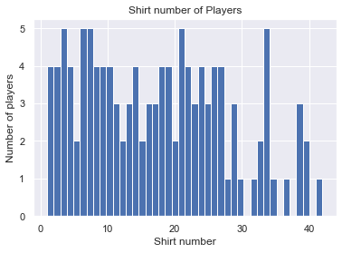
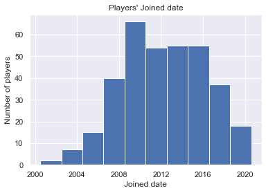
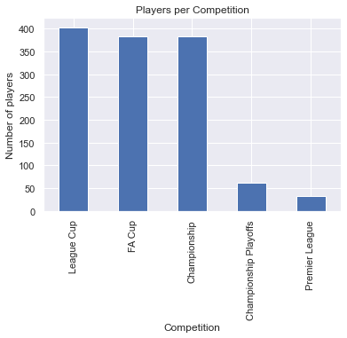

# Boro Player Predictions - Current Market Value

## 0. Setup

## 1. Problem Definition

* Determine Busines Objectives
* Situation Assessment
* Determine Data Mining Goal
* Produce Project Plan

The aim of this project is to see if we can use data on players at Middlesbrough Football Club to make preditions about the player's and the team's current and future performance.

We have player data from Transfermarkt, ESPN, WhoScored and Fly Me To The Moon (fanzine).

"Performance" could be measured in many different ways: Results on the pitch, market value, fan popularity, churn, ...

## 2. Data Understanding

* Collect Initial Data
* Describe Data
* Explore Data
* Verify Data Quality

The first part of the data we'll look at is some general information on players, including their market value, as taken from Transfermarkt

    tmk_cnt_mbr_all_0910.csv
    tmk_cnt_mbr_all_1011.csv
    tmk_cnt_mbr_all_1112.csv
    tmk_cnt_mbr_all_1213.csv
    tmk_cnt_mbr_all_1314.csv
    tmk_cnt_mbr_all_1415.csv
    tmk_cnt_mbr_all_1516.csv
    tmk_cnt_mbr_all_1617.csv
    tmk_cnt_mbr_all_1718.csv
    tmk_cnt_mbr_all_1819.csv
    tmk_cnt_mbr_all_1920.csv
    

<table border="1" class="dataframe">
  <thead>
    <tr style="text-align: right;">
      <th></th>
      <th>Shirt number</th>
      <th>Position</th>
      <th>Name</th>
      <th>Date of birth</th>
      <th>Height</th>
      <th>Foot</th>
      <th>Joined</th>
      <th>Contract expires</th>
      <th>Market value</th>
      <th>Season</th>
      <th>Position group</th>
      <th>Age</th>
    </tr>
  </thead>
  <tbody>
    <tr>
      <th>240</th>
      <td>16.0</td>
      <td>Centre Forward</td>
      <td>Bartholomew Ogbeche</td>
      <td>1984-10-01</td>
      <td>178.0</td>
      <td>both</td>
      <td>2011-10-01</td>
      <td>NaT</td>
      <td>0.450</td>
      <td>11/12</td>
      <td>F</td>
      <td>26</td>
    </tr>
    <tr>
      <th>518</th>
      <td>7.0</td>
      <td>Central Midfield</td>
      <td>Grant Leadbitter</td>
      <td>1986-01-07</td>
      <td>177.0</td>
      <td>right</td>
      <td>2012-07-01</td>
      <td>2017-06-30</td>
      <td>1.500</td>
      <td>15/16</td>
      <td>M</td>
      <td>30</td>
    </tr>
    <tr>
      <th>611</th>
      <td>13.0</td>
      <td>Keeper</td>
      <td>Tomás Mejías</td>
      <td>1989-01-30</td>
      <td>195.0</td>
      <td>right</td>
      <td>2014-07-05</td>
      <td>2018-06-30</td>
      <td>0.225</td>
      <td>17/18</td>
      <td>G</td>
      <td>29</td>
    </tr>
    <tr>
      <th>28</th>
      <td>3.0</td>
      <td>Left-Back</td>
      <td>Andrew Taylor</td>
      <td>1986-08-01</td>
      <td>178.0</td>
      <td>left</td>
      <td>2005-07-01</td>
      <td>NaT</td>
      <td>1.880</td>
      <td>09/10</td>
      <td>D</td>
      <td>22</td>
    </tr>
    <tr>
      <th>274</th>
      <td>2.0</td>
      <td>Right-Back</td>
      <td>Justin Hoyte</td>
      <td>1984-11-20</td>
      <td>180.0</td>
      <td>right</td>
      <td>2008-08-01</td>
      <td>NaT</td>
      <td>1.130</td>
      <td>12/13</td>
      <td>D</td>
      <td>27</td>
    </tr>
    <tr>
      <th>48</th>
      <td>34.0</td>
      <td>Defensive Midfield</td>
      <td>Isaiah Osbourne</td>
      <td>1987-11-05</td>
      <td>188.0</td>
      <td>right</td>
      <td>2009-11-06</td>
      <td>NaT</td>
      <td>0.375</td>
      <td>09/10</td>
      <td>M</td>
      <td>21</td>
    </tr>
    <tr>
      <th>618</th>
      <td>4.0</td>
      <td>Centre-Back</td>
      <td>Daniel Ayala</td>
      <td>1990-11-07</td>
      <td>190.0</td>
      <td>right</td>
      <td>2014-01-24</td>
      <td>2020-06-30</td>
      <td>1.800</td>
      <td>17/18</td>
      <td>D</td>
      <td>27</td>
    </tr>
    <tr>
      <th>198</th>
      <td>3.0</td>
      <td>Left-Back</td>
      <td>Joe Bennett</td>
      <td>1990-03-28</td>
      <td>177.0</td>
      <td>left</td>
      <td>2008-07-01</td>
      <td>NaT</td>
      <td>0.188</td>
      <td>11/12</td>
      <td>D</td>
      <td>21</td>
    </tr>
  </tbody>
</table>

<table border="1" class="dataframe">
  <thead>
    <tr style="text-align: right;">
      <th></th>
      <th>Shirt number</th>
      <th>Position</th>
      <th>Name</th>
      <th>Date of birth</th>
      <th>Height</th>
      <th>Foot</th>
      <th>Joined</th>
      <th>Contract expires</th>
      <th>Market value</th>
      <th>Season</th>
      <th>Position group</th>
      <th>Age</th>
    </tr>
  </thead>
  <tbody>
    <tr>
      <th>count</th>
      <td>333.000000</td>
      <td>364</td>
      <td>364</td>
      <td>364</td>
      <td>356.000000</td>
      <td>324</td>
      <td>351</td>
      <td>169</td>
      <td>330.000000</td>
      <td>364</td>
      <td>364</td>
      <td>364.000000</td>
    </tr>
    <tr>
      <th>unique</th>
      <td>NaN</td>
      <td>19</td>
      <td>172</td>
      <td>169</td>
      <td>NaN</td>
      <td>3</td>
      <td>126</td>
      <td>12</td>
      <td>NaN</td>
      <td>11</td>
      <td>4</td>
      <td>NaN</td>
    </tr>
    <tr>
      <th>top</th>
      <td>NaN</td>
      <td>Centre Back</td>
      <td>Ben Gibson</td>
      <td>1993-01-15 00:00:00</td>
      <td>NaN</td>
      <td>right</td>
      <td>2010-07-01 00:00:00</td>
      <td>2020-06-30 00:00:00</td>
      <td>NaN</td>
      <td>09/10</td>
      <td>M</td>
      <td>NaN</td>
    </tr>
    <tr>
      <th>freq</th>
      <td>NaN</td>
      <td>53</td>
      <td>9</td>
      <td>9</td>
      <td>NaN</td>
      <td>201</td>
      <td>31</td>
      <td>28</td>
      <td>NaN</td>
      <td>47</td>
      <td>134</td>
      <td>NaN</td>
    </tr>
    <tr>
      <th>first</th>
      <td>NaN</td>
      <td>NaN</td>
      <td>NaN</td>
      <td>1973-08-27 00:00:00</td>
      <td>NaN</td>
      <td>NaN</td>
      <td>2000-07-01 00:00:00</td>
      <td>2016-05-31 00:00:00</td>
      <td>NaN</td>
      <td>NaN</td>
      <td>NaN</td>
      <td>NaN</td>
    </tr>
    <tr>
      <th>last</th>
      <td>NaN</td>
      <td>NaN</td>
      <td>NaN</td>
      <td>2000-08-09 00:00:00</td>
      <td>NaN</td>
      <td>NaN</td>
      <td>2020-01-31 00:00:00</td>
      <td>2023-06-30 00:00:00</td>
      <td>NaN</td>
      <td>NaN</td>
      <td>NaN</td>
      <td>NaN</td>
    </tr>
    <tr>
      <th>mean</th>
      <td>18.054054</td>
      <td>NaN</td>
      <td>NaN</td>
      <td>NaN</td>
      <td>183.286517</td>
      <td>NaN</td>
      <td>NaN</td>
      <td>NaN</td>
      <td>1.696327</td>
      <td>NaN</td>
      <td>NaN</td>
      <td>24.826923</td>
    </tr>
    <tr>
      <th>std</th>
      <td>11.018471</td>
      <td>NaN</td>
      <td>NaN</td>
      <td>NaN</td>
      <td>6.028752</td>
      <td>NaN</td>
      <td>NaN</td>
      <td>NaN</td>
      <td>1.776398</td>
      <td>NaN</td>
      <td>NaN</td>
      <td>4.696900</td>
    </tr>
    <tr>
      <th>min</th>
      <td>1.000000</td>
      <td>NaN</td>
      <td>NaN</td>
      <td>NaN</td>
      <td>167.000000</td>
      <td>NaN</td>
      <td>NaN</td>
      <td>NaN</td>
      <td>0.038000</td>
      <td>NaN</td>
      <td>NaN</td>
      <td>16.000000</td>
    </tr>
    <tr>
      <th>25%</th>
      <td>8.000000</td>
      <td>NaN</td>
      <td>NaN</td>
      <td>NaN</td>
      <td>179.000000</td>
      <td>NaN</td>
      <td>NaN</td>
      <td>NaN</td>
      <td>0.375000</td>
      <td>NaN</td>
      <td>NaN</td>
      <td>21.000000</td>
    </tr>
    <tr>
      <th>50%</th>
      <td>18.000000</td>
      <td>NaN</td>
      <td>NaN</td>
      <td>NaN</td>
      <td>183.000000</td>
      <td>NaN</td>
      <td>NaN</td>
      <td>NaN</td>
      <td>1.130000</td>
      <td>NaN</td>
      <td>NaN</td>
      <td>25.000000</td>
    </tr>
    <tr>
      <th>75%</th>
      <td>26.000000</td>
      <td>NaN</td>
      <td>NaN</td>
      <td>NaN</td>
      <td>188.000000</td>
      <td>NaN</td>
      <td>NaN</td>
      <td>NaN</td>
      <td>2.250000</td>
      <td>NaN</td>
      <td>NaN</td>
      <td>28.000000</td>
    </tr>
    <tr>
      <th>max</th>
      <td>42.000000</td>
      <td>NaN</td>
      <td>NaN</td>
      <td>NaN</td>
      <td>199.000000</td>
      <td>NaN</td>
      <td>NaN</td>
      <td>NaN</td>
      <td>10.800000</td>
      <td>NaN</td>
      <td>NaN</td>
      <td>40.000000</td>
    </tr>
  </tbody>
</table>

**ANALYSIS** So the data is looking broadly in good shape, but there are a few missing values to consider...

    Shirt number        0.914835
    Position            1.000000
    Name                1.000000
    Date of birth       1.000000
    Height              0.978022
    Foot                0.890110
    Joined              0.964286
    Contract expires    0.464286
    Market value        0.906593
    Season              1.000000
    Position group      1.000000
    Age                 1.000000
    dtype: float64

**ANALYSIS** Only `Joined` has large gaps. Let's look at it in more detail...

<table border="1" class="dataframe">
  <thead>
    <tr style="text-align: right;">
      <th></th>
      <th>Shirt number</th>
      <th>Position</th>
      <th>Name</th>
      <th>Date of birth</th>
      <th>Height</th>
      <th>Foot</th>
      <th>Joined</th>
      <th>Contract expires</th>
      <th>Market value</th>
      <th>Season</th>
      <th>Position group</th>
      <th>Age</th>
    </tr>
  </thead>
  <tbody>
    <tr>
      <th>156</th>
      <td>41.0</td>
      <td>Left Midfield</td>
      <td>Adam Reach</td>
      <td>1993-02-03</td>
      <td>185.0</td>
      <td>left</td>
      <td>NaT</td>
      <td>NaT</td>
      <td>NaN</td>
      <td>10/11</td>
      <td>M</td>
      <td>17</td>
    </tr>
    <tr>
      <th>220</th>
      <td>32.0</td>
      <td>Left Midfield</td>
      <td>Adam Reach</td>
      <td>1993-02-03</td>
      <td>185.0</td>
      <td>left</td>
      <td>2011-07-01</td>
      <td>2019-06-30</td>
      <td>NaN</td>
      <td>11/12</td>
      <td>M</td>
      <td>18</td>
    </tr>
    <tr>
      <th>300</th>
      <td>25.0</td>
      <td>Left Midfield</td>
      <td>Adam Reach</td>
      <td>1993-02-03</td>
      <td>185.0</td>
      <td>left</td>
      <td>2011-07-01</td>
      <td>2019-06-30</td>
      <td>NaN</td>
      <td>12/13</td>
      <td>M</td>
      <td>19</td>
    </tr>
    <tr>
      <th>374</th>
      <td>NaN</td>
      <td>Left Midfield</td>
      <td>Adam Reach</td>
      <td>1993-02-03</td>
      <td>185.0</td>
      <td>left</td>
      <td>2011-07-01</td>
      <td>2019-06-30</td>
      <td>0.188</td>
      <td>13/14</td>
      <td>M</td>
      <td>20</td>
    </tr>
    <tr>
      <th>454</th>
      <td>20.0</td>
      <td>Left Midfield</td>
      <td>Adam Reach</td>
      <td>1993-02-03</td>
      <td>185.0</td>
      <td>left</td>
      <td>2011-07-01</td>
      <td>2019-06-30</td>
      <td>0.375</td>
      <td>14/15</td>
      <td>M</td>
      <td>21</td>
    </tr>
    <tr>
      <th>26</th>
      <td>39.0</td>
      <td>Centre Back</td>
      <td>Ben Gibson</td>
      <td>1993-01-15</td>
      <td>185.0</td>
      <td>left</td>
      <td>NaT</td>
      <td>NaT</td>
      <td>NaN</td>
      <td>09/10</td>
      <td>D</td>
      <td>16</td>
    </tr>
    <tr>
      <th>120</th>
      <td>34.0</td>
      <td>Centre Back</td>
      <td>Ben Gibson</td>
      <td>1993-01-15</td>
      <td>185.0</td>
      <td>left</td>
      <td>2010-07-01</td>
      <td>2019-06-30</td>
      <td>NaN</td>
      <td>10/11</td>
      <td>D</td>
      <td>17</td>
    </tr>
    <tr>
      <th>194</th>
      <td>34.0</td>
      <td>Centre Back</td>
      <td>Ben Gibson</td>
      <td>1993-01-15</td>
      <td>185.0</td>
      <td>left</td>
      <td>2010-07-01</td>
      <td>2019-06-30</td>
      <td>NaN</td>
      <td>11/12</td>
      <td>D</td>
      <td>18</td>
    </tr>
    <tr>
      <th>266</th>
      <td>40.0</td>
      <td>Centre Back</td>
      <td>Ben Gibson</td>
      <td>1993-01-15</td>
      <td>185.0</td>
      <td>left</td>
      <td>2010-07-01</td>
      <td>2019-06-30</td>
      <td>NaN</td>
      <td>12/13</td>
      <td>D</td>
      <td>19</td>
    </tr>
    <tr>
      <th>348</th>
      <td>22.0</td>
      <td>Centre Back</td>
      <td>Ben Gibson</td>
      <td>1993-01-15</td>
      <td>185.0</td>
      <td>left</td>
      <td>2010-07-01</td>
      <td>2019-06-30</td>
      <td>0.188</td>
      <td>13/14</td>
      <td>D</td>
      <td>20</td>
    </tr>
    <tr>
      <th>416</th>
      <td>6.0</td>
      <td>Centre Back</td>
      <td>Ben Gibson</td>
      <td>1993-01-15</td>
      <td>185.0</td>
      <td>left</td>
      <td>2010-07-01</td>
      <td>2019-06-30</td>
      <td>0.450</td>
      <td>14/15</td>
      <td>D</td>
      <td>21</td>
    </tr>
    <tr>
      <th>490</th>
      <td>6.0</td>
      <td>Centre Back</td>
      <td>Ben Gibson</td>
      <td>1993-01-15</td>
      <td>185.0</td>
      <td>left</td>
      <td>2010-07-01</td>
      <td>2019-06-30</td>
      <td>1.500</td>
      <td>15/16</td>
      <td>D</td>
      <td>23</td>
    </tr>
    <tr>
      <th>547</th>
      <td>6.0</td>
      <td>Centre-Back</td>
      <td>Ben Gibson</td>
      <td>1993-01-15</td>
      <td>185.0</td>
      <td>left</td>
      <td>2011-07-01</td>
      <td>2021-06-30</td>
      <td>5.100</td>
      <td>16/17</td>
      <td>D</td>
      <td>24</td>
    </tr>
    <tr>
      <th>616</th>
      <td>6.0</td>
      <td>Centre-Back</td>
      <td>Ben Gibson</td>
      <td>1993-01-15</td>
      <td>185.0</td>
      <td>left</td>
      <td>2011-07-01</td>
      <td>2022-06-30</td>
      <td>9.000</td>
      <td>17/18</td>
      <td>D</td>
      <td>25</td>
    </tr>
    <tr>
      <th>24</th>
      <td>37.0</td>
      <td>Centre Back</td>
      <td>Bruno Pilatos</td>
      <td>1993-03-30</td>
      <td>NaN</td>
      <td>right</td>
      <td>NaT</td>
      <td>NaT</td>
      <td>NaN</td>
      <td>09/10</td>
      <td>D</td>
      <td>16</td>
    </tr>
    <tr>
      <th>122</th>
      <td>35.0</td>
      <td>Centre Back</td>
      <td>Bruno Pilatos</td>
      <td>1993-03-30</td>
      <td>NaN</td>
      <td>right</td>
      <td>2010-07-01</td>
      <td>NaT</td>
      <td>NaN</td>
      <td>10/11</td>
      <td>D</td>
      <td>17</td>
    </tr>
    <tr>
      <th>282</th>
      <td>29.0</td>
      <td>Defensive Midfield</td>
      <td>Bryn Morris</td>
      <td>1996-04-25</td>
      <td>182.0</td>
      <td>NaN</td>
      <td>NaT</td>
      <td>NaT</td>
      <td>NaN</td>
      <td>12/13</td>
      <td>M</td>
      <td>16</td>
    </tr>
    <tr>
      <th>364</th>
      <td>NaN</td>
      <td>Defensive Midfield</td>
      <td>Bryn Morris</td>
      <td>1996-04-25</td>
      <td>182.0</td>
      <td>NaN</td>
      <td>2014-01-01</td>
      <td>2016-06-30</td>
      <td>NaN</td>
      <td>13/14</td>
      <td>M</td>
      <td>17</td>
    </tr>
    <tr>
      <th>440</th>
      <td>28.0</td>
      <td>Defensive Midfield</td>
      <td>Bryn Morris</td>
      <td>1996-04-25</td>
      <td>182.0</td>
      <td>NaN</td>
      <td>2014-01-01</td>
      <td>2016-06-30</td>
      <td>0.263</td>
      <td>14/15</td>
      <td>M</td>
      <td>18</td>
    </tr>
    <tr>
      <th>512</th>
      <td>NaN</td>
      <td>Defensive Midfield</td>
      <td>Bryn Morris</td>
      <td>1996-04-25</td>
      <td>182.0</td>
      <td>NaN</td>
      <td>2014-01-01</td>
      <td>2016-06-30</td>
      <td>0.263</td>
      <td>15/16</td>
      <td>M</td>
      <td>20</td>
    </tr>
    <tr>
      <th>60</th>
      <td>38.0</td>
      <td>Left Midfield</td>
      <td>Cameron Park</td>
      <td>1992-07-06</td>
      <td>178.0</td>
      <td>left</td>
      <td>NaT</td>
      <td>NaT</td>
      <td>NaN</td>
      <td>09/10</td>
      <td>M</td>
      <td>16</td>
    </tr>
    <tr>
      <th>154</th>
      <td>38.0</td>
      <td>Left Midfield</td>
      <td>Cameron Park</td>
      <td>1992-07-06</td>
      <td>178.0</td>
      <td>left</td>
      <td>NaT</td>
      <td>NaT</td>
      <td>NaN</td>
      <td>10/11</td>
      <td>M</td>
      <td>17</td>
    </tr>
    <tr>
      <th>218</th>
      <td>24.0</td>
      <td>Left Midfield</td>
      <td>Cameron Park</td>
      <td>1992-07-06</td>
      <td>178.0</td>
      <td>left</td>
      <td>2011-07-01</td>
      <td>NaT</td>
      <td>NaN</td>
      <td>11/12</td>
      <td>M</td>
      <td>18</td>
    </tr>
    <tr>
      <th>298</th>
      <td>24.0</td>
      <td>Left Midfield</td>
      <td>Cameron Park</td>
      <td>1992-07-06</td>
      <td>178.0</td>
      <td>left</td>
      <td>2011-07-01</td>
      <td>NaT</td>
      <td>0.056</td>
      <td>12/13</td>
      <td>M</td>
      <td>19</td>
    </tr>
    <tr>
      <th>102</th>
      <td>39.0</td>
      <td>Keeper</td>
      <td>Connor Ripley</td>
      <td>1993-02-13</td>
      <td>191.0</td>
      <td>NaN</td>
      <td>NaT</td>
      <td>NaT</td>
      <td>NaN</td>
      <td>10/11</td>
      <td>G</td>
      <td>17</td>
    </tr>
    <tr>
      <th>182</th>
      <td>31.0</td>
      <td>Keeper</td>
      <td>Connor Ripley</td>
      <td>1993-02-13</td>
      <td>191.0</td>
      <td>NaN</td>
      <td>2011-07-01</td>
      <td>NaT</td>
      <td>NaN</td>
      <td>11/12</td>
      <td>G</td>
      <td>18</td>
    </tr>
    <tr>
      <th>250</th>
      <td>31.0</td>
      <td>Keeper</td>
      <td>Connor Ripley</td>
      <td>1993-02-13</td>
      <td>191.0</td>
      <td>NaN</td>
      <td>2011-07-01</td>
      <td>NaT</td>
      <td>0.188</td>
      <td>12/13</td>
      <td>G</td>
      <td>19</td>
    </tr>
    <tr>
      <th>334</th>
      <td>NaN</td>
      <td>Keeper</td>
      <td>Connor Ripley</td>
      <td>1993-02-13</td>
      <td>191.0</td>
      <td>NaN</td>
      <td>2011-07-01</td>
      <td>NaT</td>
      <td>0.188</td>
      <td>13/14</td>
      <td>G</td>
      <td>20</td>
    </tr>
    <tr>
      <th>406</th>
      <td>12.0</td>
      <td>Keeper</td>
      <td>Connor Ripley</td>
      <td>1993-02-13</td>
      <td>191.0</td>
      <td>NaN</td>
      <td>2011-07-01</td>
      <td>NaT</td>
      <td>0.131</td>
      <td>14/15</td>
      <td>G</td>
      <td>21</td>
    </tr>
    <tr>
      <th>482</th>
      <td>NaN</td>
      <td>Keeper</td>
      <td>Connor Ripley</td>
      <td>1993-02-13</td>
      <td>191.0</td>
      <td>NaN</td>
      <td>2011-07-01</td>
      <td>2018-06-30</td>
      <td>0.188</td>
      <td>15/16</td>
      <td>G</td>
      <td>23</td>
    </tr>
    <tr>
      <th>542</th>
      <td>NaN</td>
      <td>Keeper</td>
      <td>Connor Ripley</td>
      <td>1993-02-13</td>
      <td>191.0</td>
      <td>NaN</td>
      <td>2011-07-01</td>
      <td>2018-06-30</td>
      <td>0.213</td>
      <td>16/17</td>
      <td>G</td>
      <td>24</td>
    </tr>
    <tr>
      <th>92</th>
      <td>35.0</td>
      <td>Centre Forward</td>
      <td>Luke Williams</td>
      <td>1993-06-11</td>
      <td>185.0</td>
      <td>NaN</td>
      <td>NaT</td>
      <td>NaT</td>
      <td>NaN</td>
      <td>09/10</td>
      <td>F</td>
      <td>16</td>
    </tr>
    <tr>
      <th>174</th>
      <td>22.0</td>
      <td>Centre Forward</td>
      <td>Luke Williams</td>
      <td>1993-06-11</td>
      <td>185.0</td>
      <td>NaN</td>
      <td>2010-07-01</td>
      <td>NaT</td>
      <td>NaN</td>
      <td>10/11</td>
      <td>F</td>
      <td>17</td>
    </tr>
    <tr>
      <th>242</th>
      <td>20.0</td>
      <td>Centre Forward</td>
      <td>Luke Williams</td>
      <td>1993-06-11</td>
      <td>185.0</td>
      <td>NaN</td>
      <td>2010-07-01</td>
      <td>NaT</td>
      <td>0.375</td>
      <td>11/12</td>
      <td>F</td>
      <td>18</td>
    </tr>
    <tr>
      <th>322</th>
      <td>22.0</td>
      <td>Centre Forward</td>
      <td>Luke Williams</td>
      <td>1993-06-11</td>
      <td>185.0</td>
      <td>NaN</td>
      <td>2010-07-01</td>
      <td>NaT</td>
      <td>0.188</td>
      <td>12/13</td>
      <td>F</td>
      <td>19</td>
    </tr>
    <tr>
      <th>396</th>
      <td>14.0</td>
      <td>Centre Forward</td>
      <td>Luke Williams</td>
      <td>1993-06-11</td>
      <td>185.0</td>
      <td>NaN</td>
      <td>2010-07-01</td>
      <td>NaT</td>
      <td>0.188</td>
      <td>13/14</td>
      <td>F</td>
      <td>20</td>
    </tr>
    <tr>
      <th>476</th>
      <td>NaN</td>
      <td>Centre Forward</td>
      <td>Luke Williams</td>
      <td>1993-06-11</td>
      <td>185.0</td>
      <td>NaN</td>
      <td>2010-07-01</td>
      <td>NaT</td>
      <td>0.263</td>
      <td>14/15</td>
      <td>F</td>
      <td>21</td>
    </tr>
  </tbody>
</table>

**ANALYSIS** _Possibly_ we could back fill some missing `Joined` dates but this might have some downstream consequences because the date _might_ exceed the end of that season. We'll leave them as Nulls for now.

Next we'll look at the distributions of single fields with bar charts for categorical variables and histograms for numeric and date variables

    <matplotlib.axes._subplots.AxesSubplot at 0x18319b82dc0>

    <matplotlib.axes._subplots.AxesSubplot at 0x18319ede9a0>

    <matplotlib.axes._subplots.AxesSubplot at 0x18319f44a60>

    <matplotlib.axes._subplots.AxesSubplot at 0x18319fbbc40>

    <matplotlib.axes._subplots.AxesSubplot at 0x18319f7ed30>

    <matplotlib.axes._subplots.AxesSubplot at 0x1831a10aa00>

    <matplotlib.axes._subplots.AxesSubplot at 0x1831a138250>

    <matplotlib.axes._subplots.AxesSubplot at 0x1831a1bd460>

    <matplotlib.axes._subplots.AxesSubplot at 0x1831a214be0>

    <matplotlib.axes._subplots.AxesSubplot at 0x1831a2a76a0>

We can explore simple relationships between variables using pairplots and histogram facet grids

    <seaborn.axisgrid.PairGrid at 0x1831a31a220>

    <seaborn.axisgrid.PairGrid at 0x1831a974820>

    <seaborn.axisgrid.PairGrid at 0x18319ed97f0>

    <seaborn.axisgrid.FacetGrid at 0x1831a0d64c0>

## 3. Data Preperation

* Select Data
* Clean Data
* Construct Data
* Integrate Data
* Format Data

    (364, 12)

    <class 'pandas.core.frame.DataFrame'>
    Index: 364 entries, Brad Jones (09/10) to Rudy Gestede (19/20)
    Data columns (total 12 columns):
     #   Column            Non-Null Count  Dtype         
    ---  ------            --------------  -----         
     0   Shirt number      333 non-null    float64       
     1   Position          364 non-null    object        
     2   Name              364 non-null    object        
     3   Date of birth     364 non-null    datetime64[ns]
     4   Height            356 non-null    float64       
     5   Foot              324 non-null    object        
     6   Joined            351 non-null    datetime64[ns]
     7   Contract expires  169 non-null    datetime64[ns]
     8   Market value      330 non-null    float64       
     9   Season            364 non-null    object        
     10  Position group    364 non-null    object        
     11  Age               364 non-null    int32         
    dtypes: datetime64[ns](3), float64(3), int32(1), object(5)
    memory usage: 35.5+ KB
    

We can derive some new numeric features to express relationships between dates

    <matplotlib.axes._subplots.AxesSubplot at 0x29d31292400>

**ANALYSIS** Most players join in their teens or mid-twenties.

    <matplotlib.axes._subplots.AxesSubplot at 0x29d31465370>

**ANALYSIS** I'm going to leave out `Shirt number`, `Position`, `Name`, `Date of birth`, `Joined`, `Season` and `Contract expires` from the model for now. `Contract expires` is populated in less than half of records. The others can be discarded for simplicity of model.

    (364, 7)

`Foot` and `Position group` will be one-hot encoded 

    (364, 12)

<table border="1" class="dataframe">
  <thead>
    <tr style="text-align: right;">
      <th></th>
      <th>Height</th>
      <th>Market value</th>
      <th>Age</th>
      <th>Age when joined</th>
      <th>Years in team</th>
      <th>Foot=both</th>
      <th>Foot=left</th>
      <th>Foot=right</th>
      <th>Position group=D</th>
      <th>Position group=F</th>
      <th>Position group=G</th>
      <th>Position group=M</th>
    </tr>
    <tr>
      <th>Player key</th>
      <th></th>
      <th></th>
      <th></th>
      <th></th>
      <th></th>
      <th></th>
      <th></th>
      <th></th>
      <th></th>
      <th></th>
      <th></th>
      <th></th>
    </tr>
  </thead>
  <tbody>
    <tr>
      <th>Bartholomew Ogbeche (11/12)</th>
      <td>178.0</td>
      <td>0.450</td>
      <td>26</td>
      <td>26.998501</td>
      <td>0.750187</td>
      <td>1</td>
      <td>0</td>
      <td>0</td>
      <td>0</td>
      <td>1</td>
      <td>0</td>
      <td>0</td>
    </tr>
    <tr>
      <th>Grant Leadbitter  (15/16)</th>
      <td>177.0</td>
      <td>1.500</td>
      <td>30</td>
      <td>26.481037</td>
      <td>4.000082</td>
      <td>0</td>
      <td>0</td>
      <td>1</td>
      <td>0</td>
      <td>0</td>
      <td>0</td>
      <td>1</td>
    </tr>
    <tr>
      <th>Tomás Mejías (17/18)</th>
      <td>195.0</td>
      <td>0.225</td>
      <td>29</td>
      <td>25.426942</td>
      <td>3.989131</td>
      <td>0</td>
      <td>0</td>
      <td>1</td>
      <td>0</td>
      <td>0</td>
      <td>1</td>
      <td>0</td>
    </tr>
    <tr>
      <th>Andrew Taylor (09/10)</th>
      <td>178.0</td>
      <td>1.880</td>
      <td>22</td>
      <td>18.916200</td>
      <td>4.999418</td>
      <td>0</td>
      <td>1</td>
      <td>0</td>
      <td>1</td>
      <td>0</td>
      <td>0</td>
      <td>0</td>
    </tr>
    <tr>
      <th>Justin Hoyte (12/13)</th>
      <td>180.0</td>
      <td>1.130</td>
      <td>27</td>
      <td>23.696585</td>
      <td>4.914543</td>
      <td>0</td>
      <td>0</td>
      <td>1</td>
      <td>1</td>
      <td>0</td>
      <td>0</td>
      <td>0</td>
    </tr>
  </tbody>
</table>

<table border="1" class="dataframe">
  <thead>
    <tr style="text-align: right;">
      <th></th>
      <th>Height</th>
      <th>Market value</th>
      <th>Age</th>
      <th>Age when joined</th>
      <th>Years in team</th>
      <th>Foot=both</th>
      <th>Foot=left</th>
      <th>Foot=right</th>
      <th>Position group=D</th>
      <th>Position group=F</th>
      <th>Position group=G</th>
      <th>Position group=M</th>
    </tr>
  </thead>
  <tbody>
    <tr>
      <th>count</th>
      <td>356.000000</td>
      <td>330.000000</td>
      <td>364.000000</td>
      <td>351.000000</td>
      <td>351.000000</td>
      <td>364.000000</td>
      <td>364.000000</td>
      <td>364.000000</td>
      <td>364.000000</td>
      <td>364.000000</td>
      <td>364.000000</td>
      <td>364.000000</td>
    </tr>
    <tr>
      <th>mean</th>
      <td>183.286517</td>
      <td>1.696327</td>
      <td>24.826923</td>
      <td>23.871039</td>
      <td>2.447119</td>
      <td>0.057692</td>
      <td>0.280220</td>
      <td>0.552198</td>
      <td>0.335165</td>
      <td>0.178571</td>
      <td>0.118132</td>
      <td>0.368132</td>
    </tr>
    <tr>
      <th>std</th>
      <td>6.028752</td>
      <td>1.776398</td>
      <td>4.696900</td>
      <td>4.733915</td>
      <td>2.005552</td>
      <td>0.233482</td>
      <td>0.449725</td>
      <td>0.497952</td>
      <td>0.472698</td>
      <td>0.383520</td>
      <td>0.323208</td>
      <td>0.482961</td>
    </tr>
    <tr>
      <th>min</th>
      <td>167.000000</td>
      <td>0.038000</td>
      <td>16.000000</td>
      <td>16.356256</td>
      <td>0.265577</td>
      <td>0.000000</td>
      <td>0.000000</td>
      <td>0.000000</td>
      <td>0.000000</td>
      <td>0.000000</td>
      <td>0.000000</td>
      <td>0.000000</td>
    </tr>
    <tr>
      <th>25%</th>
      <td>179.000000</td>
      <td>0.375000</td>
      <td>21.000000</td>
      <td>19.409023</td>
      <td>0.913092</td>
      <td>0.000000</td>
      <td>0.000000</td>
      <td>0.000000</td>
      <td>0.000000</td>
      <td>0.000000</td>
      <td>0.000000</td>
      <td>0.000000</td>
    </tr>
    <tr>
      <th>50%</th>
      <td>183.000000</td>
      <td>1.130000</td>
      <td>25.000000</td>
      <td>23.907404</td>
      <td>1.960341</td>
      <td>0.000000</td>
      <td>0.000000</td>
      <td>1.000000</td>
      <td>0.000000</td>
      <td>0.000000</td>
      <td>0.000000</td>
      <td>0.000000</td>
    </tr>
    <tr>
      <th>75%</th>
      <td>188.000000</td>
      <td>2.250000</td>
      <td>28.000000</td>
      <td>26.554960</td>
      <td>3.422384</td>
      <td>0.000000</td>
      <td>1.000000</td>
      <td>1.000000</td>
      <td>1.000000</td>
      <td>0.000000</td>
      <td>0.000000</td>
      <td>1.000000</td>
    </tr>
    <tr>
      <th>max</th>
      <td>199.000000</td>
      <td>10.800000</td>
      <td>40.000000</td>
      <td>37.607891</td>
      <td>10.998172</td>
      <td>1.000000</td>
      <td>1.000000</td>
      <td>1.000000</td>
      <td>1.000000</td>
      <td>1.000000</td>
      <td>1.000000</td>
      <td>1.000000</td>
    </tr>
  </tbody>
</table>

    <seaborn.axisgrid.PairGrid at 0x29d315e0d00>

    Index(['Height', 'Market value', 'Age', 'Age when joined', 'Years in team',
           'Foot=both', 'Foot=left', 'Foot=right', 'Position group=D',
           'Position group=F', 'Position group=G', 'Position group=M'],
          dtype='object')

## 4. Modelling

* Select Modelling Technique
* Generate Test Design
* Build Model
* Assess Model

    ['Height',
     'Age',
     'Age when joined',
     'Years in team',
     'Foot=both',
     'Foot=left',
     'Foot=right',
     'Position group=D',
     'Position group=F',
     'Position group=G',
     'Position group=M']

    True

    ((328, 11), (328,))

    ((295, 11), (33, 11), (295,), (33,))

    10

    KFold(n_splits=10, random_state=4, shuffle=True)

    LinearRegression(copy_X=True, fit_intercept=True, n_jobs=None, normalize=False)

    {'fit_intercept': [True, False], 'normalize': [True, False]}

    GridSearchCV(cv=KFold(n_splits=10, random_state=4, shuffle=True),
                 error_score=nan,
                 estimator=LinearRegression(copy_X=True, fit_intercept=True,
                                            n_jobs=None, normalize=False),
                 iid='deprecated', n_jobs=None,
                 param_grid={'fit_intercept': [True, False],
                             'normalize': [True, False]},
                 pre_dispatch='2*n_jobs', refit=True, return_train_score=False,
                 scoring=None, verbose=0)

    GridSearchCV(cv=KFold(n_splits=10, random_state=4, shuffle=True),
                 error_score=nan,
                 estimator=LinearRegression(copy_X=True, fit_intercept=True,
                                            n_jobs=None, normalize=False),
                 iid='deprecated', n_jobs=None,
                 param_grid={'fit_intercept': [True, False],
                             'normalize': [True, False]},
                 pre_dispatch='2*n_jobs', refit=True, return_train_score=False,
                 scoring=None, verbose=0)

    {'fit_intercept': True, 'normalize': False}

    LinearRegression(copy_X=True, fit_intercept=True, n_jobs=None, normalize=False)

    LinearRegression(copy_X=True, fit_intercept=True, n_jobs=None, normalize=False)

**ANALYSIS** 

## 5. Evaluation

* Evaluate Results
* Review Process
* Determine Next Steps

<table border="1" class="dataframe">
  <thead>
    <tr style="text-align: right;">
      <th></th>
      <th>Train</th>
      <th>Test</th>
    </tr>
  </thead>
  <tbody>
    <tr>
      <th>MedAE</th>
      <td>0.849475</td>
      <td>0.994531</td>
    </tr>
    <tr>
      <th>RMSE</th>
      <td>1.600917</td>
      <td>1.376077</td>
    </tr>
    <tr>
      <th>R^2</th>
      <td>0.223167</td>
      <td>0.010775</td>
    </tr>
  </tbody>
</table>

**ANALYSIS** Metrics aren't great - even just on the training data - but it's a baseline. The only way is up (I Hope!) :)

**ANALYSIS** The model seems pretty weak in general but we can say the learning curves have largely converged so adding extra training samples is unlikely to improve the model.

    <matplotlib.axes._subplots.AxesSubplot at 0x29d31929550>

**ANALYSIS** Confirming our scoring visually, it looks pretty weak correlation between actual and predicted values. Note also the model is not able to predict anything much above £4m even though some of the data exceeded £10m.

<table border="1" class="dataframe">
  <thead>
    <tr style="text-align: right;">
      <th></th>
      <th>effect</th>
      <th>error</th>
    </tr>
  </thead>
  <tbody>
    <tr>
      <th>Height</th>
      <td>0.01</td>
      <td>0.02</td>
    </tr>
    <tr>
      <th>Age</th>
      <td>1.11</td>
      <td>0.21</td>
    </tr>
    <tr>
      <th>Age when joined</th>
      <td>-1.07</td>
      <td>0.21</td>
    </tr>
    <tr>
      <th>Years in team</th>
      <td>-1.14</td>
      <td>0.21</td>
    </tr>
    <tr>
      <th>Foot=both</th>
      <td>0.01</td>
      <td>0.58</td>
    </tr>
    <tr>
      <th>Foot=left</th>
      <td>0.36</td>
      <td>0.47</td>
    </tr>
    <tr>
      <th>Foot=right</th>
      <td>0.42</td>
      <td>0.48</td>
    </tr>
    <tr>
      <th>Position group=D</th>
      <td>-0.07</td>
      <td>0.13</td>
    </tr>
    <tr>
      <th>Position group=F</th>
      <td>0.89</td>
      <td>0.21</td>
    </tr>
    <tr>
      <th>Position group=G</th>
      <td>-1.17</td>
      <td>0.19</td>
    </tr>
    <tr>
      <th>Position group=M</th>
      <td>0.35</td>
      <td>0.16</td>
    </tr>
  </tbody>
</table>

**ANALYSIS** The individual features which appear to have most effect are `Age`, `Age when joined`, `Years in team` and `Position group=G`. Perhaps the most we can say is old goalkeepers aren't worth much.

## 6. Deployment

* Plan Deployment
* Plan Monitoring and Maintenance
* Produce Final Report
* Review Project

    (364, 12)

    (364, 13)

<table border="1" class="dataframe">
  <thead>
    <tr style="text-align: right;">
      <th></th>
      <th>Height</th>
      <th>Market value</th>
      <th>Age</th>
      <th>Age when joined</th>
      <th>Years in team</th>
      <th>Foot=both</th>
      <th>Foot=left</th>
      <th>Foot=right</th>
      <th>Position group=D</th>
      <th>Position group=F</th>
      <th>Position group=G</th>
      <th>Position group=M</th>
      <th>Market value (prediction)</th>
    </tr>
  </thead>
  <tbody>
    <tr>
      <th>count</th>
      <td>356.000000</td>
      <td>330.000000</td>
      <td>364.000000</td>
      <td>351.000000</td>
      <td>351.000000</td>
      <td>364.000000</td>
      <td>364.000000</td>
      <td>364.000000</td>
      <td>364.000000</td>
      <td>364.000000</td>
      <td>364.000000</td>
      <td>364.000000</td>
      <td>347.000000</td>
    </tr>
    <tr>
      <th>mean</th>
      <td>183.286517</td>
      <td>1.696327</td>
      <td>24.826923</td>
      <td>23.871039</td>
      <td>2.447119</td>
      <td>0.057692</td>
      <td>0.280220</td>
      <td>0.552198</td>
      <td>0.335165</td>
      <td>0.178571</td>
      <td>0.118132</td>
      <td>0.368132</td>
      <td>1.659529</td>
    </tr>
    <tr>
      <th>std</th>
      <td>6.028752</td>
      <td>1.776398</td>
      <td>4.696900</td>
      <td>4.733915</td>
      <td>2.005552</td>
      <td>0.233482</td>
      <td>0.449725</td>
      <td>0.497952</td>
      <td>0.472698</td>
      <td>0.383520</td>
      <td>0.323208</td>
      <td>0.482961</td>
      <td>0.916826</td>
    </tr>
    <tr>
      <th>min</th>
      <td>167.000000</td>
      <td>0.038000</td>
      <td>16.000000</td>
      <td>16.356256</td>
      <td>0.265577</td>
      <td>0.000000</td>
      <td>0.000000</td>
      <td>0.000000</td>
      <td>0.000000</td>
      <td>0.000000</td>
      <td>0.000000</td>
      <td>0.000000</td>
      <td>-0.344257</td>
    </tr>
    <tr>
      <th>25%</th>
      <td>179.000000</td>
      <td>0.375000</td>
      <td>21.000000</td>
      <td>19.409023</td>
      <td>0.913092</td>
      <td>0.000000</td>
      <td>0.000000</td>
      <td>0.000000</td>
      <td>0.000000</td>
      <td>0.000000</td>
      <td>0.000000</td>
      <td>0.000000</td>
      <td>0.937653</td>
    </tr>
    <tr>
      <th>50%</th>
      <td>183.000000</td>
      <td>1.130000</td>
      <td>25.000000</td>
      <td>23.907404</td>
      <td>1.960341</td>
      <td>0.000000</td>
      <td>0.000000</td>
      <td>1.000000</td>
      <td>0.000000</td>
      <td>0.000000</td>
      <td>0.000000</td>
      <td>0.000000</td>
      <td>1.596059</td>
    </tr>
    <tr>
      <th>75%</th>
      <td>188.000000</td>
      <td>2.250000</td>
      <td>28.000000</td>
      <td>26.554960</td>
      <td>3.422384</td>
      <td>0.000000</td>
      <td>1.000000</td>
      <td>1.000000</td>
      <td>1.000000</td>
      <td>0.000000</td>
      <td>0.000000</td>
      <td>1.000000</td>
      <td>2.330483</td>
    </tr>
    <tr>
      <th>max</th>
      <td>199.000000</td>
      <td>10.800000</td>
      <td>40.000000</td>
      <td>37.607891</td>
      <td>10.998172</td>
      <td>1.000000</td>
      <td>1.000000</td>
      <td>1.000000</td>
      <td>1.000000</td>
      <td>1.000000</td>
      <td>1.000000</td>
      <td>1.000000</td>
      <td>4.218156</td>
    </tr>
  </tbody>
</table>

    <seaborn.axisgrid.PairGrid at 0x1831e987520>

**ANALYSIS** As we saw during data preperation there's no clear correlations with continuous features at work. Further our predictions don't even particularly correlate with the actual values.

    (34, 13)

<table border="1" class="dataframe">
  <thead>
    <tr style="text-align: right;">
      <th></th>
      <th>Height</th>
      <th>Market value</th>
      <th>Age</th>
      <th>Age when joined</th>
      <th>Years in team</th>
      <th>Foot=both</th>
      <th>Foot=left</th>
      <th>Foot=right</th>
      <th>Position group=D</th>
      <th>Position group=F</th>
      <th>Position group=G</th>
      <th>Position group=M</th>
      <th>Market value (prediction)</th>
    </tr>
  </thead>
  <tbody>
    <tr>
      <th>count</th>
      <td>19.000000</td>
      <td>0.0</td>
      <td>19.000000</td>
      <td>19.000000</td>
      <td>19.000000</td>
      <td>19.0</td>
      <td>19.000000</td>
      <td>19.000000</td>
      <td>19.000000</td>
      <td>19.000000</td>
      <td>19.000000</td>
      <td>19.000000</td>
      <td>19.000000</td>
    </tr>
    <tr>
      <th>mean</th>
      <td>182.578947</td>
      <td>NaN</td>
      <td>18.736842</td>
      <td>18.809421</td>
      <td>1.431925</td>
      <td>0.0</td>
      <td>0.421053</td>
      <td>0.315789</td>
      <td>0.315789</td>
      <td>0.157895</td>
      <td>0.052632</td>
      <td>0.473684</td>
      <td>1.305653</td>
    </tr>
    <tr>
      <th>std</th>
      <td>5.766915</td>
      <td>NaN</td>
      <td>1.284182</td>
      <td>1.398387</td>
      <td>0.980438</td>
      <td>0.0</td>
      <td>0.507257</td>
      <td>0.477567</td>
      <td>0.477567</td>
      <td>0.374634</td>
      <td>0.229416</td>
      <td>0.512989</td>
      <td>0.683406</td>
    </tr>
    <tr>
      <th>min</th>
      <td>172.000000</td>
      <td>NaN</td>
      <td>17.000000</td>
      <td>17.054423</td>
      <td>0.334025</td>
      <td>0.0</td>
      <td>0.000000</td>
      <td>0.000000</td>
      <td>0.000000</td>
      <td>0.000000</td>
      <td>0.000000</td>
      <td>0.000000</td>
      <td>-0.037862</td>
    </tr>
    <tr>
      <th>25%</th>
      <td>180.000000</td>
      <td>NaN</td>
      <td>18.000000</td>
      <td>17.831988</td>
      <td>0.915830</td>
      <td>0.0</td>
      <td>0.000000</td>
      <td>0.000000</td>
      <td>0.000000</td>
      <td>0.000000</td>
      <td>0.000000</td>
      <td>0.000000</td>
      <td>0.908761</td>
    </tr>
    <tr>
      <th>50%</th>
      <td>183.000000</td>
      <td>NaN</td>
      <td>18.000000</td>
      <td>18.404211</td>
      <td>0.999336</td>
      <td>0.0</td>
      <td>0.000000</td>
      <td>0.000000</td>
      <td>0.000000</td>
      <td>0.000000</td>
      <td>0.000000</td>
      <td>0.000000</td>
      <td>1.325046</td>
    </tr>
    <tr>
      <th>75%</th>
      <td>185.000000</td>
      <td>NaN</td>
      <td>20.000000</td>
      <td>19.280341</td>
      <td>2.000041</td>
      <td>0.0</td>
      <td>1.000000</td>
      <td>1.000000</td>
      <td>1.000000</td>
      <td>0.000000</td>
      <td>0.000000</td>
      <td>1.000000</td>
      <td>1.467859</td>
    </tr>
    <tr>
      <th>max</th>
      <td>196.000000</td>
      <td>NaN</td>
      <td>21.000000</td>
      <td>21.881353</td>
      <td>4.000082</td>
      <td>0.0</td>
      <td>1.000000</td>
      <td>1.000000</td>
      <td>1.000000</td>
      <td>1.000000</td>
      <td>1.000000</td>
      <td>1.000000</td>
      <td>3.049585</td>
    </tr>
  </tbody>
</table>

<table border="1" class="dataframe">
  <thead>
    <tr style="text-align: right;">
      <th></th>
      <th>Height</th>
      <th>Market value</th>
      <th>Age</th>
      <th>Age when joined</th>
      <th>Years in team</th>
      <th>Foot=both</th>
      <th>Foot=left</th>
      <th>Foot=right</th>
      <th>Position group=D</th>
      <th>Position group=F</th>
      <th>Position group=G</th>
      <th>Position group=M</th>
      <th>Market value (prediction)</th>
    </tr>
    <tr>
      <th>Player key</th>
      <th></th>
      <th></th>
      <th></th>
      <th></th>
      <th></th>
      <th></th>
      <th></th>
      <th></th>
      <th></th>
      <th></th>
      <th></th>
      <th></th>
      <th></th>
    </tr>
  </thead>
  <tbody>
    <tr>
      <th>Jay O'Shea (09/10)</th>
      <td>183.0</td>
      <td>NaN</td>
      <td>20</td>
      <td>21.555542</td>
      <td>0.334025</td>
      <td>0</td>
      <td>0</td>
      <td>1</td>
      <td>0</td>
      <td>0</td>
      <td>0</td>
      <td>1</td>
      <td>1.325046</td>
    </tr>
    <tr>
      <th>Ben Gibson (10/11)</th>
      <td>185.0</td>
      <td>NaN</td>
      <td>17</td>
      <td>17.456895</td>
      <td>0.999336</td>
      <td>0</td>
      <td>1</td>
      <td>0</td>
      <td>1</td>
      <td>0</td>
      <td>0</td>
      <td>0</td>
      <td>0.933638</td>
    </tr>
    <tr>
      <th>Richard Smallwood (10/11)</th>
      <td>180.0</td>
      <td>NaN</td>
      <td>19</td>
      <td>19.504850</td>
      <td>0.999336</td>
      <td>0</td>
      <td>0</td>
      <td>0</td>
      <td>0</td>
      <td>0</td>
      <td>0</td>
      <td>1</td>
      <td>1.075825</td>
    </tr>
    <tr>
      <th>Luke Williams (10/11)</th>
      <td>185.0</td>
      <td>NaN</td>
      <td>17</td>
      <td>17.054423</td>
      <td>0.999336</td>
      <td>0</td>
      <td>0</td>
      <td>0</td>
      <td>0</td>
      <td>1</td>
      <td>0</td>
      <td>0</td>
      <td>2.472767</td>
    </tr>
    <tr>
      <th>Connor Ripley (11/12)</th>
      <td>191.0</td>
      <td>NaN</td>
      <td>18</td>
      <td>18.376832</td>
      <td>1.002074</td>
      <td>0</td>
      <td>0</td>
      <td>0</td>
      <td>0</td>
      <td>0</td>
      <td>1</td>
      <td>0</td>
      <td>-0.037862</td>
    </tr>
    <tr>
      <th>Ben Gibson (11/12)</th>
      <td>185.0</td>
      <td>NaN</td>
      <td>18</td>
      <td>17.456895</td>
      <td>2.001410</td>
      <td>0</td>
      <td>1</td>
      <td>0</td>
      <td>1</td>
      <td>0</td>
      <td>0</td>
      <td>0</td>
      <td>0.883883</td>
    </tr>
    <tr>
      <th>Cameron Park (11/12)</th>
      <td>178.0</td>
      <td>NaN</td>
      <td>18</td>
      <td>18.984647</td>
      <td>1.002074</td>
      <td>0</td>
      <td>1</td>
      <td>0</td>
      <td>0</td>
      <td>0</td>
      <td>0</td>
      <td>1</td>
      <td>0.863075</td>
    </tr>
    <tr>
      <th>Adam Reach (11/12)</th>
      <td>185.0</td>
      <td>NaN</td>
      <td>18</td>
      <td>18.404211</td>
      <td>1.002074</td>
      <td>0</td>
      <td>1</td>
      <td>0</td>
      <td>0</td>
      <td>0</td>
      <td>0</td>
      <td>1</td>
      <td>1.482308</td>
    </tr>
    <tr>
      <th>Alex Nimely (11/12)</th>
      <td>180.0</td>
      <td>NaN</td>
      <td>20</td>
      <td>20.309794</td>
      <td>0.832324</td>
      <td>0</td>
      <td>0</td>
      <td>1</td>
      <td>0</td>
      <td>1</td>
      <td>0</td>
      <td>0</td>
      <td>3.049585</td>
    </tr>
    <tr>
      <th>Christian Burgess (12/13)</th>
      <td>196.0</td>
      <td>NaN</td>
      <td>20</td>
      <td>20.742383</td>
      <td>0.991122</td>
      <td>0</td>
      <td>0</td>
      <td>1</td>
      <td>1</td>
      <td>0</td>
      <td>0</td>
      <td>0</td>
      <td>0.950748</td>
    </tr>
    <tr>
      <th>Ben Gibson (12/13)</th>
      <td>185.0</td>
      <td>NaN</td>
      <td>19</td>
      <td>17.456895</td>
      <td>3.000746</td>
      <td>0</td>
      <td>1</td>
      <td>0</td>
      <td>1</td>
      <td>0</td>
      <td>0</td>
      <td>0</td>
      <td>0.837262</td>
    </tr>
    <tr>
      <th>Adam Reach (12/13)</th>
      <td>185.0</td>
      <td>NaN</td>
      <td>19</td>
      <td>18.404211</td>
      <td>2.001410</td>
      <td>0</td>
      <td>1</td>
      <td>0</td>
      <td>0</td>
      <td>0</td>
      <td>0</td>
      <td>1</td>
      <td>1.435687</td>
    </tr>
    <tr>
      <th>Bryn Morris (13/14)</th>
      <td>182.0</td>
      <td>NaN</td>
      <td>17</td>
      <td>17.686879</td>
      <td>0.495561</td>
      <td>0</td>
      <td>0</td>
      <td>0</td>
      <td>0</td>
      <td>0</td>
      <td>0</td>
      <td>1</td>
      <td>1.431125</td>
    </tr>
    <tr>
      <th>Ryan Brobbel (13/14)</th>
      <td>172.0</td>
      <td>NaN</td>
      <td>20</td>
      <td>18.322074</td>
      <td>3.000746</td>
      <td>0</td>
      <td>1</td>
      <td>0</td>
      <td>0</td>
      <td>0</td>
      <td>0</td>
      <td>1</td>
      <td>1.500031</td>
    </tr>
    <tr>
      <th>Bradley Halliday (14/15)</th>
      <td>180.0</td>
      <td>NaN</td>
      <td>18</td>
      <td>17.977097</td>
      <td>1.998672</td>
      <td>0</td>
      <td>0</td>
      <td>1</td>
      <td>1</td>
      <td>0</td>
      <td>0</td>
      <td>0</td>
      <td>0.636304</td>
    </tr>
    <tr>
      <th>Ryan Fredericks (14/15)</th>
      <td>180.0</td>
      <td>NaN</td>
      <td>21</td>
      <td>21.881353</td>
      <td>0.840537</td>
      <td>0</td>
      <td>0</td>
      <td>1</td>
      <td>1</td>
      <td>0</td>
      <td>0</td>
      <td>0</td>
      <td>1.008700</td>
    </tr>
    <tr>
      <th>Milos Veljkovic (14/15)</th>
      <td>187.0</td>
      <td>NaN</td>
      <td>18</td>
      <td>19.055833</td>
      <td>0.706380</td>
      <td>0</td>
      <td>0</td>
      <td>1</td>
      <td>0</td>
      <td>0</td>
      <td>0</td>
      <td>1</td>
      <td>1.415445</td>
    </tr>
    <tr>
      <th>Ryan Brobbel (14/15)</th>
      <td>172.0</td>
      <td>NaN</td>
      <td>21</td>
      <td>18.322074</td>
      <td>4.000082</td>
      <td>0</td>
      <td>1</td>
      <td>0</td>
      <td>0</td>
      <td>0</td>
      <td>0</td>
      <td>1</td>
      <td>1.453410</td>
    </tr>
    <tr>
      <th>Bradley Fewster (14/15)</th>
      <td>178.0</td>
      <td>NaN</td>
      <td>18</td>
      <td>18.426114</td>
      <td>0.999336</td>
      <td>0</td>
      <td>0</td>
      <td>0</td>
      <td>0</td>
      <td>1</td>
      <td>0</td>
      <td>0</td>
      <td>2.090427</td>
    </tr>
  </tbody>
</table>

**ANALYSIS** The player's missing actual Market values are all young players (17-21). The predictions are typically quite small which is as expected at least. Poor Connor Ripley (11/12) gets a negative value!

    [NbConvertApp] Converting notebook boro_01_current_market_value.ipynb to markdown
    [NbConvertApp] Support files will be in boro_01_current_market_value_files\
    [NbConvertApp] Making directory ./output\boro_01_current_market_value_files
    [NbConvertApp] Making directory ./output\boro_01_current_market_value_files
    [NbConvertApp] Making directory ./output\boro_01_current_market_value_files
    [NbConvertApp] Making directory ./output\boro_01_current_market_value_files
    [NbConvertApp] Making directory ./output\boro_01_current_market_value_files
    [NbConvertApp] Making directory ./output\boro_01_current_market_value_files
    [NbConvertApp] Making directory ./output\boro_01_current_market_value_files
    [NbConvertApp] Making directory ./output\boro_01_current_market_value_files
    [NbConvertApp] Making directory ./output\boro_01_current_market_value_files
    [NbConvertApp] Making directory ./output\boro_01_current_market_value_files
    [NbConvertApp] Making directory ./output\boro_01_current_market_value_files
    [NbConvertApp] Making directory ./output\boro_01_current_market_value_files
    [NbConvertApp] Making directory ./output\boro_01_current_market_value_files
    [NbConvertApp] Making directory ./output\boro_01_current_market_value_files
    [NbConvertApp] Making directory ./output\boro_01_current_market_value_files
    [NbConvertApp] Making directory ./output\boro_01_current_market_value_files
    [NbConvertApp] Making directory ./output\boro_01_current_market_value_files
    [NbConvertApp] Making directory ./output\boro_01_current_market_value_files
    [NbConvertApp] Making directory ./output\boro_01_current_market_value_files
    [NbConvertApp] Making directory ./output\boro_01_current_market_value_files
    [NbConvertApp] Writing 53887 bytes to ./output\boro_01_current_market_value.md
    

    [NbConvertApp] Converting notebook boro_01_current_market_value.ipynb to python
    [NbConvertApp] Writing 12969 bytes to ./output\boro_01_current_market_value.py
    
