# European Club data - Analysis of goals

Written report for this analysis can be found [here](../reports/club_01_goals_around_europe.md)

    (203194, 16)

<table border="1" class="dataframe">
  <thead>
    <tr style="text-align: right;">
      <th></th>
      <th>count</th>
      <th>unique</th>
      <th>top</th>
      <th>freq</th>
      <th>first</th>
      <th>last</th>
      <th>mean</th>
      <th>std</th>
      <th>min</th>
      <th>25%</th>
      <th>50%</th>
      <th>75%</th>
      <th>max</th>
    </tr>
  </thead>
  <tbody>
    <tr>
      <th>Date</th>
      <td>203194.0</td>
      <td>6958</td>
      <td>2019-08-31 00:00:00</td>
      <td>197</td>
      <td>1993-07-23 00:00:00</td>
      <td>2020-11-30 00:00:00</td>
      <td></td>
      <td></td>
      <td></td>
      <td></td>
      <td></td>
      <td></td>
      <td></td>
    </tr>
    <tr>
      <th>Month</th>
      <td>203194.0</td>
      <td>12</td>
      <td>04</td>
      <td>23184</td>
      <td></td>
      <td></td>
      <td></td>
      <td></td>
      <td></td>
      <td></td>
      <td></td>
      <td></td>
      <td></td>
    </tr>
    <tr>
      <th>Day_Of_Week</th>
      <td>203194.0</td>
      <td>7</td>
      <td>6</td>
      <td>102781</td>
      <td></td>
      <td></td>
      <td></td>
      <td></td>
      <td></td>
      <td></td>
      <td></td>
      <td></td>
      <td></td>
    </tr>
    <tr>
      <th>HomeAway</th>
      <td>203194.0</td>
      <td>1</td>
      <td>Home</td>
      <td>203194</td>
      <td></td>
      <td></td>
      <td></td>
      <td></td>
      <td></td>
      <td></td>
      <td></td>
      <td></td>
      <td></td>
    </tr>
    <tr>
      <th>Season</th>
      <td>203194.0</td>
      <td>28</td>
      <td>2018-2019</td>
      <td>10223</td>
      <td></td>
      <td></td>
      <td></td>
      <td></td>
      <td></td>
      <td></td>
      <td></td>
      <td></td>
      <td></td>
    </tr>
    <tr>
      <th>Country</th>
      <td>203194.0</td>
      <td>11</td>
      <td>England</td>
      <td>74934</td>
      <td></td>
      <td></td>
      <td></td>
      <td></td>
      <td></td>
      <td></td>
      <td></td>
      <td></td>
      <td></td>
    </tr>
    <tr>
      <th>Tier</th>
      <td>203194.0</td>
      <td></td>
      <td></td>
      <td></td>
      <td></td>
      <td></td>
      <td>1.90274</td>
      <td>1.13008</td>
      <td>1</td>
      <td>1</td>
      <td>2</td>
      <td>2</td>
      <td>5</td>
    </tr>
    <tr>
      <th>Team</th>
      <td>203194.0</td>
      <td>785</td>
      <td>Watford</td>
      <td>2258</td>
      <td></td>
      <td></td>
      <td></td>
      <td></td>
      <td></td>
      <td></td>
      <td></td>
      <td></td>
      <td></td>
    </tr>
    <tr>
      <th>TeamOpp</th>
      <td>203194.0</td>
      <td>776</td>
      <td>Watford</td>
      <td>2233</td>
      <td></td>
      <td></td>
      <td></td>
      <td></td>
      <td></td>
      <td></td>
      <td></td>
      <td></td>
      <td></td>
    </tr>
    <tr>
      <th>Manager</th>
      <td>23605.0</td>
      <td>164</td>
      <td>Bryan Robson</td>
      <td>679</td>
      <td></td>
      <td></td>
      <td></td>
      <td></td>
      <td></td>
      <td></td>
      <td></td>
      <td></td>
      <td></td>
    </tr>
    <tr>
      <th>ManagerOpp</th>
      <td>23607.0</td>
      <td>163</td>
      <td>Bryan Robson</td>
      <td>683</td>
      <td></td>
      <td></td>
      <td></td>
      <td></td>
      <td></td>
      <td></td>
      <td></td>
      <td></td>
      <td></td>
    </tr>
    <tr>
      <th>Referee</th>
      <td>70696.0</td>
      <td>1314</td>
      <td>M Atkinson</td>
      <td>1191</td>
      <td></td>
      <td></td>
      <td></td>
      <td></td>
      <td></td>
      <td></td>
      <td></td>
      <td></td>
      <td></td>
    </tr>
    <tr>
      <th>Stadium</th>
      <td>101087.0</td>
      <td>181</td>
      <td>Vicarage Road</td>
      <td>2258</td>
      <td></td>
      <td></td>
      <td></td>
      <td></td>
      <td></td>
      <td></td>
      <td></td>
      <td></td>
      <td></td>
    </tr>
    <tr>
      <th>Latitude</th>
      <td>101087.0</td>
      <td></td>
      <td></td>
      <td></td>
      <td></td>
      <td></td>
      <td>50.7686</td>
      <td>4.6019</td>
      <td>36.7341</td>
      <td>49.9842</td>
      <td>51.6498</td>
      <td>53.5553</td>
      <td>57.5959</td>
    </tr>
    <tr>
      <th>Longitude</th>
      <td>101087.0</td>
      <td></td>
      <td></td>
      <td></td>
      <td></td>
      <td></td>
      <td>-0.33143</td>
      <td>3.93994</td>
      <td>-8.73971</td>
      <td>-2.62028</td>
      <td>-1.3882</td>
      <td>-0.05095</td>
      <td>13.2394</td>
    </tr>
    <tr>
      <th>TotalGoals</th>
      <td>203194.0</td>
      <td></td>
      <td></td>
      <td></td>
      <td></td>
      <td></td>
      <td>2.62462</td>
      <td>1.65723</td>
      <td>0</td>
      <td>1</td>
      <td>2</td>
      <td>4</td>
      <td>13</td>
    </tr>
  </tbody>
</table>

## Overall Trends

    (2.6246198214514207, 1.6572290068030846, 0.9673908146483361, 4.281848828254505)

    
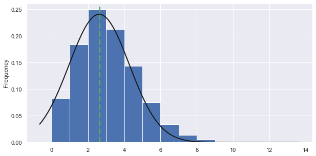
    

    
    #######
    
              TotalGoals                                              
                   count      mean       std  min  25%  50%  75%   max
    Season                                                            
    1993-1994     3346.0  2.643455  1.699524  0.0  1.0  2.0  4.0  11.0
    1994-1995     4617.0  2.690492  1.718282  0.0  1.0  2.0  4.0  10.0
    1995-1996     5103.0  2.658828  1.694471  0.0  1.0  2.0  4.0  11.0
    1996-1997     5981.0  2.587862  1.702795  0.0  1.0  2.0  4.0  13.0
    1997-1998     6733.0  2.624981  1.725868  0.0  1.0  2.0  4.0  11.0
    1998-1999     6531.0  2.629613  1.682949  0.0  1.0  2.0  4.0  10.0
    1999-2000     6532.0  2.657226  1.701303  0.0  1.0  2.0  4.0  12.0
    2000-2001     6553.0  2.684725  1.694666  0.0  1.0  2.0  4.0  10.0
    2001-2002     6473.0  2.662753  1.697212  0.0  1.0  2.0  4.0  11.0
    2002-2003     4391.0  2.599408  1.655140  0.0  1.0  2.0  4.0  10.0
    2003-2004     5267.0  2.644959  1.670326  0.0  1.0  2.0  4.0  10.0
    2004-2005     5644.0  2.576187  1.665243  0.0  1.0  2.0  4.0  10.0
    2005-2006     7802.0  2.504871  1.599750  0.0  1.0  2.0  3.0  11.0
    2006-2007     7875.0  2.529905  1.608876  0.0  1.0  2.0  4.0  10.0
    2007-2008     7929.0  2.589482  1.639677  0.0  1.0  2.0  4.0  11.0
    2008-2009     8100.0  2.560494  1.611684  0.0  1.0  2.0  4.0  10.0
    2009-2010     8035.0  2.582078  1.625377  0.0  1.0  2.0  4.0  12.0
    2010-2011     8477.0  2.678070  1.671897  0.0  1.0  2.0  4.0  11.0
    2011-2012     8702.0  2.663755  1.663032  0.0  1.0  2.0  4.0  10.0
    2012-2013     8710.0  2.729392  1.687940  0.0  2.0  3.0  4.0  11.0
    2013-2014     8981.0  2.637457  1.645658  0.0  1.0  2.0  4.0  12.0
    2014-2015     9239.0  2.611322  1.687391  0.0  1.0  2.0  4.0  12.0
    2015-2016     9420.0  2.614544  1.630458  0.0  1.0  2.0  4.0  12.0
    2016-2017     9836.0  2.634303  1.628408  0.0  1.0  2.0  4.0  10.0
    2017-2018    10121.0  2.634917  1.636057  0.0  1.0  2.0  4.0  10.0
    2018-2019    10223.0  2.663700  1.631709  0.0  2.0  2.0  4.0  11.0
    2019-2020     9597.0  2.600917  1.570741  0.0  1.0  2.0  4.0   9.0
    2020-2021     2976.0  2.594758  1.718440  0.0  1.0  2.0  4.0  13.0
    

    
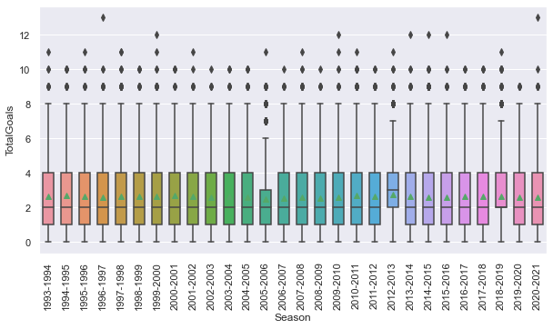
    

    
    #######
    
          TotalGoals                                              
               count      mean       std  min  25%  50%  75%   max
    Month                                                         
    01       17842.0  2.567145  1.641348  0.0  1.0  2.0  4.0  11.0
    02       21424.0  2.544716  1.628544  0.0  1.0  2.0  4.0  11.0
    03       22432.0  2.552291  1.632483  0.0  1.0  2.0  4.0  11.0
    04       23184.0  2.633368  1.648220  0.0  1.0  2.0  4.0  11.0
    05       11837.0  2.858410  1.736841  0.0  2.0  3.0  4.0  12.0
    06        1589.0  2.767778  1.721715  0.0  1.0  3.0  4.0  13.0
    07        1345.0  2.570260  1.624224  0.0  1.0  2.0  4.0   9.0
    08       17282.0  2.601666  1.630745  0.0  1.0  2.0  4.0  12.0
    09       22124.0  2.631486  1.657143  0.0  1.0  2.0  4.0  10.0
    10       22358.0  2.665310  1.680161  0.0  1.0  2.0  4.0  13.0
    11       20949.0  2.659936  1.672335  0.0  1.0  2.0  4.0  10.0
    12       20828.0  2.616478  1.653966  0.0  1.0  2.0  4.0  12.0
    

    
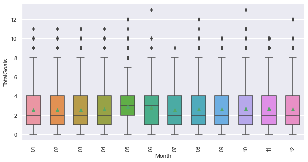
    

    
    #######
    
                TotalGoals                                              
                     count      mean       std  min  25%  50%  75%   max
    Day_Of_Week                                                         
    0              51308.0  2.669701  1.698131  0.0  1.0  2.0  4.0  12.0
    1               7841.0  2.533350  1.604423  0.0  1.0  2.0  4.0  10.0
    2              16056.0  2.558171  1.611730  0.0  1.0  2.0  4.0  11.0
    3               8763.0  2.608924  1.651253  0.0  1.0  2.0  4.0  13.0
    4               1749.0  2.571184  1.599197  0.0  1.0  2.0  4.0   8.0
    5              14696.0  2.526946  1.622094  0.0  1.0  2.0  4.0  11.0
    6             102781.0  2.635672  1.652848  0.0  1.0  2.0  4.0  13.0
    

    
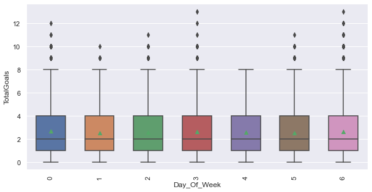
    

    
    #######
    
             TotalGoals                                              
                  count      mean       std  min  25%  50%  75%   max
    Country                                                          
    Belgium      6669.0  2.881841  1.739864  0.0  2.0  3.0  4.0  12.0
    England     74934.0  2.601129  1.625235  0.0  1.0  2.0  4.0  11.0
    France      18216.0  2.360507  1.561539  0.0  1.0  2.0  3.0  11.0
    Germany     16143.0  2.809267  1.711031  0.0  2.0  3.0  4.0  13.0
    Greece       6675.0  2.491536  1.635512  0.0  1.0  2.0  3.0  10.0
    Holland      7989.0  3.075354  1.777518  0.0  2.0  3.0  4.0  13.0
    Italy       18589.0  2.533541  1.626860  0.0  1.0  2.0  4.0  10.0
    Portugal     7243.0  2.502692  1.614398  0.0  1.0  2.0  4.0  10.0
    Scotland    17917.0  2.786069  1.690613  0.0  2.0  3.0  4.0  12.0
    Spain       20992.0  2.510194  1.644387  0.0  1.0  2.0  3.0  12.0
    Turkey       7827.0  2.784081  1.747149  0.0  2.0  3.0  4.0  11.0
    

    
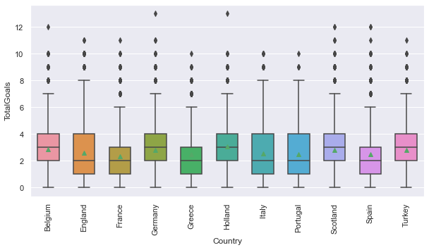
    

    
    #######
    
         TotalGoals                                              
              count      mean       std  min  25%  50%  75%   max
    Tier                                                         
    1       97874.0  2.687813  1.686063  0.0  1.0  3.0  4.0  13.0
    2       61774.0  2.499595  1.611747  0.0  1.0  2.0  3.0  13.0
    3       17129.0  2.683052  1.634595  0.0  2.0  3.0  4.0  11.0
    4       18268.0  2.628914  1.645041  0.0  1.0  2.0  4.0  11.0
    5        8149.0  2.680942  1.669430  0.0  1.0  2.0  4.0  10.0
    

    

    

## Most and Fewest Goals

    
    #######
    
    Top 10 average goals by Team (minimum 30 matches)...
                      TotalGoals Variable
    Team                                 
    PSV Eindhoven       3.583710     Team
    Ajax                3.542986     Team
    Barcelona           3.509690     Team
    Real Madrid         3.497099     Team
    Alfreton Town       3.456522     Team
    Bayern Munich       3.423841     Team
    Sparta Rotterdam    3.326923     Team
    Gretna              3.322222     Team
    Reutlingen          3.317073     Team
    FC Emmen            3.314286     Team
    

    
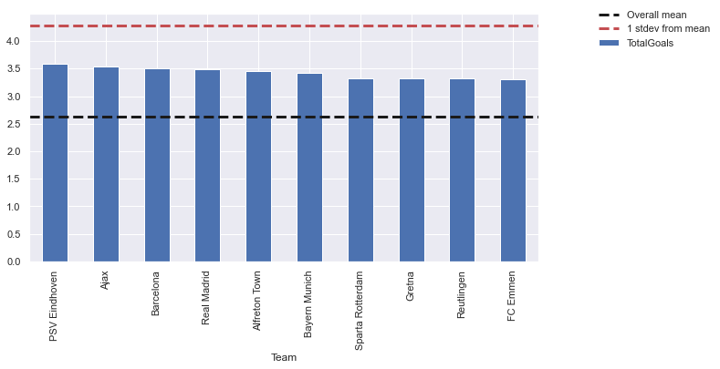
    

    Bottom 10 average goals by Team (minimum 30 matches)...
                   TotalGoals Variable
    Team                              
    Reus Deportiu    1.587302     Team
    Badajoz          1.871212     Team
    Lamia            1.905660     Team
    Reggiana         1.946237     Team
    Paris FC         1.986842     Team
    Giannina         1.987342     Team
    Monza            2.012500     Team
    Louhans-Cuis.    2.016393     Team
    Latina           2.023810     Team
    Lucchese         2.026316     Team
    

    
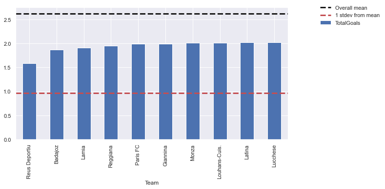
    

    
    #######
    
    Top 10 average goals by TeamOpp (minimum 30 matches)...
                    TotalGoals Variable
    TeamOpp                            
    Erzurumspor       3.676471  TeamOpp
    Kayseri           3.529412  TeamOpp
    Roosendaal        3.514286  TeamOpp
    A. Sebatspor      3.500000  TeamOpp
    MVV Maastricht    3.494118  TeamOpp
    Roda              3.470588  TeamOpp
    Elazigspor        3.385965  TeamOpp
    Ethnikos          3.382353  TeamOpp
    Hyde United       3.347826  TeamOpp
    Holstein Kiel     3.345455  TeamOpp
    

    
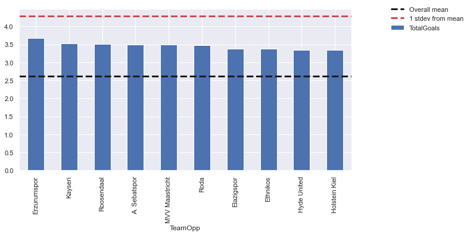
    

    Bottom 10 average goals by TeamOpp (minimum 30 matches)...
                   TotalGoals Variable
    TeamOpp                           
    Reus Deportiu    1.539683  TeamOpp
    Orduspor         1.882353  TeamOpp
    Arezzo           1.886364  TeamOpp
    Badajoz          1.931818  TeamOpp
    Tirsense         1.970588  TeamOpp
    Red Star         2.000000  TeamOpp
    Wasquehal        2.000000  TeamOpp
    Leixoes          2.023810  TeamOpp
    Merida           2.039604  TeamOpp
    Lamia            2.041667  TeamOpp
    

    
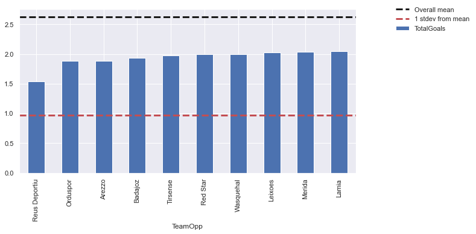
    

    
    #######
    
    Top 10 average goals by Manager (minimum 30 matches)...
                       TotalGoals Variable
    Manager                               
    Unai Emery           3.500000  Manager
    Derek McInnes        3.250000  Manager
    Dean Smith §         3.211268  Manager
    André Villas-Boas    3.184953  Manager
    Kit Symons           3.106977  Manager
    Harry Redknapp       3.068182  Manager
    Claudio Ranieri      3.067416  Manager
    Dean Smith           3.063584  Manager
    Stewart Houston      3.035494  Manager
    Rafael Benítez       2.974895  Manager
    

    
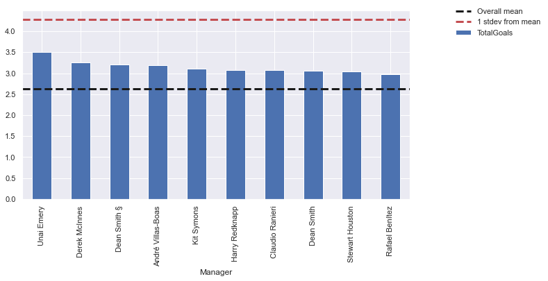
    

    Bottom 10 average goals by Manager (minimum 30 matches)...
                       TotalGoals Variable
    Manager                               
    Gerhard Struber      1.589744  Manager
    Jonathan Woodgate    1.625000  Manager
    Steve Agnew          1.862069  Manager
    Tony Pulis           1.987500  Manager
    Aitor Karanka        2.009615  Manager
    José Morais          2.140000  Manager
    Gordon Strachan      2.142857  Manager
    Roy Hodgson          2.146199  Manager
    David O'Leary        2.214286  Manager
    Gary Rowett          2.255814  Manager
    

    
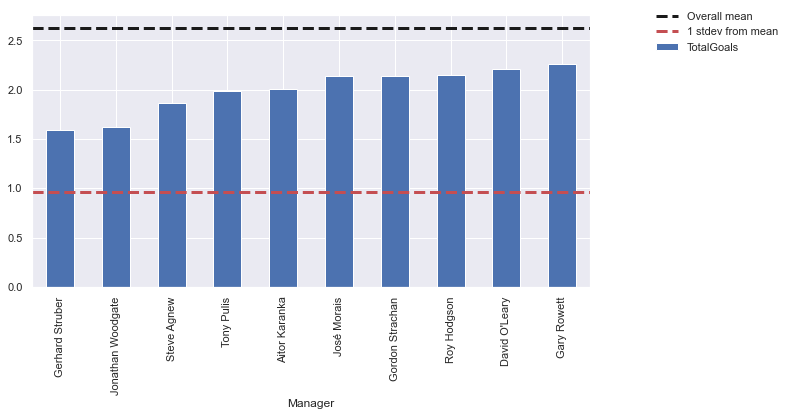
    

    
    #######
    
    Top 10 average goals by ManagerOpp (minimum 30 matches)...
                       TotalGoals    Variable
    ManagerOpp                               
    Malky Mackay         3.603774  ManagerOpp
    Unai Emery           3.392157  ManagerOpp
    Jaap Stam            3.380952  ManagerOpp
    Carlo Ancelotti      3.352941  ManagerOpp
    Claude Puel          3.305556  ManagerOpp
    Ruud Gullit          3.093750  ManagerOpp
    Eddie Howe           3.008357  ManagerOpp
    Joe Kinnear          2.985149  ManagerOpp
    Iain Dowie           2.944444  ManagerOpp
    André Villas-Boas    2.913183  ManagerOpp
    

    
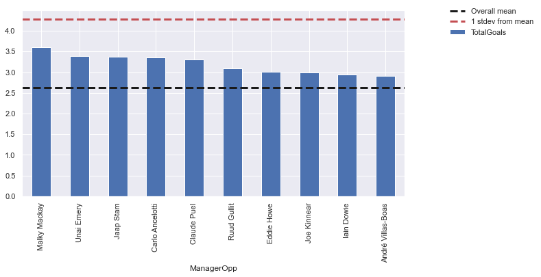
    

    Bottom 10 average goals by ManagerOpp (minimum 30 matches)...
                         TotalGoals    Variable
    ManagerOpp                                 
    Mikel Arteta           1.857143  ManagerOpp
    Brian Little           2.112903  ManagerOpp
    Aitor Karanka          2.121951  ManagerOpp
    Steve McClaren         2.185185  ManagerOpp
    Avram Grant            2.212121  ManagerOpp
    Roy Hodgson            2.215569  ManagerOpp
    Dougie Freedman        2.216667  ManagerOpp
    Ronald Koeman          2.235849  ManagerOpp
    Mauricio Pochettino    2.236842  ManagerOpp
    Gérard Houllier        2.239130  ManagerOpp
    

    
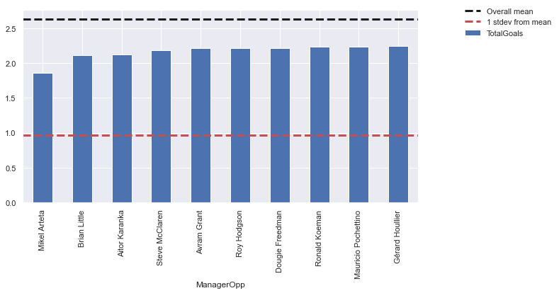
    

    
    #######
    
    Top 10 average goals by Stadium (minimum 30 matches)...
                         TotalGoals Variable
    Stadium                                 
    Camp Nou               3.509690  Stadium
    Santiago Bernabéu      3.497099  Stadium
    Allianz Arena          3.423841  Stadium
    Weserstadion           3.131868  Stadium
    BayArena               3.131579  Stadium
    Galabank               3.116279  Stadium
    Etihad Stadium         3.099398  Stadium
    Celtic Park            3.091880  Stadium
    Ibrox Stadium          3.086393  Stadium
    Rhein-Neckar Arena     3.071111  Stadium
    

    
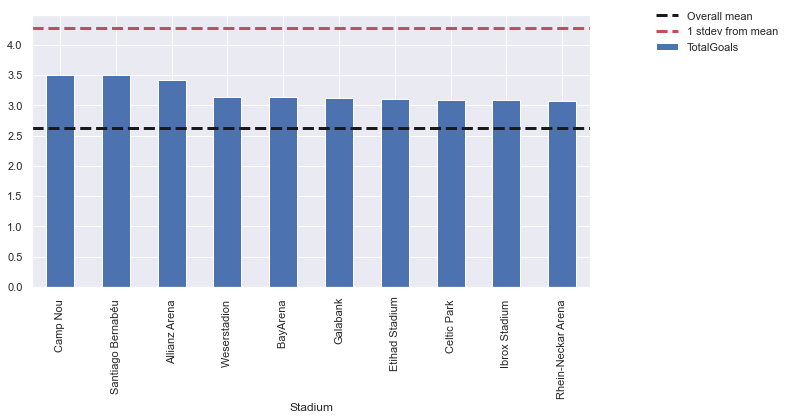
    

    Bottom 10 average goals by Stadium (minimum 30 matches)...
                            TotalGoals Variable
    Stadium                                    
    Stade François Coty       2.148241  Stadium
    Allianz Riviera           2.205821  Stadium
    Stadium Municipal         2.210648  Stadium
    Stade Marcel Picot        2.278960  Stadium
    Riverside Stadium         2.280193  Stadium
    Stade Francis-Le Blé      2.282895  Stadium
    Stade de la Beaujoire     2.286307  Stadium
    Oakwell                   2.291667  Stadium
    Stade du Roudourou        2.296296  Stadium
    Liberty Stadium           2.314204  Stadium
    

    
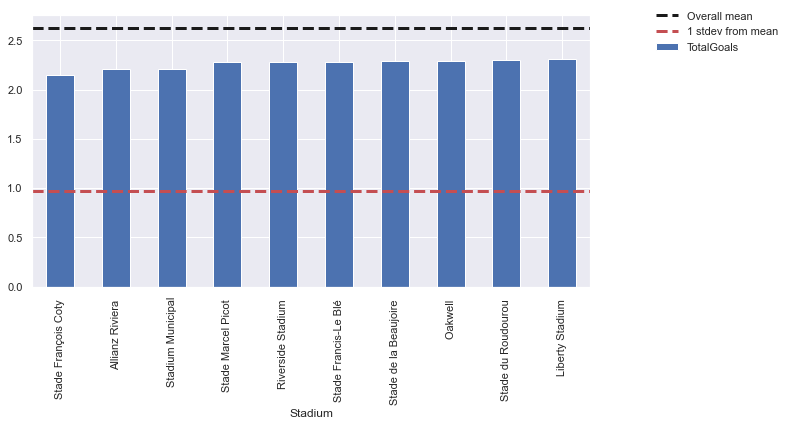
    

    
    #######
    
    Top 10 average goals by Referee (minimum 30 matches)...
                  TotalGoals Variable
    Referee                          
    G Beaton        3.482759  Referee
    J Oldham        3.372549  Referee
    C Charleston    3.272727  Referee
    A Freeland      3.267857  Referee
    H Dallas        3.257143  Referee
    G Ross          3.242424  Referee
    R Johnson       3.162791  Referee
    J Whiteley      3.137255  Referee
    F Graham        3.127329  Referee
    D Richardson    3.080645  Referee
    

    
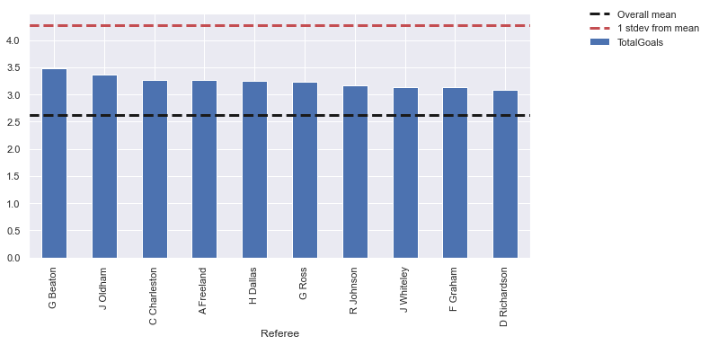
    

    Bottom 10 average goals by Referee (minimum 30 matches)...
                  TotalGoals Variable
    Referee                          
    G Cain          2.055556  Referee
    O Yates         2.097744  Referee
    S Creighton     2.104167  Referee
    C Hatzidakis    2.138889  Referee
    A Young         2.142857  Referee
    C Harwood       2.162162  Referee
    J P Robinson    2.181818  Referee
    J Bell          2.193548  Referee
    E Smith         2.200000  Referee
    D Treleaven     2.215385  Referee
    

    
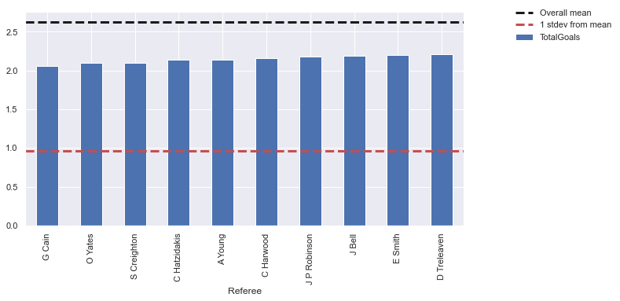
    

                                  TotalGoals
    Value (Variable)                        
    Erzurumspor (TeamOpp)           3.676471
    Malky Mackay (ManagerOpp)       3.603774
    PSV Eindhoven (Team)            3.583710
    Ajax (Team)                     3.542986
    Kayseri (TeamOpp)               3.529412
    Roosendaal (TeamOpp)            3.514286
    Barcelona (Team)                3.509690
    Camp Nou  (Stadium)             3.509690
    Unai Emery (Manager)            3.500000
    A. Sebatspor (TeamOpp)          3.500000
    Real Madrid (Team)              3.497099
    Santiago Bernabéu  (Stadium)    3.497099
    MVV Maastricht (TeamOpp)        3.494118
    G Beaton (Referee)              3.482759
    Roda (TeamOpp)                  3.470588
    Alfreton Town (Team)            3.456522
    Bayern Munich (Team)            3.423841
    Allianz Arena  (Stadium)        3.423841
    Unai Emery (ManagerOpp)         3.392157
    Elazigspor (TeamOpp)            3.385965
    Ethnikos (TeamOpp)              3.382353
    Jaap Stam (ManagerOpp)          3.380952
    J Oldham (Referee)              3.372549
    Carlo Ancelotti (ManagerOpp)    3.352941
    Hyde United (TeamOpp)           3.347826
    Holstein Kiel (TeamOpp)         3.345455
    Sparta Rotterdam (Team)         3.326923
    Gretna (Team)                   3.322222
    Reutlingen (Team)               3.317073
    FC Emmen (Team)                 3.314286
    

    
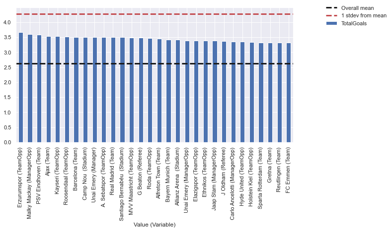
    

                                 TotalGoals
    Value (Variable)                       
    Reus Deportiu (TeamOpp)        1.539683
    Reus Deportiu (Team)           1.587302
    Gerhard Struber (Manager)      1.589744
    Jonathan Woodgate (Manager)    1.625000
    Mikel Arteta (ManagerOpp)      1.857143
    Steve Agnew (Manager)          1.862069
    Badajoz (Team)                 1.871212
    Orduspor (TeamOpp)             1.882353
    Arezzo (TeamOpp)               1.886364
    Lamia (Team)                   1.905660
    Badajoz (TeamOpp)              1.931818
    Reggiana (Team)                1.946237
    Tirsense (TeamOpp)             1.970588
    Paris FC (Team)                1.986842
    Giannina (Team)                1.987342
    Tony Pulis (Manager)           1.987500
    Red Star (TeamOpp)             2.000000
    Wasquehal (TeamOpp)            2.000000
    Aitor Karanka (Manager)        2.009615
    Monza (Team)                   2.012500
    Louhans-Cuis. (Team)           2.016393
    Leixoes (TeamOpp)              2.023810
    Latina (Team)                  2.023810
    Lucchese (Team)                2.026316
    Merida (TeamOpp)               2.039604
    Lamia (TeamOpp)                2.041667
    G Cain (Referee)               2.055556
    O Yates (Referee)              2.097744
    S Creighton (Referee)          2.104167
    Brian Little (ManagerOpp)      2.112903
    

    
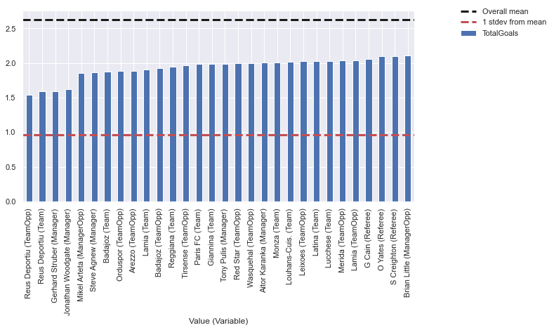
    

    
    #######
    
    Sample size and means with Manager by Country, Tier
                   size      mean
    Country Tier                 
    England 1     11215  2.619795
            2      9467  2.576423
            3      2379  2.550231
            4       544  2.591912
    
    #######
    
    Sample size and means with ManagerOpp by Country, Tier
                   size      mean
    Country Tier                 
    England 1     11206  2.621542
            2      9486  2.591292
            3      2371  2.639814
            4       544  2.531250
    
    #######
    
    Sample size and means with Stadium by Country, Tier
                    size      mean
    Country  Tier                 
    England  1     18512  2.630672
             2     20698  2.576771
             3     10430  2.591467
             4      7057  2.574607
             5      1005  2.766169
    France   1      7804  2.421451
             2      3120  2.339423
    Germany  1      6728  2.918549
             2      2439  2.717097
    Scotland 1      5351  2.666417
             2      2820  2.706383
             3      1657  2.939650
             4      1736  2.887097
    Spain    1      8840  2.712443
             2      2890  2.397232
    
    #######
    
    Sample size and means with Referee by Country, Tier
                    size      mean
    Country  Tier                 
    England  1     16038  2.629754
             2     17519  2.565843
             3     10434  2.618171
             4     10398  2.553857
             5      7576  2.666315
    Germany  1       611  2.916530
             2       608  3.031250
    Italy    1       760  2.578947
    Scotland 1      4097  2.652673
             2       882  2.732426
             3       887  2.835400
             4       886  2.796840
    
    #######
    
    Sample size and means with Latitude by Country, Tier
                    size      mean
    Country  Tier                 
    England  1     18512  2.630672
             2     20698  2.576771
             3     10430  2.591467
             4      7057  2.574607
             5      1005  2.766169
    France   1      7804  2.421451
             2      3120  2.339423
    Germany  1      6728  2.918549
             2      2439  2.717097
    Scotland 1      5351  2.666417
             2      2820  2.706383
             3      1657  2.939650
             4      1736  2.887097
    Spain    1      8840  2.712443
             2      2890  2.397232
    
    #######
    
    Sample size and means with Longitude by Country, Tier
                    size      mean
    Country  Tier                 
    England  1     18512  2.630672
             2     20698  2.576771
             3     10430  2.591467
             4      7057  2.574607
             5      1005  2.766169
    France   1      7804  2.421451
             2      3120  2.339423
    Germany  1      6728  2.918549
             2      2439  2.717097
    Scotland 1      5351  2.666417
             2      2820  2.706383
             3      1657  2.939650
             4      1736  2.887097
    Spain    1      8840  2.712443
             2      2890  2.397232
    

## Mapping Goals

    
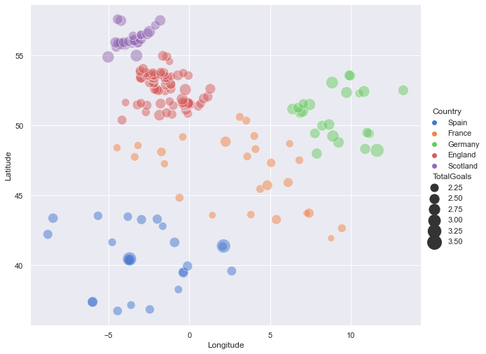
    

