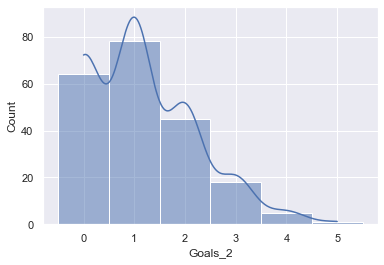
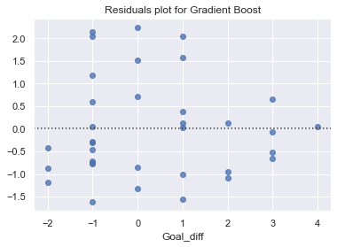
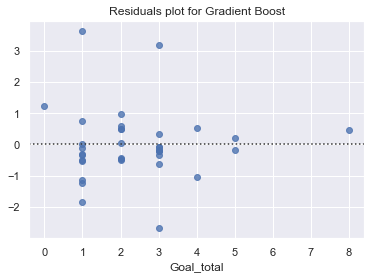

# Euro 2020 (2021) Predictions

<!-- Written report for this analysis can be found [here](../reports/boro_01_market_value.md) -->

## 1. Business Understanding

* Determine Busines Objectives
* Situation Assessment
* Determine Data Mining Goal
* Produce Project Plan

```
# 1. Predict results of every match at Euro 2020
# 2. Make predictions before each round of competition
# 3. Ideally, at each round, use the predictions to simulate remainder of competition
# 4. Check against other predictions and actual results
# 5. Write up process (report/blog)
```

## 2. Data Understanding

* Collect Initial Data
* Describe Data
* Explore Data
* Verify Data Quality

    2021-06-24 22:33:27,168 - INFO - Building master filepath for nations_matches
    2021-06-24 22:33:27,168 - INFO - Fetching C:\Users\adeacon\Documents\GitHub\the-ball-is-round\data\processed\ftb_nations_matches.txt
    2021-06-24 22:33:27,176 - INFO - Building master filepath for nations_matches
    


<div>
<style scoped>
    .dataframe tbody tr th:only-of-type {
        vertical-align: middle;
    }

    .dataframe tbody tr th {
        vertical-align: top;
    }

    .dataframe thead th {
        text-align: right;
    }
</style>
<table border="1" class="dataframe">
  <thead>
    <tr style="text-align: right;">
      <th></th>
      <th>count</th>
      <th>unique</th>
      <th>top</th>
      <th>freq</th>
      <th>mean</th>
      <th>std</th>
      <th>min</th>
      <th>25%</th>
      <th>50%</th>
      <th>75%</th>
      <th>max</th>
    </tr>
  </thead>
  <tbody>
    <tr>
      <th>Round</th>
      <td>219</td>
      <td>5</td>
      <td>Group stage</td>
      <td>168</td>
      <td>NaN</td>
      <td>NaN</td>
      <td>NaN</td>
      <td>NaN</td>
      <td>NaN</td>
      <td>NaN</td>
      <td>NaN</td>
    </tr>
    <tr>
      <th>Day</th>
      <td>219</td>
      <td>7</td>
      <td>Sun</td>
      <td>43</td>
      <td>NaN</td>
      <td>NaN</td>
      <td>NaN</td>
      <td>NaN</td>
      <td>NaN</td>
      <td>NaN</td>
      <td>NaN</td>
    </tr>
    <tr>
      <th>Date</th>
      <td>219</td>
      <td>114</td>
      <td>2021-06-21</td>
      <td>4</td>
      <td>NaN</td>
      <td>NaN</td>
      <td>NaN</td>
      <td>NaN</td>
      <td>NaN</td>
      <td>NaN</td>
      <td>NaN</td>
    </tr>
    <tr>
      <th>Time</th>
      <td>219</td>
      <td>16</td>
      <td>20:45 (19:45)</td>
      <td>52</td>
      <td>NaN</td>
      <td>NaN</td>
      <td>NaN</td>
      <td>NaN</td>
      <td>NaN</td>
      <td>NaN</td>
      <td>NaN</td>
    </tr>
    <tr>
      <th>Team_1</th>
      <td>219</td>
      <td>35</td>
      <td>Portugal</td>
      <td>16</td>
      <td>NaN</td>
      <td>NaN</td>
      <td>NaN</td>
      <td>NaN</td>
      <td>NaN</td>
      <td>NaN</td>
      <td>NaN</td>
    </tr>
    <tr>
      <th>Team_2</th>
      <td>219</td>
      <td>35</td>
      <td>Portugal</td>
      <td>15</td>
      <td>NaN</td>
      <td>NaN</td>
      <td>NaN</td>
      <td>NaN</td>
      <td>NaN</td>
      <td>NaN</td>
      <td>NaN</td>
    </tr>
    <tr>
      <th>Year</th>
      <td>219</td>
      <td>NaN</td>
      <td>NaN</td>
      <td>NaN</td>
      <td>2011.34</td>
      <td>7.17709</td>
      <td>2000</td>
      <td>2004</td>
      <td>2012</td>
      <td>2016</td>
      <td>2021</td>
    </tr>
    <tr>
      <th>Goals_1</th>
      <td>211</td>
      <td>NaN</td>
      <td>NaN</td>
      <td>NaN</td>
      <td>1.41706</td>
      <td>1.31529</td>
      <td>0</td>
      <td>0</td>
      <td>1</td>
      <td>2</td>
      <td>6</td>
    </tr>
    <tr>
      <th>Goals_2</th>
      <td>211</td>
      <td>NaN</td>
      <td>NaN</td>
      <td>NaN</td>
      <td>1.17062</td>
      <td>1.05978</td>
      <td>0</td>
      <td>0</td>
      <td>1</td>
      <td>2</td>
      <td>5</td>
    </tr>
    <tr>
      <th>Goal_diff</th>
      <td>211</td>
      <td>NaN</td>
      <td>NaN</td>
      <td>NaN</td>
      <td>0.246445</td>
      <td>1.78777</td>
      <td>-5</td>
      <td>-1</td>
      <td>0</td>
      <td>1</td>
      <td>5</td>
    </tr>
    <tr>
      <th>Venue</th>
      <td>219</td>
      <td>61</td>
      <td>Stade de France</td>
      <td>7</td>
      <td>NaN</td>
      <td>NaN</td>
      <td>NaN</td>
      <td>NaN</td>
      <td>NaN</td>
      <td>NaN</td>
      <td>NaN</td>
    </tr>
    <tr>
      <th>Venue_country</th>
      <td>134</td>
      <td>11</td>
      <td>France</td>
      <td>45</td>
      <td>NaN</td>
      <td>NaN</td>
      <td>NaN</td>
      <td>NaN</td>
      <td>NaN</td>
      <td>NaN</td>
      <td>NaN</td>
    </tr>
    <tr>
      <th>Venue_city</th>
      <td>134</td>
      <td>34</td>
      <td>Saint-Denis</td>
      <td>7</td>
      <td>NaN</td>
      <td>NaN</td>
      <td>NaN</td>
      <td>NaN</td>
      <td>NaN</td>
      <td>NaN</td>
      <td>NaN</td>
    </tr>
    <tr>
      <th>Home_1</th>
      <td>219</td>
      <td>NaN</td>
      <td>NaN</td>
      <td>NaN</td>
      <td>0.0776256</td>
      <td>0.268194</td>
      <td>0</td>
      <td>0</td>
      <td>0</td>
      <td>0</td>
      <td>1</td>
    </tr>
    <tr>
      <th>Home_2</th>
      <td>219</td>
      <td>NaN</td>
      <td>NaN</td>
      <td>NaN</td>
      <td>0.0410959</td>
      <td>0.198967</td>
      <td>0</td>
      <td>0</td>
      <td>0</td>
      <td>0</td>
      <td>1</td>
    </tr>
    <tr>
      <th>Goal_total</th>
      <td>211</td>
      <td>NaN</td>
      <td>NaN</td>
      <td>NaN</td>
      <td>2.58768</td>
      <td>1.58434</td>
      <td>0</td>
      <td>1</td>
      <td>2</td>
      <td>3</td>
      <td>8</td>
    </tr>
    <tr>
      <th>Result</th>
      <td>211</td>
      <td>3</td>
      <td>Win</td>
      <td>90</td>
      <td>NaN</td>
      <td>NaN</td>
      <td>NaN</td>
      <td>NaN</td>
      <td>NaN</td>
      <td>NaN</td>
      <td>NaN</td>
    </tr>
  </tbody>
</table>
</div>


    
    Goals_1
    
    


    

    


    
    --------------------
    
    Goals_2
    
    


    

    


    
    --------------------
    
    Goal_diff
    
    


    

    


    
    --------------------
    
    Goal_total
    
    


    

    


    
    --------------------
    

    
    Round
    
    Group stage       168
    Quarter-finals     20
    Semi-finals        10
    Round of 16         8
    Final               5
    Name: Round, dtype: int64
    


    

    


    
    --------------------
    
    Day
    
    Sun    41
    Sat    36
    Wed    34
    Mon    30
    Tue    26
    Fri    22
    Thu    22
    Name: Day, dtype: int64
    


    

    


    
    --------------------
    
    Time
    
    20:45 (19:45)    52
    18:00 (17:00)    45
    21:00 (20:00)    37
    19:45            23
    17:00            11
    21:45 (19:45)    11
    15:00 (14:00)    10
    19:00 (17:00)     6
    20:00             3
    22:00 (20:00)     3
    14:00             3
    20:00 (17:00)     2
    16:00 (14:00)     2
    14:30 (13:30)     1
    20:00 (19:00)     1
    17:00 (14:00)     1
    Name: Time, dtype: int64
    


    

    


    
    --------------------
    
    Year
    
    2016    51
    2021    36
    2012    31
    2008    31
    2004    31
    2000    31
    Name: Year, dtype: int64
    


    

    


    
    --------------------
    
    Venue_country
    
    NULL           83
    France         45
    Ukraine        16
    Netherlands    16
    Belgium        15
    Austria        13
    Switzerland    12
    Poland         11
    Name: Venue_country, dtype: int64
    


    

    


    
    --------------------
    
    Result
    
    Win     90
    Loss    81
    Draw    40
    Name: Result, dtype: int64
    


    

    


    
    --------------------
    

    2021-06-24 22:33:29,171 - INFO - Building master filepath for nations_summaries
    2021-06-24 22:33:29,172 - INFO - Fetching C:\Users\adeacon\Documents\GitHub\the-ball-is-round\data\processed\ftb_nations_summaries.txt
    2021-06-24 22:33:29,174 - INFO - Building master filepath for nations_summaries
    


<div>
<style scoped>
    .dataframe tbody tr th:only-of-type {
        vertical-align: middle;
    }

    .dataframe tbody tr th {
        vertical-align: top;
    }

    .dataframe thead th {
        text-align: right;
    }
</style>
<table border="1" class="dataframe">
  <thead>
    <tr style="text-align: right;">
      <th></th>
      <th>count</th>
      <th>unique</th>
      <th>top</th>
      <th>freq</th>
      <th>mean</th>
      <th>std</th>
      <th>min</th>
      <th>25%</th>
      <th>50%</th>
      <th>75%</th>
      <th>max</th>
    </tr>
  </thead>
  <tbody>
    <tr>
      <th>Rank Local</th>
      <td>112</td>
      <td>NaN</td>
      <td>NaN</td>
      <td>NaN</td>
      <td>10.1964</td>
      <td>6.06398</td>
      <td>1</td>
      <td>5</td>
      <td>10</td>
      <td>14.25</td>
      <td>24</td>
    </tr>
    <tr>
      <th>Rank Global</th>
      <td>112</td>
      <td>NaN</td>
      <td>NaN</td>
      <td>NaN</td>
      <td>18.6964</td>
      <td>14.7769</td>
      <td>1</td>
      <td>8</td>
      <td>15</td>
      <td>26</td>
      <td>74</td>
    </tr>
    <tr>
      <th>Team</th>
      <td>112</td>
      <td>35</td>
      <td>Germany</td>
      <td>6</td>
      <td>NaN</td>
      <td>NaN</td>
      <td>NaN</td>
      <td>NaN</td>
      <td>NaN</td>
      <td>NaN</td>
      <td>NaN</td>
    </tr>
    <tr>
      <th>Rating</th>
      <td>112</td>
      <td>NaN</td>
      <td>NaN</td>
      <td>NaN</td>
      <td>1856</td>
      <td>122.945</td>
      <td>1524</td>
      <td>1771.25</td>
      <td>1853</td>
      <td>1948.25</td>
      <td>2127</td>
    </tr>
    <tr>
      <th>Average Rank</th>
      <td>112</td>
      <td>NaN</td>
      <td>NaN</td>
      <td>NaN</td>
      <td>22.5268</td>
      <td>16.0921</td>
      <td>4</td>
      <td>11</td>
      <td>19</td>
      <td>27.25</td>
      <td>83</td>
    </tr>
    <tr>
      <th>Average Rating</th>
      <td>112</td>
      <td>NaN</td>
      <td>NaN</td>
      <td>NaN</td>
      <td>1769.49</td>
      <td>128.753</td>
      <td>1390</td>
      <td>1704.75</td>
      <td>1785.5</td>
      <td>1875.25</td>
      <td>1985</td>
    </tr>
    <tr>
      <th>1 Year Change Rank</th>
      <td>112</td>
      <td>NaN</td>
      <td>NaN</td>
      <td>NaN</td>
      <td>1.41071</td>
      <td>5.92073</td>
      <td>-15</td>
      <td>-2</td>
      <td>1</td>
      <td>4</td>
      <td>23</td>
    </tr>
    <tr>
      <th>1 Year Change Rating</th>
      <td>112</td>
      <td>NaN</td>
      <td>NaN</td>
      <td>NaN</td>
      <td>7.26786</td>
      <td>42.6667</td>
      <td>-92</td>
      <td>-24.25</td>
      <td>7.5</td>
      <td>35.25</td>
      <td>127</td>
    </tr>
    <tr>
      <th>Matches Total</th>
      <td>112</td>
      <td>NaN</td>
      <td>NaN</td>
      <td>NaN</td>
      <td>638.009</td>
      <td>214.417</td>
      <td>63</td>
      <td>537.25</td>
      <td>659.5</td>
      <td>787</td>
      <td>1073</td>
    </tr>
    <tr>
      <th>Matches Home</th>
      <td>112</td>
      <td>NaN</td>
      <td>NaN</td>
      <td>NaN</td>
      <td>285.482</td>
      <td>98.4145</td>
      <td>23</td>
      <td>223</td>
      <td>295</td>
      <td>360</td>
      <td>467</td>
    </tr>
    <tr>
      <th>Matches Away</th>
      <td>112</td>
      <td>NaN</td>
      <td>NaN</td>
      <td>NaN</td>
      <td>282.17</td>
      <td>99.397</td>
      <td>32</td>
      <td>223.25</td>
      <td>290.5</td>
      <td>344</td>
      <td>494</td>
    </tr>
    <tr>
      <th>Matches Neutral</th>
      <td>112</td>
      <td>NaN</td>
      <td>NaN</td>
      <td>NaN</td>
      <td>70.3571</td>
      <td>33.2126</td>
      <td>8</td>
      <td>44</td>
      <td>68</td>
      <td>94</td>
      <td>157</td>
    </tr>
    <tr>
      <th>Matches Wins</th>
      <td>112</td>
      <td>NaN</td>
      <td>NaN</td>
      <td>NaN</td>
      <td>298.768</td>
      <td>128.751</td>
      <td>21</td>
      <td>209</td>
      <td>303.5</td>
      <td>383.25</td>
      <td>628</td>
    </tr>
    <tr>
      <th>Matches Losses</th>
      <td>112</td>
      <td>NaN</td>
      <td>NaN</td>
      <td>NaN</td>
      <td>194.812</td>
      <td>74.8451</td>
      <td>26</td>
      <td>145</td>
      <td>193.5</td>
      <td>246.5</td>
      <td>410</td>
    </tr>
    <tr>
      <th>Matches Draws</th>
      <td>112</td>
      <td>NaN</td>
      <td>NaN</td>
      <td>NaN</td>
      <td>144.429</td>
      <td>45.8214</td>
      <td>16</td>
      <td>122.5</td>
      <td>148</td>
      <td>174</td>
      <td>244</td>
    </tr>
    <tr>
      <th>Goals For</th>
      <td>112</td>
      <td>NaN</td>
      <td>NaN</td>
      <td>NaN</td>
      <td>1157.33</td>
      <td>528.22</td>
      <td>83</td>
      <td>821.5</td>
      <td>1175</td>
      <td>1432</td>
      <td>2513</td>
    </tr>
    <tr>
      <th>Goals Against</th>
      <td>112</td>
      <td>NaN</td>
      <td>NaN</td>
      <td>NaN</td>
      <td>852.866</td>
      <td>323.145</td>
      <td>87</td>
      <td>638.25</td>
      <td>876.5</td>
      <td>1079.5</td>
      <td>1615</td>
    </tr>
    <tr>
      <th>Year</th>
      <td>112</td>
      <td>NaN</td>
      <td>NaN</td>
      <td>NaN</td>
      <td>2011.36</td>
      <td>7.26941</td>
      <td>2000</td>
      <td>2004</td>
      <td>2012</td>
      <td>2016</td>
      <td>2021</td>
    </tr>
    <tr>
      <th>Country</th>
      <td>112</td>
      <td>32</td>
      <td>United Kingdom</td>
      <td>9</td>
      <td>NaN</td>
      <td>NaN</td>
      <td>NaN</td>
      <td>NaN</td>
      <td>NaN</td>
      <td>NaN</td>
      <td>NaN</td>
    </tr>
    <tr>
      <th>Data Year</th>
      <td>112</td>
      <td>NaN</td>
      <td>NaN</td>
      <td>NaN</td>
      <td>2010.14</td>
      <td>6.98887</td>
      <td>1999</td>
      <td>2003</td>
      <td>2011</td>
      <td>2015</td>
      <td>2019</td>
    </tr>
    <tr>
      <th>GDP (PPP)</th>
      <td>112</td>
      <td>NaN</td>
      <td>NaN</td>
      <td>NaN</td>
      <td>1.19252e+06</td>
      <td>1.19294e+06</td>
      <td>16865.3</td>
      <td>313922</td>
      <td>545971</td>
      <td>2.083e+06</td>
      <td>4.30886e+06</td>
    </tr>
    <tr>
      <th>Population</th>
      <td>112</td>
      <td>NaN</td>
      <td>NaN</td>
      <td>NaN</td>
      <td>35.3018</td>
      <td>35.5946</td>
      <td>0.330243</td>
      <td>8.82449</td>
      <td>16.0182</td>
      <td>60.5572</td>
      <td>145.872</td>
    </tr>
    <tr>
      <th>GDP (PPP) Per Capita</th>
      <td>112</td>
      <td>NaN</td>
      <td>NaN</td>
      <td>NaN</td>
      <td>35377</td>
      <td>13683</td>
      <td>7493.28</td>
      <td>26531.8</td>
      <td>35891.7</td>
      <td>44947.3</td>
      <td>75574.7</td>
    </tr>
  </tbody>
</table>
</div>


    
    Rating
    
    


    

    


    
    --------------------
    
    Average Rank
    
    


    

    


    
    --------------------
    
    Average Rating
    
    


    

    


    
    --------------------
    
    1 Year Change Rank
    
    


    

    


    
    --------------------
    
    1 Year Change Rating
    
    


    

    


    
    --------------------
    
    Matches Total
    
    


    

    


    
    --------------------
    
    Matches Home
    
    


    

    


    
    --------------------
    
    Matches Away
    
    


    

    


    
    --------------------
    
    Matches Neutral
    
    


    

    


    
    --------------------
    
    Matches Wins
    
    


    

    


    
    --------------------
    
    Matches Losses
    
    


    

    


    
    --------------------
    
    Matches Draws
    
    


    

    


    
    --------------------
    
    Goals For
    
    


    

    


    
    --------------------
    
    Goals Against
    
    


    

    


    
    --------------------
    
    GDP (PPP)
    
    


    

    


    
    --------------------
    
    Population
    
    


    

    


    
    --------------------
    
    GDP (PPP) Per Capita
    
    


    

    


    
    --------------------
    

## 3. Data Preperation

* Select Data
* Clean Data
* Construct Data
* Integrate Data
* Format Data


<div>
<style scoped>
    .dataframe tbody tr th:only-of-type {
        vertical-align: middle;
    }

    .dataframe tbody tr th {
        vertical-align: top;
    }

    .dataframe thead th {
        text-align: right;
    }
</style>
<table border="1" class="dataframe">
  <thead>
    <tr style="text-align: right;">
      <th></th>
      <th>count</th>
      <th>mean</th>
      <th>std</th>
      <th>min</th>
      <th>25%</th>
      <th>50%</th>
      <th>75%</th>
      <th>max</th>
    </tr>
  </thead>
  <tbody>
    <tr>
      <th>Year</th>
      <td>219.0</td>
      <td>2.011342e+03</td>
      <td>7.177090e+00</td>
      <td>2000.000000</td>
      <td>2004.000000</td>
      <td>2012.000000</td>
      <td>2.016000e+03</td>
      <td>2.021000e+03</td>
    </tr>
    <tr>
      <th>Goals_1</th>
      <td>211.0</td>
      <td>1.417062e+00</td>
      <td>1.315292e+00</td>
      <td>0.000000</td>
      <td>0.000000</td>
      <td>1.000000</td>
      <td>2.000000e+00</td>
      <td>6.000000e+00</td>
    </tr>
    <tr>
      <th>Goals_2</th>
      <td>211.0</td>
      <td>1.170616e+00</td>
      <td>1.059779e+00</td>
      <td>0.000000</td>
      <td>0.000000</td>
      <td>1.000000</td>
      <td>2.000000e+00</td>
      <td>5.000000e+00</td>
    </tr>
    <tr>
      <th>Goal_diff</th>
      <td>211.0</td>
      <td>2.464455e-01</td>
      <td>1.787769e+00</td>
      <td>-5.000000</td>
      <td>-1.000000</td>
      <td>0.000000</td>
      <td>1.000000e+00</td>
      <td>5.000000e+00</td>
    </tr>
    <tr>
      <th>Home_1</th>
      <td>219.0</td>
      <td>7.762557e-02</td>
      <td>2.681945e-01</td>
      <td>0.000000</td>
      <td>0.000000</td>
      <td>0.000000</td>
      <td>0.000000e+00</td>
      <td>1.000000e+00</td>
    </tr>
    <tr>
      <th>Home_2</th>
      <td>219.0</td>
      <td>4.109589e-02</td>
      <td>1.989668e-01</td>
      <td>0.000000</td>
      <td>0.000000</td>
      <td>0.000000</td>
      <td>0.000000e+00</td>
      <td>1.000000e+00</td>
    </tr>
    <tr>
      <th>Goal_total</th>
      <td>211.0</td>
      <td>2.587678e+00</td>
      <td>1.584340e+00</td>
      <td>0.000000</td>
      <td>1.000000</td>
      <td>2.000000</td>
      <td>3.000000e+00</td>
      <td>8.000000e+00</td>
    </tr>
    <tr>
      <th>Rank Local</th>
      <td>219.0</td>
      <td>9.237443e+00</td>
      <td>5.931433e+00</td>
      <td>1.000000</td>
      <td>4.000000</td>
      <td>8.000000</td>
      <td>1.300000e+01</td>
      <td>2.400000e+01</td>
    </tr>
    <tr>
      <th>Rank Global</th>
      <td>219.0</td>
      <td>1.686758e+01</td>
      <td>1.416890e+01</td>
      <td>1.000000</td>
      <td>7.000000</td>
      <td>13.000000</td>
      <td>2.250000e+01</td>
      <td>7.400000e+01</td>
    </tr>
    <tr>
      <th>Rating</th>
      <td>219.0</td>
      <td>1.874639e+03</td>
      <td>1.244261e+02</td>
      <td>1524.000000</td>
      <td>1787.000000</td>
      <td>1875.000000</td>
      <td>1.971000e+03</td>
      <td>2.127000e+03</td>
    </tr>
    <tr>
      <th>Average Rank</th>
      <td>219.0</td>
      <td>2.089041e+01</td>
      <td>1.510504e+01</td>
      <td>4.000000</td>
      <td>9.500000</td>
      <td>18.000000</td>
      <td>2.400000e+01</td>
      <td>8.300000e+01</td>
    </tr>
    <tr>
      <th>Average Rating</th>
      <td>219.0</td>
      <td>1.782767e+03</td>
      <td>1.256972e+02</td>
      <td>1390.000000</td>
      <td>1719.000000</td>
      <td>1792.000000</td>
      <td>1.885500e+03</td>
      <td>1.985000e+03</td>
    </tr>
    <tr>
      <th>1 Year Change Rank</th>
      <td>219.0</td>
      <td>9.817352e-01</td>
      <td>5.207584e+00</td>
      <td>-15.000000</td>
      <td>-2.000000</td>
      <td>0.000000</td>
      <td>3.000000e+00</td>
      <td>2.300000e+01</td>
    </tr>
    <tr>
      <th>1 Year Change Rating</th>
      <td>219.0</td>
      <td>3.447489e+00</td>
      <td>4.341945e+01</td>
      <td>-92.000000</td>
      <td>-26.000000</td>
      <td>2.000000</td>
      <td>3.500000e+01</td>
      <td>1.270000e+02</td>
    </tr>
    <tr>
      <th>Matches Total</th>
      <td>219.0</td>
      <td>6.472831e+02</td>
      <td>2.137187e+02</td>
      <td>63.000000</td>
      <td>550.000000</td>
      <td>661.000000</td>
      <td>8.030000e+02</td>
      <td>1.073000e+03</td>
    </tr>
    <tr>
      <th>Matches Home</th>
      <td>219.0</td>
      <td>2.913242e+02</td>
      <td>9.719898e+01</td>
      <td>23.000000</td>
      <td>231.500000</td>
      <td>300.000000</td>
      <td>3.640000e+02</td>
      <td>4.670000e+02</td>
    </tr>
    <tr>
      <th>Matches Away</th>
      <td>219.0</td>
      <td>2.824475e+02</td>
      <td>9.888521e+01</td>
      <td>32.000000</td>
      <td>218.000000</td>
      <td>289.000000</td>
      <td>3.420000e+02</td>
      <td>4.940000e+02</td>
    </tr>
    <tr>
      <th>Matches Neutral</th>
      <td>219.0</td>
      <td>7.351142e+01</td>
      <td>3.445118e+01</td>
      <td>8.000000</td>
      <td>46.500000</td>
      <td>70.000000</td>
      <td>9.500000e+01</td>
      <td>1.570000e+02</td>
    </tr>
    <tr>
      <th>Matches Wins</th>
      <td>219.0</td>
      <td>3.084612e+02</td>
      <td>1.311131e+02</td>
      <td>21.000000</td>
      <td>210.500000</td>
      <td>306.000000</td>
      <td>3.860000e+02</td>
      <td>6.280000e+02</td>
    </tr>
    <tr>
      <th>Matches Losses</th>
      <td>219.0</td>
      <td>1.927808e+02</td>
      <td>7.379775e+01</td>
      <td>26.000000</td>
      <td>145.000000</td>
      <td>190.000000</td>
      <td>2.460000e+02</td>
      <td>4.100000e+02</td>
    </tr>
    <tr>
      <th>Matches Draws</th>
      <td>219.0</td>
      <td>1.460411e+02</td>
      <td>4.577461e+01</td>
      <td>16.000000</td>
      <td>121.000000</td>
      <td>148.000000</td>
      <td>1.740000e+02</td>
      <td>2.440000e+02</td>
    </tr>
    <tr>
      <th>Goals For</th>
      <td>219.0</td>
      <td>1.190196e+03</td>
      <td>5.361304e+02</td>
      <td>83.000000</td>
      <td>841.500000</td>
      <td>1178.000000</td>
      <td>1.452000e+03</td>
      <td>2.513000e+03</td>
    </tr>
    <tr>
      <th>Goals Against</th>
      <td>219.0</td>
      <td>8.537123e+02</td>
      <td>3.177857e+02</td>
      <td>87.000000</td>
      <td>626.000000</td>
      <td>893.000000</td>
      <td>1.074500e+03</td>
      <td>1.615000e+03</td>
    </tr>
    <tr>
      <th>Data Year</th>
      <td>219.0</td>
      <td>2.010142e+03</td>
      <td>6.911834e+00</td>
      <td>1999.000000</td>
      <td>2003.000000</td>
      <td>2011.000000</td>
      <td>2.015000e+03</td>
      <td>2.019000e+03</td>
    </tr>
    <tr>
      <th>GDP (PPP)</th>
      <td>219.0</td>
      <td>1.281759e+06</td>
      <td>1.199433e+06</td>
      <td>16865.345703</td>
      <td>317885.203125</td>
      <td>650311.875000</td>
      <td>2.227538e+06</td>
      <td>4.308862e+06</td>
    </tr>
    <tr>
      <th>Population</th>
      <td>219.0</td>
      <td>3.675634e+01</td>
      <td>3.421002e+01</td>
      <td>0.330243</td>
      <td>9.684679</td>
      <td>17.097130</td>
      <td>6.138030e+01</td>
      <td>1.458723e+02</td>
    </tr>
    <tr>
      <th>GDP (PPP) Per Capita</th>
      <td>219.0</td>
      <td>3.610007e+04</td>
      <td>1.285539e+04</td>
      <td>7493.284135</td>
      <td>27512.020377</td>
      <td>36505.543076</td>
      <td>4.551327e+04</td>
      <td>7.557470e+04</td>
    </tr>
    <tr>
      <th>Rank Local (2)</th>
      <td>219.0</td>
      <td>1.004110e+01</td>
      <td>6.134812e+00</td>
      <td>1.000000</td>
      <td>5.000000</td>
      <td>9.000000</td>
      <td>1.400000e+01</td>
      <td>2.400000e+01</td>
    </tr>
    <tr>
      <th>Rank Global (2)</th>
      <td>219.0</td>
      <td>1.812785e+01</td>
      <td>1.433230e+01</td>
      <td>1.000000</td>
      <td>7.500000</td>
      <td>14.000000</td>
      <td>2.400000e+01</td>
      <td>7.400000e+01</td>
    </tr>
    <tr>
      <th>Rating (2)</th>
      <td>219.0</td>
      <td>1.859329e+03</td>
      <td>1.203412e+02</td>
      <td>1524.000000</td>
      <td>1776.500000</td>
      <td>1864.000000</td>
      <td>1.950500e+03</td>
      <td>2.127000e+03</td>
    </tr>
    <tr>
      <th>Average Rank (2)</th>
      <td>219.0</td>
      <td>2.267580e+01</td>
      <td>1.628079e+01</td>
      <td>4.000000</td>
      <td>11.000000</td>
      <td>20.000000</td>
      <td>2.700000e+01</td>
      <td>8.300000e+01</td>
    </tr>
    <tr>
      <th>Average Rating (2)</th>
      <td>219.0</td>
      <td>1.766187e+03</td>
      <td>1.295115e+02</td>
      <td>1390.000000</td>
      <td>1704.000000</td>
      <td>1775.000000</td>
      <td>1.875000e+03</td>
      <td>1.985000e+03</td>
    </tr>
    <tr>
      <th>1 Year Change Rank (2)</th>
      <td>219.0</td>
      <td>1.415525e+00</td>
      <td>5.801450e+00</td>
      <td>-15.000000</td>
      <td>-2.000000</td>
      <td>0.000000</td>
      <td>3.000000e+00</td>
      <td>2.300000e+01</td>
    </tr>
    <tr>
      <th>1 Year Change Rating (2)</th>
      <td>219.0</td>
      <td>7.424658e+00</td>
      <td>4.099662e+01</td>
      <td>-92.000000</td>
      <td>-22.000000</td>
      <td>5.000000</td>
      <td>3.300000e+01</td>
      <td>1.270000e+02</td>
    </tr>
    <tr>
      <th>Matches Total (2)</th>
      <td>219.0</td>
      <td>6.333059e+02</td>
      <td>2.017983e+02</td>
      <td>63.000000</td>
      <td>523.000000</td>
      <td>634.000000</td>
      <td>7.900000e+02</td>
      <td>1.073000e+03</td>
    </tr>
    <tr>
      <th>Matches Home (2)</th>
      <td>219.0</td>
      <td>2.847397e+02</td>
      <td>9.368819e+01</td>
      <td>23.000000</td>
      <td>220.000000</td>
      <td>293.000000</td>
      <td>3.610000e+02</td>
      <td>4.670000e+02</td>
    </tr>
    <tr>
      <th>Matches Away (2)</th>
      <td>219.0</td>
      <td>2.785205e+02</td>
      <td>9.285173e+01</td>
      <td>32.000000</td>
      <td>216.000000</td>
      <td>282.000000</td>
      <td>3.420000e+02</td>
      <td>4.940000e+02</td>
    </tr>
    <tr>
      <th>Matches Neutral (2)</th>
      <td>219.0</td>
      <td>7.004566e+01</td>
      <td>3.287365e+01</td>
      <td>8.000000</td>
      <td>44.000000</td>
      <td>67.000000</td>
      <td>9.400000e+01</td>
      <td>1.570000e+02</td>
    </tr>
    <tr>
      <th>Matches Wins (2)</th>
      <td>219.0</td>
      <td>2.951233e+02</td>
      <td>1.228929e+02</td>
      <td>21.000000</td>
      <td>209.000000</td>
      <td>303.000000</td>
      <td>3.815000e+02</td>
      <td>6.280000e+02</td>
    </tr>
    <tr>
      <th>Matches Losses (2)</th>
      <td>219.0</td>
      <td>1.943927e+02</td>
      <td>7.060311e+01</td>
      <td>26.000000</td>
      <td>145.000000</td>
      <td>188.000000</td>
      <td>2.460000e+02</td>
      <td>4.100000e+02</td>
    </tr>
    <tr>
      <th>Matches Draws (2)</th>
      <td>219.0</td>
      <td>1.437900e+02</td>
      <td>4.324235e+01</td>
      <td>16.000000</td>
      <td>122.000000</td>
      <td>145.000000</td>
      <td>1.735000e+02</td>
      <td>2.440000e+02</td>
    </tr>
    <tr>
      <th>Goals For (2)</th>
      <td>219.0</td>
      <td>1.136014e+03</td>
      <td>5.009044e+02</td>
      <td>83.000000</td>
      <td>802.500000</td>
      <td>1172.000000</td>
      <td>1.413000e+03</td>
      <td>2.513000e+03</td>
    </tr>
    <tr>
      <th>Goals Against (2)</th>
      <td>219.0</td>
      <td>8.471553e+02</td>
      <td>3.052280e+02</td>
      <td>87.000000</td>
      <td>642.000000</td>
      <td>852.000000</td>
      <td>1.074500e+03</td>
      <td>1.615000e+03</td>
    </tr>
    <tr>
      <th>Data Year (2)</th>
      <td>219.0</td>
      <td>2.010142e+03</td>
      <td>6.911834e+00</td>
      <td>1999.000000</td>
      <td>2003.000000</td>
      <td>2011.000000</td>
      <td>2.015000e+03</td>
      <td>2.019000e+03</td>
    </tr>
    <tr>
      <th>GDP (PPP) (2)</th>
      <td>219.0</td>
      <td>1.235542e+06</td>
      <td>1.205407e+06</td>
      <td>16865.345703</td>
      <td>313628.031250</td>
      <td>562544.187500</td>
      <td>2.232518e+06</td>
      <td>4.308862e+06</td>
    </tr>
    <tr>
      <th>Population (2)</th>
      <td>219.0</td>
      <td>3.588079e+01</td>
      <td>3.493309e+01</td>
      <td>0.330243</td>
      <td>8.955102</td>
      <td>16.200951</td>
      <td>6.138030e+01</td>
      <td>1.458723e+02</td>
    </tr>
    <tr>
      <th>GDP (PPP) Per Capita (2)</th>
      <td>219.0</td>
      <td>3.547805e+04</td>
      <td>1.370685e+04</td>
      <td>7493.284135</td>
      <td>26861.329120</td>
      <td>36533.876382</td>
      <td>4.423183e+04</td>
      <td>7.557470e+04</td>
    </tr>
    <tr>
      <th>Elo_rating_diff</th>
      <td>219.0</td>
      <td>1.531050e+01</td>
      <td>1.749618e+02</td>
      <td>-411.000000</td>
      <td>-100.500000</td>
      <td>20.000000</td>
      <td>1.510000e+02</td>
      <td>4.440000e+02</td>
    </tr>
    <tr>
      <th>Home_advantage</th>
      <td>219.0</td>
      <td>3.652968e-02</td>
      <td>3.434028e-01</td>
      <td>-1.000000</td>
      <td>0.000000</td>
      <td>0.000000</td>
      <td>0.000000e+00</td>
      <td>1.000000e+00</td>
    </tr>
    <tr>
      <th>Relative_experience</th>
      <td>219.0</td>
      <td>1.235637e+00</td>
      <td>9.564514e-01</td>
      <td>0.103110</td>
      <td>0.782518</td>
      <td>1.019656</td>
      <td>1.339901e+00</td>
      <td>9.095238e+00</td>
    </tr>
    <tr>
      <th>Relative_population</th>
      <td>219.0</td>
      <td>5.024343e+00</td>
      <td>1.949383e+01</td>
      <td>0.028253</td>
      <td>0.265664</td>
      <td>1.043332</td>
      <td>4.191187e+00</td>
      <td>2.016585e+02</td>
    </tr>
    <tr>
      <th>Relative_GDP_per_capita</th>
      <td>219.0</td>
      <td>1.276904e+00</td>
      <td>9.709901e-01</td>
      <td>0.163999</td>
      <td>0.703541</td>
      <td>0.945984</td>
      <td>1.534451e+00</td>
      <td>5.480461e+00</td>
    </tr>
    <tr>
      <th>Relative_ELO_rating</th>
      <td>219.0</td>
      <td>1.012621e+00</td>
      <td>9.555251e-02</td>
      <td>0.798034</td>
      <td>0.946817</td>
      <td>1.010293</td>
      <td>1.086386e+00</td>
      <td>1.291339e+00</td>
    </tr>
  </tbody>
</table>
</div>


<style  type="text/css" >
#T_d2ef5582_d533_11eb_a535_74d83eb26131row0_col0,#T_d2ef5582_d533_11eb_a535_74d83eb26131row1_col1,#T_d2ef5582_d533_11eb_a535_74d83eb26131row2_col2,#T_d2ef5582_d533_11eb_a535_74d83eb26131row3_col3,#T_d2ef5582_d533_11eb_a535_74d83eb26131row4_col4,#T_d2ef5582_d533_11eb_a535_74d83eb26131row5_col5,#T_d2ef5582_d533_11eb_a535_74d83eb26131row6_col6,#T_d2ef5582_d533_11eb_a535_74d83eb26131row6_col11,#T_d2ef5582_d533_11eb_a535_74d83eb26131row7_col7,#T_d2ef5582_d533_11eb_a535_74d83eb26131row8_col8,#T_d2ef5582_d533_11eb_a535_74d83eb26131row9_col9,#T_d2ef5582_d533_11eb_a535_74d83eb26131row10_col10,#T_d2ef5582_d533_11eb_a535_74d83eb26131row11_col6,#T_d2ef5582_d533_11eb_a535_74d83eb26131row11_col11{
            background-color:  #b40426;
            color:  #f1f1f1;
        }#T_d2ef5582_d533_11eb_a535_74d83eb26131row0_col1{
            background-color:  #aac7fd;
            color:  #000000;
        }#T_d2ef5582_d533_11eb_a535_74d83eb26131row0_col2{
            background-color:  #da5a49;
            color:  #000000;
        }#T_d2ef5582_d533_11eb_a535_74d83eb26131row0_col3{
            background-color:  #6384eb;
            color:  #000000;
        }#T_d2ef5582_d533_11eb_a535_74d83eb26131row0_col4{
            background-color:  #b9d0f9;
            color:  #000000;
        }#T_d2ef5582_d533_11eb_a535_74d83eb26131row0_col5{
            background-color:  #f29274;
            color:  #000000;
        }#T_d2ef5582_d533_11eb_a535_74d83eb26131row0_col6{
            background-color:  #cedaeb;
            color:  #000000;
        }#T_d2ef5582_d533_11eb_a535_74d83eb26131row0_col7,#T_d2ef5582_d533_11eb_a535_74d83eb26131row7_col2{
            background-color:  #c4d5f3;
            color:  #000000;
        }#T_d2ef5582_d533_11eb_a535_74d83eb26131row0_col8{
            background-color:  #5a78e4;
            color:  #000000;
        }#T_d2ef5582_d533_11eb_a535_74d83eb26131row0_col9,#T_d2ef5582_d533_11eb_a535_74d83eb26131row9_col8{
            background-color:  #7396f5;
            color:  #000000;
        }#T_d2ef5582_d533_11eb_a535_74d83eb26131row0_col10{
            background-color:  #98b9ff;
            color:  #000000;
        }#T_d2ef5582_d533_11eb_a535_74d83eb26131row0_col11,#T_d2ef5582_d533_11eb_a535_74d83eb26131row9_col2{
            background-color:  #cdd9ec;
            color:  #000000;
        }#T_d2ef5582_d533_11eb_a535_74d83eb26131row1_col0,#T_d2ef5582_d533_11eb_a535_74d83eb26131row1_col2,#T_d2ef5582_d533_11eb_a535_74d83eb26131row1_col6,#T_d2ef5582_d533_11eb_a535_74d83eb26131row1_col8,#T_d2ef5582_d533_11eb_a535_74d83eb26131row1_col10,#T_d2ef5582_d533_11eb_a535_74d83eb26131row1_col11,#T_d2ef5582_d533_11eb_a535_74d83eb26131row2_col1,#T_d2ef5582_d533_11eb_a535_74d83eb26131row4_col5,#T_d2ef5582_d533_11eb_a535_74d83eb26131row4_col7,#T_d2ef5582_d533_11eb_a535_74d83eb26131row7_col4,#T_d2ef5582_d533_11eb_a535_74d83eb26131row10_col9,#T_d2ef5582_d533_11eb_a535_74d83eb26131row11_col3{
            background-color:  #3b4cc0;
            color:  #f1f1f1;
        }#T_d2ef5582_d533_11eb_a535_74d83eb26131row1_col3{
            background-color:  #4e68d8;
            color:  #000000;
        }#T_d2ef5582_d533_11eb_a535_74d83eb26131row1_col4,#T_d2ef5582_d533_11eb_a535_74d83eb26131row6_col10{
            background-color:  #a6c4fe;
            color:  #000000;
        }#T_d2ef5582_d533_11eb_a535_74d83eb26131row1_col5{
            background-color:  #f2cbb7;
            color:  #000000;
        }#T_d2ef5582_d533_11eb_a535_74d83eb26131row1_col7{
            background-color:  #c3d5f4;
            color:  #000000;
        }#T_d2ef5582_d533_11eb_a535_74d83eb26131row1_col9,#T_d2ef5582_d533_11eb_a535_74d83eb26131row5_col3{
            background-color:  #5b7ae5;
            color:  #000000;
        }#T_d2ef5582_d533_11eb_a535_74d83eb26131row2_col0{
            background-color:  #e8765c;
            color:  #000000;
        }#T_d2ef5582_d533_11eb_a535_74d83eb26131row2_col3{
            background-color:  #6687ed;
            color:  #000000;
        }#T_d2ef5582_d533_11eb_a535_74d83eb26131row2_col4{
            background-color:  #c5d6f2;
            color:  #000000;
        }#T_d2ef5582_d533_11eb_a535_74d83eb26131row2_col5,#T_d2ef5582_d533_11eb_a535_74d83eb26131row10_col0,#T_d2ef5582_d533_11eb_a535_74d83eb26131row11_col9{
            background-color:  #94b6ff;
            color:  #000000;
        }#T_d2ef5582_d533_11eb_a535_74d83eb26131row2_col6{
            background-color:  #e4d9d2;
            color:  #000000;
        }#T_d2ef5582_d533_11eb_a535_74d83eb26131row2_col7{
            background-color:  #bed2f6;
            color:  #000000;
        }#T_d2ef5582_d533_11eb_a535_74d83eb26131row2_col8,#T_d2ef5582_d533_11eb_a535_74d83eb26131row6_col5,#T_d2ef5582_d533_11eb_a535_74d83eb26131row11_col5{
            background-color:  #5977e3;
            color:  #000000;
        }#T_d2ef5582_d533_11eb_a535_74d83eb26131row2_col9{
            background-color:  #5d7ce6;
            color:  #000000;
        }#T_d2ef5582_d533_11eb_a535_74d83eb26131row2_col10,#T_d2ef5582_d533_11eb_a535_74d83eb26131row10_col1,#T_d2ef5582_d533_11eb_a535_74d83eb26131row11_col10{
            background-color:  #a5c3fe;
            color:  #000000;
        }#T_d2ef5582_d533_11eb_a535_74d83eb26131row2_col11{
            background-color:  #e2dad5;
            color:  #000000;
        }#T_d2ef5582_d533_11eb_a535_74d83eb26131row3_col0{
            background-color:  #6a8bef;
            color:  #000000;
        }#T_d2ef5582_d533_11eb_a535_74d83eb26131row3_col1,#T_d2ef5582_d533_11eb_a535_74d83eb26131row8_col1,#T_d2ef5582_d533_11eb_a535_74d83eb26131row10_col8{
            background-color:  #bcd2f7;
            color:  #000000;
        }#T_d2ef5582_d533_11eb_a535_74d83eb26131row3_col2,#T_d2ef5582_d533_11eb_a535_74d83eb26131row4_col2,#T_d2ef5582_d533_11eb_a535_74d83eb26131row10_col7{
            background-color:  #cbd8ee;
            color:  #000000;
        }#T_d2ef5582_d533_11eb_a535_74d83eb26131row3_col4{
            background-color:  #afcafc;
            color:  #000000;
        }#T_d2ef5582_d533_11eb_a535_74d83eb26131row3_col5,#T_d2ef5582_d533_11eb_a535_74d83eb26131row8_col3{
            background-color:  #5572df;
            color:  #000000;
        }#T_d2ef5582_d533_11eb_a535_74d83eb26131row3_col6{
            background-color:  #6e90f2;
            color:  #000000;
        }#T_d2ef5582_d533_11eb_a535_74d83eb26131row3_col7{
            background-color:  #d95847;
            color:  #000000;
        }#T_d2ef5582_d533_11eb_a535_74d83eb26131row3_col8{
            background-color:  #4055c8;
            color:  #f1f1f1;
        }#T_d2ef5582_d533_11eb_a535_74d83eb26131row3_col9,#T_d2ef5582_d533_11eb_a535_74d83eb26131row7_col11,#T_d2ef5582_d533_11eb_a535_74d83eb26131row8_col0,#T_d2ef5582_d533_11eb_a535_74d83eb26131row10_col3{
            background-color:  #7597f6;
            color:  #000000;
        }#T_d2ef5582_d533_11eb_a535_74d83eb26131row3_col10,#T_d2ef5582_d533_11eb_a535_74d83eb26131row4_col6{
            background-color:  #81a4fb;
            color:  #000000;
        }#T_d2ef5582_d533_11eb_a535_74d83eb26131row3_col11{
            background-color:  #6b8df0;
            color:  #000000;
        }#T_d2ef5582_d533_11eb_a535_74d83eb26131row4_col0{
            background-color:  #5875e1;
            color:  #000000;
        }#T_d2ef5582_d533_11eb_a535_74d83eb26131row4_col1,#T_d2ef5582_d533_11eb_a535_74d83eb26131row6_col7,#T_d2ef5582_d533_11eb_a535_74d83eb26131row11_col7{
            background-color:  #aec9fc;
            color:  #000000;
        }#T_d2ef5582_d533_11eb_a535_74d83eb26131row4_col3{
            background-color:  #455cce;
            color:  #f1f1f1;
        }#T_d2ef5582_d533_11eb_a535_74d83eb26131row4_col8{
            background-color:  #4b64d5;
            color:  #f1f1f1;
        }#T_d2ef5582_d533_11eb_a535_74d83eb26131row4_col9{
            background-color:  #4358cb;
            color:  #f1f1f1;
        }#T_d2ef5582_d533_11eb_a535_74d83eb26131row4_col10,#T_d2ef5582_d533_11eb_a535_74d83eb26131row7_col5{
            background-color:  #6282ea;
            color:  #000000;
        }#T_d2ef5582_d533_11eb_a535_74d83eb26131row4_col11,#T_d2ef5582_d533_11eb_a535_74d83eb26131row9_col5{
            background-color:  #7ea1fa;
            color:  #000000;
        }#T_d2ef5582_d533_11eb_a535_74d83eb26131row5_col0{
            background-color:  #f18f71;
            color:  #000000;
        }#T_d2ef5582_d533_11eb_a535_74d83eb26131row5_col1{
            background-color:  #f59c7d;
            color:  #000000;
        }#T_d2ef5582_d533_11eb_a535_74d83eb26131row5_col2{
            background-color:  #e5d8d1;
            color:  #000000;
        }#T_d2ef5582_d533_11eb_a535_74d83eb26131row5_col4{
            background-color:  #abc8fd;
            color:  #000000;
        }#T_d2ef5582_d533_11eb_a535_74d83eb26131row5_col6{
            background-color:  #8fb1fe;
            color:  #000000;
        }#T_d2ef5582_d533_11eb_a535_74d83eb26131row5_col7{
            background-color:  #c7d7f0;
            color:  #000000;
        }#T_d2ef5582_d533_11eb_a535_74d83eb26131row5_col8{
            background-color:  #506bda;
            color:  #000000;
        }#T_d2ef5582_d533_11eb_a535_74d83eb26131row5_col9{
            background-color:  #799cf8;
            color:  #000000;
        }#T_d2ef5582_d533_11eb_a535_74d83eb26131row5_col10{
            background-color:  #7295f4;
            color:  #000000;
        }#T_d2ef5582_d533_11eb_a535_74d83eb26131row5_col11{
            background-color:  #8db0fe;
            color:  #000000;
        }#T_d2ef5582_d533_11eb_a535_74d83eb26131row6_col0,#T_d2ef5582_d533_11eb_a535_74d83eb26131row11_col0{
            background-color:  #b2ccfb;
            color:  #000000;
        }#T_d2ef5582_d533_11eb_a535_74d83eb26131row6_col1,#T_d2ef5582_d533_11eb_a535_74d83eb26131row9_col0{
            background-color:  #84a7fc;
            color:  #000000;
        }#T_d2ef5582_d533_11eb_a535_74d83eb26131row6_col2{
            background-color:  #f5c1a9;
            color:  #000000;
        }#T_d2ef5582_d533_11eb_a535_74d83eb26131row6_col3,#T_d2ef5582_d533_11eb_a535_74d83eb26131row7_col8{
            background-color:  #3c4ec2;
            color:  #f1f1f1;
        }#T_d2ef5582_d533_11eb_a535_74d83eb26131row6_col4,#T_d2ef5582_d533_11eb_a535_74d83eb26131row8_col7{
            background-color:  #b7cff9;
            color:  #000000;
        }#T_d2ef5582_d533_11eb_a535_74d83eb26131row6_col8{
            background-color:  #a2c1ff;
            color:  #000000;
        }#T_d2ef5582_d533_11eb_a535_74d83eb26131row6_col9{
            background-color:  #90b2fe;
            color:  #000000;
        }#T_d2ef5582_d533_11eb_a535_74d83eb26131row7_col0{
            background-color:  #688aef;
            color:  #000000;
        }#T_d2ef5582_d533_11eb_a535_74d83eb26131row7_col1{
            background-color:  #c9d7f0;
            color:  #000000;
        }#T_d2ef5582_d533_11eb_a535_74d83eb26131row7_col3{
            background-color:  #e7745b;
            color:  #000000;
        }#T_d2ef5582_d533_11eb_a535_74d83eb26131row7_col6{
            background-color:  #7699f6;
            color:  #000000;
        }#T_d2ef5582_d533_11eb_a535_74d83eb26131row7_col9{
            background-color:  #7093f3;
            color:  #000000;
        }#T_d2ef5582_d533_11eb_a535_74d83eb26131row7_col10{
            background-color:  #7a9df8;
            color:  #000000;
        }#T_d2ef5582_d533_11eb_a535_74d83eb26131row8_col2,#T_d2ef5582_d533_11eb_a535_74d83eb26131row8_col10{
            background-color:  #cfdaea;
            color:  #000000;
        }#T_d2ef5582_d533_11eb_a535_74d83eb26131row8_col4,#T_d2ef5582_d533_11eb_a535_74d83eb26131row9_col11,#T_d2ef5582_d533_11eb_a535_74d83eb26131row10_col6{
            background-color:  #c1d4f4;
            color:  #000000;
        }#T_d2ef5582_d533_11eb_a535_74d83eb26131row8_col5{
            background-color:  #5f7fe8;
            color:  #000000;
        }#T_d2ef5582_d533_11eb_a535_74d83eb26131row8_col6,#T_d2ef5582_d533_11eb_a535_74d83eb26131row9_col7{
            background-color:  #d2dbe8;
            color:  #000000;
        }#T_d2ef5582_d533_11eb_a535_74d83eb26131row8_col9{
            background-color:  #7b9ff9;
            color:  #000000;
        }#T_d2ef5582_d533_11eb_a535_74d83eb26131row8_col11{
            background-color:  #d4dbe6;
            color:  #000000;
        }#T_d2ef5582_d533_11eb_a535_74d83eb26131row9_col1{
            background-color:  #ccd9ed;
            color:  #000000;
        }#T_d2ef5582_d533_11eb_a535_74d83eb26131row9_col3{
            background-color:  #80a3fa;
            color:  #000000;
        }#T_d2ef5582_d533_11eb_a535_74d83eb26131row9_col4,#T_d2ef5582_d533_11eb_a535_74d83eb26131row11_col4{
            background-color:  #b6cefa;
            color:  #000000;
        }#T_d2ef5582_d533_11eb_a535_74d83eb26131row9_col6,#T_d2ef5582_d533_11eb_a535_74d83eb26131row10_col11{
            background-color:  #c0d4f5;
            color:  #000000;
        }#T_d2ef5582_d533_11eb_a535_74d83eb26131row9_col10{
            background-color:  #516ddb;
            color:  #000000;
        }#T_d2ef5582_d533_11eb_a535_74d83eb26131row10_col2{
            background-color:  #e6d7cf;
            color:  #000000;
        }#T_d2ef5582_d533_11eb_a535_74d83eb26131row10_col4{
            background-color:  #bbd1f8;
            color:  #000000;
        }#T_d2ef5582_d533_11eb_a535_74d83eb26131row10_col5{
            background-color:  #6180e9;
            color:  #000000;
        }#T_d2ef5582_d533_11eb_a535_74d83eb26131row11_col1{
            background-color:  #85a8fc;
            color:  #000000;
        }#T_d2ef5582_d533_11eb_a535_74d83eb26131row11_col2{
            background-color:  #f5c2aa;
            color:  #000000;
        }#T_d2ef5582_d533_11eb_a535_74d83eb26131row11_col8{
            background-color:  #a7c5fe;
            color:  #000000;
        }</style><table id="T_d2ef5582_d533_11eb_a535_74d83eb26131" ><thead>    <tr>        <th class="blank level0" ></th>        <th class="col_heading level0 col0" >Goals_1</th>        <th class="col_heading level0 col1" >Goals_2</th>        <th class="col_heading level0 col2" >Goal_diff</th>        <th class="col_heading level0 col3" >Home_1</th>        <th class="col_heading level0 col4" >Home_2</th>        <th class="col_heading level0 col5" >Goal_total</th>        <th class="col_heading level0 col6" >Elo_rating_diff</th>        <th class="col_heading level0 col7" >Home_advantage</th>        <th class="col_heading level0 col8" >Relative_experience</th>        <th class="col_heading level0 col9" >Relative_population</th>        <th class="col_heading level0 col10" >Relative_GDP_per_capita</th>        <th class="col_heading level0 col11" >Relative_ELO_rating</th>    </tr></thead><tbody>
                <tr>
                        <th id="T_d2ef5582_d533_11eb_a535_74d83eb26131level0_row0" class="row_heading level0 row0" >Goals_1</th>
                        <td id="T_d2ef5582_d533_11eb_a535_74d83eb26131row0_col0" class="data row0 col0" >1.000000</td>
                        <td id="T_d2ef5582_d533_11eb_a535_74d83eb26131row0_col1" class="data row0 col1" >-0.123032</td>
                        <td id="T_d2ef5582_d533_11eb_a535_74d83eb26131row0_col2" class="data row0 col2" >0.808649</td>
                        <td id="T_d2ef5582_d533_11eb_a535_74d83eb26131row0_col3" class="data row0 col3" >0.045393</td>
                        <td id="T_d2ef5582_d533_11eb_a535_74d83eb26131row0_col4" class="data row0 col4" >-0.013469</td>
                        <td id="T_d2ef5582_d533_11eb_a535_74d83eb26131row0_col5" class="data row0 col5" >0.747886</td>
                        <td id="T_d2ef5582_d533_11eb_a535_74d83eb26131row0_col6" class="data row0 col6" >0.279740</td>
                        <td id="T_d2ef5582_d533_11eb_a535_74d83eb26131row0_col7" class="data row0 col7" >0.043018</td>
                        <td id="T_d2ef5582_d533_11eb_a535_74d83eb26131row0_col8" class="data row0 col8" >0.081068</td>
                        <td id="T_d2ef5582_d533_11eb_a535_74d83eb26131row0_col9" class="data row0 col9" >0.129070</td>
                        <td id="T_d2ef5582_d533_11eb_a535_74d83eb26131row0_col10" class="data row0 col10" >0.180608</td>
                        <td id="T_d2ef5582_d533_11eb_a535_74d83eb26131row0_col11" class="data row0 col11" >0.276621</td>
            </tr>
            <tr>
                        <th id="T_d2ef5582_d533_11eb_a535_74d83eb26131level0_row1" class="row_heading level0 row1" >Goals_2</th>
                        <td id="T_d2ef5582_d533_11eb_a535_74d83eb26131row1_col0" class="data row1 col0" >-0.123032</td>
                        <td id="T_d2ef5582_d533_11eb_a535_74d83eb26131row1_col1" class="data row1 col1" >1.000000</td>
                        <td id="T_d2ef5582_d533_11eb_a535_74d83eb26131row1_col2" class="data row1 col2" >-0.683311</td>
                        <td id="T_d2ef5582_d533_11eb_a535_74d83eb26131row1_col3" class="data row1 col3" >-0.029292</td>
                        <td id="T_d2ef5582_d533_11eb_a535_74d83eb26131row1_col4" class="data row1 col4" >-0.100612</td>
                        <td id="T_d2ef5582_d533_11eb_a535_74d83eb26131row1_col5" class="data row1 col5" >0.566770</td>
                        <td id="T_d2ef5582_d533_11eb_a535_74d83eb26131row1_col6" class="data row1 col6" >-0.305316</td>
                        <td id="T_d2ef5582_d533_11eb_a535_74d83eb26131row1_col7" class="data row1 col7" >0.036709</td>
                        <td id="T_d2ef5582_d533_11eb_a535_74d83eb26131row1_col8" class="data row1 col8" >-0.026594</td>
                        <td id="T_d2ef5582_d533_11eb_a535_74d83eb26131row1_col9" class="data row1 col9" >0.057470</td>
                        <td id="T_d2ef5582_d533_11eb_a535_74d83eb26131row1_col10" class="data row1 col10" >-0.144531</td>
                        <td id="T_d2ef5582_d533_11eb_a535_74d83eb26131row1_col11" class="data row1 col11" >-0.298493</td>
            </tr>
            <tr>
                        <th id="T_d2ef5582_d533_11eb_a535_74d83eb26131level0_row2" class="row_heading level0 row2" >Goal_diff</th>
                        <td id="T_d2ef5582_d533_11eb_a535_74d83eb26131row2_col0" class="data row2 col0" >0.808649</td>
                        <td id="T_d2ef5582_d533_11eb_a535_74d83eb26131row2_col1" class="data row2 col1" >-0.683311</td>
                        <td id="T_d2ef5582_d533_11eb_a535_74d83eb26131row2_col2" class="data row2 col2" >1.000000</td>
                        <td id="T_d2ef5582_d533_11eb_a535_74d83eb26131row2_col3" class="data row2 col3" >0.050760</td>
                        <td id="T_d2ef5582_d533_11eb_a535_74d83eb26131row2_col4" class="data row2 col4" >0.049733</td>
                        <td id="T_d2ef5582_d533_11eb_a535_74d83eb26131row2_col5" class="data row2 col5" >0.214254</td>
                        <td id="T_d2ef5582_d533_11eb_a535_74d83eb26131row2_col6" class="data row2 col6" >0.386799</td>
                        <td id="T_d2ef5582_d533_11eb_a535_74d83eb26131row2_col7" class="data row2 col7" >0.009888</td>
                        <td id="T_d2ef5582_d533_11eb_a535_74d83eb26131row2_col8" class="data row2 col8" >0.075408</td>
                        <td id="T_d2ef5582_d533_11eb_a535_74d83eb26131row2_col9" class="data row2 col9" >0.060891</td>
                        <td id="T_d2ef5582_d533_11eb_a535_74d83eb26131row2_col10" class="data row2 col10" >0.218553</td>
                        <td id="T_d2ef5582_d533_11eb_a535_74d83eb26131row2_col11" class="data row2 col11" >0.380460</td>
            </tr>
            <tr>
                        <th id="T_d2ef5582_d533_11eb_a535_74d83eb26131level0_row3" class="row_heading level0 row3" >Home_1</th>
                        <td id="T_d2ef5582_d533_11eb_a535_74d83eb26131row3_col0" class="data row3 col0" >0.045393</td>
                        <td id="T_d2ef5582_d533_11eb_a535_74d83eb26131row3_col1" class="data row3 col1" >-0.029292</td>
                        <td id="T_d2ef5582_d533_11eb_a535_74d83eb26131row3_col2" class="data row3 col2" >0.050760</td>
                        <td id="T_d2ef5582_d533_11eb_a535_74d83eb26131row3_col3" class="data row3 col3" >1.000000</td>
                        <td id="T_d2ef5582_d533_11eb_a535_74d83eb26131row3_col4" class="data row3 col4" >-0.060057</td>
                        <td id="T_d2ef5582_d533_11eb_a535_74d83eb26131row3_col5" class="data row3 col5" >0.018091</td>
                        <td id="T_d2ef5582_d533_11eb_a535_74d83eb26131row3_col6" class="data row3 col6" >-0.094950</td>
                        <td id="T_d2ef5582_d533_11eb_a535_74d83eb26131row3_col7" class="data row3 col7" >0.815787</td>
                        <td id="T_d2ef5582_d533_11eb_a535_74d83eb26131row3_col8" class="data row3 col8" >-0.003485</td>
                        <td id="T_d2ef5582_d533_11eb_a535_74d83eb26131row3_col9" class="data row3 col9" >0.133887</td>
                        <td id="T_d2ef5582_d533_11eb_a535_74d83eb26131row3_col10" class="data row3 col10" >0.101536</td>
                        <td id="T_d2ef5582_d533_11eb_a535_74d83eb26131row3_col11" class="data row3 col11" >-0.099693</td>
            </tr>
            <tr>
                        <th id="T_d2ef5582_d533_11eb_a535_74d83eb26131level0_row4" class="row_heading level0 row4" >Home_2</th>
                        <td id="T_d2ef5582_d533_11eb_a535_74d83eb26131row4_col0" class="data row4 col0" >-0.013469</td>
                        <td id="T_d2ef5582_d533_11eb_a535_74d83eb26131row4_col1" class="data row4 col1" >-0.100612</td>
                        <td id="T_d2ef5582_d533_11eb_a535_74d83eb26131row4_col2" class="data row4 col2" >0.049733</td>
                        <td id="T_d2ef5582_d533_11eb_a535_74d83eb26131row4_col3" class="data row4 col3" >-0.060057</td>
                        <td id="T_d2ef5582_d533_11eb_a535_74d83eb26131row4_col4" class="data row4 col4" >1.000000</td>
                        <td id="T_d2ef5582_d533_11eb_a535_74d83eb26131row4_col5" class="data row4 col5" >-0.078482</td>
                        <td id="T_d2ef5582_d533_11eb_a535_74d83eb26131row4_col6" class="data row4 col6" >-0.020134</td>
                        <td id="T_d2ef5582_d533_11eb_a535_74d83eb26131row4_col7" class="data row4 col7" >-0.626301</td>
                        <td id="T_d2ef5582_d533_11eb_a535_74d83eb26131row4_col8" class="data row4 col8" >0.030896</td>
                        <td id="T_d2ef5582_d533_11eb_a535_74d83eb26131row4_col9" class="data row4 col9" >-0.028295</td>
                        <td id="T_d2ef5582_d533_11eb_a535_74d83eb26131row4_col10" class="data row4 col10" >-0.000887</td>
                        <td id="T_d2ef5582_d533_11eb_a535_74d83eb26131row4_col11" class="data row4 col11" >-0.024993</td>
            </tr>
            <tr>
                        <th id="T_d2ef5582_d533_11eb_a535_74d83eb26131level0_row5" class="row_heading level0 row5" >Goal_total</th>
                        <td id="T_d2ef5582_d533_11eb_a535_74d83eb26131row5_col0" class="data row5 col0" >0.747886</td>
                        <td id="T_d2ef5582_d533_11eb_a535_74d83eb26131row5_col1" class="data row5 col1" >0.566770</td>
                        <td id="T_d2ef5582_d533_11eb_a535_74d83eb26131row5_col2" class="data row5 col2" >0.214254</td>
                        <td id="T_d2ef5582_d533_11eb_a535_74d83eb26131row5_col3" class="data row5 col3" >0.018091</td>
                        <td id="T_d2ef5582_d533_11eb_a535_74d83eb26131row5_col4" class="data row5 col4" >-0.078482</td>
                        <td id="T_d2ef5582_d533_11eb_a535_74d83eb26131row5_col5" class="data row5 col5" >1.000000</td>
                        <td id="T_d2ef5582_d533_11eb_a535_74d83eb26131row5_col6" class="data row5 col6" >0.028007</td>
                        <td id="T_d2ef5582_d533_11eb_a535_74d83eb26131row5_col7" class="data row5 col7" >0.060267</td>
                        <td id="T_d2ef5582_d533_11eb_a535_74d83eb26131row5_col8" class="data row5 col8" >0.049513</td>
                        <td id="T_d2ef5582_d533_11eb_a535_74d83eb26131row5_col9" class="data row5 col9" >0.145594</td>
                        <td id="T_d2ef5582_d533_11eb_a535_74d83eb26131row5_col10" class="data row5 col10" >0.053260</td>
                        <td id="T_d2ef5582_d533_11eb_a535_74d83eb26131row5_col11" class="data row5 col11" >0.029982</td>
            </tr>
            <tr>
                        <th id="T_d2ef5582_d533_11eb_a535_74d83eb26131level0_row6" class="row_heading level0 row6" >Elo_rating_diff</th>
                        <td id="T_d2ef5582_d533_11eb_a535_74d83eb26131row6_col0" class="data row6 col0" >0.279740</td>
                        <td id="T_d2ef5582_d533_11eb_a535_74d83eb26131row6_col1" class="data row6 col1" >-0.305316</td>
                        <td id="T_d2ef5582_d533_11eb_a535_74d83eb26131row6_col2" class="data row6 col2" >0.386799</td>
                        <td id="T_d2ef5582_d533_11eb_a535_74d83eb26131row6_col3" class="data row6 col3" >-0.094950</td>
                        <td id="T_d2ef5582_d533_11eb_a535_74d83eb26131row6_col4" class="data row6 col4" >-0.020134</td>
                        <td id="T_d2ef5582_d533_11eb_a535_74d83eb26131row6_col5" class="data row6 col5" >0.028007</td>
                        <td id="T_d2ef5582_d533_11eb_a535_74d83eb26131row6_col6" class="data row6 col6" >1.000000</td>
                        <td id="T_d2ef5582_d533_11eb_a535_74d83eb26131row6_col7" class="data row6 col7" >-0.062489</td>
                        <td id="T_d2ef5582_d533_11eb_a535_74d83eb26131row6_col8" class="data row6 col8" >0.293248</td>
                        <td id="T_d2ef5582_d533_11eb_a535_74d83eb26131row6_col9" class="data row6 col9" >0.215400</td>
                        <td id="T_d2ef5582_d533_11eb_a535_74d83eb26131row6_col10" class="data row6 col10" >0.224212</td>
                        <td id="T_d2ef5582_d533_11eb_a535_74d83eb26131row6_col11" class="data row6 col11" >0.996962</td>
            </tr>
            <tr>
                        <th id="T_d2ef5582_d533_11eb_a535_74d83eb26131level0_row7" class="row_heading level0 row7" >Home_advantage</th>
                        <td id="T_d2ef5582_d533_11eb_a535_74d83eb26131row7_col0" class="data row7 col0" >0.043018</td>
                        <td id="T_d2ef5582_d533_11eb_a535_74d83eb26131row7_col1" class="data row7 col1" >0.036709</td>
                        <td id="T_d2ef5582_d533_11eb_a535_74d83eb26131row7_col2" class="data row7 col2" >0.009888</td>
                        <td id="T_d2ef5582_d533_11eb_a535_74d83eb26131row7_col3" class="data row7 col3" >0.815787</td>
                        <td id="T_d2ef5582_d533_11eb_a535_74d83eb26131row7_col4" class="data row7 col4" >-0.626301</td>
                        <td id="T_d2ef5582_d533_11eb_a535_74d83eb26131row7_col5" class="data row7 col5" >0.060267</td>
                        <td id="T_d2ef5582_d533_11eb_a535_74d83eb26131row7_col6" class="data row7 col6" >-0.062489</td>
                        <td id="T_d2ef5582_d533_11eb_a535_74d83eb26131row7_col7" class="data row7 col7" >1.000000</td>
                        <td id="T_d2ef5582_d533_11eb_a535_74d83eb26131row7_col8" class="data row7 col8" >-0.020623</td>
                        <td id="T_d2ef5582_d533_11eb_a535_74d83eb26131row7_col9" class="data row7 col9" >0.120958</td>
                        <td id="T_d2ef5582_d533_11eb_a535_74d83eb26131row7_col10" class="data row7 col10" >0.079813</td>
                        <td id="T_d2ef5582_d533_11eb_a535_74d83eb26131row7_col11" class="data row7 col11" >-0.063378</td>
            </tr>
            <tr>
                        <th id="T_d2ef5582_d533_11eb_a535_74d83eb26131level0_row8" class="row_heading level0 row8" >Relative_experience</th>
                        <td id="T_d2ef5582_d533_11eb_a535_74d83eb26131row8_col0" class="data row8 col0" >0.081068</td>
                        <td id="T_d2ef5582_d533_11eb_a535_74d83eb26131row8_col1" class="data row8 col1" >-0.026594</td>
                        <td id="T_d2ef5582_d533_11eb_a535_74d83eb26131row8_col2" class="data row8 col2" >0.075408</td>
                        <td id="T_d2ef5582_d533_11eb_a535_74d83eb26131row8_col3" class="data row8 col3" >-0.003485</td>
                        <td id="T_d2ef5582_d533_11eb_a535_74d83eb26131row8_col4" class="data row8 col4" >0.030896</td>
                        <td id="T_d2ef5582_d533_11eb_a535_74d83eb26131row8_col5" class="data row8 col5" >0.049513</td>
                        <td id="T_d2ef5582_d533_11eb_a535_74d83eb26131row8_col6" class="data row8 col6" >0.293248</td>
                        <td id="T_d2ef5582_d533_11eb_a535_74d83eb26131row8_col7" class="data row8 col7" >-0.020623</td>
                        <td id="T_d2ef5582_d533_11eb_a535_74d83eb26131row8_col8" class="data row8 col8" >1.000000</td>
                        <td id="T_d2ef5582_d533_11eb_a535_74d83eb26131row8_col9" class="data row8 col9" >0.156312</td>
                        <td id="T_d2ef5582_d533_11eb_a535_74d83eb26131row8_col10" class="data row8 col10" >0.374036</td>
                        <td id="T_d2ef5582_d533_11eb_a535_74d83eb26131row8_col11" class="data row8 col11" >0.306289</td>
            </tr>
            <tr>
                        <th id="T_d2ef5582_d533_11eb_a535_74d83eb26131level0_row9" class="row_heading level0 row9" >Relative_population</th>
                        <td id="T_d2ef5582_d533_11eb_a535_74d83eb26131row9_col0" class="data row9 col0" >0.129070</td>
                        <td id="T_d2ef5582_d533_11eb_a535_74d83eb26131row9_col1" class="data row9 col1" >0.057470</td>
                        <td id="T_d2ef5582_d533_11eb_a535_74d83eb26131row9_col2" class="data row9 col2" >0.060891</td>
                        <td id="T_d2ef5582_d533_11eb_a535_74d83eb26131row9_col3" class="data row9 col3" >0.133887</td>
                        <td id="T_d2ef5582_d533_11eb_a535_74d83eb26131row9_col4" class="data row9 col4" >-0.028295</td>
                        <td id="T_d2ef5582_d533_11eb_a535_74d83eb26131row9_col5" class="data row9 col5" >0.145594</td>
                        <td id="T_d2ef5582_d533_11eb_a535_74d83eb26131row9_col6" class="data row9 col6" >0.215400</td>
                        <td id="T_d2ef5582_d533_11eb_a535_74d83eb26131row9_col7" class="data row9 col7" >0.120958</td>
                        <td id="T_d2ef5582_d533_11eb_a535_74d83eb26131row9_col8" class="data row9 col8" >0.156312</td>
                        <td id="T_d2ef5582_d533_11eb_a535_74d83eb26131row9_col9" class="data row9 col9" >1.000000</td>
                        <td id="T_d2ef5582_d533_11eb_a535_74d83eb26131row9_col10" class="data row9 col10" >-0.057802</td>
                        <td id="T_d2ef5582_d533_11eb_a535_74d83eb26131row9_col11" class="data row9 col11" >0.228550</td>
            </tr>
            <tr>
                        <th id="T_d2ef5582_d533_11eb_a535_74d83eb26131level0_row10" class="row_heading level0 row10" >Relative_GDP_per_capita</th>
                        <td id="T_d2ef5582_d533_11eb_a535_74d83eb26131row10_col0" class="data row10 col0" >0.180608</td>
                        <td id="T_d2ef5582_d533_11eb_a535_74d83eb26131row10_col1" class="data row10 col1" >-0.144531</td>
                        <td id="T_d2ef5582_d533_11eb_a535_74d83eb26131row10_col2" class="data row10 col2" >0.218553</td>
                        <td id="T_d2ef5582_d533_11eb_a535_74d83eb26131row10_col3" class="data row10 col3" >0.101536</td>
                        <td id="T_d2ef5582_d533_11eb_a535_74d83eb26131row10_col4" class="data row10 col4" >-0.000887</td>
                        <td id="T_d2ef5582_d533_11eb_a535_74d83eb26131row10_col5" class="data row10 col5" >0.053260</td>
                        <td id="T_d2ef5582_d533_11eb_a535_74d83eb26131row10_col6" class="data row10 col6" >0.224212</td>
                        <td id="T_d2ef5582_d533_11eb_a535_74d83eb26131row10_col7" class="data row10 col7" >0.079813</td>
                        <td id="T_d2ef5582_d533_11eb_a535_74d83eb26131row10_col8" class="data row10 col8" >0.374036</td>
                        <td id="T_d2ef5582_d533_11eb_a535_74d83eb26131row10_col9" class="data row10 col9" >-0.057802</td>
                        <td id="T_d2ef5582_d533_11eb_a535_74d83eb26131row10_col10" class="data row10 col10" >1.000000</td>
                        <td id="T_d2ef5582_d533_11eb_a535_74d83eb26131row10_col11" class="data row10 col11" >0.221162</td>
            </tr>
            <tr>
                        <th id="T_d2ef5582_d533_11eb_a535_74d83eb26131level0_row11" class="row_heading level0 row11" >Relative_ELO_rating</th>
                        <td id="T_d2ef5582_d533_11eb_a535_74d83eb26131row11_col0" class="data row11 col0" >0.276621</td>
                        <td id="T_d2ef5582_d533_11eb_a535_74d83eb26131row11_col1" class="data row11 col1" >-0.298493</td>
                        <td id="T_d2ef5582_d533_11eb_a535_74d83eb26131row11_col2" class="data row11 col2" >0.380460</td>
                        <td id="T_d2ef5582_d533_11eb_a535_74d83eb26131row11_col3" class="data row11 col3" >-0.099693</td>
                        <td id="T_d2ef5582_d533_11eb_a535_74d83eb26131row11_col4" class="data row11 col4" >-0.024993</td>
                        <td id="T_d2ef5582_d533_11eb_a535_74d83eb26131row11_col5" class="data row11 col5" >0.029982</td>
                        <td id="T_d2ef5582_d533_11eb_a535_74d83eb26131row11_col6" class="data row11 col6" >0.996962</td>
                        <td id="T_d2ef5582_d533_11eb_a535_74d83eb26131row11_col7" class="data row11 col7" >-0.063378</td>
                        <td id="T_d2ef5582_d533_11eb_a535_74d83eb26131row11_col8" class="data row11 col8" >0.306289</td>
                        <td id="T_d2ef5582_d533_11eb_a535_74d83eb26131row11_col9" class="data row11 col9" >0.228550</td>
                        <td id="T_d2ef5582_d533_11eb_a535_74d83eb26131row11_col10" class="data row11 col10" >0.221162</td>
                        <td id="T_d2ef5582_d533_11eb_a535_74d83eb26131row11_col11" class="data row11 col11" >1.000000</td>
            </tr>
    </tbody></table>


## 4. Modelling

* Select Modelling Technique
* Generate Test Design
* Build Model
* Assess Model

    GD Train data has shape: (140, 5)
    GD Test data has shape: (35, 5)
    ------
    GT Train data has shape: (140, 5)
    GT Test data has shape: (35, 5)
    

    _show_params...
    yType: Diff
    goalWeight: 4.0
    goalBoost: 1.0
    _show_params...
    yType: Total
    goalWeight: 5.849999999999993
    goalBoost: 1.0
    Wall time: 817 ms
    


    (10, 10)


## 5. Evaluation

* Evaluate Results
* Review Process
* Determine Next Steps

    Goal difference model
    
    Evaluating Dummy (mean)...
    
    {'MedAE': 1.3642857142857143, 'RMSE': 1.618026638866503, 'R^2': -0.0009558364544317577, 'Name': 'Dummy (mean)'}
    


    

    


    
    --------------------
    
    Evaluating Dummy (median)...
    
    {'MedAE': 1.0, 'RMSE': 1.647508942095828, 'R^2': -0.03776529338327084, 'Name': 'Dummy (median)'}
    


    

    


    
    --------------------
    
    Evaluating Linear Reg...
    
    {'MedAE': 1.2226734480871315, 'RMSE': 1.8513117016200222, 'R^2': -0.31039634684149386, 'Name': 'Linear Reg'}
    


    

    


    
    --------------------
    
    Evaluating Lasso...
    
    {'MedAE': 1.3642857142857143, 'RMSE': 1.618026638866503, 'R^2': -0.0009558364544317577, 'Name': 'Lasso'}
    


    

    


    
    --------------------
    
    Evaluating Ridge...
    
    {'MedAE': 1.2224670817367969, 'RMSE': 1.8491849362118993, 'R^2': -0.3073873399448914, 'Name': 'Ridge'}
    


    

    


    
    --------------------
    
    Evaluating Random Forest...
    
    {'MedAE': 1.25, 'RMSE': 1.9431549113551934, 'R^2': -0.4436384165626299, 'Name': 'Random Forest'}
    


    

    


    
    --------------------
    
    Evaluating Gradient Boost...
    
    {'MedAE': 1.7065667791289507, 'RMSE': 2.1949510493010136, 'R^2': -0.8420154130192994, 'Name': 'Gradient Boost'}
    


    

    


    
    --------------------
    
    Evaluating SVM (linear)...
    
    {'MedAE': 1.219921328607752, 'RMSE': 1.7880707668612643, 'R^2': -0.22239900357278097, 'Name': 'SVM (linear)'}
    


    

    


    
    --------------------
    
    Evaluating SVM (rbf)...
    
    {'MedAE': 1.3485037112630542, 'RMSE': 1.7167976462381442, 'R^2': -0.1268907127677339, 'Name': 'SVM (rbf)'}
    


    

    


    
    --------------------
    
    Evaluating Elo...
    
    _show_params...
    yType: Diff
    goalWeight: 4.0
    goalBoost: 1.0
    {'MedAE': 1.0, 'RMSE': 1.7647338933351153, 'R^2': -0.19069912609238426, 'Name': 'Elo'}
    


    

    


    
    --------------------
    
    10 models evaluated
    ==============
    ==============
    Goal total model
    
    Evaluating Dummy (mean)...
    
    {'MedAE': 0.6357142857142857, 'RMSE': 1.5548639943147202, 'R^2': -0.02975052155771918, 'Name': 'Dummy (mean)'}
    


    

    


    
    --------------------
    
    Evaluating Dummy (median)...
    
    {'MedAE': 1.0, 'RMSE': 1.5766148184367308, 'R^2': -0.0587621696801115, 'Name': 'Dummy (median)'}
    


    

    


    
    --------------------
    
    Evaluating Linear Reg...
    
    {'MedAE': 1.327977424318707, 'RMSE': 1.658860777479953, 'R^2': -0.17210652706891838, 'Name': 'Linear Reg'}
    


    

    


    
    --------------------
    
    Evaluating Lasso...
    
    {'MedAE': 0.6357142857142857, 'RMSE': 1.5548639943147202, 'R^2': -0.02975052155771918, 'Name': 'Lasso'}
    


    

    


    
    --------------------
    
    Evaluating Ridge...
    
    {'MedAE': 1.3289184425196892, 'RMSE': 1.6575176992118903, 'R^2': -0.17020932924924614, 'Name': 'Ridge'}
    


    

    


    
    --------------------
    
    Evaluating Random Forest...
    
    {'MedAE': 1.3399999999999999, 'RMSE': 1.8155065295201112, 'R^2': -0.40392154014062776, 'Name': 'Random Forest'}
    


    

    


    
    --------------------
    
    Evaluating Gradient Boost...
    
    {'MedAE': 1.261856000509832, 'RMSE': 1.9852090093355457, 'R^2': -0.6786481721714532, 'Name': 'Gradient Boost'}
    


    

    


    
    --------------------
    
    Evaluating SVM (linear)...
    
    {'MedAE': 0.9996347989888283, 'RMSE': 1.680971084027552, 'R^2': -0.20355985293377454, 'Name': 'SVM (linear)'}
    


    

    


    
    --------------------
    
    Evaluating SVM (rbf)...
    
    {'MedAE': 1.0090683235008102, 'RMSE': 1.6173065659936927, 'R^2': -0.11411983563898875, 'Name': 'SVM (rbf)'}
    


    

    


    
    --------------------
    
    Evaluating Elo...
    
    _show_params...
    yType: Total
    goalWeight: 5.849999999999993
    goalBoost: 1.0
    {'MedAE': 1.0, 'RMSE': 2.311462122306386, 'R^2': -1.2757301808066766, 'Name': 'Elo'}
    


    

    


    
    --------------------
    
    10 models evaluated
    


<style  type="text/css" >
#T_d575e518_d533_11eb_96ec_74d83eb26131row0_col1,#T_d575e518_d533_11eb_96ec_74d83eb26131row3_col1{
            background-color:  #00441b;
            color:  #f1f1f1;
        }#T_d575e518_d533_11eb_96ec_74d83eb26131row0_col2,#T_d575e518_d533_11eb_96ec_74d83eb26131row1_col3,#T_d575e518_d533_11eb_96ec_74d83eb26131row3_col2,#T_d575e518_d533_11eb_96ec_74d83eb26131row9_col3{
            background-color:  #fff5f0;
            color:  #000000;
        }#T_d575e518_d533_11eb_96ec_74d83eb26131row0_col3,#T_d575e518_d533_11eb_96ec_74d83eb26131row3_col3{
            background-color:  #fa6547;
            color:  #000000;
        }#T_d575e518_d533_11eb_96ec_74d83eb26131row1_col1{
            background-color:  #005221;
            color:  #f1f1f1;
        }#T_d575e518_d533_11eb_96ec_74d83eb26131row1_col2{
            background-color:  #ffece4;
            color:  #000000;
        }#T_d575e518_d533_11eb_96ec_74d83eb26131row2_col1{
            background-color:  #3fa95c;
            color:  #000000;
        }#T_d575e518_d533_11eb_96ec_74d83eb26131row2_col2{
            background-color:  #fc8969;
            color:  #000000;
        }#T_d575e518_d533_11eb_96ec_74d83eb26131row2_col3,#T_d575e518_d533_11eb_96ec_74d83eb26131row4_col3{
            background-color:  #fca689;
            color:  #000000;
        }#T_d575e518_d533_11eb_96ec_74d83eb26131row4_col1{
            background-color:  #3fa85b;
            color:  #000000;
        }#T_d575e518_d533_11eb_96ec_74d83eb26131row4_col2{
            background-color:  #fc8a6a;
            color:  #000000;
        }#T_d575e518_d533_11eb_96ec_74d83eb26131row5_col1{
            background-color:  #7dc87e;
            color:  #000000;
        }#T_d575e518_d533_11eb_96ec_74d83eb26131row5_col2{
            background-color:  #f5523a;
            color:  #000000;
        }#T_d575e518_d533_11eb_96ec_74d83eb26131row5_col3{
            background-color:  #fc997a;
            color:  #000000;
        }#T_d575e518_d533_11eb_96ec_74d83eb26131row6_col1{
            background-color:  #f7fcf5;
            color:  #000000;
        }#T_d575e518_d533_11eb_96ec_74d83eb26131row6_col2,#T_d575e518_d533_11eb_96ec_74d83eb26131row6_col3{
            background-color:  #67000d;
            color:  #f1f1f1;
        }#T_d575e518_d533_11eb_96ec_74d83eb26131row7_col1{
            background-color:  #268e47;
            color:  #000000;
        }#T_d575e518_d533_11eb_96ec_74d83eb26131row7_col2{
            background-color:  #fcad90;
            color:  #000000;
        }#T_d575e518_d533_11eb_96ec_74d83eb26131row7_col3{
            background-color:  #fca78b;
            color:  #000000;
        }#T_d575e518_d533_11eb_96ec_74d83eb26131row8_col1{
            background-color:  #077331;
            color:  #f1f1f1;
        }#T_d575e518_d533_11eb_96ec_74d83eb26131row8_col2{
            background-color:  #fdd3c1;
            color:  #000000;
        }#T_d575e518_d533_11eb_96ec_74d83eb26131row8_col3{
            background-color:  #fb6c4c;
            color:  #000000;
        }#T_d575e518_d533_11eb_96ec_74d83eb26131row9_col1{
            background-color:  #1c8540;
            color:  #000000;
        }#T_d575e518_d533_11eb_96ec_74d83eb26131row9_col2{
            background-color:  #fcb99f;
            color:  #000000;
        }</style><table id="T_d575e518_d533_11eb_96ec_74d83eb26131" ><thead>    <tr>        <th class="blank level0" ></th>        <th class="col_heading level0 col0" >Name</th>        <th class="col_heading level0 col1" >R^2</th>        <th class="col_heading level0 col2" >RMSE</th>        <th class="col_heading level0 col3" >MedAE</th>    </tr></thead><tbody>
                <tr>
                        <th id="T_d575e518_d533_11eb_96ec_74d83eb26131level0_row0" class="row_heading level0 row0" >0</th>
                        <td id="T_d575e518_d533_11eb_96ec_74d83eb26131row0_col0" class="data row0 col0" >Dummy (mean)</td>
                        <td id="T_d575e518_d533_11eb_96ec_74d83eb26131row0_col1" class="data row0 col1" >-0.000956</td>
                        <td id="T_d575e518_d533_11eb_96ec_74d83eb26131row0_col2" class="data row0 col2" >1.618027</td>
                        <td id="T_d575e518_d533_11eb_96ec_74d83eb26131row0_col3" class="data row0 col3" >1.364286</td>
            </tr>
            <tr>
                        <th id="T_d575e518_d533_11eb_96ec_74d83eb26131level0_row1" class="row_heading level0 row1" >1</th>
                        <td id="T_d575e518_d533_11eb_96ec_74d83eb26131row1_col0" class="data row1 col0" >Dummy (median)</td>
                        <td id="T_d575e518_d533_11eb_96ec_74d83eb26131row1_col1" class="data row1 col1" >-0.037765</td>
                        <td id="T_d575e518_d533_11eb_96ec_74d83eb26131row1_col2" class="data row1 col2" >1.647509</td>
                        <td id="T_d575e518_d533_11eb_96ec_74d83eb26131row1_col3" class="data row1 col3" >1.000000</td>
            </tr>
            <tr>
                        <th id="T_d575e518_d533_11eb_96ec_74d83eb26131level0_row2" class="row_heading level0 row2" >2</th>
                        <td id="T_d575e518_d533_11eb_96ec_74d83eb26131row2_col0" class="data row2 col0" >Linear Reg</td>
                        <td id="T_d575e518_d533_11eb_96ec_74d83eb26131row2_col1" class="data row2 col1" >-0.310396</td>
                        <td id="T_d575e518_d533_11eb_96ec_74d83eb26131row2_col2" class="data row2 col2" >1.851312</td>
                        <td id="T_d575e518_d533_11eb_96ec_74d83eb26131row2_col3" class="data row2 col3" >1.222673</td>
            </tr>
            <tr>
                        <th id="T_d575e518_d533_11eb_96ec_74d83eb26131level0_row3" class="row_heading level0 row3" >3</th>
                        <td id="T_d575e518_d533_11eb_96ec_74d83eb26131row3_col0" class="data row3 col0" >Lasso</td>
                        <td id="T_d575e518_d533_11eb_96ec_74d83eb26131row3_col1" class="data row3 col1" >-0.000956</td>
                        <td id="T_d575e518_d533_11eb_96ec_74d83eb26131row3_col2" class="data row3 col2" >1.618027</td>
                        <td id="T_d575e518_d533_11eb_96ec_74d83eb26131row3_col3" class="data row3 col3" >1.364286</td>
            </tr>
            <tr>
                        <th id="T_d575e518_d533_11eb_96ec_74d83eb26131level0_row4" class="row_heading level0 row4" >4</th>
                        <td id="T_d575e518_d533_11eb_96ec_74d83eb26131row4_col0" class="data row4 col0" >Ridge</td>
                        <td id="T_d575e518_d533_11eb_96ec_74d83eb26131row4_col1" class="data row4 col1" >-0.307387</td>
                        <td id="T_d575e518_d533_11eb_96ec_74d83eb26131row4_col2" class="data row4 col2" >1.849185</td>
                        <td id="T_d575e518_d533_11eb_96ec_74d83eb26131row4_col3" class="data row4 col3" >1.222467</td>
            </tr>
            <tr>
                        <th id="T_d575e518_d533_11eb_96ec_74d83eb26131level0_row5" class="row_heading level0 row5" >5</th>
                        <td id="T_d575e518_d533_11eb_96ec_74d83eb26131row5_col0" class="data row5 col0" >Random Forest</td>
                        <td id="T_d575e518_d533_11eb_96ec_74d83eb26131row5_col1" class="data row5 col1" >-0.443638</td>
                        <td id="T_d575e518_d533_11eb_96ec_74d83eb26131row5_col2" class="data row5 col2" >1.943155</td>
                        <td id="T_d575e518_d533_11eb_96ec_74d83eb26131row5_col3" class="data row5 col3" >1.250000</td>
            </tr>
            <tr>
                        <th id="T_d575e518_d533_11eb_96ec_74d83eb26131level0_row6" class="row_heading level0 row6" >6</th>
                        <td id="T_d575e518_d533_11eb_96ec_74d83eb26131row6_col0" class="data row6 col0" >Gradient Boost</td>
                        <td id="T_d575e518_d533_11eb_96ec_74d83eb26131row6_col1" class="data row6 col1" >-0.842015</td>
                        <td id="T_d575e518_d533_11eb_96ec_74d83eb26131row6_col2" class="data row6 col2" >2.194951</td>
                        <td id="T_d575e518_d533_11eb_96ec_74d83eb26131row6_col3" class="data row6 col3" >1.706567</td>
            </tr>
            <tr>
                        <th id="T_d575e518_d533_11eb_96ec_74d83eb26131level0_row7" class="row_heading level0 row7" >7</th>
                        <td id="T_d575e518_d533_11eb_96ec_74d83eb26131row7_col0" class="data row7 col0" >SVM (linear)</td>
                        <td id="T_d575e518_d533_11eb_96ec_74d83eb26131row7_col1" class="data row7 col1" >-0.222399</td>
                        <td id="T_d575e518_d533_11eb_96ec_74d83eb26131row7_col2" class="data row7 col2" >1.788071</td>
                        <td id="T_d575e518_d533_11eb_96ec_74d83eb26131row7_col3" class="data row7 col3" >1.219921</td>
            </tr>
            <tr>
                        <th id="T_d575e518_d533_11eb_96ec_74d83eb26131level0_row8" class="row_heading level0 row8" >8</th>
                        <td id="T_d575e518_d533_11eb_96ec_74d83eb26131row8_col0" class="data row8 col0" >SVM (rbf)</td>
                        <td id="T_d575e518_d533_11eb_96ec_74d83eb26131row8_col1" class="data row8 col1" >-0.126891</td>
                        <td id="T_d575e518_d533_11eb_96ec_74d83eb26131row8_col2" class="data row8 col2" >1.716798</td>
                        <td id="T_d575e518_d533_11eb_96ec_74d83eb26131row8_col3" class="data row8 col3" >1.348504</td>
            </tr>
            <tr>
                        <th id="T_d575e518_d533_11eb_96ec_74d83eb26131level0_row9" class="row_heading level0 row9" >9</th>
                        <td id="T_d575e518_d533_11eb_96ec_74d83eb26131row9_col0" class="data row9 col0" >Elo</td>
                        <td id="T_d575e518_d533_11eb_96ec_74d83eb26131row9_col1" class="data row9 col1" >-0.190699</td>
                        <td id="T_d575e518_d533_11eb_96ec_74d83eb26131row9_col2" class="data row9 col2" >1.764734</td>
                        <td id="T_d575e518_d533_11eb_96ec_74d83eb26131row9_col3" class="data row9 col3" >1.000000</td>
            </tr>
    </tbody></table>


<style  type="text/css" >
#T_d57aef78_d533_11eb_b03b_74d83eb26131row0_col1,#T_d57aef78_d533_11eb_b03b_74d83eb26131row3_col1{
            background-color:  #00441b;
            color:  #f1f1f1;
        }#T_d57aef78_d533_11eb_b03b_74d83eb26131row0_col2,#T_d57aef78_d533_11eb_b03b_74d83eb26131row0_col3,#T_d57aef78_d533_11eb_b03b_74d83eb26131row3_col2,#T_d57aef78_d533_11eb_b03b_74d83eb26131row3_col3{
            background-color:  #fff5f0;
            color:  #000000;
        }#T_d57aef78_d533_11eb_b03b_74d83eb26131row1_col1{
            background-color:  #004a1e;
            color:  #f1f1f1;
        }#T_d57aef78_d533_11eb_b03b_74d83eb26131row1_col2{
            background-color:  #fff0e9;
            color:  #000000;
        }#T_d57aef78_d533_11eb_b03b_74d83eb26131row1_col3,#T_d57aef78_d533_11eb_b03b_74d83eb26131row7_col3,#T_d57aef78_d533_11eb_b03b_74d83eb26131row9_col3{
            background-color:  #f96346;
            color:  #000000;
        }#T_d57aef78_d533_11eb_b03b_74d83eb26131row2_col1{
            background-color:  #00692a;
            color:  #f1f1f1;
        }#T_d57aef78_d533_11eb_b03b_74d83eb26131row2_col2{
            background-color:  #fedccd;
            color:  #000000;
        }#T_d57aef78_d533_11eb_b03b_74d83eb26131row2_col3,#T_d57aef78_d533_11eb_b03b_74d83eb26131row4_col3{
            background-color:  #6f020e;
            color:  #f1f1f1;
        }#T_d57aef78_d533_11eb_b03b_74d83eb26131row4_col1{
            background-color:  #00682a;
            color:  #f1f1f1;
        }#T_d57aef78_d533_11eb_b03b_74d83eb26131row4_col2{
            background-color:  #fedecf;
            color:  #000000;
        }#T_d57aef78_d533_11eb_b03b_74d83eb26131row5_col1{
            background-color:  #2f974e;
            color:  #000000;
        }#T_d57aef78_d533_11eb_b03b_74d83eb26131row5_col2{
            background-color:  #fc9c7d;
            color:  #000000;
        }#T_d57aef78_d533_11eb_b03b_74d83eb26131row5_col3,#T_d57aef78_d533_11eb_b03b_74d83eb26131row9_col2{
            background-color:  #67000d;
            color:  #f1f1f1;
        }#T_d57aef78_d533_11eb_b03b_74d83eb26131row6_col1{
            background-color:  #7cc87c;
            color:  #000000;
        }#T_d57aef78_d533_11eb_b03b_74d83eb26131row6_col2{
            background-color:  #f4503a;
            color:  #000000;
        }#T_d57aef78_d533_11eb_b03b_74d83eb26131row6_col3{
            background-color:  #9d0d14;
            color:  #f1f1f1;
        }#T_d57aef78_d533_11eb_b03b_74d83eb26131row7_col1{
            background-color:  #03702e;
            color:  #f1f1f1;
        }#T_d57aef78_d533_11eb_b03b_74d83eb26131row7_col2{
            background-color:  #fdd4c2;
            color:  #000000;
        }#T_d57aef78_d533_11eb_b03b_74d83eb26131row8_col1{
            background-color:  #005a24;
            color:  #f1f1f1;
        }#T_d57aef78_d533_11eb_b03b_74d83eb26131row8_col2{
            background-color:  #fee7dc;
            color:  #000000;
        }#T_d57aef78_d533_11eb_b03b_74d83eb26131row8_col3{
            background-color:  #f85f43;
            color:  #000000;
        }#T_d57aef78_d533_11eb_b03b_74d83eb26131row9_col1{
            background-color:  #f7fcf5;
            color:  #000000;
        }</style><table id="T_d57aef78_d533_11eb_b03b_74d83eb26131" ><thead>    <tr>        <th class="blank level0" ></th>        <th class="col_heading level0 col0" >Name</th>        <th class="col_heading level0 col1" >R^2</th>        <th class="col_heading level0 col2" >RMSE</th>        <th class="col_heading level0 col3" >MedAE</th>    </tr></thead><tbody>
                <tr>
                        <th id="T_d57aef78_d533_11eb_b03b_74d83eb26131level0_row0" class="row_heading level0 row0" >0</th>
                        <td id="T_d57aef78_d533_11eb_b03b_74d83eb26131row0_col0" class="data row0 col0" >Dummy (mean)</td>
                        <td id="T_d57aef78_d533_11eb_b03b_74d83eb26131row0_col1" class="data row0 col1" >-0.029751</td>
                        <td id="T_d57aef78_d533_11eb_b03b_74d83eb26131row0_col2" class="data row0 col2" >1.554864</td>
                        <td id="T_d57aef78_d533_11eb_b03b_74d83eb26131row0_col3" class="data row0 col3" >0.635714</td>
            </tr>
            <tr>
                        <th id="T_d57aef78_d533_11eb_b03b_74d83eb26131level0_row1" class="row_heading level0 row1" >1</th>
                        <td id="T_d57aef78_d533_11eb_b03b_74d83eb26131row1_col0" class="data row1 col0" >Dummy (median)</td>
                        <td id="T_d57aef78_d533_11eb_b03b_74d83eb26131row1_col1" class="data row1 col1" >-0.058762</td>
                        <td id="T_d57aef78_d533_11eb_b03b_74d83eb26131row1_col2" class="data row1 col2" >1.576615</td>
                        <td id="T_d57aef78_d533_11eb_b03b_74d83eb26131row1_col3" class="data row1 col3" >1.000000</td>
            </tr>
            <tr>
                        <th id="T_d57aef78_d533_11eb_b03b_74d83eb26131level0_row2" class="row_heading level0 row2" >2</th>
                        <td id="T_d57aef78_d533_11eb_b03b_74d83eb26131row2_col0" class="data row2 col0" >Linear Reg</td>
                        <td id="T_d57aef78_d533_11eb_b03b_74d83eb26131row2_col1" class="data row2 col1" >-0.172107</td>
                        <td id="T_d57aef78_d533_11eb_b03b_74d83eb26131row2_col2" class="data row2 col2" >1.658861</td>
                        <td id="T_d57aef78_d533_11eb_b03b_74d83eb26131row2_col3" class="data row2 col3" >1.327977</td>
            </tr>
            <tr>
                        <th id="T_d57aef78_d533_11eb_b03b_74d83eb26131level0_row3" class="row_heading level0 row3" >3</th>
                        <td id="T_d57aef78_d533_11eb_b03b_74d83eb26131row3_col0" class="data row3 col0" >Lasso</td>
                        <td id="T_d57aef78_d533_11eb_b03b_74d83eb26131row3_col1" class="data row3 col1" >-0.029751</td>
                        <td id="T_d57aef78_d533_11eb_b03b_74d83eb26131row3_col2" class="data row3 col2" >1.554864</td>
                        <td id="T_d57aef78_d533_11eb_b03b_74d83eb26131row3_col3" class="data row3 col3" >0.635714</td>
            </tr>
            <tr>
                        <th id="T_d57aef78_d533_11eb_b03b_74d83eb26131level0_row4" class="row_heading level0 row4" >4</th>
                        <td id="T_d57aef78_d533_11eb_b03b_74d83eb26131row4_col0" class="data row4 col0" >Ridge</td>
                        <td id="T_d57aef78_d533_11eb_b03b_74d83eb26131row4_col1" class="data row4 col1" >-0.170209</td>
                        <td id="T_d57aef78_d533_11eb_b03b_74d83eb26131row4_col2" class="data row4 col2" >1.657518</td>
                        <td id="T_d57aef78_d533_11eb_b03b_74d83eb26131row4_col3" class="data row4 col3" >1.328918</td>
            </tr>
            <tr>
                        <th id="T_d57aef78_d533_11eb_b03b_74d83eb26131level0_row5" class="row_heading level0 row5" >5</th>
                        <td id="T_d57aef78_d533_11eb_b03b_74d83eb26131row5_col0" class="data row5 col0" >Random Forest</td>
                        <td id="T_d57aef78_d533_11eb_b03b_74d83eb26131row5_col1" class="data row5 col1" >-0.403922</td>
                        <td id="T_d57aef78_d533_11eb_b03b_74d83eb26131row5_col2" class="data row5 col2" >1.815507</td>
                        <td id="T_d57aef78_d533_11eb_b03b_74d83eb26131row5_col3" class="data row5 col3" >1.340000</td>
            </tr>
            <tr>
                        <th id="T_d57aef78_d533_11eb_b03b_74d83eb26131level0_row6" class="row_heading level0 row6" >6</th>
                        <td id="T_d57aef78_d533_11eb_b03b_74d83eb26131row6_col0" class="data row6 col0" >Gradient Boost</td>
                        <td id="T_d57aef78_d533_11eb_b03b_74d83eb26131row6_col1" class="data row6 col1" >-0.678648</td>
                        <td id="T_d57aef78_d533_11eb_b03b_74d83eb26131row6_col2" class="data row6 col2" >1.985209</td>
                        <td id="T_d57aef78_d533_11eb_b03b_74d83eb26131row6_col3" class="data row6 col3" >1.261856</td>
            </tr>
            <tr>
                        <th id="T_d57aef78_d533_11eb_b03b_74d83eb26131level0_row7" class="row_heading level0 row7" >7</th>
                        <td id="T_d57aef78_d533_11eb_b03b_74d83eb26131row7_col0" class="data row7 col0" >SVM (linear)</td>
                        <td id="T_d57aef78_d533_11eb_b03b_74d83eb26131row7_col1" class="data row7 col1" >-0.203560</td>
                        <td id="T_d57aef78_d533_11eb_b03b_74d83eb26131row7_col2" class="data row7 col2" >1.680971</td>
                        <td id="T_d57aef78_d533_11eb_b03b_74d83eb26131row7_col3" class="data row7 col3" >0.999635</td>
            </tr>
            <tr>
                        <th id="T_d57aef78_d533_11eb_b03b_74d83eb26131level0_row8" class="row_heading level0 row8" >8</th>
                        <td id="T_d57aef78_d533_11eb_b03b_74d83eb26131row8_col0" class="data row8 col0" >SVM (rbf)</td>
                        <td id="T_d57aef78_d533_11eb_b03b_74d83eb26131row8_col1" class="data row8 col1" >-0.114120</td>
                        <td id="T_d57aef78_d533_11eb_b03b_74d83eb26131row8_col2" class="data row8 col2" >1.617307</td>
                        <td id="T_d57aef78_d533_11eb_b03b_74d83eb26131row8_col3" class="data row8 col3" >1.009068</td>
            </tr>
            <tr>
                        <th id="T_d57aef78_d533_11eb_b03b_74d83eb26131level0_row9" class="row_heading level0 row9" >9</th>
                        <td id="T_d57aef78_d533_11eb_b03b_74d83eb26131row9_col0" class="data row9 col0" >Elo</td>
                        <td id="T_d57aef78_d533_11eb_b03b_74d83eb26131row9_col1" class="data row9 col1" >-1.275730</td>
                        <td id="T_d57aef78_d533_11eb_b03b_74d83eb26131row9_col2" class="data row9 col2" >2.311462</td>
                        <td id="T_d57aef78_d533_11eb_b03b_74d83eb26131row9_col3" class="data row9 col3" >1.000000</td>
            </tr>
    </tbody></table>


    (EloRegressor(),
     Pipeline(steps=[('standardizer', StandardScaler()), ('estimator', Lasso())]))


## 6. Deployment

* Plan Deployment
* Plan Monitoring and Maintenance
* Produce Final Report
* Review Project

    _show_params...
    yType: Diff
    goalWeight: 4.0
    goalBoost: 1.0
    


<div>
<style scoped>
    .dataframe tbody tr th:only-of-type {
        vertical-align: middle;
    }

    .dataframe tbody tr th {
        vertical-align: top;
    }

    .dataframe thead th {
        text-align: right;
    }
</style>
<table border="1" class="dataframe">
  <thead>
    <tr style="text-align: right;">
      <th></th>
      <th>count</th>
      <th>unique</th>
      <th>top</th>
      <th>freq</th>
      <th>mean</th>
      <th>std</th>
      <th>min</th>
      <th>25%</th>
      <th>50%</th>
      <th>75%</th>
      <th>max</th>
    </tr>
  </thead>
  <tbody>
    <tr>
      <th>Date</th>
      <td>219</td>
      <td>114</td>
      <td>2021-06-21</td>
      <td>4</td>
      <td>NaN</td>
      <td>NaN</td>
      <td>NaN</td>
      <td>NaN</td>
      <td>NaN</td>
      <td>NaN</td>
      <td>NaN</td>
    </tr>
    <tr>
      <th>Year</th>
      <td>219</td>
      <td>NaN</td>
      <td>NaN</td>
      <td>NaN</td>
      <td>2011.34</td>
      <td>7.17709</td>
      <td>2000</td>
      <td>2004</td>
      <td>2012</td>
      <td>2016</td>
      <td>2021</td>
    </tr>
    <tr>
      <th>Round</th>
      <td>219</td>
      <td>5</td>
      <td>Group stage</td>
      <td>168</td>
      <td>NaN</td>
      <td>NaN</td>
      <td>NaN</td>
      <td>NaN</td>
      <td>NaN</td>
      <td>NaN</td>
      <td>NaN</td>
    </tr>
    <tr>
      <th>Team_1</th>
      <td>219</td>
      <td>35</td>
      <td>Portugal</td>
      <td>16</td>
      <td>NaN</td>
      <td>NaN</td>
      <td>NaN</td>
      <td>NaN</td>
      <td>NaN</td>
      <td>NaN</td>
      <td>NaN</td>
    </tr>
    <tr>
      <th>Team_2</th>
      <td>219</td>
      <td>35</td>
      <td>Portugal</td>
      <td>15</td>
      <td>NaN</td>
      <td>NaN</td>
      <td>NaN</td>
      <td>NaN</td>
      <td>NaN</td>
      <td>NaN</td>
      <td>NaN</td>
    </tr>
    <tr>
      <th>Usage</th>
      <td>219</td>
      <td>3</td>
      <td>Training</td>
      <td>140</td>
      <td>NaN</td>
      <td>NaN</td>
      <td>NaN</td>
      <td>NaN</td>
      <td>NaN</td>
      <td>NaN</td>
      <td>NaN</td>
    </tr>
    <tr>
      <th>Actual_score_1</th>
      <td>211</td>
      <td>NaN</td>
      <td>NaN</td>
      <td>NaN</td>
      <td>1.41706</td>
      <td>1.31529</td>
      <td>0</td>
      <td>0</td>
      <td>1</td>
      <td>2</td>
      <td>6</td>
    </tr>
    <tr>
      <th>Actual_score_2</th>
      <td>211</td>
      <td>NaN</td>
      <td>NaN</td>
      <td>NaN</td>
      <td>1.17062</td>
      <td>1.05978</td>
      <td>0</td>
      <td>0</td>
      <td>1</td>
      <td>2</td>
      <td>5</td>
    </tr>
    <tr>
      <th>Actual_goal_diff</th>
      <td>211</td>
      <td>NaN</td>
      <td>NaN</td>
      <td>NaN</td>
      <td>0.246445</td>
      <td>1.78777</td>
      <td>-5</td>
      <td>-1</td>
      <td>0</td>
      <td>1</td>
      <td>5</td>
    </tr>
    <tr>
      <th>Actual_goal_total</th>
      <td>211</td>
      <td>NaN</td>
      <td>NaN</td>
      <td>NaN</td>
      <td>2.58768</td>
      <td>1.58434</td>
      <td>0</td>
      <td>1</td>
      <td>2</td>
      <td>3</td>
      <td>8</td>
    </tr>
    <tr>
      <th>Actual_result</th>
      <td>211</td>
      <td>3</td>
      <td>Win</td>
      <td>90</td>
      <td>NaN</td>
      <td>NaN</td>
      <td>NaN</td>
      <td>NaN</td>
      <td>NaN</td>
      <td>NaN</td>
      <td>NaN</td>
    </tr>
    <tr>
      <th>Predicted_score_1</th>
      <td>219</td>
      <td>NaN</td>
      <td>NaN</td>
      <td>NaN</td>
      <td>1.32877</td>
      <td>0.534707</td>
      <td>0</td>
      <td>1</td>
      <td>1</td>
      <td>2</td>
      <td>2</td>
    </tr>
    <tr>
      <th>Predicted_score_2</th>
      <td>219</td>
      <td>NaN</td>
      <td>NaN</td>
      <td>NaN</td>
      <td>1.25114</td>
      <td>0.484566</td>
      <td>0</td>
      <td>1</td>
      <td>1</td>
      <td>2</td>
      <td>2</td>
    </tr>
    <tr>
      <th>Predicted_goal_diff</th>
      <td>219</td>
      <td>NaN</td>
      <td>NaN</td>
      <td>NaN</td>
      <td>0.0776256</td>
      <td>0.89258</td>
      <td>-2</td>
      <td>-1</td>
      <td>0</td>
      <td>1</td>
      <td>2</td>
    </tr>
    <tr>
      <th>Predicted_goal_total</th>
      <td>219</td>
      <td>NaN</td>
      <td>NaN</td>
      <td>NaN</td>
      <td>2.57991</td>
      <td>0.494704</td>
      <td>2</td>
      <td>2</td>
      <td>3</td>
      <td>3</td>
      <td>3</td>
    </tr>
    <tr>
      <th>Predicted_result</th>
      <td>219</td>
      <td>3</td>
      <td>Draw</td>
      <td>80</td>
      <td>NaN</td>
      <td>NaN</td>
      <td>NaN</td>
      <td>NaN</td>
      <td>NaN</td>
      <td>NaN</td>
      <td>NaN</td>
    </tr>
    <tr>
      <th>Correct_result</th>
      <td>211</td>
      <td>NaN</td>
      <td>NaN</td>
      <td>NaN</td>
      <td>0.445498</td>
      <td>0.498203</td>
      <td>0</td>
      <td>0</td>
      <td>0</td>
      <td>1</td>
      <td>1</td>
    </tr>
    <tr>
      <th>Correct_goal_diff</th>
      <td>211</td>
      <td>NaN</td>
      <td>NaN</td>
      <td>NaN</td>
      <td>0.260664</td>
      <td>0.440041</td>
      <td>0</td>
      <td>0</td>
      <td>0</td>
      <td>1</td>
      <td>1</td>
    </tr>
    <tr>
      <th>Correct_score</th>
      <td>211</td>
      <td>NaN</td>
      <td>NaN</td>
      <td>NaN</td>
      <td>0.137441</td>
      <td>0.345131</td>
      <td>0</td>
      <td>0</td>
      <td>0</td>
      <td>0</td>
      <td>1</td>
    </tr>
    <tr>
      <th>Points</th>
      <td>211</td>
      <td>NaN</td>
      <td>NaN</td>
      <td>NaN</td>
      <td>0.843602</td>
      <td>1.09943</td>
      <td>0</td>
      <td>0</td>
      <td>0</td>
      <td>2</td>
      <td>3</td>
    </tr>
  </tbody>
</table>
</div>


<div>
<style scoped>
    .dataframe tbody tr th:only-of-type {
        vertical-align: middle;
    }

    .dataframe tbody tr th {
        vertical-align: top;
    }

    .dataframe thead th {
        text-align: right;
    }
</style>
<table border="1" class="dataframe">
  <thead>
    <tr style="text-align: right;">
      <th></th>
      <th>Matches played</th>
      <th>Points per game</th>
      <th>% correct result</th>
      <th>% correct goal diff</th>
      <th>% correct score</th>
      <th>Goals per game (predicted)</th>
      <th>Goals per game (actual)</th>
      <th>% games won (predicted)</th>
      <th>% games won (actual)</th>
    </tr>
  </thead>
  <tbody>
    <tr>
      <th>2000</th>
      <td>31</td>
      <td>0.71</td>
      <td>35%</td>
      <td>19%</td>
      <td>16%</td>
      <td>2.48</td>
      <td>2.84</td>
      <td>52%</td>
      <td>87%</td>
    </tr>
    <tr>
      <th>2004</th>
      <td>31</td>
      <td>0.74</td>
      <td>42%</td>
      <td>23%</td>
      <td>10%</td>
      <td>2.61</td>
      <td>2.74</td>
      <td>74%</td>
      <td>74%</td>
    </tr>
    <tr>
      <th>2008</th>
      <td>31</td>
      <td>0.74</td>
      <td>35%</td>
      <td>26%</td>
      <td>13%</td>
      <td>2.45</td>
      <td>2.61</td>
      <td>45%</td>
      <td>87%</td>
    </tr>
    <tr>
      <th>2012</th>
      <td>31</td>
      <td>0.84</td>
      <td>42%</td>
      <td>26%</td>
      <td>16%</td>
      <td>2.45</td>
      <td>2.58</td>
      <td>45%</td>
      <td>84%</td>
    </tr>
    <tr>
      <th>2016</th>
      <td>51</td>
      <td>0.86</td>
      <td>45%</td>
      <td>27%</td>
      <td>14%</td>
      <td>2.69</td>
      <td>2.31</td>
      <td>75%</td>
      <td>78%</td>
    </tr>
    <tr>
      <th>2021</th>
      <td>36</td>
      <td>1.11</td>
      <td>64%</td>
      <td>33%</td>
      <td>14%</td>
      <td>2.67</td>
      <td>2.61</td>
      <td>78%</td>
      <td>78%</td>
    </tr>
    <tr>
      <th>Training</th>
      <td>140</td>
      <td>0.81</td>
      <td>42%</td>
      <td>24%</td>
      <td>14%</td>
      <td>2.55</td>
      <td>2.64</td>
      <td>61%</td>
      <td>81%</td>
    </tr>
    <tr>
      <th>Testing</th>
      <td>35</td>
      <td>0.71</td>
      <td>34%</td>
      <td>26%</td>
      <td>11%</td>
      <td>2.57</td>
      <td>2.37</td>
      <td>56%</td>
      <td>86%</td>
    </tr>
    <tr>
      <th>Live</th>
      <td>36</td>
      <td>1.11</td>
      <td>64%</td>
      <td>33%</td>
      <td>14%</td>
      <td>2.67</td>
      <td>2.61</td>
      <td>78%</td>
      <td>78%</td>
    </tr>
    <tr>
      <th>Overall</th>
      <td>211</td>
      <td>0.84</td>
      <td>45%</td>
      <td>26%</td>
      <td>14%</td>
      <td>2.57</td>
      <td>2.59</td>
      <td>63%</td>
      <td>81%</td>
    </tr>
  </tbody>
</table>
</div>


<div>
<style scoped>
    .dataframe tbody tr th:only-of-type {
        vertical-align: middle;
    }

    .dataframe tbody tr th {
        vertical-align: top;
    }

    .dataframe thead th {
        text-align: right;
    }
</style>
<table border="1" class="dataframe">
  <thead>
    <tr style="text-align: right;">
      <th></th>
      <th>count</th>
      <th>mean</th>
      <th>std</th>
      <th>min</th>
      <th>25%</th>
      <th>50%</th>
      <th>75%</th>
      <th>max</th>
    </tr>
  </thead>
  <tbody>
    <tr>
      <th>Year</th>
      <td>44.0</td>
      <td>2021.000000</td>
      <td>0.000000</td>
      <td>2021.0</td>
      <td>2021.00</td>
      <td>2021.0</td>
      <td>2021.0</td>
      <td>2021.0</td>
    </tr>
    <tr>
      <th>Actual_score_1</th>
      <td>36.0</td>
      <td>1.166667</td>
      <td>1.133893</td>
      <td>0.0</td>
      <td>0.00</td>
      <td>1.0</td>
      <td>2.0</td>
      <td>3.0</td>
    </tr>
    <tr>
      <th>Actual_score_2</th>
      <td>36.0</td>
      <td>1.444444</td>
      <td>1.274911</td>
      <td>0.0</td>
      <td>0.75</td>
      <td>1.0</td>
      <td>2.0</td>
      <td>5.0</td>
    </tr>
    <tr>
      <th>Actual_goal_diff</th>
      <td>36.0</td>
      <td>-0.277778</td>
      <td>1.861046</td>
      <td>-5.0</td>
      <td>-1.25</td>
      <td>0.0</td>
      <td>1.0</td>
      <td>3.0</td>
    </tr>
    <tr>
      <th>Actual_goal_total</th>
      <td>36.0</td>
      <td>2.611111</td>
      <td>1.535816</td>
      <td>0.0</td>
      <td>1.00</td>
      <td>2.5</td>
      <td>4.0</td>
      <td>6.0</td>
    </tr>
    <tr>
      <th>Predicted_score_1</th>
      <td>44.0</td>
      <td>1.431818</td>
      <td>0.624974</td>
      <td>0.0</td>
      <td>1.00</td>
      <td>1.5</td>
      <td>2.0</td>
      <td>2.0</td>
    </tr>
    <tr>
      <th>Predicted_score_2</th>
      <td>44.0</td>
      <td>1.250000</td>
      <td>0.488234</td>
      <td>0.0</td>
      <td>1.00</td>
      <td>1.0</td>
      <td>2.0</td>
      <td>2.0</td>
    </tr>
    <tr>
      <th>Predicted_goal_diff</th>
      <td>44.0</td>
      <td>0.181818</td>
      <td>1.017812</td>
      <td>-2.0</td>
      <td>-1.00</td>
      <td>0.5</td>
      <td>1.0</td>
      <td>2.0</td>
    </tr>
    <tr>
      <th>Predicted_goal_total</th>
      <td>44.0</td>
      <td>2.681818</td>
      <td>0.471155</td>
      <td>2.0</td>
      <td>2.00</td>
      <td>3.0</td>
      <td>3.0</td>
      <td>3.0</td>
    </tr>
    <tr>
      <th>Correct_result</th>
      <td>36.0</td>
      <td>0.638889</td>
      <td>0.487136</td>
      <td>0.0</td>
      <td>0.00</td>
      <td>1.0</td>
      <td>1.0</td>
      <td>1.0</td>
    </tr>
    <tr>
      <th>Correct_goal_diff</th>
      <td>36.0</td>
      <td>0.333333</td>
      <td>0.478091</td>
      <td>0.0</td>
      <td>0.00</td>
      <td>0.0</td>
      <td>1.0</td>
      <td>1.0</td>
    </tr>
    <tr>
      <th>Correct_score</th>
      <td>36.0</td>
      <td>0.138889</td>
      <td>0.350736</td>
      <td>0.0</td>
      <td>0.00</td>
      <td>0.0</td>
      <td>0.0</td>
      <td>1.0</td>
    </tr>
    <tr>
      <th>Points</th>
      <td>36.0</td>
      <td>1.111111</td>
      <td>1.063089</td>
      <td>0.0</td>
      <td>0.00</td>
      <td>1.0</td>
      <td>2.0</td>
      <td>3.0</td>
    </tr>
  </tbody>
</table>
</div>


    
    
    #### Group  A
                 Points  Goal_diff_all  Goals_for  Rank  Points_mini  \
    Italy             9            3.0        6.0    98          NaN   
    Switzerland       2           -1.0        3.0    91          2.0   
    Turkey            2           -1.0        3.0    86          2.0   
    Wales             2           -1.0        3.0    81          2.0   
    
                 Goal_diff_mini  Goals_for_mini  Rank_mini  
    Italy                   NaN             NaN        NaN  
    Switzerland             0.0             2.0       91.0  
    Turkey                  0.0             2.0       86.0  
    Wales                   0.0             2.0       81.0  
    
    
    #### Group  B
             Points  Goal_diff_all  Goals_for  Rank  Points_mini  Goal_diff_mini  \
    Belgium       9            5.0        6.0    99          NaN             NaN   
    Denmark       6            1.0        5.0    85          NaN             NaN   
    Russia        1           -3.0        2.0    88          1.0             0.0   
    Finland       1           -3.0        2.0    80          1.0             0.0   
    
             Goals_for_mini  Rank_mini  
    Belgium             NaN        NaN  
    Denmark             NaN        NaN  
    Russia              1.0       88.0  
    Finland             1.0       80.0  
    
    
    #### Group  C
                     Points  Goal_diff_all  Goals_for  Rank  Points_mini  \
    Netherlands           9            4.0        6.0    89          NaN   
    Ukraine               4            0.0        4.0    94          1.0   
    Austria               4            0.0        4.0    84          1.0   
    North Macedonia       0           -4.0        2.0    70          NaN   
    
                     Goal_diff_mini  Goals_for_mini  Rank_mini  
    Netherlands                 NaN             NaN        NaN  
    Ukraine                     0.0             1.0       94.0  
    Austria                     0.0             1.0       84.0  
    North Macedonia             NaN             NaN        NaN  
    
    
    #### Group  D
                    Points  Goal_diff_all  Goals_for  Rank  Points_mini  \
    England              9            3.0        6.0    97          NaN   
    Croatia              4            0.0        4.0    90          1.0   
    Czech Republic       4            0.0        4.0    82          1.0   
    Scotland             0           -3.0        3.0    71          NaN   
    
                    Goal_diff_mini  Goals_for_mini  Rank_mini  
    England                    NaN             NaN        NaN  
    Croatia                    0.0             1.0       90.0  
    Czech Republic             0.0             1.0       82.0  
    Scotland                   NaN             NaN        NaN  
    
    
    #### Group  E
              Points  Goal_diff_all  Goals_for  Rank  Points_mini  Goal_diff_mini  \
    Spain          9            4.0        6.0    95          NaN             NaN   
    Poland         4            0.0        4.0    92          1.0             0.0   
    Sweden         4            0.0        4.0    83          1.0             0.0   
    Slovakia       0           -4.0        2.0    78          NaN             NaN   
    
              Goals_for_mini  Rank_mini  
    Spain                NaN        NaN  
    Poland               1.0       92.0  
    Sweden               1.0       83.0  
    Slovakia             NaN        NaN  
    
    
    #### Group  F
              Points  Goal_diff_all  Goals_for  Rank  Points_mini  Goal_diff_mini  \
    France         7            2.0        5.0    93          1.0             0.0   
    Portugal       7            2.0        5.0    87          1.0             0.0   
    Germany        3           -1.0        4.0    96          NaN             NaN   
    Hungary        0           -3.0        3.0    69          NaN             NaN   
    
              Goals_for_mini  Rank_mini  
    France               1.0       93.0  
    Portugal             1.0       87.0  
    Germany              NaN        NaN  
    Hungary              NaN        NaN  
    
    
    #### Third-placed teams
    


<div>
<style scoped>
    .dataframe tbody tr th:only-of-type {
        vertical-align: middle;
    }

    .dataframe tbody tr th {
        vertical-align: top;
    }

    .dataframe thead th {
        text-align: right;
    }
</style>
<table border="1" class="dataframe">
  <thead>
    <tr style="text-align: right;">
      <th></th>
      <th>Points</th>
      <th>Goal_diff_all</th>
      <th>Goals_for</th>
      <th>Rank</th>
    </tr>
  </thead>
  <tbody>
    <tr>
      <th>Austria</th>
      <td>4.0</td>
      <td>0.0</td>
      <td>4.0</td>
      <td>84.0</td>
    </tr>
    <tr>
      <th>Sweden</th>
      <td>4.0</td>
      <td>0.0</td>
      <td>4.0</td>
      <td>83.0</td>
    </tr>
    <tr>
      <th>Czech Republic</th>
      <td>4.0</td>
      <td>0.0</td>
      <td>4.0</td>
      <td>82.0</td>
    </tr>
    <tr>
      <th>Germany</th>
      <td>3.0</td>
      <td>-1.0</td>
      <td>4.0</td>
      <td>96.0</td>
    </tr>
    <tr>
      <th>Turkey</th>
      <td>2.0</td>
      <td>-1.0</td>
      <td>3.0</td>
      <td>86.0</td>
    </tr>
    <tr>
      <th>Russia</th>
      <td>1.0</td>
      <td>-3.0</td>
      <td>2.0</td>
      <td>88.0</td>
    </tr>
  </tbody>
</table>
</div>


