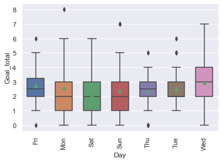
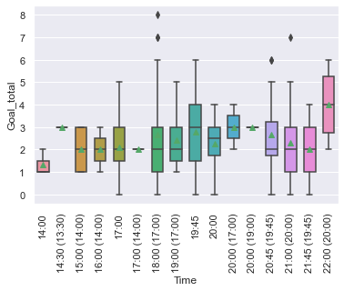
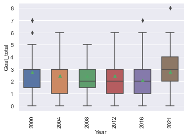
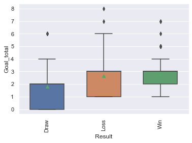
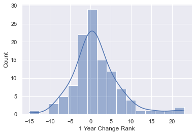

# Euro 2020 (2021) Predictions

<!-- Written report for this analysis can be found [here](../reports/boro_01_market_value.md) -->

## 1. Business Understanding

* Determine Busines Objectives
* Situation Assessment
* Determine Data Mining Goal
* Produce Project Plan

```
# 1. Predict results of every match at Euro 2020
# 2. Make predictions before each round of competition
# 3. Ideally, at each round, use the predictions to simulate remainder of competition
# 4. Check against other predictions and actual results
# 5. Write up process (report/blog)
```

## 2. Data Understanding

* Collect Initial Data
* Describe Data
* Explore Data
* Verify Data Quality

    2021-07-05 15:18:36,789 - INFO - Building master filepath for nations_matches
    2021-07-05 15:18:36,793 - INFO - Fetching C:\Users\adeacon\Documents\GitHub\the-ball-is-round\data\processed\ftb_nations_matches.txt
    2021-07-05 15:18:36,794 - INFO - Building master filepath for nations_matches
    


<div>
<style scoped>
    .dataframe tbody tr th:only-of-type {
        vertical-align: middle;
    }

    .dataframe tbody tr th {
        vertical-align: top;
    }

    .dataframe thead th {
        text-align: right;
    }
</style>
<table border="1" class="dataframe">
  <thead>
    <tr style="text-align: right;">
      <th></th>
      <th>count</th>
      <th>unique</th>
      <th>top</th>
      <th>freq</th>
      <th>mean</th>
      <th>std</th>
      <th>min</th>
      <th>25%</th>
      <th>50%</th>
      <th>75%</th>
      <th>max</th>
    </tr>
  </thead>
  <tbody>
    <tr>
      <th>Round</th>
      <td>225</td>
      <td>5</td>
      <td>Group stage</td>
      <td>168</td>
      <td>NaN</td>
      <td>NaN</td>
      <td>NaN</td>
      <td>NaN</td>
      <td>NaN</td>
      <td>NaN</td>
      <td>NaN</td>
    </tr>
    <tr>
      <th>Day</th>
      <td>225</td>
      <td>7</td>
      <td>Sun</td>
      <td>43</td>
      <td>NaN</td>
      <td>NaN</td>
      <td>NaN</td>
      <td>NaN</td>
      <td>NaN</td>
      <td>NaN</td>
      <td>NaN</td>
    </tr>
    <tr>
      <th>Date</th>
      <td>225</td>
      <td>118</td>
      <td>2016-06-22</td>
      <td>4</td>
      <td>NaN</td>
      <td>NaN</td>
      <td>NaN</td>
      <td>NaN</td>
      <td>NaN</td>
      <td>NaN</td>
      <td>NaN</td>
    </tr>
    <tr>
      <th>Time</th>
      <td>225</td>
      <td>16</td>
      <td>20:45 (19:45)</td>
      <td>52</td>
      <td>NaN</td>
      <td>NaN</td>
      <td>NaN</td>
      <td>NaN</td>
      <td>NaN</td>
      <td>NaN</td>
      <td>NaN</td>
    </tr>
    <tr>
      <th>Team_1</th>
      <td>225</td>
      <td>35</td>
      <td>Portugal</td>
      <td>16</td>
      <td>NaN</td>
      <td>NaN</td>
      <td>NaN</td>
      <td>NaN</td>
      <td>NaN</td>
      <td>NaN</td>
      <td>NaN</td>
    </tr>
    <tr>
      <th>Team_2</th>
      <td>225</td>
      <td>35</td>
      <td>Portugal</td>
      <td>15</td>
      <td>NaN</td>
      <td>NaN</td>
      <td>NaN</td>
      <td>NaN</td>
      <td>NaN</td>
      <td>NaN</td>
      <td>NaN</td>
    </tr>
    <tr>
      <th>Year</th>
      <td>225</td>
      <td>NaN</td>
      <td>NaN</td>
      <td>NaN</td>
      <td>2011.6</td>
      <td>7.25</td>
      <td>2000</td>
      <td>2004</td>
      <td>2012</td>
      <td>2016</td>
      <td>2021</td>
    </tr>
    <tr>
      <th>Goals_1</th>
      <td>223</td>
      <td>NaN</td>
      <td>NaN</td>
      <td>NaN</td>
      <td>1.41256</td>
      <td>1.3084</td>
      <td>0</td>
      <td>0</td>
      <td>1</td>
      <td>2</td>
      <td>6</td>
    </tr>
    <tr>
      <th>Goals_2</th>
      <td>223</td>
      <td>NaN</td>
      <td>NaN</td>
      <td>NaN</td>
      <td>1.22422</td>
      <td>1.11256</td>
      <td>0</td>
      <td>0</td>
      <td>1</td>
      <td>2</td>
      <td>5</td>
    </tr>
    <tr>
      <th>Goal_diff</th>
      <td>223</td>
      <td>NaN</td>
      <td>NaN</td>
      <td>NaN</td>
      <td>0.188341</td>
      <td>1.8085</td>
      <td>-5</td>
      <td>-1</td>
      <td>0</td>
      <td>1</td>
      <td>5</td>
    </tr>
    <tr>
      <th>Venue</th>
      <td>225</td>
      <td>60</td>
      <td>Ernst-Happel-Stadion</td>
      <td>7</td>
      <td>NaN</td>
      <td>NaN</td>
      <td>NaN</td>
      <td>NaN</td>
      <td>NaN</td>
      <td>NaN</td>
      <td>NaN</td>
    </tr>
    <tr>
      <th>Venue_country</th>
      <td>133</td>
      <td>11</td>
      <td>France</td>
      <td>45</td>
      <td>NaN</td>
      <td>NaN</td>
      <td>NaN</td>
      <td>NaN</td>
      <td>NaN</td>
      <td>NaN</td>
      <td>NaN</td>
    </tr>
    <tr>
      <th>Venue_city</th>
      <td>133</td>
      <td>34</td>
      <td>Vienna</td>
      <td>7</td>
      <td>NaN</td>
      <td>NaN</td>
      <td>NaN</td>
      <td>NaN</td>
      <td>NaN</td>
      <td>NaN</td>
      <td>NaN</td>
    </tr>
    <tr>
      <th>Home_1</th>
      <td>225</td>
      <td>NaN</td>
      <td>NaN</td>
      <td>NaN</td>
      <td>0.0755556</td>
      <td>0.264875</td>
      <td>0</td>
      <td>0</td>
      <td>0</td>
      <td>0</td>
      <td>1</td>
    </tr>
    <tr>
      <th>Home_2</th>
      <td>225</td>
      <td>NaN</td>
      <td>NaN</td>
      <td>NaN</td>
      <td>0.04</td>
      <td>0.196396</td>
      <td>0</td>
      <td>0</td>
      <td>0</td>
      <td>0</td>
      <td>1</td>
    </tr>
    <tr>
      <th>Goal_total</th>
      <td>223</td>
      <td>NaN</td>
      <td>NaN</td>
      <td>NaN</td>
      <td>2.63677</td>
      <td>1.62134</td>
      <td>0</td>
      <td>1</td>
      <td>2</td>
      <td>3</td>
      <td>8</td>
    </tr>
    <tr>
      <th>Result</th>
      <td>223</td>
      <td>3</td>
      <td>Win</td>
      <td>94</td>
      <td>NaN</td>
      <td>NaN</td>
      <td>NaN</td>
      <td>NaN</td>
      <td>NaN</td>
      <td>NaN</td>
      <td>NaN</td>
    </tr>
  </tbody>
</table>
</div>


    
    Goals_1
    
    


    

    


    
    --------------------
    
    Goals_2
    
    


    

    


    
    --------------------
    
    Goal_diff
    
    


    

    


    
    --------------------
    
    Goal_total
    
    


    

    


    
    --------------------
    

    
    Round
    
    Group stage       168
    Quarter-finals     24
    Round of 16        16
    Semi-finals        10
    Final               5
    Name: Round, dtype: int64
    


    

    


    
    --------------------
    
    Day
    
    Sun    43
    Sat    40
    Wed    34
    Mon    32
    Tue    28
    Fri    24
    Thu    22
    Name: Day, dtype: int64
    


    

    


    
    --------------------
    
    Time
    
    20:45 (19:45)    52
    18:00 (17:00)    48
    21:00 (20:00)    40
    19:45            23
    17:00            12
    21:45 (19:45)    11
    15:00 (14:00)    10
    19:00 (17:00)     7
    20:00             5
    22:00 (20:00)     4
    20:00 (17:00)     3
    14:00             3
    16:00 (14:00)     2
    20:00 (19:00)     1
    14:30 (13:30)     1
    17:00 (14:00)     1
    Name: Time, dtype: int64
    


    

    


    
    --------------------
    
    Year
    
    2016    51
    2021    48
    2012    31
    2008    31
    2004    31
    2000    31
    Name: Year, dtype: int64
    


    

    


    
    --------------------
    
    Venue_country
    
    NULL           92
    France         45
    Netherlands    16
    Ukraine        16
    Belgium        15
    Austria        13
    Switzerland    12
    Poland         11
    Germany         1
    Russia          1
    Italy           1
    Name: Venue_country, dtype: int64
    


    

    


    
    --------------------
    
    Result
    
    Win     94
    Loss    88
    Draw    41
    Name: Result, dtype: int64
    


    

    


    
    --------------------
    

    2021-07-05 15:18:38,733 - INFO - Building master filepath for nations_summaries
    2021-07-05 15:18:38,734 - INFO - Fetching C:\Users\adeacon\Documents\GitHub\the-ball-is-round\data\processed\ftb_nations_summaries.txt
    2021-07-05 15:18:38,734 - INFO - Building master filepath for nations_summaries
    


<div>
<style scoped>
    .dataframe tbody tr th:only-of-type {
        vertical-align: middle;
    }

    .dataframe tbody tr th {
        vertical-align: top;
    }

    .dataframe thead th {
        text-align: right;
    }
</style>
<table border="1" class="dataframe">
  <thead>
    <tr style="text-align: right;">
      <th></th>
      <th>count</th>
      <th>unique</th>
      <th>top</th>
      <th>freq</th>
      <th>mean</th>
      <th>std</th>
      <th>min</th>
      <th>25%</th>
      <th>50%</th>
      <th>75%</th>
      <th>max</th>
    </tr>
  </thead>
  <tbody>
    <tr>
      <th>Rank Local</th>
      <td>112</td>
      <td>NaN</td>
      <td>NaN</td>
      <td>NaN</td>
      <td>10.1964</td>
      <td>6.06398</td>
      <td>1</td>
      <td>5</td>
      <td>10</td>
      <td>14.25</td>
      <td>24</td>
    </tr>
    <tr>
      <th>Rank Global</th>
      <td>112</td>
      <td>NaN</td>
      <td>NaN</td>
      <td>NaN</td>
      <td>18.6964</td>
      <td>14.7769</td>
      <td>1</td>
      <td>8</td>
      <td>15</td>
      <td>26</td>
      <td>74</td>
    </tr>
    <tr>
      <th>Team</th>
      <td>112</td>
      <td>35</td>
      <td>Czech Republic</td>
      <td>6</td>
      <td>NaN</td>
      <td>NaN</td>
      <td>NaN</td>
      <td>NaN</td>
      <td>NaN</td>
      <td>NaN</td>
      <td>NaN</td>
    </tr>
    <tr>
      <th>Rating</th>
      <td>112</td>
      <td>NaN</td>
      <td>NaN</td>
      <td>NaN</td>
      <td>1856</td>
      <td>122.945</td>
      <td>1524</td>
      <td>1771.25</td>
      <td>1853</td>
      <td>1948.25</td>
      <td>2127</td>
    </tr>
    <tr>
      <th>Average Rank</th>
      <td>112</td>
      <td>NaN</td>
      <td>NaN</td>
      <td>NaN</td>
      <td>22.5268</td>
      <td>16.0921</td>
      <td>4</td>
      <td>11</td>
      <td>19</td>
      <td>27.25</td>
      <td>83</td>
    </tr>
    <tr>
      <th>Average Rating</th>
      <td>112</td>
      <td>NaN</td>
      <td>NaN</td>
      <td>NaN</td>
      <td>1769.49</td>
      <td>128.753</td>
      <td>1390</td>
      <td>1704.75</td>
      <td>1785.5</td>
      <td>1875.25</td>
      <td>1985</td>
    </tr>
    <tr>
      <th>1 Year Change Rank</th>
      <td>112</td>
      <td>NaN</td>
      <td>NaN</td>
      <td>NaN</td>
      <td>1.41071</td>
      <td>5.92073</td>
      <td>-15</td>
      <td>-2</td>
      <td>1</td>
      <td>4</td>
      <td>23</td>
    </tr>
    <tr>
      <th>1 Year Change Rating</th>
      <td>112</td>
      <td>NaN</td>
      <td>NaN</td>
      <td>NaN</td>
      <td>7.26786</td>
      <td>42.6667</td>
      <td>-92</td>
      <td>-24.25</td>
      <td>7.5</td>
      <td>35.25</td>
      <td>127</td>
    </tr>
    <tr>
      <th>Matches Total</th>
      <td>112</td>
      <td>NaN</td>
      <td>NaN</td>
      <td>NaN</td>
      <td>638.009</td>
      <td>214.417</td>
      <td>63</td>
      <td>537.25</td>
      <td>659.5</td>
      <td>787</td>
      <td>1073</td>
    </tr>
    <tr>
      <th>Matches Home</th>
      <td>112</td>
      <td>NaN</td>
      <td>NaN</td>
      <td>NaN</td>
      <td>285.482</td>
      <td>98.4145</td>
      <td>23</td>
      <td>223</td>
      <td>295</td>
      <td>360</td>
      <td>467</td>
    </tr>
    <tr>
      <th>Matches Away</th>
      <td>112</td>
      <td>NaN</td>
      <td>NaN</td>
      <td>NaN</td>
      <td>282.17</td>
      <td>99.397</td>
      <td>32</td>
      <td>223.25</td>
      <td>290.5</td>
      <td>344</td>
      <td>494</td>
    </tr>
    <tr>
      <th>Matches Neutral</th>
      <td>112</td>
      <td>NaN</td>
      <td>NaN</td>
      <td>NaN</td>
      <td>70.3571</td>
      <td>33.2126</td>
      <td>8</td>
      <td>44</td>
      <td>68</td>
      <td>94</td>
      <td>157</td>
    </tr>
    <tr>
      <th>Matches Wins</th>
      <td>112</td>
      <td>NaN</td>
      <td>NaN</td>
      <td>NaN</td>
      <td>298.768</td>
      <td>128.751</td>
      <td>21</td>
      <td>209</td>
      <td>303.5</td>
      <td>383.25</td>
      <td>628</td>
    </tr>
    <tr>
      <th>Matches Losses</th>
      <td>112</td>
      <td>NaN</td>
      <td>NaN</td>
      <td>NaN</td>
      <td>194.812</td>
      <td>74.8451</td>
      <td>26</td>
      <td>145</td>
      <td>193.5</td>
      <td>246.5</td>
      <td>410</td>
    </tr>
    <tr>
      <th>Matches Draws</th>
      <td>112</td>
      <td>NaN</td>
      <td>NaN</td>
      <td>NaN</td>
      <td>144.429</td>
      <td>45.8214</td>
      <td>16</td>
      <td>122.5</td>
      <td>148</td>
      <td>174</td>
      <td>244</td>
    </tr>
    <tr>
      <th>Goals For</th>
      <td>112</td>
      <td>NaN</td>
      <td>NaN</td>
      <td>NaN</td>
      <td>1157.33</td>
      <td>528.22</td>
      <td>83</td>
      <td>821.5</td>
      <td>1175</td>
      <td>1432</td>
      <td>2513</td>
    </tr>
    <tr>
      <th>Goals Against</th>
      <td>112</td>
      <td>NaN</td>
      <td>NaN</td>
      <td>NaN</td>
      <td>852.866</td>
      <td>323.145</td>
      <td>87</td>
      <td>638.25</td>
      <td>876.5</td>
      <td>1079.5</td>
      <td>1615</td>
    </tr>
    <tr>
      <th>Year</th>
      <td>112</td>
      <td>NaN</td>
      <td>NaN</td>
      <td>NaN</td>
      <td>2011.36</td>
      <td>7.26941</td>
      <td>2000</td>
      <td>2004</td>
      <td>2012</td>
      <td>2016</td>
      <td>2021</td>
    </tr>
    <tr>
      <th>Country</th>
      <td>112</td>
      <td>32</td>
      <td>United Kingdom</td>
      <td>9</td>
      <td>NaN</td>
      <td>NaN</td>
      <td>NaN</td>
      <td>NaN</td>
      <td>NaN</td>
      <td>NaN</td>
      <td>NaN</td>
    </tr>
    <tr>
      <th>Data Year</th>
      <td>112</td>
      <td>NaN</td>
      <td>NaN</td>
      <td>NaN</td>
      <td>2010.14</td>
      <td>6.98887</td>
      <td>1999</td>
      <td>2003</td>
      <td>2011</td>
      <td>2015</td>
      <td>2019</td>
    </tr>
    <tr>
      <th>GDP (PPP)</th>
      <td>112</td>
      <td>NaN</td>
      <td>NaN</td>
      <td>NaN</td>
      <td>1.19252e+06</td>
      <td>1.19294e+06</td>
      <td>16865.3</td>
      <td>313922</td>
      <td>545971</td>
      <td>2.083e+06</td>
      <td>4.30886e+06</td>
    </tr>
    <tr>
      <th>Population</th>
      <td>112</td>
      <td>NaN</td>
      <td>NaN</td>
      <td>NaN</td>
      <td>35.3018</td>
      <td>35.5946</td>
      <td>0.330243</td>
      <td>8.82449</td>
      <td>16.0182</td>
      <td>60.5572</td>
      <td>145.872</td>
    </tr>
    <tr>
      <th>GDP (PPP) Per Capita</th>
      <td>112</td>
      <td>NaN</td>
      <td>NaN</td>
      <td>NaN</td>
      <td>35377</td>
      <td>13683</td>
      <td>7493.28</td>
      <td>26531.8</td>
      <td>35891.7</td>
      <td>44947.3</td>
      <td>75574.7</td>
    </tr>
  </tbody>
</table>
</div>


    
    Rating
    
    


    

    


    
    --------------------
    
    Average Rank
    
    


    

    


    
    --------------------
    
    Average Rating
    
    


    

    


    
    --------------------
    
    1 Year Change Rank
    
    


    

    


    
    --------------------
    
    1 Year Change Rating
    
    


    

    


    
    --------------------
    
    Matches Total
    
    


    

    


    
    --------------------
    
    Matches Home
    
    


    

    


    
    --------------------
    
    Matches Away
    
    


    

    


    
    --------------------
    
    Matches Neutral
    
    


    

    


    
    --------------------
    
    Matches Wins
    
    


    

    


    
    --------------------
    
    Matches Losses
    
    


    

    


    
    --------------------
    
    Matches Draws
    
    


    

    


    
    --------------------
    
    Goals For
    
    


    

    


    
    --------------------
    
    Goals Against
    
    


    

    


    
    --------------------
    
    GDP (PPP)
    
    


    

    


    
    --------------------
    
    Population
    
    


    

    


    
    --------------------
    
    GDP (PPP) Per Capita
    
    


    

    


    
    --------------------
    

## 3. Data Preperation

* Select Data
* Clean Data
* Construct Data
* Integrate Data
* Format Data


<div>
<style scoped>
    .dataframe tbody tr th:only-of-type {
        vertical-align: middle;
    }

    .dataframe tbody tr th {
        vertical-align: top;
    }

    .dataframe thead th {
        text-align: right;
    }
</style>
<table border="1" class="dataframe">
  <thead>
    <tr style="text-align: right;">
      <th></th>
      <th>count</th>
      <th>mean</th>
      <th>std</th>
      <th>min</th>
      <th>25%</th>
      <th>50%</th>
      <th>75%</th>
      <th>max</th>
    </tr>
  </thead>
  <tbody>
    <tr>
      <th>Year</th>
      <td>225.0</td>
      <td>2.011600e+03</td>
      <td>7.250000e+00</td>
      <td>2000.000000</td>
      <td>2004.000000</td>
      <td>2012.000000</td>
      <td>2.016000e+03</td>
      <td>2.021000e+03</td>
    </tr>
    <tr>
      <th>Goals_1</th>
      <td>223.0</td>
      <td>1.412556e+00</td>
      <td>1.308401e+00</td>
      <td>0.000000</td>
      <td>0.000000</td>
      <td>1.000000</td>
      <td>2.000000e+00</td>
      <td>6.000000e+00</td>
    </tr>
    <tr>
      <th>Goals_2</th>
      <td>223.0</td>
      <td>1.224215e+00</td>
      <td>1.112560e+00</td>
      <td>0.000000</td>
      <td>0.000000</td>
      <td>1.000000</td>
      <td>2.000000e+00</td>
      <td>5.000000e+00</td>
    </tr>
    <tr>
      <th>Goal_diff</th>
      <td>223.0</td>
      <td>1.883408e-01</td>
      <td>1.808501e+00</td>
      <td>-5.000000</td>
      <td>-1.000000</td>
      <td>0.000000</td>
      <td>1.000000e+00</td>
      <td>5.000000e+00</td>
    </tr>
    <tr>
      <th>Home_1</th>
      <td>225.0</td>
      <td>7.555556e-02</td>
      <td>2.648749e-01</td>
      <td>0.000000</td>
      <td>0.000000</td>
      <td>0.000000</td>
      <td>0.000000e+00</td>
      <td>1.000000e+00</td>
    </tr>
    <tr>
      <th>Home_2</th>
      <td>225.0</td>
      <td>4.000000e-02</td>
      <td>1.963961e-01</td>
      <td>0.000000</td>
      <td>0.000000</td>
      <td>0.000000</td>
      <td>0.000000e+00</td>
      <td>1.000000e+00</td>
    </tr>
    <tr>
      <th>Goal_total</th>
      <td>223.0</td>
      <td>2.636771e+00</td>
      <td>1.621336e+00</td>
      <td>0.000000</td>
      <td>1.000000</td>
      <td>2.000000</td>
      <td>3.000000e+00</td>
      <td>8.000000e+00</td>
    </tr>
    <tr>
      <th>Rank Local</th>
      <td>225.0</td>
      <td>9.226667e+00</td>
      <td>5.919640e+00</td>
      <td>1.000000</td>
      <td>4.000000</td>
      <td>8.000000</td>
      <td>1.300000e+01</td>
      <td>2.400000e+01</td>
    </tr>
    <tr>
      <th>Rank Global</th>
      <td>225.0</td>
      <td>1.676444e+01</td>
      <td>1.406244e+01</td>
      <td>1.000000</td>
      <td>7.000000</td>
      <td>13.000000</td>
      <td>2.200000e+01</td>
      <td>7.400000e+01</td>
    </tr>
    <tr>
      <th>Rating</th>
      <td>225.0</td>
      <td>1.876053e+03</td>
      <td>1.244909e+02</td>
      <td>1524.000000</td>
      <td>1788.000000</td>
      <td>1875.000000</td>
      <td>1.972000e+03</td>
      <td>2.127000e+03</td>
    </tr>
    <tr>
      <th>Average Rank</th>
      <td>225.0</td>
      <td>2.082222e+01</td>
      <td>1.501055e+01</td>
      <td>4.000000</td>
      <td>8.000000</td>
      <td>18.000000</td>
      <td>2.400000e+01</td>
      <td>8.300000e+01</td>
    </tr>
    <tr>
      <th>Average Rating</th>
      <td>225.0</td>
      <td>1.783693e+03</td>
      <td>1.253566e+02</td>
      <td>1390.000000</td>
      <td>1721.000000</td>
      <td>1792.000000</td>
      <td>1.890000e+03</td>
      <td>1.985000e+03</td>
    </tr>
    <tr>
      <th>1 Year Change Rank</th>
      <td>225.0</td>
      <td>1.004444e+00</td>
      <td>5.161238e+00</td>
      <td>-15.000000</td>
      <td>-2.000000</td>
      <td>0.000000</td>
      <td>3.000000e+00</td>
      <td>2.300000e+01</td>
    </tr>
    <tr>
      <th>1 Year Change Rating</th>
      <td>225.0</td>
      <td>3.657778e+00</td>
      <td>4.307969e+01</td>
      <td>-92.000000</td>
      <td>-26.000000</td>
      <td>4.000000</td>
      <td>3.500000e+01</td>
      <td>1.270000e+02</td>
    </tr>
    <tr>
      <th>Matches Total</th>
      <td>225.0</td>
      <td>6.505733e+02</td>
      <td>2.154005e+02</td>
      <td>63.000000</td>
      <td>554.000000</td>
      <td>674.000000</td>
      <td>8.030000e+02</td>
      <td>1.073000e+03</td>
    </tr>
    <tr>
      <th>Matches Home</th>
      <td>225.0</td>
      <td>2.928044e+02</td>
      <td>9.788617e+01</td>
      <td>23.000000</td>
      <td>232.000000</td>
      <td>300.000000</td>
      <td>3.720000e+02</td>
      <td>4.670000e+02</td>
    </tr>
    <tr>
      <th>Matches Away</th>
      <td>225.0</td>
      <td>2.838622e+02</td>
      <td>9.970530e+01</td>
      <td>32.000000</td>
      <td>218.000000</td>
      <td>295.000000</td>
      <td>3.470000e+02</td>
      <td>4.940000e+02</td>
    </tr>
    <tr>
      <th>Matches Neutral</th>
      <td>225.0</td>
      <td>7.390667e+01</td>
      <td>3.467032e+01</td>
      <td>8.000000</td>
      <td>47.000000</td>
      <td>70.000000</td>
      <td>9.500000e+01</td>
      <td>1.570000e+02</td>
    </tr>
    <tr>
      <th>Matches Wins</th>
      <td>225.0</td>
      <td>3.101556e+02</td>
      <td>1.321356e+02</td>
      <td>21.000000</td>
      <td>211.000000</td>
      <td>306.000000</td>
      <td>3.900000e+02</td>
      <td>6.280000e+02</td>
    </tr>
    <tr>
      <th>Matches Losses</th>
      <td>225.0</td>
      <td>1.935067e+02</td>
      <td>7.436818e+01</td>
      <td>26.000000</td>
      <td>145.000000</td>
      <td>190.000000</td>
      <td>2.460000e+02</td>
      <td>4.100000e+02</td>
    </tr>
    <tr>
      <th>Matches Draws</th>
      <td>225.0</td>
      <td>1.469111e+02</td>
      <td>4.629825e+01</td>
      <td>16.000000</td>
      <td>121.000000</td>
      <td>148.000000</td>
      <td>1.770000e+02</td>
      <td>2.440000e+02</td>
    </tr>
    <tr>
      <th>Goals For</th>
      <td>225.0</td>
      <td>1.196271e+03</td>
      <td>5.399309e+02</td>
      <td>83.000000</td>
      <td>844.000000</td>
      <td>1195.000000</td>
      <td>1.452000e+03</td>
      <td>2.513000e+03</td>
    </tr>
    <tr>
      <th>Goals Against</th>
      <td>225.0</td>
      <td>8.568800e+02</td>
      <td>3.196173e+02</td>
      <td>87.000000</td>
      <td>633.000000</td>
      <td>895.000000</td>
      <td>1.077000e+03</td>
      <td>1.615000e+03</td>
    </tr>
    <tr>
      <th>Data Year</th>
      <td>225.0</td>
      <td>2.010378e+03</td>
      <td>6.967043e+00</td>
      <td>1999.000000</td>
      <td>2003.000000</td>
      <td>2011.000000</td>
      <td>2.015000e+03</td>
      <td>2.019000e+03</td>
    </tr>
    <tr>
      <th>GDP (PPP)</th>
      <td>225.0</td>
      <td>1.282387e+06</td>
      <td>1.196457e+06</td>
      <td>16865.345703</td>
      <td>319420.843750</td>
      <td>617131.812500</td>
      <td>2.227538e+06</td>
      <td>4.308862e+06</td>
    </tr>
    <tr>
      <th>Population</th>
      <td>225.0</td>
      <td>3.667792e+01</td>
      <td>3.399079e+01</td>
      <td>0.330243</td>
      <td>9.684679</td>
      <td>17.097130</td>
      <td>6.057849e+01</td>
      <td>1.458723e+02</td>
    </tr>
    <tr>
      <th>GDP (PPP) Per Capita</th>
      <td>225.0</td>
      <td>3.631093e+04</td>
      <td>1.306118e+04</td>
      <td>7493.284135</td>
      <td>27512.020377</td>
      <td>36533.876382</td>
      <td>4.570633e+04</td>
      <td>7.557470e+04</td>
    </tr>
    <tr>
      <th>Rank Local (2)</th>
      <td>225.0</td>
      <td>9.911111e+00</td>
      <td>6.109208e+00</td>
      <td>1.000000</td>
      <td>5.000000</td>
      <td>9.000000</td>
      <td>1.400000e+01</td>
      <td>2.400000e+01</td>
    </tr>
    <tr>
      <th>Rank Global (2)</th>
      <td>225.0</td>
      <td>1.782222e+01</td>
      <td>1.426392e+01</td>
      <td>1.000000</td>
      <td>7.000000</td>
      <td>14.000000</td>
      <td>2.400000e+01</td>
      <td>7.400000e+01</td>
    </tr>
    <tr>
      <th>Rating (2)</th>
      <td>225.0</td>
      <td>1.863089e+03</td>
      <td>1.209689e+02</td>
      <td>1524.000000</td>
      <td>1777.000000</td>
      <td>1867.000000</td>
      <td>1.960000e+03</td>
      <td>2.127000e+03</td>
    </tr>
    <tr>
      <th>Average Rank (2)</th>
      <td>225.0</td>
      <td>2.236444e+01</td>
      <td>1.620628e+01</td>
      <td>4.000000</td>
      <td>11.000000</td>
      <td>19.000000</td>
      <td>2.700000e+01</td>
      <td>8.300000e+01</td>
    </tr>
    <tr>
      <th>Average Rating (2)</th>
      <td>225.0</td>
      <td>1.769596e+03</td>
      <td>1.299477e+02</td>
      <td>1390.000000</td>
      <td>1704.000000</td>
      <td>1779.000000</td>
      <td>1.879000e+03</td>
      <td>1.985000e+03</td>
    </tr>
    <tr>
      <th>1 Year Change Rank (2)</th>
      <td>225.0</td>
      <td>1.466667e+00</td>
      <td>5.751553e+00</td>
      <td>-15.000000</td>
      <td>-1.000000</td>
      <td>1.000000</td>
      <td>3.000000e+00</td>
      <td>2.300000e+01</td>
    </tr>
    <tr>
      <th>1 Year Change Rating (2)</th>
      <td>225.0</td>
      <td>8.288889e+00</td>
      <td>4.109366e+01</td>
      <td>-92.000000</td>
      <td>-21.000000</td>
      <td>8.000000</td>
      <td>3.500000e+01</td>
      <td>1.270000e+02</td>
    </tr>
    <tr>
      <th>Matches Total (2)</th>
      <td>225.0</td>
      <td>6.386800e+02</td>
      <td>2.026733e+02</td>
      <td>63.000000</td>
      <td>523.000000</td>
      <td>640.000000</td>
      <td>8.010000e+02</td>
      <td>1.073000e+03</td>
    </tr>
    <tr>
      <th>Matches Home (2)</th>
      <td>225.0</td>
      <td>2.870444e+02</td>
      <td>9.386302e+01</td>
      <td>23.000000</td>
      <td>224.000000</td>
      <td>295.000000</td>
      <td>3.630000e+02</td>
      <td>4.670000e+02</td>
    </tr>
    <tr>
      <th>Matches Away (2)</th>
      <td>225.0</td>
      <td>2.804756e+02</td>
      <td>9.316571e+01</td>
      <td>32.000000</td>
      <td>218.000000</td>
      <td>283.000000</td>
      <td>3.430000e+02</td>
      <td>4.940000e+02</td>
    </tr>
    <tr>
      <th>Matches Neutral (2)</th>
      <td>225.0</td>
      <td>7.116000e+01</td>
      <td>3.338816e+01</td>
      <td>8.000000</td>
      <td>46.000000</td>
      <td>68.000000</td>
      <td>9.400000e+01</td>
      <td>1.570000e+02</td>
    </tr>
    <tr>
      <th>Matches Wins (2)</th>
      <td>225.0</td>
      <td>2.991511e+02</td>
      <td>1.244206e+02</td>
      <td>21.000000</td>
      <td>209.000000</td>
      <td>303.000000</td>
      <td>3.840000e+02</td>
      <td>6.280000e+02</td>
    </tr>
    <tr>
      <th>Matches Losses (2)</th>
      <td>225.0</td>
      <td>1.944711e+02</td>
      <td>7.037781e+01</td>
      <td>26.000000</td>
      <td>145.000000</td>
      <td>188.000000</td>
      <td>2.460000e+02</td>
      <td>4.100000e+02</td>
    </tr>
    <tr>
      <th>Matches Draws (2)</th>
      <td>225.0</td>
      <td>1.450578e+02</td>
      <td>4.366329e+01</td>
      <td>16.000000</td>
      <td>123.000000</td>
      <td>148.000000</td>
      <td>1.740000e+02</td>
      <td>2.440000e+02</td>
    </tr>
    <tr>
      <th>Goals For (2)</th>
      <td>225.0</td>
      <td>1.149769e+03</td>
      <td>5.051272e+02</td>
      <td>83.000000</td>
      <td>824.000000</td>
      <td>1195.000000</td>
      <td>1.431000e+03</td>
      <td>2.513000e+03</td>
    </tr>
    <tr>
      <th>Goals Against (2)</th>
      <td>225.0</td>
      <td>8.488222e+02</td>
      <td>3.033814e+02</td>
      <td>87.000000</td>
      <td>644.000000</td>
      <td>852.000000</td>
      <td>1.077000e+03</td>
      <td>1.615000e+03</td>
    </tr>
    <tr>
      <th>Data Year (2)</th>
      <td>225.0</td>
      <td>2.010378e+03</td>
      <td>6.967043e+00</td>
      <td>1999.000000</td>
      <td>2003.000000</td>
      <td>2011.000000</td>
      <td>2.015000e+03</td>
      <td>2.019000e+03</td>
    </tr>
    <tr>
      <th>GDP (PPP) (2)</th>
      <td>225.0</td>
      <td>1.247652e+06</td>
      <td>1.203656e+06</td>
      <td>16865.345703</td>
      <td>314019.625000</td>
      <td>562544.187500</td>
      <td>2.232518e+06</td>
      <td>4.308862e+06</td>
    </tr>
    <tr>
      <th>Population (2)</th>
      <td>225.0</td>
      <td>3.595996e+01</td>
      <td>3.469816e+01</td>
      <td>0.330243</td>
      <td>8.955102</td>
      <td>16.200951</td>
      <td>6.057849e+01</td>
      <td>1.458723e+02</td>
    </tr>
    <tr>
      <th>GDP (PPP) Per Capita (2)</th>
      <td>225.0</td>
      <td>3.578581e+04</td>
      <td>1.369129e+04</td>
      <td>7493.284135</td>
      <td>27503.425456</td>
      <td>37019.891294</td>
      <td>4.423183e+04</td>
      <td>7.557470e+04</td>
    </tr>
    <tr>
      <th>Elo_rating_diff</th>
      <td>225.0</td>
      <td>1.296444e+01</td>
      <td>1.740637e+02</td>
      <td>-411.000000</td>
      <td>-103.000000</td>
      <td>18.000000</td>
      <td>1.480000e+02</td>
      <td>4.440000e+02</td>
    </tr>
    <tr>
      <th>Home_advantage</th>
      <td>225.0</td>
      <td>3.555556e-02</td>
      <td>3.388238e-01</td>
      <td>-1.000000</td>
      <td>0.000000</td>
      <td>0.000000</td>
      <td>0.000000e+00</td>
      <td>1.000000e+00</td>
    </tr>
    <tr>
      <th>Relative_experience</th>
      <td>225.0</td>
      <td>1.228449e+00</td>
      <td>9.461578e-01</td>
      <td>0.103110</td>
      <td>0.785036</td>
      <td>1.019656</td>
      <td>1.334940e+00</td>
      <td>9.095238e+00</td>
    </tr>
    <tr>
      <th>Relative_population</th>
      <td>225.0</td>
      <td>4.960909e+00</td>
      <td>1.924647e+01</td>
      <td>0.028253</td>
      <td>0.264898</td>
      <td>1.043332</td>
      <td>4.084184e+00</td>
      <td>2.016585e+02</td>
    </tr>
    <tr>
      <th>Relative_GDP_per_capita</th>
      <td>225.0</td>
      <td>1.268648e+00</td>
      <td>9.620311e-01</td>
      <td>0.163999</td>
      <td>0.708016</td>
      <td>0.945984</td>
      <td>1.528608e+00</td>
      <td>5.480461e+00</td>
    </tr>
    <tr>
      <th>Relative_ELO_rating</th>
      <td>225.0</td>
      <td>1.011311e+00</td>
      <td>9.500221e-02</td>
      <td>0.798034</td>
      <td>0.942802</td>
      <td>1.008974</td>
      <td>1.081712e+00</td>
      <td>1.291339e+00</td>
    </tr>
  </tbody>
</table>
</div>


<style  type="text/css" >
#T_e6ab2158_dd9b_11eb_8cbc_74d83eb26131row0_col0,#T_e6ab2158_dd9b_11eb_8cbc_74d83eb26131row1_col1,#T_e6ab2158_dd9b_11eb_8cbc_74d83eb26131row2_col2,#T_e6ab2158_dd9b_11eb_8cbc_74d83eb26131row3_col3,#T_e6ab2158_dd9b_11eb_8cbc_74d83eb26131row4_col4,#T_e6ab2158_dd9b_11eb_8cbc_74d83eb26131row5_col5,#T_e6ab2158_dd9b_11eb_8cbc_74d83eb26131row6_col6,#T_e6ab2158_dd9b_11eb_8cbc_74d83eb26131row6_col11,#T_e6ab2158_dd9b_11eb_8cbc_74d83eb26131row7_col7,#T_e6ab2158_dd9b_11eb_8cbc_74d83eb26131row8_col8,#T_e6ab2158_dd9b_11eb_8cbc_74d83eb26131row9_col9,#T_e6ab2158_dd9b_11eb_8cbc_74d83eb26131row10_col10,#T_e6ab2158_dd9b_11eb_8cbc_74d83eb26131row11_col6,#T_e6ab2158_dd9b_11eb_8cbc_74d83eb26131row11_col11{
            background-color:  #b40426;
            color:  #f1f1f1;
        }#T_e6ab2158_dd9b_11eb_8cbc_74d83eb26131row0_col1,#T_e6ab2158_dd9b_11eb_8cbc_74d83eb26131row6_col7,#T_e6ab2158_dd9b_11eb_8cbc_74d83eb26131row11_col7{
            background-color:  #aec9fc;
            color:  #000000;
        }#T_e6ab2158_dd9b_11eb_8cbc_74d83eb26131row0_col2{
            background-color:  #dd5f4b;
            color:  #000000;
        }#T_e6ab2158_dd9b_11eb_8cbc_74d83eb26131row0_col3,#T_e6ab2158_dd9b_11eb_8cbc_74d83eb26131row4_col10{
            background-color:  #6384eb;
            color:  #000000;
        }#T_e6ab2158_dd9b_11eb_8cbc_74d83eb26131row0_col4{
            background-color:  #b9d0f9;
            color:  #000000;
        }#T_e6ab2158_dd9b_11eb_8cbc_74d83eb26131row0_col5{
            background-color:  #f4987a;
            color:  #000000;
        }#T_e6ab2158_dd9b_11eb_8cbc_74d83eb26131row0_col6{
            background-color:  #cfdaea;
            color:  #000000;
        }#T_e6ab2158_dd9b_11eb_8cbc_74d83eb26131row0_col7,#T_e6ab2158_dd9b_11eb_8cbc_74d83eb26131row10_col6{
            background-color:  #c4d5f3;
            color:  #000000;
        }#T_e6ab2158_dd9b_11eb_8cbc_74d83eb26131row0_col8{
            background-color:  #5f7fe8;
            color:  #000000;
        }#T_e6ab2158_dd9b_11eb_8cbc_74d83eb26131row0_col9,#T_e6ab2158_dd9b_11eb_8cbc_74d83eb26131row7_col9{
            background-color:  #7295f4;
            color:  #000000;
        }#T_e6ab2158_dd9b_11eb_8cbc_74d83eb26131row0_col10,#T_e6ab2158_dd9b_11eb_8cbc_74d83eb26131row11_col9{
            background-color:  #94b6ff;
            color:  #000000;
        }#T_e6ab2158_dd9b_11eb_8cbc_74d83eb26131row0_col11,#T_e6ab2158_dd9b_11eb_8cbc_74d83eb26131row3_col2,#T_e6ab2158_dd9b_11eb_8cbc_74d83eb26131row4_col2{
            background-color:  #cdd9ec;
            color:  #000000;
        }#T_e6ab2158_dd9b_11eb_8cbc_74d83eb26131row1_col0,#T_e6ab2158_dd9b_11eb_8cbc_74d83eb26131row1_col2,#T_e6ab2158_dd9b_11eb_8cbc_74d83eb26131row1_col6,#T_e6ab2158_dd9b_11eb_8cbc_74d83eb26131row1_col8,#T_e6ab2158_dd9b_11eb_8cbc_74d83eb26131row1_col10,#T_e6ab2158_dd9b_11eb_8cbc_74d83eb26131row1_col11,#T_e6ab2158_dd9b_11eb_8cbc_74d83eb26131row2_col1,#T_e6ab2158_dd9b_11eb_8cbc_74d83eb26131row4_col5,#T_e6ab2158_dd9b_11eb_8cbc_74d83eb26131row4_col7,#T_e6ab2158_dd9b_11eb_8cbc_74d83eb26131row7_col4,#T_e6ab2158_dd9b_11eb_8cbc_74d83eb26131row10_col9,#T_e6ab2158_dd9b_11eb_8cbc_74d83eb26131row11_col3{
            background-color:  #3b4cc0;
            color:  #f1f1f1;
        }#T_e6ab2158_dd9b_11eb_8cbc_74d83eb26131row1_col3{
            background-color:  #4a63d3;
            color:  #f1f1f1;
        }#T_e6ab2158_dd9b_11eb_8cbc_74d83eb26131row1_col4,#T_e6ab2158_dd9b_11eb_8cbc_74d83eb26131row10_col1{
            background-color:  #a6c4fe;
            color:  #000000;
        }#T_e6ab2158_dd9b_11eb_8cbc_74d83eb26131row1_col5{
            background-color:  #f5c4ac;
            color:  #000000;
        }#T_e6ab2158_dd9b_11eb_8cbc_74d83eb26131row1_col7,#T_e6ab2158_dd9b_11eb_8cbc_74d83eb26131row8_col4,#T_e6ab2158_dd9b_11eb_8cbc_74d83eb26131row10_col8,#T_e6ab2158_dd9b_11eb_8cbc_74d83eb26131row10_col11{
            background-color:  #c1d4f4;
            color:  #000000;
        }#T_e6ab2158_dd9b_11eb_8cbc_74d83eb26131row1_col9{
            background-color:  #5a78e4;
            color:  #000000;
        }#T_e6ab2158_dd9b_11eb_8cbc_74d83eb26131row2_col0{
            background-color:  #ec7f63;
            color:  #000000;
        }#T_e6ab2158_dd9b_11eb_8cbc_74d83eb26131row2_col3{
            background-color:  #6788ee;
            color:  #000000;
        }#T_e6ab2158_dd9b_11eb_8cbc_74d83eb26131row2_col4,#T_e6ab2158_dd9b_11eb_8cbc_74d83eb26131row5_col7{
            background-color:  #c6d6f1;
            color:  #000000;
        }#T_e6ab2158_dd9b_11eb_8cbc_74d83eb26131row2_col5,#T_e6ab2158_dd9b_11eb_8cbc_74d83eb26131row4_col6{
            background-color:  #84a7fc;
            color:  #000000;
        }#T_e6ab2158_dd9b_11eb_8cbc_74d83eb26131row2_col6{
            background-color:  #e6d7cf;
            color:  #000000;
        }#T_e6ab2158_dd9b_11eb_8cbc_74d83eb26131row2_col7{
            background-color:  #bed2f6;
            color:  #000000;
        }#T_e6ab2158_dd9b_11eb_8cbc_74d83eb26131row2_col8,#T_e6ab2158_dd9b_11eb_8cbc_74d83eb26131row7_col5{
            background-color:  #6282ea;
            color:  #000000;
        }#T_e6ab2158_dd9b_11eb_8cbc_74d83eb26131row2_col9{
            background-color:  #5d7ce6;
            color:  #000000;
        }#T_e6ab2158_dd9b_11eb_8cbc_74d83eb26131row2_col10{
            background-color:  #a3c2fe;
            color:  #000000;
        }#T_e6ab2158_dd9b_11eb_8cbc_74d83eb26131row2_col11{
            background-color:  #e4d9d2;
            color:  #000000;
        }#T_e6ab2158_dd9b_11eb_8cbc_74d83eb26131row3_col0,#T_e6ab2158_dd9b_11eb_8cbc_74d83eb26131row7_col0{
            background-color:  #6687ed;
            color:  #000000;
        }#T_e6ab2158_dd9b_11eb_8cbc_74d83eb26131row3_col1,#T_e6ab2158_dd9b_11eb_8cbc_74d83eb26131row10_col4{
            background-color:  #bbd1f8;
            color:  #000000;
        }#T_e6ab2158_dd9b_11eb_8cbc_74d83eb26131row3_col4,#T_e6ab2158_dd9b_11eb_8cbc_74d83eb26131row4_col1,#T_e6ab2158_dd9b_11eb_8cbc_74d83eb26131row6_col0,#T_e6ab2158_dd9b_11eb_8cbc_74d83eb26131row11_col0{
            background-color:  #afcafc;
            color:  #000000;
        }#T_e6ab2158_dd9b_11eb_8cbc_74d83eb26131row3_col5,#T_e6ab2158_dd9b_11eb_8cbc_74d83eb26131row9_col10{
            background-color:  #5470de;
            color:  #000000;
        }#T_e6ab2158_dd9b_11eb_8cbc_74d83eb26131row3_col6,#T_e6ab2158_dd9b_11eb_8cbc_74d83eb26131row8_col0{
            background-color:  #6f92f3;
            color:  #000000;
        }#T_e6ab2158_dd9b_11eb_8cbc_74d83eb26131row3_col7{
            background-color:  #da5a49;
            color:  #000000;
        }#T_e6ab2158_dd9b_11eb_8cbc_74d83eb26131row3_col8{
            background-color:  #4961d2;
            color:  #f1f1f1;
        }#T_e6ab2158_dd9b_11eb_8cbc_74d83eb26131row3_col9,#T_e6ab2158_dd9b_11eb_8cbc_74d83eb26131row7_col6{
            background-color:  #779af7;
            color:  #000000;
        }#T_e6ab2158_dd9b_11eb_8cbc_74d83eb26131row3_col10,#T_e6ab2158_dd9b_11eb_8cbc_74d83eb26131row9_col3{
            background-color:  #82a6fb;
            color:  #000000;
        }#T_e6ab2158_dd9b_11eb_8cbc_74d83eb26131row3_col11{
            background-color:  #6c8ff1;
            color:  #000000;
        }#T_e6ab2158_dd9b_11eb_8cbc_74d83eb26131row4_col0,#T_e6ab2158_dd9b_11eb_8cbc_74d83eb26131row6_col5,#T_e6ab2158_dd9b_11eb_8cbc_74d83eb26131row11_col5{
            background-color:  #5572df;
            color:  #000000;
        }#T_e6ab2158_dd9b_11eb_8cbc_74d83eb26131row4_col3{
            background-color:  #455cce;
            color:  #f1f1f1;
        }#T_e6ab2158_dd9b_11eb_8cbc_74d83eb26131row4_col8{
            background-color:  #516ddb;
            color:  #000000;
        }#T_e6ab2158_dd9b_11eb_8cbc_74d83eb26131row4_col9,#T_e6ab2158_dd9b_11eb_8cbc_74d83eb26131row7_col8{
            background-color:  #4358cb;
            color:  #f1f1f1;
        }#T_e6ab2158_dd9b_11eb_8cbc_74d83eb26131row4_col11{
            background-color:  #81a4fb;
            color:  #000000;
        }#T_e6ab2158_dd9b_11eb_8cbc_74d83eb26131row5_col0{
            background-color:  #f39577;
            color:  #000000;
        }#T_e6ab2158_dd9b_11eb_8cbc_74d83eb26131row5_col1{
            background-color:  #f39475;
            color:  #000000;
        }#T_e6ab2158_dd9b_11eb_8cbc_74d83eb26131row5_col2{
            background-color:  #dedcdb;
            color:  #000000;
        }#T_e6ab2158_dd9b_11eb_8cbc_74d83eb26131row5_col3{
            background-color:  #5875e1;
            color:  #000000;
        }#T_e6ab2158_dd9b_11eb_8cbc_74d83eb26131row5_col4{
            background-color:  #aac7fd;
            color:  #000000;
        }#T_e6ab2158_dd9b_11eb_8cbc_74d83eb26131row5_col6,#T_e6ab2158_dd9b_11eb_8cbc_74d83eb26131row5_col11,#T_e6ab2158_dd9b_11eb_8cbc_74d83eb26131row10_col0{
            background-color:  #8badfd;
            color:  #000000;
        }#T_e6ab2158_dd9b_11eb_8cbc_74d83eb26131row5_col8{
            background-color:  #506bda;
            color:  #000000;
        }#T_e6ab2158_dd9b_11eb_8cbc_74d83eb26131row5_col9{
            background-color:  #7699f6;
            color:  #000000;
        }#T_e6ab2158_dd9b_11eb_8cbc_74d83eb26131row5_col10{
            background-color:  #6b8df0;
            color:  #000000;
        }#T_e6ab2158_dd9b_11eb_8cbc_74d83eb26131row6_col1{
            background-color:  #85a8fc;
            color:  #000000;
        }#T_e6ab2158_dd9b_11eb_8cbc_74d83eb26131row6_col2{
            background-color:  #f6bfa6;
            color:  #000000;
        }#T_e6ab2158_dd9b_11eb_8cbc_74d83eb26131row6_col3{
            background-color:  #3c4ec2;
            color:  #f1f1f1;
        }#T_e6ab2158_dd9b_11eb_8cbc_74d83eb26131row6_col4,#T_e6ab2158_dd9b_11eb_8cbc_74d83eb26131row8_col7,#T_e6ab2158_dd9b_11eb_8cbc_74d83eb26131row11_col4{
            background-color:  #b7cff9;
            color:  #000000;
        }#T_e6ab2158_dd9b_11eb_8cbc_74d83eb26131row6_col8,#T_e6ab2158_dd9b_11eb_8cbc_74d83eb26131row11_col10{
            background-color:  #a7c5fe;
            color:  #000000;
        }#T_e6ab2158_dd9b_11eb_8cbc_74d83eb26131row6_col9{
            background-color:  #90b2fe;
            color:  #000000;
        }#T_e6ab2158_dd9b_11eb_8cbc_74d83eb26131row6_col10{
            background-color:  #a9c6fd;
            color:  #000000;
        }#T_e6ab2158_dd9b_11eb_8cbc_74d83eb26131row7_col1{
            background-color:  #c9d7f0;
            color:  #000000;
        }#T_e6ab2158_dd9b_11eb_8cbc_74d83eb26131row7_col2{
            background-color:  #c5d6f2;
            color:  #000000;
        }#T_e6ab2158_dd9b_11eb_8cbc_74d83eb26131row7_col3{
            background-color:  #e7745b;
            color:  #000000;
        }#T_e6ab2158_dd9b_11eb_8cbc_74d83eb26131row7_col10,#T_e6ab2158_dd9b_11eb_8cbc_74d83eb26131row8_col9,#T_e6ab2158_dd9b_11eb_8cbc_74d83eb26131row9_col5{
            background-color:  #7b9ff9;
            color:  #000000;
        }#T_e6ab2158_dd9b_11eb_8cbc_74d83eb26131row7_col11,#T_e6ab2158_dd9b_11eb_8cbc_74d83eb26131row10_col3{
            background-color:  #7597f6;
            color:  #000000;
        }#T_e6ab2158_dd9b_11eb_8cbc_74d83eb26131row8_col1{
            background-color:  #bad0f8;
            color:  #000000;
        }#T_e6ab2158_dd9b_11eb_8cbc_74d83eb26131row8_col2,#T_e6ab2158_dd9b_11eb_8cbc_74d83eb26131row8_col10{
            background-color:  #d2dbe8;
            color:  #000000;
        }#T_e6ab2158_dd9b_11eb_8cbc_74d83eb26131row8_col3{
            background-color:  #5673e0;
            color:  #000000;
        }#T_e6ab2158_dd9b_11eb_8cbc_74d83eb26131row8_col5,#T_e6ab2158_dd9b_11eb_8cbc_74d83eb26131row10_col5{
            background-color:  #5977e3;
            color:  #000000;
        }#T_e6ab2158_dd9b_11eb_8cbc_74d83eb26131row8_col6,#T_e6ab2158_dd9b_11eb_8cbc_74d83eb26131row9_col7{
            background-color:  #d3dbe7;
            color:  #000000;
        }#T_e6ab2158_dd9b_11eb_8cbc_74d83eb26131row8_col11{
            background-color:  #d5dbe5;
            color:  #000000;
        }#T_e6ab2158_dd9b_11eb_8cbc_74d83eb26131row9_col0{
            background-color:  #80a3fa;
            color:  #000000;
        }#T_e6ab2158_dd9b_11eb_8cbc_74d83eb26131row9_col1{
            background-color:  #ccd9ed;
            color:  #000000;
        }#T_e6ab2158_dd9b_11eb_8cbc_74d83eb26131row9_col2{
            background-color:  #cedaeb;
            color:  #000000;
        }#T_e6ab2158_dd9b_11eb_8cbc_74d83eb26131row9_col4{
            background-color:  #b6cefa;
            color:  #000000;
        }#T_e6ab2158_dd9b_11eb_8cbc_74d83eb26131row9_col6{
            background-color:  #c0d4f5;
            color:  #000000;
        }#T_e6ab2158_dd9b_11eb_8cbc_74d83eb26131row9_col8{
            background-color:  #7a9df8;
            color:  #000000;
        }#T_e6ab2158_dd9b_11eb_8cbc_74d83eb26131row9_col11{
            background-color:  #c3d5f4;
            color:  #000000;
        }#T_e6ab2158_dd9b_11eb_8cbc_74d83eb26131row10_col2{
            background-color:  #e5d8d1;
            color:  #000000;
        }#T_e6ab2158_dd9b_11eb_8cbc_74d83eb26131row10_col7{
            background-color:  #cad8ef;
            color:  #000000;
        }#T_e6ab2158_dd9b_11eb_8cbc_74d83eb26131row11_col1{
            background-color:  #86a9fc;
            color:  #000000;
        }#T_e6ab2158_dd9b_11eb_8cbc_74d83eb26131row11_col2{
            background-color:  #f5c0a7;
            color:  #000000;
        }#T_e6ab2158_dd9b_11eb_8cbc_74d83eb26131row11_col8{
            background-color:  #adc9fd;
            color:  #000000;
        }</style><table id="T_e6ab2158_dd9b_11eb_8cbc_74d83eb26131" ><thead>    <tr>        <th class="blank level0" ></th>        <th class="col_heading level0 col0" >Goals_1</th>        <th class="col_heading level0 col1" >Goals_2</th>        <th class="col_heading level0 col2" >Goal_diff</th>        <th class="col_heading level0 col3" >Home_1</th>        <th class="col_heading level0 col4" >Home_2</th>        <th class="col_heading level0 col5" >Goal_total</th>        <th class="col_heading level0 col6" >Elo_rating_diff</th>        <th class="col_heading level0 col7" >Home_advantage</th>        <th class="col_heading level0 col8" >Relative_experience</th>        <th class="col_heading level0 col9" >Relative_population</th>        <th class="col_heading level0 col10" >Relative_GDP_per_capita</th>        <th class="col_heading level0 col11" >Relative_ELO_rating</th>    </tr></thead><tbody>
                <tr>
                        <th id="T_e6ab2158_dd9b_11eb_8cbc_74d83eb26131level0_row0" class="row_heading level0 row0" >Goals_1</th>
                        <td id="T_e6ab2158_dd9b_11eb_8cbc_74d83eb26131row0_col0" class="data row0 col0" >1.000000</td>
                        <td id="T_e6ab2158_dd9b_11eb_8cbc_74d83eb26131row0_col1" class="data row0 col1" >-0.110248</td>
                        <td id="T_e6ab2158_dd9b_11eb_8cbc_74d83eb26131row0_col2" class="data row0 col2" >0.791296</td>
                        <td id="T_e6ab2158_dd9b_11eb_8cbc_74d83eb26131row0_col3" class="data row0 col3" >0.045243</td>
                        <td id="T_e6ab2158_dd9b_11eb_8cbc_74d83eb26131row0_col4" class="data row0 col4" >-0.012445</td>
                        <td id="T_e6ab2158_dd9b_11eb_8cbc_74d83eb26131row0_col5" class="data row0 col5" >0.731337</td>
                        <td id="T_e6ab2158_dd9b_11eb_8cbc_74d83eb26131row0_col6" class="data row0 col6" >0.278898</td>
                        <td id="T_e6ab2158_dd9b_11eb_8cbc_74d83eb26131row0_col7" class="data row0 col7" >0.042373</td>
                        <td id="T_e6ab2158_dd9b_11eb_8cbc_74d83eb26131row0_col8" class="data row0 col8" >0.075965</td>
                        <td id="T_e6ab2158_dd9b_11eb_8cbc_74d83eb26131row0_col9" class="data row0 col9" >0.127540</td>
                        <td id="T_e6ab2158_dd9b_11eb_8cbc_74d83eb26131row0_col10" class="data row0 col10" >0.161863</td>
                        <td id="T_e6ab2158_dd9b_11eb_8cbc_74d83eb26131row0_col11" class="data row0 col11" >0.276048</td>
            </tr>
            <tr>
                        <th id="T_e6ab2158_dd9b_11eb_8cbc_74d83eb26131level0_row1" class="row_heading level0 row1" >Goals_2</th>
                        <td id="T_e6ab2158_dd9b_11eb_8cbc_74d83eb26131row1_col0" class="data row1 col0" >-0.110248</td>
                        <td id="T_e6ab2158_dd9b_11eb_8cbc_74d83eb26131row1_col1" class="data row1 col1" >1.000000</td>
                        <td id="T_e6ab2158_dd9b_11eb_8cbc_74d83eb26131row1_col2" class="data row1 col2" >-0.694945</td>
                        <td id="T_e6ab2158_dd9b_11eb_8cbc_74d83eb26131row1_col3" class="data row1 col3" >-0.040502</td>
                        <td id="T_e6ab2158_dd9b_11eb_8cbc_74d83eb26131row1_col4" class="data row1 col4" >-0.103003</td>
                        <td id="T_e6ab2158_dd9b_11eb_8cbc_74d83eb26131row1_col5" class="data row1 col5" >0.597230</td>
                        <td id="T_e6ab2158_dd9b_11eb_8cbc_74d83eb26131row1_col6" class="data row1 col6" >-0.310008</td>
                        <td id="T_e6ab2158_dd9b_11eb_8cbc_74d83eb26131row1_col7" class="data row1 col7" >0.029454</td>
                        <td id="T_e6ab2158_dd9b_11eb_8cbc_74d83eb26131row1_col8" class="data row1 col8" >-0.047368</td>
                        <td id="T_e6ab2158_dd9b_11eb_8cbc_74d83eb26131row1_col9" class="data row1 col9" >0.051130</td>
                        <td id="T_e6ab2158_dd9b_11eb_8cbc_74d83eb26131row1_col10" class="data row1 col10" >-0.151633</td>
                        <td id="T_e6ab2158_dd9b_11eb_8cbc_74d83eb26131row1_col11" class="data row1 col11" >-0.303109</td>
            </tr>
            <tr>
                        <th id="T_e6ab2158_dd9b_11eb_8cbc_74d83eb26131level0_row2" class="row_heading level0 row2" >Goal_diff</th>
                        <td id="T_e6ab2158_dd9b_11eb_8cbc_74d83eb26131row2_col0" class="data row2 col0" >0.791296</td>
                        <td id="T_e6ab2158_dd9b_11eb_8cbc_74d83eb26131row2_col1" class="data row2 col1" >-0.694945</td>
                        <td id="T_e6ab2158_dd9b_11eb_8cbc_74d83eb26131row2_col2" class="data row2 col2" >1.000000</td>
                        <td id="T_e6ab2158_dd9b_11eb_8cbc_74d83eb26131row2_col3" class="data row2 col3" >0.057649</td>
                        <td id="T_e6ab2158_dd9b_11eb_8cbc_74d83eb26131row2_col4" class="data row2 col4" >0.054362</td>
                        <td id="T_e6ab2158_dd9b_11eb_8cbc_74d83eb26131row2_col5" class="data row2 col5" >0.161696</td>
                        <td id="T_e6ab2158_dd9b_11eb_8cbc_74d83eb26131row2_col6" class="data row2 col6" >0.392487</td>
                        <td id="T_e6ab2158_dd9b_11eb_8cbc_74d83eb26131row2_col7" class="data row2 col7" >0.012537</td>
                        <td id="T_e6ab2158_dd9b_11eb_8cbc_74d83eb26131row2_col8" class="data row2 col8" >0.084099</td>
                        <td id="T_e6ab2158_dd9b_11eb_8cbc_74d83eb26131row2_col9" class="data row2 col9" >0.060817</td>
                        <td id="T_e6ab2158_dd9b_11eb_8cbc_74d83eb26131row2_col10" class="data row2 col10" >0.210386</td>
                        <td id="T_e6ab2158_dd9b_11eb_8cbc_74d83eb26131row2_col11" class="data row2 col11" >0.386181</td>
            </tr>
            <tr>
                        <th id="T_e6ab2158_dd9b_11eb_8cbc_74d83eb26131level0_row3" class="row_heading level0 row3" >Home_1</th>
                        <td id="T_e6ab2158_dd9b_11eb_8cbc_74d83eb26131row3_col0" class="data row3 col0" >0.045243</td>
                        <td id="T_e6ab2158_dd9b_11eb_8cbc_74d83eb26131row3_col1" class="data row3 col1" >-0.040502</td>
                        <td id="T_e6ab2158_dd9b_11eb_8cbc_74d83eb26131row3_col2" class="data row3 col2" >0.057649</td>
                        <td id="T_e6ab2158_dd9b_11eb_8cbc_74d83eb26131row3_col3" class="data row3 col3" >1.000000</td>
                        <td id="T_e6ab2158_dd9b_11eb_8cbc_74d83eb26131row3_col4" class="data row3 col4" >-0.058356</td>
                        <td id="T_e6ab2158_dd9b_11eb_8cbc_74d83eb26131row3_col5" class="data row3 col5" >0.008718</td>
                        <td id="T_e6ab2158_dd9b_11eb_8cbc_74d83eb26131row3_col6" class="data row3 col6" >-0.093865</td>
                        <td id="T_e6ab2158_dd9b_11eb_8cbc_74d83eb26131row3_col7" class="data row3 col7" >0.815574</td>
                        <td id="T_e6ab2158_dd9b_11eb_8cbc_74d83eb26131row3_col8" class="data row3 col8" >0.001870</td>
                        <td id="T_e6ab2158_dd9b_11eb_8cbc_74d83eb26131row3_col9" class="data row3 col9" >0.144111</td>
                        <td id="T_e6ab2158_dd9b_11eb_8cbc_74d83eb26131row3_col10" class="data row3 col10" >0.102237</td>
                        <td id="T_e6ab2158_dd9b_11eb_8cbc_74d83eb26131row3_col11" class="data row3 col11" >-0.098354</td>
            </tr>
            <tr>
                        <th id="T_e6ab2158_dd9b_11eb_8cbc_74d83eb26131level0_row4" class="row_heading level0 row4" >Home_2</th>
                        <td id="T_e6ab2158_dd9b_11eb_8cbc_74d83eb26131row4_col0" class="data row4 col0" >-0.012445</td>
                        <td id="T_e6ab2158_dd9b_11eb_8cbc_74d83eb26131row4_col1" class="data row4 col1" >-0.103003</td>
                        <td id="T_e6ab2158_dd9b_11eb_8cbc_74d83eb26131row4_col2" class="data row4 col2" >0.054362</td>
                        <td id="T_e6ab2158_dd9b_11eb_8cbc_74d83eb26131row4_col3" class="data row4 col3" >-0.058356</td>
                        <td id="T_e6ab2158_dd9b_11eb_8cbc_74d83eb26131row4_col4" class="data row4 col4" >1.000000</td>
                        <td id="T_e6ab2158_dd9b_11eb_8cbc_74d83eb26131row4_col5" class="data row4 col5" >-0.080724</td>
                        <td id="T_e6ab2158_dd9b_11eb_8cbc_74d83eb26131row4_col6" class="data row4 col6" >-0.017196</td>
                        <td id="T_e6ab2158_dd9b_11eb_8cbc_74d83eb26131row4_col7" class="data row4 col7" >-0.625261</td>
                        <td id="T_e6ab2158_dd9b_11eb_8cbc_74d83eb26131row4_col8" class="data row4 col8" >0.032348</td>
                        <td id="T_e6ab2158_dd9b_11eb_8cbc_74d83eb26131row4_col9" class="data row4 col9" >-0.027582</td>
                        <td id="T_e6ab2158_dd9b_11eb_8cbc_74d83eb26131row4_col10" class="data row4 col10" >0.000873</td>
                        <td id="T_e6ab2158_dd9b_11eb_8cbc_74d83eb26131row4_col11" class="data row4 col11" >-0.021964</td>
            </tr>
            <tr>
                        <th id="T_e6ab2158_dd9b_11eb_8cbc_74d83eb26131level0_row5" class="row_heading level0 row5" >Goal_total</th>
                        <td id="T_e6ab2158_dd9b_11eb_8cbc_74d83eb26131row5_col0" class="data row5 col0" >0.731337</td>
                        <td id="T_e6ab2158_dd9b_11eb_8cbc_74d83eb26131row5_col1" class="data row5 col1" >0.597230</td>
                        <td id="T_e6ab2158_dd9b_11eb_8cbc_74d83eb26131row5_col2" class="data row5 col2" >0.161696</td>
                        <td id="T_e6ab2158_dd9b_11eb_8cbc_74d83eb26131row5_col3" class="data row5 col3" >0.008718</td>
                        <td id="T_e6ab2158_dd9b_11eb_8cbc_74d83eb26131row5_col4" class="data row5 col4" >-0.080724</td>
                        <td id="T_e6ab2158_dd9b_11eb_8cbc_74d83eb26131row5_col5" class="data row5 col5" >1.000000</td>
                        <td id="T_e6ab2158_dd9b_11eb_8cbc_74d83eb26131row5_col6" class="data row5 col6" >0.012340</td>
                        <td id="T_e6ab2158_dd9b_11eb_8cbc_74d83eb26131row5_col7" class="data row5 col7" >0.054406</td>
                        <td id="T_e6ab2158_dd9b_11eb_8cbc_74d83eb26131row5_col8" class="data row5 col8" >0.028799</td>
                        <td id="T_e6ab2158_dd9b_11eb_8cbc_74d83eb26131row5_col9" class="data row5 col9" >0.138009</td>
                        <td id="T_e6ab2158_dd9b_11eb_8cbc_74d83eb26131row5_col10" class="data row5 col10" >0.026572</td>
                        <td id="T_e6ab2158_dd9b_11eb_8cbc_74d83eb26131row5_col11" class="data row5 col11" >0.014775</td>
            </tr>
            <tr>
                        <th id="T_e6ab2158_dd9b_11eb_8cbc_74d83eb26131level0_row6" class="row_heading level0 row6" >Elo_rating_diff</th>
                        <td id="T_e6ab2158_dd9b_11eb_8cbc_74d83eb26131row6_col0" class="data row6 col0" >0.278898</td>
                        <td id="T_e6ab2158_dd9b_11eb_8cbc_74d83eb26131row6_col1" class="data row6 col1" >-0.310008</td>
                        <td id="T_e6ab2158_dd9b_11eb_8cbc_74d83eb26131row6_col2" class="data row6 col2" >0.392487</td>
                        <td id="T_e6ab2158_dd9b_11eb_8cbc_74d83eb26131row6_col3" class="data row6 col3" >-0.093865</td>
                        <td id="T_e6ab2158_dd9b_11eb_8cbc_74d83eb26131row6_col4" class="data row6 col4" >-0.017196</td>
                        <td id="T_e6ab2158_dd9b_11eb_8cbc_74d83eb26131row6_col5" class="data row6 col5" >0.012340</td>
                        <td id="T_e6ab2158_dd9b_11eb_8cbc_74d83eb26131row6_col6" class="data row6 col6" >1.000000</td>
                        <td id="T_e6ab2158_dd9b_11eb_8cbc_74d83eb26131row6_col7" class="data row6 col7" >-0.063411</td>
                        <td id="T_e6ab2158_dd9b_11eb_8cbc_74d83eb26131row6_col8" class="data row6 col8" >0.295935</td>
                        <td id="T_e6ab2158_dd9b_11eb_8cbc_74d83eb26131row6_col9" class="data row6 col9" >0.215980</td>
                        <td id="T_e6ab2158_dd9b_11eb_8cbc_74d83eb26131row6_col10" class="data row6 col10" >0.227427</td>
                        <td id="T_e6ab2158_dd9b_11eb_8cbc_74d83eb26131row6_col11" class="data row6 col11" >0.996976</td>
            </tr>
            <tr>
                        <th id="T_e6ab2158_dd9b_11eb_8cbc_74d83eb26131level0_row7" class="row_heading level0 row7" >Home_advantage</th>
                        <td id="T_e6ab2158_dd9b_11eb_8cbc_74d83eb26131row7_col0" class="data row7 col0" >0.042373</td>
                        <td id="T_e6ab2158_dd9b_11eb_8cbc_74d83eb26131row7_col1" class="data row7 col1" >0.029454</td>
                        <td id="T_e6ab2158_dd9b_11eb_8cbc_74d83eb26131row7_col2" class="data row7 col2" >0.012537</td>
                        <td id="T_e6ab2158_dd9b_11eb_8cbc_74d83eb26131row7_col3" class="data row7 col3" >0.815574</td>
                        <td id="T_e6ab2158_dd9b_11eb_8cbc_74d83eb26131row7_col4" class="data row7 col4" >-0.625261</td>
                        <td id="T_e6ab2158_dd9b_11eb_8cbc_74d83eb26131row7_col5" class="data row7 col5" >0.054406</td>
                        <td id="T_e6ab2158_dd9b_11eb_8cbc_74d83eb26131row7_col6" class="data row7 col6" >-0.063411</td>
                        <td id="T_e6ab2158_dd9b_11eb_8cbc_74d83eb26131row7_col7" class="data row7 col7" >1.000000</td>
                        <td id="T_e6ab2158_dd9b_11eb_8cbc_74d83eb26131row7_col8" class="data row7 col8" >-0.017288</td>
                        <td id="T_e6ab2158_dd9b_11eb_8cbc_74d83eb26131row7_col9" class="data row7 col9" >0.128646</td>
                        <td id="T_e6ab2158_dd9b_11eb_8cbc_74d83eb26131row7_col10" class="data row7 col10" >0.079418</td>
                        <td id="T_e6ab2158_dd9b_11eb_8cbc_74d83eb26131row7_col11" class="data row7 col11" >-0.064157</td>
            </tr>
            <tr>
                        <th id="T_e6ab2158_dd9b_11eb_8cbc_74d83eb26131level0_row8" class="row_heading level0 row8" >Relative_experience</th>
                        <td id="T_e6ab2158_dd9b_11eb_8cbc_74d83eb26131row8_col0" class="data row8 col0" >0.075965</td>
                        <td id="T_e6ab2158_dd9b_11eb_8cbc_74d83eb26131row8_col1" class="data row8 col1" >-0.047368</td>
                        <td id="T_e6ab2158_dd9b_11eb_8cbc_74d83eb26131row8_col2" class="data row8 col2" >0.084099</td>
                        <td id="T_e6ab2158_dd9b_11eb_8cbc_74d83eb26131row8_col3" class="data row8 col3" >0.001870</td>
                        <td id="T_e6ab2158_dd9b_11eb_8cbc_74d83eb26131row8_col4" class="data row8 col4" >0.032348</td>
                        <td id="T_e6ab2158_dd9b_11eb_8cbc_74d83eb26131row8_col5" class="data row8 col5" >0.028799</td>
                        <td id="T_e6ab2158_dd9b_11eb_8cbc_74d83eb26131row8_col6" class="data row8 col6" >0.295935</td>
                        <td id="T_e6ab2158_dd9b_11eb_8cbc_74d83eb26131row8_col7" class="data row8 col7" >-0.017288</td>
                        <td id="T_e6ab2158_dd9b_11eb_8cbc_74d83eb26131row8_col8" class="data row8 col8" >1.000000</td>
                        <td id="T_e6ab2158_dd9b_11eb_8cbc_74d83eb26131row8_col9" class="data row8 col9" >0.157539</td>
                        <td id="T_e6ab2158_dd9b_11eb_8cbc_74d83eb26131row8_col10" class="data row8 col10" >0.376697</td>
                        <td id="T_e6ab2158_dd9b_11eb_8cbc_74d83eb26131row8_col11" class="data row8 col11" >0.308969</td>
            </tr>
            <tr>
                        <th id="T_e6ab2158_dd9b_11eb_8cbc_74d83eb26131level0_row9" class="row_heading level0 row9" >Relative_population</th>
                        <td id="T_e6ab2158_dd9b_11eb_8cbc_74d83eb26131row9_col0" class="data row9 col0" >0.127540</td>
                        <td id="T_e6ab2158_dd9b_11eb_8cbc_74d83eb26131row9_col1" class="data row9 col1" >0.051130</td>
                        <td id="T_e6ab2158_dd9b_11eb_8cbc_74d83eb26131row9_col2" class="data row9 col2" >0.060817</td>
                        <td id="T_e6ab2158_dd9b_11eb_8cbc_74d83eb26131row9_col3" class="data row9 col3" >0.144111</td>
                        <td id="T_e6ab2158_dd9b_11eb_8cbc_74d83eb26131row9_col4" class="data row9 col4" >-0.027582</td>
                        <td id="T_e6ab2158_dd9b_11eb_8cbc_74d83eb26131row9_col5" class="data row9 col5" >0.138009</td>
                        <td id="T_e6ab2158_dd9b_11eb_8cbc_74d83eb26131row9_col6" class="data row9 col6" >0.215980</td>
                        <td id="T_e6ab2158_dd9b_11eb_8cbc_74d83eb26131row9_col7" class="data row9 col7" >0.128646</td>
                        <td id="T_e6ab2158_dd9b_11eb_8cbc_74d83eb26131row9_col8" class="data row9 col8" >0.157539</td>
                        <td id="T_e6ab2158_dd9b_11eb_8cbc_74d83eb26131row9_col9" class="data row9 col9" >1.000000</td>
                        <td id="T_e6ab2158_dd9b_11eb_8cbc_74d83eb26131row9_col10" class="data row9 col10" >-0.057026</td>
                        <td id="T_e6ab2158_dd9b_11eb_8cbc_74d83eb26131row9_col11" class="data row9 col11" >0.229111</td>
            </tr>
            <tr>
                        <th id="T_e6ab2158_dd9b_11eb_8cbc_74d83eb26131level0_row10" class="row_heading level0 row10" >Relative_GDP_per_capita</th>
                        <td id="T_e6ab2158_dd9b_11eb_8cbc_74d83eb26131row10_col0" class="data row10 col0" >0.161863</td>
                        <td id="T_e6ab2158_dd9b_11eb_8cbc_74d83eb26131row10_col1" class="data row10 col1" >-0.151633</td>
                        <td id="T_e6ab2158_dd9b_11eb_8cbc_74d83eb26131row10_col2" class="data row10 col2" >0.210386</td>
                        <td id="T_e6ab2158_dd9b_11eb_8cbc_74d83eb26131row10_col3" class="data row10 col3" >0.102237</td>
                        <td id="T_e6ab2158_dd9b_11eb_8cbc_74d83eb26131row10_col4" class="data row10 col4" >0.000873</td>
                        <td id="T_e6ab2158_dd9b_11eb_8cbc_74d83eb26131row10_col5" class="data row10 col5" >0.026572</td>
                        <td id="T_e6ab2158_dd9b_11eb_8cbc_74d83eb26131row10_col6" class="data row10 col6" >0.227427</td>
                        <td id="T_e6ab2158_dd9b_11eb_8cbc_74d83eb26131row10_col7" class="data row10 col7" >0.079418</td>
                        <td id="T_e6ab2158_dd9b_11eb_8cbc_74d83eb26131row10_col8" class="data row10 col8" >0.376697</td>
                        <td id="T_e6ab2158_dd9b_11eb_8cbc_74d83eb26131row10_col9" class="data row10 col9" >-0.057026</td>
                        <td id="T_e6ab2158_dd9b_11eb_8cbc_74d83eb26131row10_col10" class="data row10 col10" >1.000000</td>
                        <td id="T_e6ab2158_dd9b_11eb_8cbc_74d83eb26131row10_col11" class="data row10 col11" >0.224591</td>
            </tr>
            <tr>
                        <th id="T_e6ab2158_dd9b_11eb_8cbc_74d83eb26131level0_row11" class="row_heading level0 row11" >Relative_ELO_rating</th>
                        <td id="T_e6ab2158_dd9b_11eb_8cbc_74d83eb26131row11_col0" class="data row11 col0" >0.276048</td>
                        <td id="T_e6ab2158_dd9b_11eb_8cbc_74d83eb26131row11_col1" class="data row11 col1" >-0.303109</td>
                        <td id="T_e6ab2158_dd9b_11eb_8cbc_74d83eb26131row11_col2" class="data row11 col2" >0.386181</td>
                        <td id="T_e6ab2158_dd9b_11eb_8cbc_74d83eb26131row11_col3" class="data row11 col3" >-0.098354</td>
                        <td id="T_e6ab2158_dd9b_11eb_8cbc_74d83eb26131row11_col4" class="data row11 col4" >-0.021964</td>
                        <td id="T_e6ab2158_dd9b_11eb_8cbc_74d83eb26131row11_col5" class="data row11 col5" >0.014775</td>
                        <td id="T_e6ab2158_dd9b_11eb_8cbc_74d83eb26131row11_col6" class="data row11 col6" >0.996976</td>
                        <td id="T_e6ab2158_dd9b_11eb_8cbc_74d83eb26131row11_col7" class="data row11 col7" >-0.064157</td>
                        <td id="T_e6ab2158_dd9b_11eb_8cbc_74d83eb26131row11_col8" class="data row11 col8" >0.308969</td>
                        <td id="T_e6ab2158_dd9b_11eb_8cbc_74d83eb26131row11_col9" class="data row11 col9" >0.229111</td>
                        <td id="T_e6ab2158_dd9b_11eb_8cbc_74d83eb26131row11_col10" class="data row11 col10" >0.224591</td>
                        <td id="T_e6ab2158_dd9b_11eb_8cbc_74d83eb26131row11_col11" class="data row11 col11" >1.000000</td>
            </tr>
    </tbody></table>


## 4. Modelling

* Select Modelling Technique
* Generate Test Design
* Build Model
* Assess Model

## 5. Evaluation

* Evaluate Results
* Review Process
* Determine Next Steps

## 6. Deployment

* Plan Deployment
* Plan Monitoring and Maintenance
* Produce Final Report
* Review Project

    Un-Pickling files...
    


    (EloRegressor(),
     ['Home_advantage',
      'Relative_experience',
      'Relative_population',
      'Relative_GDP_per_capita',
      'Elo_rating_diff'],
     Pipeline(steps=[('standardizer', StandardScaler()), ('estimator', Lasso())]),
     ['Home_advantage',
      'Relative_experience',
      'Relative_population',
      'Relative_GDP_per_capita',
      'Elo_rating_diff'])


    <class 'pandas.core.frame.DataFrame'>
    RangeIndex: 211 entries, 0 to 210
    Data columns (total 20 columns):
     #   Column                Non-Null Count  Dtype  
    ---  ------                --------------  -----  
     0   Date                  211 non-null    object 
     1   Year                  211 non-null    object 
     2   Round                 211 non-null    object 
     3   Team_1                211 non-null    object 
     4   Team_2                211 non-null    object 
     5   Usage                 211 non-null    object 
     6   Actual_score_1        175 non-null    float64
     7   Actual_score_2        175 non-null    float64
     8   Actual_goal_diff      175 non-null    float64
     9   Actual_goal_total     175 non-null    float64
     10  Actual_result         175 non-null    object 
     11  Predicted_score_1     211 non-null    float64
     12  Predicted_score_2     211 non-null    float64
     13  Predicted_goal_diff   211 non-null    float64
     14  Predicted_goal_total  211 non-null    float64
     15  Predicted_result      211 non-null    object 
     16  Correct_result        175 non-null    float64
     17  Correct_goal_diff     175 non-null    float64
     18  Correct_score         175 non-null    float64
     19  Points                175 non-null    float64
    dtypes: float64(12), object(8)
    memory usage: 33.1+ KB
    

    _show_params...
    yType: Diff
    goalWeight: 4.0
    goalBoost: 1.0
    


<div>
<style scoped>
    .dataframe tbody tr th:only-of-type {
        vertical-align: middle;
    }

    .dataframe tbody tr th {
        vertical-align: top;
    }

    .dataframe thead th {
        text-align: right;
    }
</style>
<table border="1" class="dataframe">
  <thead>
    <tr style="text-align: right;">
      <th></th>
      <th>count</th>
      <th>unique</th>
      <th>top</th>
      <th>freq</th>
      <th>mean</th>
      <th>std</th>
      <th>min</th>
      <th>25%</th>
      <th>50%</th>
      <th>75%</th>
      <th>max</th>
    </tr>
  </thead>
  <tbody>
    <tr>
      <th>Date</th>
      <td>225</td>
      <td>118</td>
      <td>2016-06-22</td>
      <td>4</td>
      <td>NaN</td>
      <td>NaN</td>
      <td>NaN</td>
      <td>NaN</td>
      <td>NaN</td>
      <td>NaN</td>
      <td>NaN</td>
    </tr>
    <tr>
      <th>Year</th>
      <td>225</td>
      <td>6</td>
      <td>2016</td>
      <td>51</td>
      <td>NaN</td>
      <td>NaN</td>
      <td>NaN</td>
      <td>NaN</td>
      <td>NaN</td>
      <td>NaN</td>
      <td>NaN</td>
    </tr>
    <tr>
      <th>Round</th>
      <td>225</td>
      <td>5</td>
      <td>Group stage</td>
      <td>168</td>
      <td>NaN</td>
      <td>NaN</td>
      <td>NaN</td>
      <td>NaN</td>
      <td>NaN</td>
      <td>NaN</td>
      <td>NaN</td>
    </tr>
    <tr>
      <th>Team_1</th>
      <td>225</td>
      <td>35</td>
      <td>Portugal</td>
      <td>16</td>
      <td>NaN</td>
      <td>NaN</td>
      <td>NaN</td>
      <td>NaN</td>
      <td>NaN</td>
      <td>NaN</td>
      <td>NaN</td>
    </tr>
    <tr>
      <th>Team_2</th>
      <td>225</td>
      <td>35</td>
      <td>Portugal</td>
      <td>15</td>
      <td>NaN</td>
      <td>NaN</td>
      <td>NaN</td>
      <td>NaN</td>
      <td>NaN</td>
      <td>NaN</td>
      <td>NaN</td>
    </tr>
    <tr>
      <th>Usage</th>
      <td>225</td>
      <td>3</td>
      <td>Training</td>
      <td>140</td>
      <td>NaN</td>
      <td>NaN</td>
      <td>NaN</td>
      <td>NaN</td>
      <td>NaN</td>
      <td>NaN</td>
      <td>NaN</td>
    </tr>
    <tr>
      <th>Actual_score_1</th>
      <td>223</td>
      <td>NaN</td>
      <td>NaN</td>
      <td>NaN</td>
      <td>1.41256</td>
      <td>1.3084</td>
      <td>0</td>
      <td>0</td>
      <td>1</td>
      <td>2</td>
      <td>6</td>
    </tr>
    <tr>
      <th>Actual_score_2</th>
      <td>223</td>
      <td>NaN</td>
      <td>NaN</td>
      <td>NaN</td>
      <td>1.22422</td>
      <td>1.11256</td>
      <td>0</td>
      <td>0</td>
      <td>1</td>
      <td>2</td>
      <td>5</td>
    </tr>
    <tr>
      <th>Actual_goal_diff</th>
      <td>223</td>
      <td>NaN</td>
      <td>NaN</td>
      <td>NaN</td>
      <td>0.188341</td>
      <td>1.8085</td>
      <td>-5</td>
      <td>-1</td>
      <td>0</td>
      <td>1</td>
      <td>5</td>
    </tr>
    <tr>
      <th>Actual_goal_total</th>
      <td>223</td>
      <td>NaN</td>
      <td>NaN</td>
      <td>NaN</td>
      <td>2.63677</td>
      <td>1.62134</td>
      <td>0</td>
      <td>1</td>
      <td>2</td>
      <td>3</td>
      <td>8</td>
    </tr>
    <tr>
      <th>Actual_result</th>
      <td>223</td>
      <td>3</td>
      <td>Win</td>
      <td>94</td>
      <td>NaN</td>
      <td>NaN</td>
      <td>NaN</td>
      <td>NaN</td>
      <td>NaN</td>
      <td>NaN</td>
      <td>NaN</td>
    </tr>
    <tr>
      <th>Predicted_score_1</th>
      <td>225</td>
      <td>NaN</td>
      <td>NaN</td>
      <td>NaN</td>
      <td>1.31111</td>
      <td>0.527046</td>
      <td>0</td>
      <td>1</td>
      <td>1</td>
      <td>2</td>
      <td>2</td>
    </tr>
    <tr>
      <th>Predicted_score_2</th>
      <td>225</td>
      <td>NaN</td>
      <td>NaN</td>
      <td>NaN</td>
      <td>1.24889</td>
      <td>0.491273</td>
      <td>0</td>
      <td>1</td>
      <td>1</td>
      <td>2</td>
      <td>2</td>
    </tr>
    <tr>
      <th>Predicted_goal_diff</th>
      <td>225</td>
      <td>NaN</td>
      <td>NaN</td>
      <td>NaN</td>
      <td>0.0622222</td>
      <td>0.889243</td>
      <td>-2</td>
      <td>-1</td>
      <td>0</td>
      <td>1</td>
      <td>2</td>
    </tr>
    <tr>
      <th>Predicted_goal_total</th>
      <td>225</td>
      <td>NaN</td>
      <td>NaN</td>
      <td>NaN</td>
      <td>2.56</td>
      <td>0.497494</td>
      <td>2</td>
      <td>2</td>
      <td>3</td>
      <td>3</td>
      <td>3</td>
    </tr>
    <tr>
      <th>Predicted_result</th>
      <td>225</td>
      <td>3</td>
      <td>Draw</td>
      <td>86</td>
      <td>NaN</td>
      <td>NaN</td>
      <td>NaN</td>
      <td>NaN</td>
      <td>NaN</td>
      <td>NaN</td>
      <td>NaN</td>
    </tr>
    <tr>
      <th>Correct_result</th>
      <td>223</td>
      <td>NaN</td>
      <td>NaN</td>
      <td>NaN</td>
      <td>0.434978</td>
      <td>0.496869</td>
      <td>0</td>
      <td>0</td>
      <td>0</td>
      <td>1</td>
      <td>1</td>
    </tr>
    <tr>
      <th>Correct_goal_diff</th>
      <td>223</td>
      <td>NaN</td>
      <td>NaN</td>
      <td>NaN</td>
      <td>0.255605</td>
      <td>0.437182</td>
      <td>0</td>
      <td>0</td>
      <td>0</td>
      <td>1</td>
      <td>1</td>
    </tr>
    <tr>
      <th>Correct_score</th>
      <td>223</td>
      <td>NaN</td>
      <td>NaN</td>
      <td>NaN</td>
      <td>0.134529</td>
      <td>0.341988</td>
      <td>0</td>
      <td>0</td>
      <td>0</td>
      <td>0</td>
      <td>1</td>
    </tr>
    <tr>
      <th>Points</th>
      <td>223</td>
      <td>NaN</td>
      <td>NaN</td>
      <td>NaN</td>
      <td>0.825112</td>
      <td>1.09499</td>
      <td>0</td>
      <td>0</td>
      <td>0</td>
      <td>2</td>
      <td>3</td>
    </tr>
  </tbody>
</table>
</div>


<div>
<style scoped>
    .dataframe tbody tr th:only-of-type {
        vertical-align: middle;
    }

    .dataframe tbody tr th {
        vertical-align: top;
    }

    .dataframe thead th {
        text-align: right;
    }
</style>
<table border="1" class="dataframe">
  <thead>
    <tr style="text-align: right;">
      <th></th>
      <th>Matches played</th>
      <th>Points per game</th>
      <th>% correct result</th>
      <th>% correct goal diff</th>
      <th>% correct score</th>
      <th>Goals per game (predicted)</th>
      <th>Goals per game (actual)</th>
      <th>% games won (predicted)</th>
      <th>% games won (actual)</th>
    </tr>
  </thead>
  <tbody>
    <tr>
      <th>2000</th>
      <td>31</td>
      <td>0.71</td>
      <td>35%</td>
      <td>19%</td>
      <td>16%</td>
      <td>2.48</td>
      <td>2.84</td>
      <td>52%</td>
      <td>87%</td>
    </tr>
    <tr>
      <th>2004</th>
      <td>31</td>
      <td>0.74</td>
      <td>42%</td>
      <td>23%</td>
      <td>10%</td>
      <td>2.61</td>
      <td>2.74</td>
      <td>74%</td>
      <td>74%</td>
    </tr>
    <tr>
      <th>2008</th>
      <td>31</td>
      <td>0.74</td>
      <td>35%</td>
      <td>26%</td>
      <td>13%</td>
      <td>2.45</td>
      <td>2.61</td>
      <td>45%</td>
      <td>87%</td>
    </tr>
    <tr>
      <th>2012</th>
      <td>31</td>
      <td>0.84</td>
      <td>42%</td>
      <td>26%</td>
      <td>16%</td>
      <td>2.45</td>
      <td>2.58</td>
      <td>45%</td>
      <td>84%</td>
    </tr>
    <tr>
      <th>2016</th>
      <td>51</td>
      <td>0.86</td>
      <td>45%</td>
      <td>27%</td>
      <td>14%</td>
      <td>2.69</td>
      <td>2.31</td>
      <td>75%</td>
      <td>78%</td>
    </tr>
    <tr>
      <th>2021</th>
      <td>48</td>
      <td>0.96</td>
      <td>54%</td>
      <td>28%</td>
      <td>12%</td>
      <td>2.58</td>
      <td>2.83</td>
      <td>69%</td>
      <td>81%</td>
    </tr>
    <tr>
      <th>Training</th>
      <td>140</td>
      <td>0.81</td>
      <td>42%</td>
      <td>24%</td>
      <td>14%</td>
      <td>2.55</td>
      <td>2.64</td>
      <td>61%</td>
      <td>81%</td>
    </tr>
    <tr>
      <th>Testing</th>
      <td>35</td>
      <td>0.71</td>
      <td>34%</td>
      <td>26%</td>
      <td>11%</td>
      <td>2.57</td>
      <td>2.37</td>
      <td>56%</td>
      <td>86%</td>
    </tr>
    <tr>
      <th>Live</th>
      <td>48</td>
      <td>0.96</td>
      <td>54%</td>
      <td>28%</td>
      <td>12%</td>
      <td>2.58</td>
      <td>2.83</td>
      <td>69%</td>
      <td>81%</td>
    </tr>
    <tr>
      <th>Overall</th>
      <td>223</td>
      <td>0.83</td>
      <td>43%</td>
      <td>26%</td>
      <td>13%</td>
      <td>2.56</td>
      <td>2.64</td>
      <td>62%</td>
      <td>82%</td>
    </tr>
  </tbody>
</table>
</div>


<div>
<style scoped>
    .dataframe tbody tr th:only-of-type {
        vertical-align: middle;
    }

    .dataframe tbody tr th {
        vertical-align: top;
    }

    .dataframe thead th {
        text-align: right;
    }
</style>
<table border="1" class="dataframe">
  <thead>
    <tr style="text-align: right;">
      <th></th>
      <th>count</th>
      <th>mean</th>
      <th>std</th>
      <th>min</th>
      <th>25%</th>
      <th>50%</th>
      <th>75%</th>
      <th>max</th>
    </tr>
  </thead>
  <tbody>
    <tr>
      <th>Actual_score_1</th>
      <td>48.0</td>
      <td>1.208333</td>
      <td>1.147770</td>
      <td>0.0</td>
      <td>0.0</td>
      <td>1.0</td>
      <td>2.0</td>
      <td>4.0</td>
    </tr>
    <tr>
      <th>Actual_score_2</th>
      <td>48.0</td>
      <td>1.625000</td>
      <td>1.378019</td>
      <td>0.0</td>
      <td>1.0</td>
      <td>1.0</td>
      <td>2.0</td>
      <td>5.0</td>
    </tr>
    <tr>
      <th>Actual_goal_diff</th>
      <td>48.0</td>
      <td>-0.416667</td>
      <td>1.877451</td>
      <td>-5.0</td>
      <td>-2.0</td>
      <td>0.0</td>
      <td>1.0</td>
      <td>3.0</td>
    </tr>
    <tr>
      <th>Actual_goal_total</th>
      <td>48.0</td>
      <td>2.833333</td>
      <td>1.705228</td>
      <td>0.0</td>
      <td>2.0</td>
      <td>3.0</td>
      <td>4.0</td>
      <td>8.0</td>
    </tr>
    <tr>
      <th>Predicted_score_1</th>
      <td>50.0</td>
      <td>1.340000</td>
      <td>0.592814</td>
      <td>0.0</td>
      <td>1.0</td>
      <td>1.0</td>
      <td>2.0</td>
      <td>2.0</td>
    </tr>
    <tr>
      <th>Predicted_score_2</th>
      <td>50.0</td>
      <td>1.240000</td>
      <td>0.517451</td>
      <td>0.0</td>
      <td>1.0</td>
      <td>1.0</td>
      <td>2.0</td>
      <td>2.0</td>
    </tr>
    <tr>
      <th>Predicted_goal_diff</th>
      <td>50.0</td>
      <td>0.100000</td>
      <td>0.994885</td>
      <td>-2.0</td>
      <td>-1.0</td>
      <td>0.0</td>
      <td>1.0</td>
      <td>2.0</td>
    </tr>
    <tr>
      <th>Predicted_goal_total</th>
      <td>50.0</td>
      <td>2.580000</td>
      <td>0.498569</td>
      <td>2.0</td>
      <td>2.0</td>
      <td>3.0</td>
      <td>3.0</td>
      <td>3.0</td>
    </tr>
    <tr>
      <th>Correct_result</th>
      <td>48.0</td>
      <td>0.541667</td>
      <td>0.503534</td>
      <td>0.0</td>
      <td>0.0</td>
      <td>1.0</td>
      <td>1.0</td>
      <td>1.0</td>
    </tr>
    <tr>
      <th>Correct_goal_diff</th>
      <td>48.0</td>
      <td>0.291667</td>
      <td>0.459340</td>
      <td>0.0</td>
      <td>0.0</td>
      <td>0.0</td>
      <td>1.0</td>
      <td>1.0</td>
    </tr>
    <tr>
      <th>Correct_score</th>
      <td>48.0</td>
      <td>0.125000</td>
      <td>0.334219</td>
      <td>0.0</td>
      <td>0.0</td>
      <td>0.0</td>
      <td>0.0</td>
      <td>1.0</td>
    </tr>
    <tr>
      <th>Points</th>
      <td>48.0</td>
      <td>0.958333</td>
      <td>1.071057</td>
      <td>0.0</td>
      <td>0.0</td>
      <td>1.0</td>
      <td>2.0</td>
      <td>3.0</td>
    </tr>
  </tbody>
</table>
</div>


