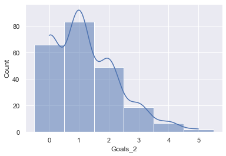
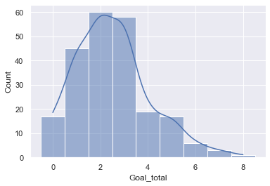
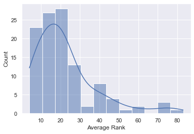

# Euro 2020 (2021) Predictions

<!-- Written report for this analysis can be found [here](../reports/boro_01_market_value.md) -->

## 1. Business Understanding

* Determine Busines Objectives
* Situation Assessment
* Determine Data Mining Goal
* Produce Project Plan

```
# 1. Predict results of every match at Euro 2020
# 2. Make predictions before each round of competition
# 3. Ideally, at each round, use the predictions to simulate remainder of competition
# 4. Check against other predictions and actual results
# 5. Write up process (report/blog)
```

## 2. Data Understanding

* Collect Initial Data
* Describe Data
* Explore Data
* Verify Data Quality

    2021-06-30 17:46:08,371 - INFO - Building master filepath for nations_matches
    2021-06-30 17:46:08,374 - INFO - Fetching C:\Users\adeacon\Documents\GitHub\the-ball-is-round\data\processed\ftb_nations_matches.txt
    2021-06-30 17:46:08,375 - INFO - Building master filepath for nations_matches
    


<div>
<style scoped>
    .dataframe tbody tr th:only-of-type {
        vertical-align: middle;
    }

    .dataframe tbody tr th {
        vertical-align: top;
    }

    .dataframe thead th {
        text-align: right;
    }
</style>
<table border="1" class="dataframe">
  <thead>
    <tr style="text-align: right;">
      <th></th>
      <th>count</th>
      <th>unique</th>
      <th>top</th>
      <th>freq</th>
      <th>mean</th>
      <th>std</th>
      <th>min</th>
      <th>25%</th>
      <th>50%</th>
      <th>75%</th>
      <th>max</th>
    </tr>
  </thead>
  <tbody>
    <tr>
      <th>Round</th>
      <td>223</td>
      <td>5</td>
      <td>Group stage</td>
      <td>168</td>
      <td>NaN</td>
      <td>NaN</td>
      <td>NaN</td>
      <td>NaN</td>
      <td>NaN</td>
      <td>NaN</td>
      <td>NaN</td>
    </tr>
    <tr>
      <th>Day</th>
      <td>223</td>
      <td>7</td>
      <td>Sun</td>
      <td>43</td>
      <td>NaN</td>
      <td>NaN</td>
      <td>NaN</td>
      <td>NaN</td>
      <td>NaN</td>
      <td>NaN</td>
      <td>NaN</td>
    </tr>
    <tr>
      <th>Date</th>
      <td>223</td>
      <td>116</td>
      <td>2021-06-21</td>
      <td>4</td>
      <td>NaN</td>
      <td>NaN</td>
      <td>NaN</td>
      <td>NaN</td>
      <td>NaN</td>
      <td>NaN</td>
      <td>NaN</td>
    </tr>
    <tr>
      <th>Time</th>
      <td>223</td>
      <td>16</td>
      <td>20:45 (19:45)</td>
      <td>52</td>
      <td>NaN</td>
      <td>NaN</td>
      <td>NaN</td>
      <td>NaN</td>
      <td>NaN</td>
      <td>NaN</td>
      <td>NaN</td>
    </tr>
    <tr>
      <th>Team_1</th>
      <td>223</td>
      <td>35</td>
      <td>Portugal</td>
      <td>16</td>
      <td>NaN</td>
      <td>NaN</td>
      <td>NaN</td>
      <td>NaN</td>
      <td>NaN</td>
      <td>NaN</td>
      <td>NaN</td>
    </tr>
    <tr>
      <th>Team_2</th>
      <td>223</td>
      <td>35</td>
      <td>Portugal</td>
      <td>15</td>
      <td>NaN</td>
      <td>NaN</td>
      <td>NaN</td>
      <td>NaN</td>
      <td>NaN</td>
      <td>NaN</td>
      <td>NaN</td>
    </tr>
    <tr>
      <th>Year</th>
      <td>223</td>
      <td>NaN</td>
      <td>NaN</td>
      <td>NaN</td>
      <td>2011.52</td>
      <td>7.22723</td>
      <td>2000</td>
      <td>2004</td>
      <td>2012</td>
      <td>2016</td>
      <td>2021</td>
    </tr>
    <tr>
      <th>Goals_1</th>
      <td>219</td>
      <td>NaN</td>
      <td>NaN</td>
      <td>NaN</td>
      <td>1.42466</td>
      <td>1.31593</td>
      <td>0</td>
      <td>0</td>
      <td>1</td>
      <td>2</td>
      <td>6</td>
    </tr>
    <tr>
      <th>Goals_2</th>
      <td>219</td>
      <td>NaN</td>
      <td>NaN</td>
      <td>NaN</td>
      <td>1.20548</td>
      <td>1.10411</td>
      <td>0</td>
      <td>0</td>
      <td>1</td>
      <td>2</td>
      <td>5</td>
    </tr>
    <tr>
      <th>Goal_diff</th>
      <td>219</td>
      <td>NaN</td>
      <td>NaN</td>
      <td>NaN</td>
      <td>0.219178</td>
      <td>1.79893</td>
      <td>-5</td>
      <td>-1</td>
      <td>0</td>
      <td>1</td>
      <td>5</td>
    </tr>
    <tr>
      <th>Venue</th>
      <td>223</td>
      <td>65</td>
      <td>Ernst-Happel-Stadion</td>
      <td>7</td>
      <td>NaN</td>
      <td>NaN</td>
      <td>NaN</td>
      <td>NaN</td>
      <td>NaN</td>
      <td>NaN</td>
      <td>NaN</td>
    </tr>
    <tr>
      <th>Venue_country</th>
      <td>137</td>
      <td>14</td>
      <td>France</td>
      <td>45</td>
      <td>NaN</td>
      <td>NaN</td>
      <td>NaN</td>
      <td>NaN</td>
      <td>NaN</td>
      <td>NaN</td>
      <td>NaN</td>
    </tr>
    <tr>
      <th>Venue_city</th>
      <td>137</td>
      <td>37</td>
      <td>Vienna</td>
      <td>7</td>
      <td>NaN</td>
      <td>NaN</td>
      <td>NaN</td>
      <td>NaN</td>
      <td>NaN</td>
      <td>NaN</td>
      <td>NaN</td>
    </tr>
    <tr>
      <th>Home_1</th>
      <td>223</td>
      <td>NaN</td>
      <td>NaN</td>
      <td>NaN</td>
      <td>0.0762332</td>
      <td>0.265968</td>
      <td>0</td>
      <td>0</td>
      <td>0</td>
      <td>0</td>
      <td>1</td>
    </tr>
    <tr>
      <th>Home_2</th>
      <td>223</td>
      <td>NaN</td>
      <td>NaN</td>
      <td>NaN</td>
      <td>0.0403587</td>
      <td>0.197242</td>
      <td>0</td>
      <td>0</td>
      <td>0</td>
      <td>0</td>
      <td>1</td>
    </tr>
    <tr>
      <th>Goal_total</th>
      <td>219</td>
      <td>NaN</td>
      <td>NaN</td>
      <td>NaN</td>
      <td>2.63014</td>
      <td>1.63258</td>
      <td>0</td>
      <td>1</td>
      <td>2</td>
      <td>3</td>
      <td>8</td>
    </tr>
    <tr>
      <th>Result</th>
      <td>219</td>
      <td>3</td>
      <td>Win</td>
      <td>94</td>
      <td>NaN</td>
      <td>NaN</td>
      <td>NaN</td>
      <td>NaN</td>
      <td>NaN</td>
      <td>NaN</td>
      <td>NaN</td>
    </tr>
  </tbody>
</table>
</div>


    
    Goals_1
    
    


    

    


    
    --------------------
    
    Goals_2
    
    


    

    


    
    --------------------
    
    Goal_diff
    
    


    

    


    
    --------------------
    
    Goal_total
    
    


    

    


    
    --------------------
    

    
    Round
    
    Group stage       168
    Quarter-finals     20
    Round of 16        16
    Semi-finals        10
    Final               5
    Name: Round, dtype: int64
    


    

    


    
    --------------------
    
    Day
    
    Sun    43
    Sat    38
    Wed    34
    Mon    32
    Tue    28
    Fri    22
    Thu    22
    Name: Day, dtype: int64
    


    

    


    
    --------------------
    
    Time
    
    20:45 (19:45)    52
    18:00 (17:00)    48
    21:00 (20:00)    38
    19:45            23
    17:00            12
    21:45 (19:45)    11
    15:00 (14:00)    10
    19:00 (17:00)     6
    20:00             5
    22:00 (20:00)     4
    14:00             3
    16:00 (14:00)     2
    20:00 (17:00)     2
    14:30 (13:30)     1
    20:00 (19:00)     1
    17:00 (14:00)     1
    Name: Time, dtype: int64
    


    

    


    
    --------------------
    
    Year
    
    2016    51
    2021    44
    2012    31
    2008    31
    2004    31
    2000    31
    Name: Year, dtype: int64
    


    

    


    
    --------------------
    
    Venue_country
    
    NULL           85
    France         45
    Netherlands    17
    Ukraine        16
    Belgium        15
    Austria        13
    Switzerland    12
    Poland         11
    England         2
    Scotland        1
    Denmark         1
    Spain           1
    Name: Venue_country, dtype: int64
    


    

    


    
    --------------------
    
    Result
    
    Win     94
    Loss    85
    Draw    40
    Name: Result, dtype: int64
    


    

    


    
    --------------------
    

    2021-06-30 17:46:10,687 - INFO - Building master filepath for nations_summaries
    2021-06-30 17:46:10,688 - INFO - Fetching C:\Users\adeacon\Documents\GitHub\the-ball-is-round\data\processed\ftb_nations_summaries.txt
    2021-06-30 17:46:10,689 - INFO - Building master filepath for nations_summaries
    


<div>
<style scoped>
    .dataframe tbody tr th:only-of-type {
        vertical-align: middle;
    }

    .dataframe tbody tr th {
        vertical-align: top;
    }

    .dataframe thead th {
        text-align: right;
    }
</style>
<table border="1" class="dataframe">
  <thead>
    <tr style="text-align: right;">
      <th></th>
      <th>count</th>
      <th>unique</th>
      <th>top</th>
      <th>freq</th>
      <th>mean</th>
      <th>std</th>
      <th>min</th>
      <th>25%</th>
      <th>50%</th>
      <th>75%</th>
      <th>max</th>
    </tr>
  </thead>
  <tbody>
    <tr>
      <th>Rank Local</th>
      <td>112</td>
      <td>NaN</td>
      <td>NaN</td>
      <td>NaN</td>
      <td>10.1964</td>
      <td>6.06398</td>
      <td>1</td>
      <td>5</td>
      <td>10</td>
      <td>14.25</td>
      <td>24</td>
    </tr>
    <tr>
      <th>Rank Global</th>
      <td>112</td>
      <td>NaN</td>
      <td>NaN</td>
      <td>NaN</td>
      <td>18.6964</td>
      <td>14.7769</td>
      <td>1</td>
      <td>8</td>
      <td>15</td>
      <td>26</td>
      <td>74</td>
    </tr>
    <tr>
      <th>Team</th>
      <td>112</td>
      <td>35</td>
      <td>France</td>
      <td>6</td>
      <td>NaN</td>
      <td>NaN</td>
      <td>NaN</td>
      <td>NaN</td>
      <td>NaN</td>
      <td>NaN</td>
      <td>NaN</td>
    </tr>
    <tr>
      <th>Rating</th>
      <td>112</td>
      <td>NaN</td>
      <td>NaN</td>
      <td>NaN</td>
      <td>1856</td>
      <td>122.945</td>
      <td>1524</td>
      <td>1771.25</td>
      <td>1853</td>
      <td>1948.25</td>
      <td>2127</td>
    </tr>
    <tr>
      <th>Average Rank</th>
      <td>112</td>
      <td>NaN</td>
      <td>NaN</td>
      <td>NaN</td>
      <td>22.5268</td>
      <td>16.0921</td>
      <td>4</td>
      <td>11</td>
      <td>19</td>
      <td>27.25</td>
      <td>83</td>
    </tr>
    <tr>
      <th>Average Rating</th>
      <td>112</td>
      <td>NaN</td>
      <td>NaN</td>
      <td>NaN</td>
      <td>1769.49</td>
      <td>128.753</td>
      <td>1390</td>
      <td>1704.75</td>
      <td>1785.5</td>
      <td>1875.25</td>
      <td>1985</td>
    </tr>
    <tr>
      <th>1 Year Change Rank</th>
      <td>112</td>
      <td>NaN</td>
      <td>NaN</td>
      <td>NaN</td>
      <td>1.41071</td>
      <td>5.92073</td>
      <td>-15</td>
      <td>-2</td>
      <td>1</td>
      <td>4</td>
      <td>23</td>
    </tr>
    <tr>
      <th>1 Year Change Rating</th>
      <td>112</td>
      <td>NaN</td>
      <td>NaN</td>
      <td>NaN</td>
      <td>7.26786</td>
      <td>42.6667</td>
      <td>-92</td>
      <td>-24.25</td>
      <td>7.5</td>
      <td>35.25</td>
      <td>127</td>
    </tr>
    <tr>
      <th>Matches Total</th>
      <td>112</td>
      <td>NaN</td>
      <td>NaN</td>
      <td>NaN</td>
      <td>638.009</td>
      <td>214.417</td>
      <td>63</td>
      <td>537.25</td>
      <td>659.5</td>
      <td>787</td>
      <td>1073</td>
    </tr>
    <tr>
      <th>Matches Home</th>
      <td>112</td>
      <td>NaN</td>
      <td>NaN</td>
      <td>NaN</td>
      <td>285.482</td>
      <td>98.4145</td>
      <td>23</td>
      <td>223</td>
      <td>295</td>
      <td>360</td>
      <td>467</td>
    </tr>
    <tr>
      <th>Matches Away</th>
      <td>112</td>
      <td>NaN</td>
      <td>NaN</td>
      <td>NaN</td>
      <td>282.17</td>
      <td>99.397</td>
      <td>32</td>
      <td>223.25</td>
      <td>290.5</td>
      <td>344</td>
      <td>494</td>
    </tr>
    <tr>
      <th>Matches Neutral</th>
      <td>112</td>
      <td>NaN</td>
      <td>NaN</td>
      <td>NaN</td>
      <td>70.3571</td>
      <td>33.2126</td>
      <td>8</td>
      <td>44</td>
      <td>68</td>
      <td>94</td>
      <td>157</td>
    </tr>
    <tr>
      <th>Matches Wins</th>
      <td>112</td>
      <td>NaN</td>
      <td>NaN</td>
      <td>NaN</td>
      <td>298.768</td>
      <td>128.751</td>
      <td>21</td>
      <td>209</td>
      <td>303.5</td>
      <td>383.25</td>
      <td>628</td>
    </tr>
    <tr>
      <th>Matches Losses</th>
      <td>112</td>
      <td>NaN</td>
      <td>NaN</td>
      <td>NaN</td>
      <td>194.812</td>
      <td>74.8451</td>
      <td>26</td>
      <td>145</td>
      <td>193.5</td>
      <td>246.5</td>
      <td>410</td>
    </tr>
    <tr>
      <th>Matches Draws</th>
      <td>112</td>
      <td>NaN</td>
      <td>NaN</td>
      <td>NaN</td>
      <td>144.429</td>
      <td>45.8214</td>
      <td>16</td>
      <td>122.5</td>
      <td>148</td>
      <td>174</td>
      <td>244</td>
    </tr>
    <tr>
      <th>Goals For</th>
      <td>112</td>
      <td>NaN</td>
      <td>NaN</td>
      <td>NaN</td>
      <td>1157.33</td>
      <td>528.22</td>
      <td>83</td>
      <td>821.5</td>
      <td>1175</td>
      <td>1432</td>
      <td>2513</td>
    </tr>
    <tr>
      <th>Goals Against</th>
      <td>112</td>
      <td>NaN</td>
      <td>NaN</td>
      <td>NaN</td>
      <td>852.866</td>
      <td>323.145</td>
      <td>87</td>
      <td>638.25</td>
      <td>876.5</td>
      <td>1079.5</td>
      <td>1615</td>
    </tr>
    <tr>
      <th>Year</th>
      <td>112</td>
      <td>NaN</td>
      <td>NaN</td>
      <td>NaN</td>
      <td>2011.36</td>
      <td>7.26941</td>
      <td>2000</td>
      <td>2004</td>
      <td>2012</td>
      <td>2016</td>
      <td>2021</td>
    </tr>
    <tr>
      <th>Country</th>
      <td>112</td>
      <td>32</td>
      <td>United Kingdom</td>
      <td>9</td>
      <td>NaN</td>
      <td>NaN</td>
      <td>NaN</td>
      <td>NaN</td>
      <td>NaN</td>
      <td>NaN</td>
      <td>NaN</td>
    </tr>
    <tr>
      <th>Data Year</th>
      <td>112</td>
      <td>NaN</td>
      <td>NaN</td>
      <td>NaN</td>
      <td>2010.14</td>
      <td>6.98887</td>
      <td>1999</td>
      <td>2003</td>
      <td>2011</td>
      <td>2015</td>
      <td>2019</td>
    </tr>
    <tr>
      <th>GDP (PPP)</th>
      <td>112</td>
      <td>NaN</td>
      <td>NaN</td>
      <td>NaN</td>
      <td>1.19252e+06</td>
      <td>1.19294e+06</td>
      <td>16865.3</td>
      <td>313922</td>
      <td>545971</td>
      <td>2.083e+06</td>
      <td>4.30886e+06</td>
    </tr>
    <tr>
      <th>Population</th>
      <td>112</td>
      <td>NaN</td>
      <td>NaN</td>
      <td>NaN</td>
      <td>35.3018</td>
      <td>35.5946</td>
      <td>0.330243</td>
      <td>8.82449</td>
      <td>16.0182</td>
      <td>60.5572</td>
      <td>145.872</td>
    </tr>
    <tr>
      <th>GDP (PPP) Per Capita</th>
      <td>112</td>
      <td>NaN</td>
      <td>NaN</td>
      <td>NaN</td>
      <td>35377</td>
      <td>13683</td>
      <td>7493.28</td>
      <td>26531.8</td>
      <td>35891.7</td>
      <td>44947.3</td>
      <td>75574.7</td>
    </tr>
  </tbody>
</table>
</div>


    
    Rating
    
    


    

    


    
    --------------------
    
    Average Rank
    
    


    

    


    
    --------------------
    
    Average Rating
    
    


    

    


    
    --------------------
    
    1 Year Change Rank
    
    


    

    


    
    --------------------
    
    1 Year Change Rating
    
    


    

    


    
    --------------------
    
    Matches Total
    
    


    

    


    
    --------------------
    
    Matches Home
    
    


    

    


    
    --------------------
    
    Matches Away
    
    


    

    


    
    --------------------
    
    Matches Neutral
    
    


    

    


    
    --------------------
    
    Matches Wins
    
    


    

    


    
    --------------------
    
    Matches Losses
    
    


    

    


    
    --------------------
    
    Matches Draws
    
    


    

    


    
    --------------------
    
    Goals For
    
    


    

    


    
    --------------------
    
    Goals Against
    
    


    

    


    
    --------------------
    
    GDP (PPP)
    
    


    

    


    
    --------------------
    
    Population
    
    


    

    


    
    --------------------
    
    GDP (PPP) Per Capita
    
    


    

    


    
    --------------------
    

## 3. Data Preperation

* Select Data
* Clean Data
* Construct Data
* Integrate Data
* Format Data


<div>
<style scoped>
    .dataframe tbody tr th:only-of-type {
        vertical-align: middle;
    }

    .dataframe tbody tr th {
        vertical-align: top;
    }

    .dataframe thead th {
        text-align: right;
    }
</style>
<table border="1" class="dataframe">
  <thead>
    <tr style="text-align: right;">
      <th></th>
      <th>count</th>
      <th>mean</th>
      <th>std</th>
      <th>min</th>
      <th>25%</th>
      <th>50%</th>
      <th>75%</th>
      <th>max</th>
    </tr>
  </thead>
  <tbody>
    <tr>
      <th>Year</th>
      <td>223.0</td>
      <td>2.011516e+03</td>
      <td>7.227230e+00</td>
      <td>2000.000000</td>
      <td>2004.000000</td>
      <td>2012.000000</td>
      <td>2.016000e+03</td>
      <td>2.021000e+03</td>
    </tr>
    <tr>
      <th>Goals_1</th>
      <td>219.0</td>
      <td>1.424658e+00</td>
      <td>1.315934e+00</td>
      <td>0.000000</td>
      <td>0.000000</td>
      <td>1.000000</td>
      <td>2.000000e+00</td>
      <td>6.000000e+00</td>
    </tr>
    <tr>
      <th>Goals_2</th>
      <td>219.0</td>
      <td>1.205479e+00</td>
      <td>1.104107e+00</td>
      <td>0.000000</td>
      <td>0.000000</td>
      <td>1.000000</td>
      <td>2.000000e+00</td>
      <td>5.000000e+00</td>
    </tr>
    <tr>
      <th>Goal_diff</th>
      <td>219.0</td>
      <td>2.191781e-01</td>
      <td>1.798929e+00</td>
      <td>-5.000000</td>
      <td>-1.000000</td>
      <td>0.000000</td>
      <td>1.000000e+00</td>
      <td>5.000000e+00</td>
    </tr>
    <tr>
      <th>Home_1</th>
      <td>223.0</td>
      <td>7.623318e-02</td>
      <td>2.659679e-01</td>
      <td>0.000000</td>
      <td>0.000000</td>
      <td>0.000000</td>
      <td>0.000000e+00</td>
      <td>1.000000e+00</td>
    </tr>
    <tr>
      <th>Home_2</th>
      <td>223.0</td>
      <td>4.035874e-02</td>
      <td>1.972419e-01</td>
      <td>0.000000</td>
      <td>0.000000</td>
      <td>0.000000</td>
      <td>0.000000e+00</td>
      <td>1.000000e+00</td>
    </tr>
    <tr>
      <th>Goal_total</th>
      <td>219.0</td>
      <td>2.630137e+00</td>
      <td>1.632583e+00</td>
      <td>0.000000</td>
      <td>1.000000</td>
      <td>2.000000</td>
      <td>3.000000e+00</td>
      <td>8.000000e+00</td>
    </tr>
    <tr>
      <th>Rank Local</th>
      <td>223.0</td>
      <td>9.260090e+00</td>
      <td>5.935431e+00</td>
      <td>1.000000</td>
      <td>4.000000</td>
      <td>8.000000</td>
      <td>1.300000e+01</td>
      <td>2.400000e+01</td>
    </tr>
    <tr>
      <th>Rank Global</th>
      <td>223.0</td>
      <td>1.685202e+01</td>
      <td>1.409462e+01</td>
      <td>1.000000</td>
      <td>7.000000</td>
      <td>13.000000</td>
      <td>2.250000e+01</td>
      <td>7.400000e+01</td>
    </tr>
    <tr>
      <th>Rating</th>
      <td>223.0</td>
      <td>1.875004e+03</td>
      <td>1.245442e+02</td>
      <td>1524.000000</td>
      <td>1787.000000</td>
      <td>1875.000000</td>
      <td>1.971000e+03</td>
      <td>2.127000e+03</td>
    </tr>
    <tr>
      <th>Average Rank</th>
      <td>223.0</td>
      <td>2.095516e+01</td>
      <td>1.501044e+01</td>
      <td>4.000000</td>
      <td>11.000000</td>
      <td>18.000000</td>
      <td>2.450000e+01</td>
      <td>8.300000e+01</td>
    </tr>
    <tr>
      <th>Average Rating</th>
      <td>223.0</td>
      <td>1.782238e+03</td>
      <td>1.249239e+02</td>
      <td>1390.000000</td>
      <td>1719.000000</td>
      <td>1792.000000</td>
      <td>1.881000e+03</td>
      <td>1.985000e+03</td>
    </tr>
    <tr>
      <th>1 Year Change Rank</th>
      <td>223.0</td>
      <td>9.865471e-01</td>
      <td>5.180073e+00</td>
      <td>-15.000000</td>
      <td>-2.000000</td>
      <td>0.000000</td>
      <td>3.000000e+00</td>
      <td>2.300000e+01</td>
    </tr>
    <tr>
      <th>1 Year Change Rating</th>
      <td>223.0</td>
      <td>3.417040e+00</td>
      <td>4.319004e+01</td>
      <td>-92.000000</td>
      <td>-26.000000</td>
      <td>2.000000</td>
      <td>3.400000e+01</td>
      <td>1.270000e+02</td>
    </tr>
    <tr>
      <th>Matches Total</th>
      <td>223.0</td>
      <td>6.478565e+02</td>
      <td>2.141322e+02</td>
      <td>63.000000</td>
      <td>550.000000</td>
      <td>674.000000</td>
      <td>8.030000e+02</td>
      <td>1.073000e+03</td>
    </tr>
    <tr>
      <th>Matches Home</th>
      <td>223.0</td>
      <td>2.916592e+02</td>
      <td>9.746961e+01</td>
      <td>23.000000</td>
      <td>231.500000</td>
      <td>300.000000</td>
      <td>3.685000e+02</td>
      <td>4.670000e+02</td>
    </tr>
    <tr>
      <th>Matches Away</th>
      <td>223.0</td>
      <td>2.828341e+02</td>
      <td>9.914174e+01</td>
      <td>32.000000</td>
      <td>218.000000</td>
      <td>292.000000</td>
      <td>3.450000e+02</td>
      <td>4.940000e+02</td>
    </tr>
    <tr>
      <th>Matches Neutral</th>
      <td>223.0</td>
      <td>7.336323e+01</td>
      <td>3.427719e+01</td>
      <td>8.000000</td>
      <td>46.500000</td>
      <td>70.000000</td>
      <td>9.500000e+01</td>
      <td>1.570000e+02</td>
    </tr>
    <tr>
      <th>Matches Wins</th>
      <td>223.0</td>
      <td>3.081345e+02</td>
      <td>1.306845e+02</td>
      <td>21.000000</td>
      <td>210.500000</td>
      <td>306.000000</td>
      <td>3.860000e+02</td>
      <td>6.280000e+02</td>
    </tr>
    <tr>
      <th>Matches Losses</th>
      <td>223.0</td>
      <td>1.936099e+02</td>
      <td>7.467259e+01</td>
      <td>26.000000</td>
      <td>145.000000</td>
      <td>190.000000</td>
      <td>2.470000e+02</td>
      <td>4.100000e+02</td>
    </tr>
    <tr>
      <th>Matches Draws</th>
      <td>223.0</td>
      <td>1.461121e+02</td>
      <td>4.571781e+01</td>
      <td>16.000000</td>
      <td>121.000000</td>
      <td>148.000000</td>
      <td>1.750000e+02</td>
      <td>2.440000e+02</td>
    </tr>
    <tr>
      <th>Goals For</th>
      <td>223.0</td>
      <td>1.189220e+03</td>
      <td>5.347872e+02</td>
      <td>83.000000</td>
      <td>841.500000</td>
      <td>1178.000000</td>
      <td>1.452000e+03</td>
      <td>2.513000e+03</td>
    </tr>
    <tr>
      <th>Goals Against</th>
      <td>223.0</td>
      <td>8.561794e+02</td>
      <td>3.207818e+02</td>
      <td>87.000000</td>
      <td>626.000000</td>
      <td>895.000000</td>
      <td>1.082000e+03</td>
      <td>1.615000e+03</td>
    </tr>
    <tr>
      <th>Data Year</th>
      <td>223.0</td>
      <td>2.010300e+03</td>
      <td>6.949908e+00</td>
      <td>1999.000000</td>
      <td>2003.000000</td>
      <td>2011.000000</td>
      <td>2.015000e+03</td>
      <td>2.019000e+03</td>
    </tr>
    <tr>
      <th>GDP (PPP)</th>
      <td>223.0</td>
      <td>1.268653e+06</td>
      <td>1.192582e+06</td>
      <td>16865.345703</td>
      <td>319420.843750</td>
      <td>617131.812500</td>
      <td>2.186025e+06</td>
      <td>4.308862e+06</td>
    </tr>
    <tr>
      <th>Population</th>
      <td>223.0</td>
      <td>3.643252e+01</td>
      <td>3.404214e+01</td>
      <td>0.330243</td>
      <td>9.684679</td>
      <td>16.738193</td>
      <td>6.057849e+01</td>
      <td>1.458723e+02</td>
    </tr>
    <tr>
      <th>GDP (PPP) Per Capita</th>
      <td>223.0</td>
      <td>3.624371e+04</td>
      <td>1.309846e+04</td>
      <td>7493.284135</td>
      <td>27512.020377</td>
      <td>36505.543076</td>
      <td>4.570633e+04</td>
      <td>7.557470e+04</td>
    </tr>
    <tr>
      <th>Rank Local (2)</th>
      <td>223.0</td>
      <td>9.955157e+00</td>
      <td>6.115831e+00</td>
      <td>1.000000</td>
      <td>5.000000</td>
      <td>9.000000</td>
      <td>1.400000e+01</td>
      <td>2.400000e+01</td>
    </tr>
    <tr>
      <th>Rank Global (2)</th>
      <td>223.0</td>
      <td>1.792377e+01</td>
      <td>1.428533e+01</td>
      <td>1.000000</td>
      <td>7.000000</td>
      <td>14.000000</td>
      <td>2.400000e+01</td>
      <td>7.400000e+01</td>
    </tr>
    <tr>
      <th>Rating (2)</th>
      <td>223.0</td>
      <td>1.861825e+03</td>
      <td>1.207294e+02</td>
      <td>1524.000000</td>
      <td>1777.000000</td>
      <td>1864.000000</td>
      <td>1.957500e+03</td>
      <td>2.127000e+03</td>
    </tr>
    <tr>
      <th>Average Rank (2)</th>
      <td>223.0</td>
      <td>2.244395e+01</td>
      <td>1.624545e+01</td>
      <td>4.000000</td>
      <td>11.000000</td>
      <td>19.000000</td>
      <td>2.700000e+01</td>
      <td>8.300000e+01</td>
    </tr>
    <tr>
      <th>Average Rating (2)</th>
      <td>223.0</td>
      <td>1.768713e+03</td>
      <td>1.300196e+02</td>
      <td>1390.000000</td>
      <td>1704.000000</td>
      <td>1775.000000</td>
      <td>1.877500e+03</td>
      <td>1.985000e+03</td>
    </tr>
    <tr>
      <th>1 Year Change Rank (2)</th>
      <td>223.0</td>
      <td>1.448430e+00</td>
      <td>5.764585e+00</td>
      <td>-15.000000</td>
      <td>-1.500000</td>
      <td>1.000000</td>
      <td>3.000000e+00</td>
      <td>2.300000e+01</td>
    </tr>
    <tr>
      <th>1 Year Change Rating (2)</th>
      <td>223.0</td>
      <td>7.964126e+00</td>
      <td>4.098757e+01</td>
      <td>-92.000000</td>
      <td>-21.000000</td>
      <td>8.000000</td>
      <td>3.400000e+01</td>
      <td>1.270000e+02</td>
    </tr>
    <tr>
      <th>Matches Total (2)</th>
      <td>223.0</td>
      <td>6.374529e+02</td>
      <td>2.030792e+02</td>
      <td>63.000000</td>
      <td>523.000000</td>
      <td>634.000000</td>
      <td>7.985000e+02</td>
      <td>1.073000e+03</td>
    </tr>
    <tr>
      <th>Matches Home (2)</th>
      <td>223.0</td>
      <td>2.865112e+02</td>
      <td>9.405734e+01</td>
      <td>23.000000</td>
      <td>222.000000</td>
      <td>294.000000</td>
      <td>3.630000e+02</td>
      <td>4.670000e+02</td>
    </tr>
    <tr>
      <th>Matches Away (2)</th>
      <td>223.0</td>
      <td>2.800448e+02</td>
      <td>9.336810e+01</td>
      <td>32.000000</td>
      <td>218.000000</td>
      <td>283.000000</td>
      <td>3.425000e+02</td>
      <td>4.940000e+02</td>
    </tr>
    <tr>
      <th>Matches Neutral (2)</th>
      <td>223.0</td>
      <td>7.089686e+01</td>
      <td>3.337520e+01</td>
      <td>8.000000</td>
      <td>45.000000</td>
      <td>68.000000</td>
      <td>9.400000e+01</td>
      <td>1.570000e+02</td>
    </tr>
    <tr>
      <th>Matches Wins (2)</th>
      <td>223.0</td>
      <td>2.982332e+02</td>
      <td>1.245896e+02</td>
      <td>21.000000</td>
      <td>209.000000</td>
      <td>303.000000</td>
      <td>3.840000e+02</td>
      <td>6.280000e+02</td>
    </tr>
    <tr>
      <th>Matches Losses (2)</th>
      <td>223.0</td>
      <td>1.943767e+02</td>
      <td>7.034658e+01</td>
      <td>26.000000</td>
      <td>145.000000</td>
      <td>188.000000</td>
      <td>2.460000e+02</td>
      <td>4.100000e+02</td>
    </tr>
    <tr>
      <th>Matches Draws (2)</th>
      <td>223.0</td>
      <td>1.448430e+02</td>
      <td>4.379752e+01</td>
      <td>16.000000</td>
      <td>123.000000</td>
      <td>148.000000</td>
      <td>1.740000e+02</td>
      <td>2.440000e+02</td>
    </tr>
    <tr>
      <th>Goals For (2)</th>
      <td>223.0</td>
      <td>1.146749e+03</td>
      <td>5.063534e+02</td>
      <td>83.000000</td>
      <td>819.000000</td>
      <td>1178.000000</td>
      <td>1.430500e+03</td>
      <td>2.513000e+03</td>
    </tr>
    <tr>
      <th>Goals Against (2)</th>
      <td>223.0</td>
      <td>8.483901e+02</td>
      <td>3.037626e+02</td>
      <td>87.000000</td>
      <td>644.000000</td>
      <td>852.000000</td>
      <td>1.074500e+03</td>
      <td>1.615000e+03</td>
    </tr>
    <tr>
      <th>Data Year (2)</th>
      <td>223.0</td>
      <td>2.010300e+03</td>
      <td>6.949908e+00</td>
      <td>1999.000000</td>
      <td>2003.000000</td>
      <td>2011.000000</td>
      <td>2.015000e+03</td>
      <td>2.019000e+03</td>
    </tr>
    <tr>
      <th>GDP (PPP) (2)</th>
      <td>223.0</td>
      <td>1.248728e+06</td>
      <td>1.206595e+06</td>
      <td>16865.345703</td>
      <td>313823.828125</td>
      <td>562544.187500</td>
      <td>2.264640e+06</td>
      <td>4.308862e+06</td>
    </tr>
    <tr>
      <th>Population (2)</th>
      <td>223.0</td>
      <td>3.604701e+01</td>
      <td>3.478755e+01</td>
      <td>0.330243</td>
      <td>8.955102</td>
      <td>16.200951</td>
      <td>6.138030e+01</td>
      <td>1.458723e+02</td>
    </tr>
    <tr>
      <th>GDP (PPP) Per Capita (2)</th>
      <td>223.0</td>
      <td>3.567066e+04</td>
      <td>1.368083e+04</td>
      <td>7493.284135</td>
      <td>27182.377288</td>
      <td>37019.891294</td>
      <td>4.423183e+04</td>
      <td>7.557470e+04</td>
    </tr>
    <tr>
      <th>Elo_rating_diff</th>
      <td>223.0</td>
      <td>1.317937e+01</td>
      <td>1.748236e+02</td>
      <td>-411.000000</td>
      <td>-106.500000</td>
      <td>18.000000</td>
      <td>1.485000e+02</td>
      <td>4.440000e+02</td>
    </tr>
    <tr>
      <th>Home_advantage</th>
      <td>223.0</td>
      <td>3.587444e-02</td>
      <td>3.403298e-01</td>
      <td>-1.000000</td>
      <td>0.000000</td>
      <td>0.000000</td>
      <td>0.000000e+00</td>
      <td>1.000000e+00</td>
    </tr>
    <tr>
      <th>Relative_experience</th>
      <td>223.0</td>
      <td>1.228479e+00</td>
      <td>9.503956e-01</td>
      <td>0.103110</td>
      <td>0.782518</td>
      <td>1.019656</td>
      <td>1.335919e+00</td>
      <td>9.095238e+00</td>
    </tr>
    <tr>
      <th>Relative_population</th>
      <td>223.0</td>
      <td>4.947126e+00</td>
      <td>1.932611e+01</td>
      <td>0.028253</td>
      <td>0.264137</td>
      <td>1.024848</td>
      <td>3.953465e+00</td>
      <td>2.016585e+02</td>
    </tr>
    <tr>
      <th>Relative_GDP_per_capita</th>
      <td>223.0</td>
      <td>1.271828e+00</td>
      <td>9.657274e-01</td>
      <td>0.163999</td>
      <td>0.703541</td>
      <td>0.945984</td>
      <td>1.534451e+00</td>
      <td>5.480461e+00</td>
    </tr>
    <tr>
      <th>Relative_ELO_rating</th>
      <td>223.0</td>
      <td>1.011461e+00</td>
      <td>9.541263e-02</td>
      <td>0.798034</td>
      <td>0.942785</td>
      <td>1.009254</td>
      <td>1.083523e+00</td>
      <td>1.291339e+00</td>
    </tr>
  </tbody>
</table>
</div>


<style  type="text/css" >
#T_ae690d4c_d9c2_11eb_93b9_74d83eb26131row0_col0,#T_ae690d4c_d9c2_11eb_93b9_74d83eb26131row1_col1,#T_ae690d4c_d9c2_11eb_93b9_74d83eb26131row2_col2,#T_ae690d4c_d9c2_11eb_93b9_74d83eb26131row3_col3,#T_ae690d4c_d9c2_11eb_93b9_74d83eb26131row4_col4,#T_ae690d4c_d9c2_11eb_93b9_74d83eb26131row5_col5,#T_ae690d4c_d9c2_11eb_93b9_74d83eb26131row6_col6,#T_ae690d4c_d9c2_11eb_93b9_74d83eb26131row6_col11,#T_ae690d4c_d9c2_11eb_93b9_74d83eb26131row7_col7,#T_ae690d4c_d9c2_11eb_93b9_74d83eb26131row8_col8,#T_ae690d4c_d9c2_11eb_93b9_74d83eb26131row9_col9,#T_ae690d4c_d9c2_11eb_93b9_74d83eb26131row10_col10,#T_ae690d4c_d9c2_11eb_93b9_74d83eb26131row11_col6,#T_ae690d4c_d9c2_11eb_93b9_74d83eb26131row11_col11{
            background-color:  #b40426;
            color:  #f1f1f1;
        }#T_ae690d4c_d9c2_11eb_93b9_74d83eb26131row0_col1,#T_ae690d4c_d9c2_11eb_93b9_74d83eb26131row3_col4{
            background-color:  #afcafc;
            color:  #000000;
        }#T_ae690d4c_d9c2_11eb_93b9_74d83eb26131row0_col2{
            background-color:  #dd5f4b;
            color:  #000000;
        }#T_ae690d4c_d9c2_11eb_93b9_74d83eb26131row0_col3,#T_ae690d4c_d9c2_11eb_93b9_74d83eb26131row7_col0{
            background-color:  #6384eb;
            color:  #000000;
        }#T_ae690d4c_d9c2_11eb_93b9_74d83eb26131row0_col4{
            background-color:  #b9d0f9;
            color:  #000000;
        }#T_ae690d4c_d9c2_11eb_93b9_74d83eb26131row0_col5,#T_ae690d4c_d9c2_11eb_93b9_74d83eb26131row5_col1{
            background-color:  #f39577;
            color:  #000000;
        }#T_ae690d4c_d9c2_11eb_93b9_74d83eb26131row0_col6{
            background-color:  #cdd9ec;
            color:  #000000;
        }#T_ae690d4c_d9c2_11eb_93b9_74d83eb26131row0_col7{
            background-color:  #c4d5f3;
            color:  #000000;
        }#T_ae690d4c_d9c2_11eb_93b9_74d83eb26131row0_col8,#T_ae690d4c_d9c2_11eb_93b9_74d83eb26131row2_col8,#T_ae690d4c_d9c2_11eb_93b9_74d83eb26131row8_col5,#T_ae690d4c_d9c2_11eb_93b9_74d83eb26131row10_col5{
            background-color:  #5a78e4;
            color:  #000000;
        }#T_ae690d4c_d9c2_11eb_93b9_74d83eb26131row0_col9{
            background-color:  #7295f4;
            color:  #000000;
        }#T_ae690d4c_d9c2_11eb_93b9_74d83eb26131row0_col10,#T_ae690d4c_d9c2_11eb_93b9_74d83eb26131row6_col9{
            background-color:  #90b2fe;
            color:  #000000;
        }#T_ae690d4c_d9c2_11eb_93b9_74d83eb26131row0_col11,#T_ae690d4c_d9c2_11eb_93b9_74d83eb26131row9_col1,#T_ae690d4c_d9c2_11eb_93b9_74d83eb26131row9_col2{
            background-color:  #ccd9ed;
            color:  #000000;
        }#T_ae690d4c_d9c2_11eb_93b9_74d83eb26131row1_col0,#T_ae690d4c_d9c2_11eb_93b9_74d83eb26131row1_col2,#T_ae690d4c_d9c2_11eb_93b9_74d83eb26131row1_col6,#T_ae690d4c_d9c2_11eb_93b9_74d83eb26131row1_col8,#T_ae690d4c_d9c2_11eb_93b9_74d83eb26131row1_col10,#T_ae690d4c_d9c2_11eb_93b9_74d83eb26131row1_col11,#T_ae690d4c_d9c2_11eb_93b9_74d83eb26131row2_col1,#T_ae690d4c_d9c2_11eb_93b9_74d83eb26131row4_col5,#T_ae690d4c_d9c2_11eb_93b9_74d83eb26131row4_col7,#T_ae690d4c_d9c2_11eb_93b9_74d83eb26131row7_col4,#T_ae690d4c_d9c2_11eb_93b9_74d83eb26131row10_col9,#T_ae690d4c_d9c2_11eb_93b9_74d83eb26131row11_col3{
            background-color:  #3b4cc0;
            color:  #f1f1f1;
        }#T_ae690d4c_d9c2_11eb_93b9_74d83eb26131row1_col3{
            background-color:  #455cce;
            color:  #f1f1f1;
        }#T_ae690d4c_d9c2_11eb_93b9_74d83eb26131row1_col4,#T_ae690d4c_d9c2_11eb_93b9_74d83eb26131row6_col10,#T_ae690d4c_d9c2_11eb_93b9_74d83eb26131row10_col1{
            background-color:  #a6c4fe;
            color:  #000000;
        }#T_ae690d4c_d9c2_11eb_93b9_74d83eb26131row1_col5{
            background-color:  #f5c4ac;
            color:  #000000;
        }#T_ae690d4c_d9c2_11eb_93b9_74d83eb26131row1_col7,#T_ae690d4c_d9c2_11eb_93b9_74d83eb26131row10_col8{
            background-color:  #bfd3f6;
            color:  #000000;
        }#T_ae690d4c_d9c2_11eb_93b9_74d83eb26131row1_col9,#T_ae690d4c_d9c2_11eb_93b9_74d83eb26131row2_col9{
            background-color:  #5b7ae5;
            color:  #000000;
        }#T_ae690d4c_d9c2_11eb_93b9_74d83eb26131row2_col0{
            background-color:  #ec7f63;
            color:  #000000;
        }#T_ae690d4c_d9c2_11eb_93b9_74d83eb26131row2_col3,#T_ae690d4c_d9c2_11eb_93b9_74d83eb26131row5_col10{
            background-color:  #6a8bef;
            color:  #000000;
        }#T_ae690d4c_d9c2_11eb_93b9_74d83eb26131row2_col4,#T_ae690d4c_d9c2_11eb_93b9_74d83eb26131row5_col7,#T_ae690d4c_d9c2_11eb_93b9_74d83eb26131row7_col1{
            background-color:  #c5d6f2;
            color:  #000000;
        }#T_ae690d4c_d9c2_11eb_93b9_74d83eb26131row2_col5{
            background-color:  #88abfd;
            color:  #000000;
        }#T_ae690d4c_d9c2_11eb_93b9_74d83eb26131row2_col6{
            background-color:  #e4d9d2;
            color:  #000000;
        }#T_ae690d4c_d9c2_11eb_93b9_74d83eb26131row2_col7,#T_ae690d4c_d9c2_11eb_93b9_74d83eb26131row9_col6,#T_ae690d4c_d9c2_11eb_93b9_74d83eb26131row10_col11{
            background-color:  #c0d4f5;
            color:  #000000;
        }#T_ae690d4c_d9c2_11eb_93b9_74d83eb26131row2_col10{
            background-color:  #9ebeff;
            color:  #000000;
        }#T_ae690d4c_d9c2_11eb_93b9_74d83eb26131row2_col11{
            background-color:  #e2dad5;
            color:  #000000;
        }#T_ae690d4c_d9c2_11eb_93b9_74d83eb26131row3_col0{
            background-color:  #6485ec;
            color:  #000000;
        }#T_ae690d4c_d9c2_11eb_93b9_74d83eb26131row3_col1,#T_ae690d4c_d9c2_11eb_93b9_74d83eb26131row6_col4,#T_ae690d4c_d9c2_11eb_93b9_74d83eb26131row8_col7,#T_ae690d4c_d9c2_11eb_93b9_74d83eb26131row11_col4{
            background-color:  #b7cff9;
            color:  #000000;
        }#T_ae690d4c_d9c2_11eb_93b9_74d83eb26131row3_col2{
            background-color:  #cedaeb;
            color:  #000000;
        }#T_ae690d4c_d9c2_11eb_93b9_74d83eb26131row3_col5,#T_ae690d4c_d9c2_11eb_93b9_74d83eb26131row4_col0{
            background-color:  #516ddb;
            color:  #000000;
        }#T_ae690d4c_d9c2_11eb_93b9_74d83eb26131row3_col6{
            background-color:  #6f92f3;
            color:  #000000;
        }#T_ae690d4c_d9c2_11eb_93b9_74d83eb26131row3_col7{
            background-color:  #da5a49;
            color:  #000000;
        }#T_ae690d4c_d9c2_11eb_93b9_74d83eb26131row3_col8,#T_ae690d4c_d9c2_11eb_93b9_74d83eb26131row4_col3{
            background-color:  #445acc;
            color:  #f1f1f1;
        }#T_ae690d4c_d9c2_11eb_93b9_74d83eb26131row3_col9,#T_ae690d4c_d9c2_11eb_93b9_74d83eb26131row7_col11,#T_ae690d4c_d9c2_11eb_93b9_74d83eb26131row10_col3{
            background-color:  #7597f6;
            color:  #000000;
        }#T_ae690d4c_d9c2_11eb_93b9_74d83eb26131row3_col10,#T_ae690d4c_d9c2_11eb_93b9_74d83eb26131row4_col11{
            background-color:  #80a3fa;
            color:  #000000;
        }#T_ae690d4c_d9c2_11eb_93b9_74d83eb26131row3_col11,#T_ae690d4c_d9c2_11eb_93b9_74d83eb26131row8_col0{
            background-color:  #6b8df0;
            color:  #000000;
        }#T_ae690d4c_d9c2_11eb_93b9_74d83eb26131row4_col1,#T_ae690d4c_d9c2_11eb_93b9_74d83eb26131row6_col7,#T_ae690d4c_d9c2_11eb_93b9_74d83eb26131row11_col7{
            background-color:  #aec9fc;
            color:  #000000;
        }#T_ae690d4c_d9c2_11eb_93b9_74d83eb26131row4_col2,#T_ae690d4c_d9c2_11eb_93b9_74d83eb26131row10_col7{
            background-color:  #cbd8ee;
            color:  #000000;
        }#T_ae690d4c_d9c2_11eb_93b9_74d83eb26131row4_col6{
            background-color:  #82a6fb;
            color:  #000000;
        }#T_ae690d4c_d9c2_11eb_93b9_74d83eb26131row4_col8,#T_ae690d4c_d9c2_11eb_93b9_74d83eb26131row5_col8{
            background-color:  #4e68d8;
            color:  #000000;
        }#T_ae690d4c_d9c2_11eb_93b9_74d83eb26131row4_col9{
            background-color:  #4358cb;
            color:  #f1f1f1;
        }#T_ae690d4c_d9c2_11eb_93b9_74d83eb26131row4_col10{
            background-color:  #6180e9;
            color:  #000000;
        }#T_ae690d4c_d9c2_11eb_93b9_74d83eb26131row5_col0{
            background-color:  #f39475;
            color:  #000000;
        }#T_ae690d4c_d9c2_11eb_93b9_74d83eb26131row5_col2{
            background-color:  #dfdbd9;
            color:  #000000;
        }#T_ae690d4c_d9c2_11eb_93b9_74d83eb26131row5_col3,#T_ae690d4c_d9c2_11eb_93b9_74d83eb26131row6_col5{
            background-color:  #5572df;
            color:  #000000;
        }#T_ae690d4c_d9c2_11eb_93b9_74d83eb26131row5_col4,#T_ae690d4c_d9c2_11eb_93b9_74d83eb26131row11_col8{
            background-color:  #aac7fd;
            color:  #000000;
        }#T_ae690d4c_d9c2_11eb_93b9_74d83eb26131row5_col6,#T_ae690d4c_d9c2_11eb_93b9_74d83eb26131row5_col11{
            background-color:  #8badfd;
            color:  #000000;
        }#T_ae690d4c_d9c2_11eb_93b9_74d83eb26131row5_col9,#T_ae690d4c_d9c2_11eb_93b9_74d83eb26131row7_col6,#T_ae690d4c_d9c2_11eb_93b9_74d83eb26131row9_col8{
            background-color:  #7699f6;
            color:  #000000;
        }#T_ae690d4c_d9c2_11eb_93b9_74d83eb26131row6_col0,#T_ae690d4c_d9c2_11eb_93b9_74d83eb26131row11_col0{
            background-color:  #abc8fd;
            color:  #000000;
        }#T_ae690d4c_d9c2_11eb_93b9_74d83eb26131row6_col1{
            background-color:  #84a7fc;
            color:  #000000;
        }#T_ae690d4c_d9c2_11eb_93b9_74d83eb26131row6_col2{
            background-color:  #f5c0a7;
            color:  #000000;
        }#T_ae690d4c_d9c2_11eb_93b9_74d83eb26131row6_col3{
            background-color:  #3c4ec2;
            color:  #f1f1f1;
        }#T_ae690d4c_d9c2_11eb_93b9_74d83eb26131row6_col8,#T_ae690d4c_d9c2_11eb_93b9_74d83eb26131row11_col10{
            background-color:  #a5c3fe;
            color:  #000000;
        }#T_ae690d4c_d9c2_11eb_93b9_74d83eb26131row7_col2{
            background-color:  #c6d6f1;
            color:  #000000;
        }#T_ae690d4c_d9c2_11eb_93b9_74d83eb26131row7_col3{
            background-color:  #e8765c;
            color:  #000000;
        }#T_ae690d4c_d9c2_11eb_93b9_74d83eb26131row7_col5{
            background-color:  #5f7fe8;
            color:  #000000;
        }#T_ae690d4c_d9c2_11eb_93b9_74d83eb26131row7_col8{
            background-color:  #3e51c5;
            color:  #f1f1f1;
        }#T_ae690d4c_d9c2_11eb_93b9_74d83eb26131row7_col9{
            background-color:  #7093f3;
            color:  #000000;
        }#T_ae690d4c_d9c2_11eb_93b9_74d83eb26131row7_col10{
            background-color:  #799cf8;
            color:  #000000;
        }#T_ae690d4c_d9c2_11eb_93b9_74d83eb26131row8_col1,#T_ae690d4c_d9c2_11eb_93b9_74d83eb26131row10_col4{
            background-color:  #bbd1f8;
            color:  #000000;
        }#T_ae690d4c_d9c2_11eb_93b9_74d83eb26131row8_col2{
            background-color:  #cfdaea;
            color:  #000000;
        }#T_ae690d4c_d9c2_11eb_93b9_74d83eb26131row8_col3{
            background-color:  #5470de;
            color:  #000000;
        }#T_ae690d4c_d9c2_11eb_93b9_74d83eb26131row8_col4,#T_ae690d4c_d9c2_11eb_93b9_74d83eb26131row9_col11{
            background-color:  #c1d4f4;
            color:  #000000;
        }#T_ae690d4c_d9c2_11eb_93b9_74d83eb26131row8_col6,#T_ae690d4c_d9c2_11eb_93b9_74d83eb26131row9_col7{
            background-color:  #d2dbe8;
            color:  #000000;
        }#T_ae690d4c_d9c2_11eb_93b9_74d83eb26131row8_col9,#T_ae690d4c_d9c2_11eb_93b9_74d83eb26131row9_col5{
            background-color:  #7b9ff9;
            color:  #000000;
        }#T_ae690d4c_d9c2_11eb_93b9_74d83eb26131row8_col10{
            background-color:  #d1dae9;
            color:  #000000;
        }#T_ae690d4c_d9c2_11eb_93b9_74d83eb26131row8_col11{
            background-color:  #d4dbe6;
            color:  #000000;
        }#T_ae690d4c_d9c2_11eb_93b9_74d83eb26131row9_col0{
            background-color:  #7da0f9;
            color:  #000000;
        }#T_ae690d4c_d9c2_11eb_93b9_74d83eb26131row9_col3{
            background-color:  #7ea1fa;
            color:  #000000;
        }#T_ae690d4c_d9c2_11eb_93b9_74d83eb26131row9_col4{
            background-color:  #b6cefa;
            color:  #000000;
        }#T_ae690d4c_d9c2_11eb_93b9_74d83eb26131row9_col10{
            background-color:  #506bda;
            color:  #000000;
        }#T_ae690d4c_d9c2_11eb_93b9_74d83eb26131row10_col0{
            background-color:  #86a9fc;
            color:  #000000;
        }#T_ae690d4c_d9c2_11eb_93b9_74d83eb26131row10_col2{
            background-color:  #e3d9d3;
            color:  #000000;
        }#T_ae690d4c_d9c2_11eb_93b9_74d83eb26131row10_col6{
            background-color:  #c3d5f4;
            color:  #000000;
        }#T_ae690d4c_d9c2_11eb_93b9_74d83eb26131row11_col1{
            background-color:  #85a8fc;
            color:  #000000;
        }#T_ae690d4c_d9c2_11eb_93b9_74d83eb26131row11_col2{
            background-color:  #f5c1a9;
            color:  #000000;
        }#T_ae690d4c_d9c2_11eb_93b9_74d83eb26131row11_col5{
            background-color:  #5673e0;
            color:  #000000;
        }#T_ae690d4c_d9c2_11eb_93b9_74d83eb26131row11_col9{
            background-color:  #94b6ff;
            color:  #000000;
        }</style><table id="T_ae690d4c_d9c2_11eb_93b9_74d83eb26131" ><thead>    <tr>        <th class="blank level0" ></th>        <th class="col_heading level0 col0" >Goals_1</th>        <th class="col_heading level0 col1" >Goals_2</th>        <th class="col_heading level0 col2" >Goal_diff</th>        <th class="col_heading level0 col3" >Home_1</th>        <th class="col_heading level0 col4" >Home_2</th>        <th class="col_heading level0 col5" >Goal_total</th>        <th class="col_heading level0 col6" >Elo_rating_diff</th>        <th class="col_heading level0 col7" >Home_advantage</th>        <th class="col_heading level0 col8" >Relative_experience</th>        <th class="col_heading level0 col9" >Relative_population</th>        <th class="col_heading level0 col10" >Relative_GDP_per_capita</th>        <th class="col_heading level0 col11" >Relative_ELO_rating</th>    </tr></thead><tbody>
                <tr>
                        <th id="T_ae690d4c_d9c2_11eb_93b9_74d83eb26131level0_row0" class="row_heading level0 row0" >Goals_1</th>
                        <td id="T_ae690d4c_d9c2_11eb_93b9_74d83eb26131row0_col0" class="data row0 col0" >1.000000</td>
                        <td id="T_ae690d4c_d9c2_11eb_93b9_74d83eb26131row0_col1" class="data row0 col1" >-0.098218</td>
                        <td id="T_ae690d4c_d9c2_11eb_93b9_74d83eb26131row0_col2" class="data row0 col2" >0.791792</td>
                        <td id="T_ae690d4c_d9c2_11eb_93b9_74d83eb26131row0_col3" class="data row0 col3" >0.049141</td>
                        <td id="T_ae690d4c_d9c2_11eb_93b9_74d83eb26131row0_col4" class="data row0 col4" >-0.014400</td>
                        <td id="T_ae690d4c_d9c2_11eb_93b9_74d83eb26131row0_col5" class="data row0 col5" >0.739620</td>
                        <td id="T_ae690d4c_d9c2_11eb_93b9_74d83eb26131row0_col6" class="data row0 col6" >0.274768</td>
                        <td id="T_ae690d4c_d9c2_11eb_93b9_74d83eb26131row0_col7" class="data row0 col7" >0.046722</td>
                        <td id="T_ae690d4c_d9c2_11eb_93b9_74d83eb26131row0_col8" class="data row0 col8" >0.070459</td>
                        <td id="T_ae690d4c_d9c2_11eb_93b9_74d83eb26131row0_col9" class="data row0 col9" >0.125974</td>
                        <td id="T_ae690d4c_d9c2_11eb_93b9_74d83eb26131row0_col10" class="data row0 col10" >0.157735</td>
                        <td id="T_ae690d4c_d9c2_11eb_93b9_74d83eb26131row0_col11" class="data row0 col11" >0.271790</td>
            </tr>
            <tr>
                        <th id="T_ae690d4c_d9c2_11eb_93b9_74d83eb26131level0_row1" class="row_heading level0 row1" >Goals_2</th>
                        <td id="T_ae690d4c_d9c2_11eb_93b9_74d83eb26131row1_col0" class="data row1 col0" >-0.098218</td>
                        <td id="T_ae690d4c_d9c2_11eb_93b9_74d83eb26131row1_col1" class="data row1 col1" >1.000000</td>
                        <td id="T_ae690d4c_d9c2_11eb_93b9_74d83eb26131row1_col2" class="data row1 col2" >-0.685606</td>
                        <td id="T_ae690d4c_d9c2_11eb_93b9_74d83eb26131row1_col3" class="data row1 col3" >-0.054113</td>
                        <td id="T_ae690d4c_d9c2_11eb_93b9_74d83eb26131row1_col4" class="data row1 col4" >-0.101259</td>
                        <td id="T_ae690d4c_d9c2_11eb_93b9_74d83eb26131row1_col5" class="data row1 col5" >0.597126</td>
                        <td id="T_ae690d4c_d9c2_11eb_93b9_74d83eb26131row1_col6" class="data row1 col6" >-0.304707</td>
                        <td id="T_ae690d4c_d9c2_11eb_93b9_74d83eb26131row1_col7" class="data row1 col7" >0.016407</td>
                        <td id="T_ae690d4c_d9c2_11eb_93b9_74d83eb26131row1_col8" class="data row1 col8" >-0.034790</td>
                        <td id="T_ae690d4c_d9c2_11eb_93b9_74d83eb26131row1_col9" class="data row1 col9" >0.055695</td>
                        <td id="T_ae690d4c_d9c2_11eb_93b9_74d83eb26131row1_col10" class="data row1 col10" >-0.140469</td>
                        <td id="T_ae690d4c_d9c2_11eb_93b9_74d83eb26131row1_col11" class="data row1 col11" >-0.297473</td>
            </tr>
            <tr>
                        <th id="T_ae690d4c_d9c2_11eb_93b9_74d83eb26131level0_row2" class="row_heading level0 row2" >Goal_diff</th>
                        <td id="T_ae690d4c_d9c2_11eb_93b9_74d83eb26131row2_col0" class="data row2 col0" >0.791792</td>
                        <td id="T_ae690d4c_d9c2_11eb_93b9_74d83eb26131row2_col1" class="data row2 col1" >-0.685606</td>
                        <td id="T_ae690d4c_d9c2_11eb_93b9_74d83eb26131row2_col2" class="data row2 col2" >1.000000</td>
                        <td id="T_ae690d4c_d9c2_11eb_93b9_74d83eb26131row2_col3" class="data row2 col3" >0.069159</td>
                        <td id="T_ae690d4c_d9c2_11eb_93b9_74d83eb26131row2_col4" class="data row2 col4" >0.051615</td>
                        <td id="T_ae690d4c_d9c2_11eb_93b9_74d83eb26131row2_col5" class="data row2 col5" >0.174548</td>
                        <td id="T_ae690d4c_d9c2_11eb_93b9_74d83eb26131row2_col6" class="data row2 col6" >0.388012</td>
                        <td id="T_ae690d4c_d9c2_11eb_93b9_74d83eb26131row2_col7" class="data row2 col7" >0.024107</td>
                        <td id="T_ae690d4c_d9c2_11eb_93b9_74d83eb26131row2_col8" class="data row2 col8" >0.072894</td>
                        <td id="T_ae690d4c_d9c2_11eb_93b9_74d83eb26131row2_col9" class="data row2 col9" >0.057968</td>
                        <td id="T_ae690d4c_d9c2_11eb_93b9_74d83eb26131row2_col10" class="data row2 col10" >0.201599</td>
                        <td id="T_ae690d4c_d9c2_11eb_93b9_74d83eb26131row2_col11" class="data row2 col11" >0.381394</td>
            </tr>
            <tr>
                        <th id="T_ae690d4c_d9c2_11eb_93b9_74d83eb26131level0_row3" class="row_heading level0 row3" >Home_1</th>
                        <td id="T_ae690d4c_d9c2_11eb_93b9_74d83eb26131row3_col0" class="data row3 col0" >0.049141</td>
                        <td id="T_ae690d4c_d9c2_11eb_93b9_74d83eb26131row3_col1" class="data row3 col1" >-0.054113</td>
                        <td id="T_ae690d4c_d9c2_11eb_93b9_74d83eb26131row3_col2" class="data row3 col2" >0.069159</td>
                        <td id="T_ae690d4c_d9c2_11eb_93b9_74d83eb26131row3_col3" class="data row3 col3" >1.000000</td>
                        <td id="T_ae690d4c_d9c2_11eb_93b9_74d83eb26131row3_col4" class="data row3 col4" >-0.058912</td>
                        <td id="T_ae690d4c_d9c2_11eb_93b9_74d83eb26131row3_col5" class="data row3 col5" >0.003014</td>
                        <td id="T_ae690d4c_d9c2_11eb_93b9_74d83eb26131row3_col6" class="data row3 col6" >-0.090584</td>
                        <td id="T_ae690d4c_d9c2_11eb_93b9_74d83eb26131row3_col7" class="data row3 col7" >0.815644</td>
                        <td id="T_ae690d4c_d9c2_11eb_93b9_74d83eb26131row3_col8" class="data row3 col8" >-0.001304</td>
                        <td id="T_ae690d4c_d9c2_11eb_93b9_74d83eb26131row3_col9" class="data row3 col9" >0.134876</td>
                        <td id="T_ae690d4c_d9c2_11eb_93b9_74d83eb26131row3_col10" class="data row3 col10" >0.102602</td>
                        <td id="T_ae690d4c_d9c2_11eb_93b9_74d83eb26131row3_col11" class="data row3 col11" >-0.095360</td>
            </tr>
            <tr>
                        <th id="T_ae690d4c_d9c2_11eb_93b9_74d83eb26131level0_row4" class="row_heading level0 row4" >Home_2</th>
                        <td id="T_ae690d4c_d9c2_11eb_93b9_74d83eb26131row4_col0" class="data row4 col0" >-0.014400</td>
                        <td id="T_ae690d4c_d9c2_11eb_93b9_74d83eb26131row4_col1" class="data row4 col1" >-0.101259</td>
                        <td id="T_ae690d4c_d9c2_11eb_93b9_74d83eb26131row4_col2" class="data row4 col2" >0.051615</td>
                        <td id="T_ae690d4c_d9c2_11eb_93b9_74d83eb26131row4_col3" class="data row4 col3" >-0.058912</td>
                        <td id="T_ae690d4c_d9c2_11eb_93b9_74d83eb26131row4_col4" class="data row4 col4" >1.000000</td>
                        <td id="T_ae690d4c_d9c2_11eb_93b9_74d83eb26131row4_col5" class="data row4 col5" >-0.080088</td>
                        <td id="T_ae690d4c_d9c2_11eb_93b9_74d83eb26131row4_col6" class="data row4 col6" >-0.017454</td>
                        <td id="T_ae690d4c_d9c2_11eb_93b9_74d83eb26131row4_col7" class="data row4 col7" >-0.625601</td>
                        <td id="T_ae690d4c_d9c2_11eb_93b9_74d83eb26131row4_col8" class="data row4 col8" >0.032348</td>
                        <td id="T_ae690d4c_d9c2_11eb_93b9_74d83eb26131row4_col9" class="data row4 col9" >-0.027450</td>
                        <td id="T_ae690d4c_d9c2_11eb_93b9_74d83eb26131row4_col10" class="data row4 col10" >0.000197</td>
                        <td id="T_ae690d4c_d9c2_11eb_93b9_74d83eb26131row4_col11" class="data row4 col11" >-0.022294</td>
            </tr>
            <tr>
                        <th id="T_ae690d4c_d9c2_11eb_93b9_74d83eb26131level0_row5" class="row_heading level0 row5" >Goal_total</th>
                        <td id="T_ae690d4c_d9c2_11eb_93b9_74d83eb26131row5_col0" class="data row5 col0" >0.739620</td>
                        <td id="T_ae690d4c_d9c2_11eb_93b9_74d83eb26131row5_col1" class="data row5 col1" >0.597126</td>
                        <td id="T_ae690d4c_d9c2_11eb_93b9_74d83eb26131row5_col2" class="data row5 col2" >0.174548</td>
                        <td id="T_ae690d4c_d9c2_11eb_93b9_74d83eb26131row5_col3" class="data row5 col3" >0.003014</td>
                        <td id="T_ae690d4c_d9c2_11eb_93b9_74d83eb26131row5_col4" class="data row5 col4" >-0.080088</td>
                        <td id="T_ae690d4c_d9c2_11eb_93b9_74d83eb26131row5_col5" class="data row5 col5" >1.000000</td>
                        <td id="T_ae690d4c_d9c2_11eb_93b9_74d83eb26131row5_col6" class="data row5 col6" >0.015403</td>
                        <td id="T_ae690d4c_d9c2_11eb_93b9_74d83eb26131row5_col7" class="data row5 col7" >0.048756</td>
                        <td id="T_ae690d4c_d9c2_11eb_93b9_74d83eb26131row5_col8" class="data row5 col8" >0.033265</td>
                        <td id="T_ae690d4c_d9c2_11eb_93b9_74d83eb26131row5_col9" class="data row5 col9" >0.139207</td>
                        <td id="T_ae690d4c_d9c2_11eb_93b9_74d83eb26131row5_col10" class="data row5 col10" >0.032143</td>
                        <td id="T_ae690d4c_d9c2_11eb_93b9_74d83eb26131row5_col11" class="data row5 col11" >0.017896</td>
            </tr>
            <tr>
                        <th id="T_ae690d4c_d9c2_11eb_93b9_74d83eb26131level0_row6" class="row_heading level0 row6" >Elo_rating_diff</th>
                        <td id="T_ae690d4c_d9c2_11eb_93b9_74d83eb26131row6_col0" class="data row6 col0" >0.274768</td>
                        <td id="T_ae690d4c_d9c2_11eb_93b9_74d83eb26131row6_col1" class="data row6 col1" >-0.304707</td>
                        <td id="T_ae690d4c_d9c2_11eb_93b9_74d83eb26131row6_col2" class="data row6 col2" >0.388012</td>
                        <td id="T_ae690d4c_d9c2_11eb_93b9_74d83eb26131row6_col3" class="data row6 col3" >-0.090584</td>
                        <td id="T_ae690d4c_d9c2_11eb_93b9_74d83eb26131row6_col4" class="data row6 col4" >-0.017454</td>
                        <td id="T_ae690d4c_d9c2_11eb_93b9_74d83eb26131row6_col5" class="data row6 col5" >0.015403</td>
                        <td id="T_ae690d4c_d9c2_11eb_93b9_74d83eb26131row6_col6" class="data row6 col6" >1.000000</td>
                        <td id="T_ae690d4c_d9c2_11eb_93b9_74d83eb26131row6_col7" class="data row6 col7" >-0.060676</td>
                        <td id="T_ae690d4c_d9c2_11eb_93b9_74d83eb26131row6_col8" class="data row6 col8" >0.295922</td>
                        <td id="T_ae690d4c_d9c2_11eb_93b9_74d83eb26131row6_col9" class="data row6 col9" >0.215948</td>
                        <td id="T_ae690d4c_d9c2_11eb_93b9_74d83eb26131row6_col10" class="data row6 col10" >0.227226</td>
                        <td id="T_ae690d4c_d9c2_11eb_93b9_74d83eb26131row6_col11" class="data row6 col11" >0.996982</td>
            </tr>
            <tr>
                        <th id="T_ae690d4c_d9c2_11eb_93b9_74d83eb26131level0_row7" class="row_heading level0 row7" >Home_advantage</th>
                        <td id="T_ae690d4c_d9c2_11eb_93b9_74d83eb26131row7_col0" class="data row7 col0" >0.046722</td>
                        <td id="T_ae690d4c_d9c2_11eb_93b9_74d83eb26131row7_col1" class="data row7 col1" >0.016407</td>
                        <td id="T_ae690d4c_d9c2_11eb_93b9_74d83eb26131row7_col2" class="data row7 col2" >0.024107</td>
                        <td id="T_ae690d4c_d9c2_11eb_93b9_74d83eb26131row7_col3" class="data row7 col3" >0.815644</td>
                        <td id="T_ae690d4c_d9c2_11eb_93b9_74d83eb26131row7_col4" class="data row7 col4" >-0.625601</td>
                        <td id="T_ae690d4c_d9c2_11eb_93b9_74d83eb26131row7_col5" class="data row7 col5" >0.048756</td>
                        <td id="T_ae690d4c_d9c2_11eb_93b9_74d83eb26131row7_col6" class="data row7 col6" >-0.060676</td>
                        <td id="T_ae690d4c_d9c2_11eb_93b9_74d83eb26131row7_col7" class="data row7 col7" >1.000000</td>
                        <td id="T_ae690d4c_d9c2_11eb_93b9_74d83eb26131row7_col8" class="data row7 col8" >-0.019767</td>
                        <td id="T_ae690d4c_d9c2_11eb_93b9_74d83eb26131row7_col9" class="data row7 col9" >0.121315</td>
                        <td id="T_ae690d4c_d9c2_11eb_93b9_74d83eb26131row7_col10" class="data row7 col10" >0.080070</td>
                        <td id="T_ae690d4c_d9c2_11eb_93b9_74d83eb26131row7_col11" class="data row7 col11" >-0.061603</td>
            </tr>
            <tr>
                        <th id="T_ae690d4c_d9c2_11eb_93b9_74d83eb26131level0_row8" class="row_heading level0 row8" >Relative_experience</th>
                        <td id="T_ae690d4c_d9c2_11eb_93b9_74d83eb26131row8_col0" class="data row8 col0" >0.070459</td>
                        <td id="T_ae690d4c_d9c2_11eb_93b9_74d83eb26131row8_col1" class="data row8 col1" >-0.034790</td>
                        <td id="T_ae690d4c_d9c2_11eb_93b9_74d83eb26131row8_col2" class="data row8 col2" >0.072894</td>
                        <td id="T_ae690d4c_d9c2_11eb_93b9_74d83eb26131row8_col3" class="data row8 col3" >-0.001304</td>
                        <td id="T_ae690d4c_d9c2_11eb_93b9_74d83eb26131row8_col4" class="data row8 col4" >0.032348</td>
                        <td id="T_ae690d4c_d9c2_11eb_93b9_74d83eb26131row8_col5" class="data row8 col5" >0.033265</td>
                        <td id="T_ae690d4c_d9c2_11eb_93b9_74d83eb26131row8_col6" class="data row8 col6" >0.295922</td>
                        <td id="T_ae690d4c_d9c2_11eb_93b9_74d83eb26131row8_col7" class="data row8 col7" >-0.019767</td>
                        <td id="T_ae690d4c_d9c2_11eb_93b9_74d83eb26131row8_col8" class="data row8 col8" >1.000000</td>
                        <td id="T_ae690d4c_d9c2_11eb_93b9_74d83eb26131row8_col9" class="data row8 col9" >0.157459</td>
                        <td id="T_ae690d4c_d9c2_11eb_93b9_74d83eb26131row8_col10" class="data row8 col10" >0.376984</td>
                        <td id="T_ae690d4c_d9c2_11eb_93b9_74d83eb26131row8_col11" class="data row8 col11" >0.308976</td>
            </tr>
            <tr>
                        <th id="T_ae690d4c_d9c2_11eb_93b9_74d83eb26131level0_row9" class="row_heading level0 row9" >Relative_population</th>
                        <td id="T_ae690d4c_d9c2_11eb_93b9_74d83eb26131row9_col0" class="data row9 col0" >0.125974</td>
                        <td id="T_ae690d4c_d9c2_11eb_93b9_74d83eb26131row9_col1" class="data row9 col1" >0.055695</td>
                        <td id="T_ae690d4c_d9c2_11eb_93b9_74d83eb26131row9_col2" class="data row9 col2" >0.057968</td>
                        <td id="T_ae690d4c_d9c2_11eb_93b9_74d83eb26131row9_col3" class="data row9 col3" >0.134876</td>
                        <td id="T_ae690d4c_d9c2_11eb_93b9_74d83eb26131row9_col4" class="data row9 col4" >-0.027450</td>
                        <td id="T_ae690d4c_d9c2_11eb_93b9_74d83eb26131row9_col5" class="data row9 col5" >0.139207</td>
                        <td id="T_ae690d4c_d9c2_11eb_93b9_74d83eb26131row9_col6" class="data row9 col6" >0.215948</td>
                        <td id="T_ae690d4c_d9c2_11eb_93b9_74d83eb26131row9_col7" class="data row9 col7" >0.121315</td>
                        <td id="T_ae690d4c_d9c2_11eb_93b9_74d83eb26131row9_col8" class="data row9 col8" >0.157459</td>
                        <td id="T_ae690d4c_d9c2_11eb_93b9_74d83eb26131row9_col9" class="data row9 col9" >1.000000</td>
                        <td id="T_ae690d4c_d9c2_11eb_93b9_74d83eb26131row9_col10" class="data row9 col10" >-0.056597</td>
                        <td id="T_ae690d4c_d9c2_11eb_93b9_74d83eb26131row9_col11" class="data row9 col11" >0.229145</td>
            </tr>
            <tr>
                        <th id="T_ae690d4c_d9c2_11eb_93b9_74d83eb26131level0_row10" class="row_heading level0 row10" >Relative_GDP_per_capita</th>
                        <td id="T_ae690d4c_d9c2_11eb_93b9_74d83eb26131row10_col0" class="data row10 col0" >0.157735</td>
                        <td id="T_ae690d4c_d9c2_11eb_93b9_74d83eb26131row10_col1" class="data row10 col1" >-0.140469</td>
                        <td id="T_ae690d4c_d9c2_11eb_93b9_74d83eb26131row10_col2" class="data row10 col2" >0.201599</td>
                        <td id="T_ae690d4c_d9c2_11eb_93b9_74d83eb26131row10_col3" class="data row10 col3" >0.102602</td>
                        <td id="T_ae690d4c_d9c2_11eb_93b9_74d83eb26131row10_col4" class="data row10 col4" >0.000197</td>
                        <td id="T_ae690d4c_d9c2_11eb_93b9_74d83eb26131row10_col5" class="data row10 col5" >0.032143</td>
                        <td id="T_ae690d4c_d9c2_11eb_93b9_74d83eb26131row10_col6" class="data row10 col6" >0.227226</td>
                        <td id="T_ae690d4c_d9c2_11eb_93b9_74d83eb26131row10_col7" class="data row10 col7" >0.080070</td>
                        <td id="T_ae690d4c_d9c2_11eb_93b9_74d83eb26131row10_col8" class="data row10 col8" >0.376984</td>
                        <td id="T_ae690d4c_d9c2_11eb_93b9_74d83eb26131row10_col9" class="data row10 col9" >-0.056597</td>
                        <td id="T_ae690d4c_d9c2_11eb_93b9_74d83eb26131row10_col10" class="data row10 col10" >1.000000</td>
                        <td id="T_ae690d4c_d9c2_11eb_93b9_74d83eb26131row10_col11" class="data row10 col11" >0.224265</td>
            </tr>
            <tr>
                        <th id="T_ae690d4c_d9c2_11eb_93b9_74d83eb26131level0_row11" class="row_heading level0 row11" >Relative_ELO_rating</th>
                        <td id="T_ae690d4c_d9c2_11eb_93b9_74d83eb26131row11_col0" class="data row11 col0" >0.271790</td>
                        <td id="T_ae690d4c_d9c2_11eb_93b9_74d83eb26131row11_col1" class="data row11 col1" >-0.297473</td>
                        <td id="T_ae690d4c_d9c2_11eb_93b9_74d83eb26131row11_col2" class="data row11 col2" >0.381394</td>
                        <td id="T_ae690d4c_d9c2_11eb_93b9_74d83eb26131row11_col3" class="data row11 col3" >-0.095360</td>
                        <td id="T_ae690d4c_d9c2_11eb_93b9_74d83eb26131row11_col4" class="data row11 col4" >-0.022294</td>
                        <td id="T_ae690d4c_d9c2_11eb_93b9_74d83eb26131row11_col5" class="data row11 col5" >0.017896</td>
                        <td id="T_ae690d4c_d9c2_11eb_93b9_74d83eb26131row11_col6" class="data row11 col6" >0.996982</td>
                        <td id="T_ae690d4c_d9c2_11eb_93b9_74d83eb26131row11_col7" class="data row11 col7" >-0.061603</td>
                        <td id="T_ae690d4c_d9c2_11eb_93b9_74d83eb26131row11_col8" class="data row11 col8" >0.308976</td>
                        <td id="T_ae690d4c_d9c2_11eb_93b9_74d83eb26131row11_col9" class="data row11 col9" >0.229145</td>
                        <td id="T_ae690d4c_d9c2_11eb_93b9_74d83eb26131row11_col10" class="data row11 col10" >0.224265</td>
                        <td id="T_ae690d4c_d9c2_11eb_93b9_74d83eb26131row11_col11" class="data row11 col11" >1.000000</td>
            </tr>
    </tbody></table>


## 4. Modelling

* Select Modelling Technique
* Generate Test Design
* Build Model
* Assess Model

## 5. Evaluation

* Evaluate Results
* Review Process
* Determine Next Steps

## 6. Deployment

* Plan Deployment
* Plan Monitoring and Maintenance
* Produce Final Report
* Review Project

    Un-Pickling files...
    


    (EloRegressor(),
     ['Home_advantage',
      'Relative_experience',
      'Relative_population',
      'Relative_GDP_per_capita',
      'Elo_rating_diff'],
     Pipeline(steps=[('standardizer', StandardScaler()), ('estimator', Lasso())]),
     ['Home_advantage',
      'Relative_experience',
      'Relative_population',
      'Relative_GDP_per_capita',
      'Elo_rating_diff'])


    <class 'pandas.core.frame.DataFrame'>
    RangeIndex: 211 entries, 0 to 210
    Data columns (total 20 columns):
     #   Column                Non-Null Count  Dtype  
    ---  ------                --------------  -----  
     0   Date                  211 non-null    object 
     1   Year                  211 non-null    object 
     2   Round                 211 non-null    object 
     3   Team_1                211 non-null    object 
     4   Team_2                211 non-null    object 
     5   Usage                 211 non-null    object 
     6   Actual_score_1        175 non-null    float64
     7   Actual_score_2        175 non-null    float64
     8   Actual_goal_diff      175 non-null    float64
     9   Actual_goal_total     175 non-null    float64
     10  Actual_result         175 non-null    object 
     11  Predicted_score_1     211 non-null    float64
     12  Predicted_score_2     211 non-null    float64
     13  Predicted_goal_diff   211 non-null    float64
     14  Predicted_goal_total  211 non-null    float64
     15  Predicted_result      211 non-null    object 
     16  Correct_result        175 non-null    float64
     17  Correct_goal_diff     175 non-null    float64
     18  Correct_score         175 non-null    float64
     19  Points                175 non-null    float64
    dtypes: float64(12), object(8)
    memory usage: 33.1+ KB
    

    _show_params...
    yType: Diff
    goalWeight: 4.0
    goalBoost: 1.0
    


<div>
<style scoped>
    .dataframe tbody tr th:only-of-type {
        vertical-align: middle;
    }

    .dataframe tbody tr th {
        vertical-align: top;
    }

    .dataframe thead th {
        text-align: right;
    }
</style>
<table border="1" class="dataframe">
  <thead>
    <tr style="text-align: right;">
      <th></th>
      <th>count</th>
      <th>unique</th>
      <th>top</th>
      <th>freq</th>
      <th>mean</th>
      <th>std</th>
      <th>min</th>
      <th>25%</th>
      <th>50%</th>
      <th>75%</th>
      <th>max</th>
    </tr>
  </thead>
  <tbody>
    <tr>
      <th>Date</th>
      <td>223</td>
      <td>116</td>
      <td>2021-06-21</td>
      <td>4</td>
      <td>NaN</td>
      <td>NaN</td>
      <td>NaN</td>
      <td>NaN</td>
      <td>NaN</td>
      <td>NaN</td>
      <td>NaN</td>
    </tr>
    <tr>
      <th>Year</th>
      <td>223</td>
      <td>6</td>
      <td>2016</td>
      <td>51</td>
      <td>NaN</td>
      <td>NaN</td>
      <td>NaN</td>
      <td>NaN</td>
      <td>NaN</td>
      <td>NaN</td>
      <td>NaN</td>
    </tr>
    <tr>
      <th>Round</th>
      <td>223</td>
      <td>5</td>
      <td>Group stage</td>
      <td>168</td>
      <td>NaN</td>
      <td>NaN</td>
      <td>NaN</td>
      <td>NaN</td>
      <td>NaN</td>
      <td>NaN</td>
      <td>NaN</td>
    </tr>
    <tr>
      <th>Team_1</th>
      <td>223</td>
      <td>35</td>
      <td>Portugal</td>
      <td>16</td>
      <td>NaN</td>
      <td>NaN</td>
      <td>NaN</td>
      <td>NaN</td>
      <td>NaN</td>
      <td>NaN</td>
      <td>NaN</td>
    </tr>
    <tr>
      <th>Team_2</th>
      <td>223</td>
      <td>35</td>
      <td>Portugal</td>
      <td>15</td>
      <td>NaN</td>
      <td>NaN</td>
      <td>NaN</td>
      <td>NaN</td>
      <td>NaN</td>
      <td>NaN</td>
      <td>NaN</td>
    </tr>
    <tr>
      <th>Usage</th>
      <td>223</td>
      <td>3</td>
      <td>Training</td>
      <td>140</td>
      <td>NaN</td>
      <td>NaN</td>
      <td>NaN</td>
      <td>NaN</td>
      <td>NaN</td>
      <td>NaN</td>
      <td>NaN</td>
    </tr>
    <tr>
      <th>Actual_score_1</th>
      <td>219</td>
      <td>NaN</td>
      <td>NaN</td>
      <td>NaN</td>
      <td>1.42466</td>
      <td>1.31593</td>
      <td>0</td>
      <td>0</td>
      <td>1</td>
      <td>2</td>
      <td>6</td>
    </tr>
    <tr>
      <th>Actual_score_2</th>
      <td>219</td>
      <td>NaN</td>
      <td>NaN</td>
      <td>NaN</td>
      <td>1.20548</td>
      <td>1.10411</td>
      <td>0</td>
      <td>0</td>
      <td>1</td>
      <td>2</td>
      <td>5</td>
    </tr>
    <tr>
      <th>Actual_goal_diff</th>
      <td>219</td>
      <td>NaN</td>
      <td>NaN</td>
      <td>NaN</td>
      <td>0.219178</td>
      <td>1.79893</td>
      <td>-5</td>
      <td>-1</td>
      <td>0</td>
      <td>1</td>
      <td>5</td>
    </tr>
    <tr>
      <th>Actual_goal_total</th>
      <td>219</td>
      <td>NaN</td>
      <td>NaN</td>
      <td>NaN</td>
      <td>2.63014</td>
      <td>1.63258</td>
      <td>0</td>
      <td>1</td>
      <td>2</td>
      <td>3</td>
      <td>8</td>
    </tr>
    <tr>
      <th>Actual_result</th>
      <td>219</td>
      <td>3</td>
      <td>Win</td>
      <td>94</td>
      <td>NaN</td>
      <td>NaN</td>
      <td>NaN</td>
      <td>NaN</td>
      <td>NaN</td>
      <td>NaN</td>
      <td>NaN</td>
    </tr>
    <tr>
      <th>Predicted_score_1</th>
      <td>223</td>
      <td>NaN</td>
      <td>NaN</td>
      <td>NaN</td>
      <td>1.3139</td>
      <td>0.528583</td>
      <td>0</td>
      <td>1</td>
      <td>1</td>
      <td>2</td>
      <td>2</td>
    </tr>
    <tr>
      <th>Predicted_score_2</th>
      <td>223</td>
      <td>NaN</td>
      <td>NaN</td>
      <td>NaN</td>
      <td>1.25112</td>
      <td>0.49291</td>
      <td>0</td>
      <td>1</td>
      <td>1</td>
      <td>2</td>
      <td>2</td>
    </tr>
    <tr>
      <th>Predicted_goal_diff</th>
      <td>223</td>
      <td>NaN</td>
      <td>NaN</td>
      <td>NaN</td>
      <td>0.0627803</td>
      <td>0.89322</td>
      <td>-2</td>
      <td>-1</td>
      <td>0</td>
      <td>1</td>
      <td>2</td>
    </tr>
    <tr>
      <th>Predicted_goal_total</th>
      <td>223</td>
      <td>NaN</td>
      <td>NaN</td>
      <td>NaN</td>
      <td>2.56502</td>
      <td>0.496869</td>
      <td>2</td>
      <td>2</td>
      <td>3</td>
      <td>3</td>
      <td>3</td>
    </tr>
    <tr>
      <th>Predicted_result</th>
      <td>223</td>
      <td>3</td>
      <td>Draw</td>
      <td>84</td>
      <td>NaN</td>
      <td>NaN</td>
      <td>NaN</td>
      <td>NaN</td>
      <td>NaN</td>
      <td>NaN</td>
      <td>NaN</td>
    </tr>
    <tr>
      <th>Correct_result</th>
      <td>219</td>
      <td>NaN</td>
      <td>NaN</td>
      <td>NaN</td>
      <td>0.424658</td>
      <td>0.495423</td>
      <td>0</td>
      <td>0</td>
      <td>0</td>
      <td>1</td>
      <td>1</td>
    </tr>
    <tr>
      <th>Correct_goal_diff</th>
      <td>219</td>
      <td>NaN</td>
      <td>NaN</td>
      <td>NaN</td>
      <td>0.251142</td>
      <td>0.434663</td>
      <td>0</td>
      <td>0</td>
      <td>0</td>
      <td>0.5</td>
      <td>1</td>
    </tr>
    <tr>
      <th>Correct_score</th>
      <td>219</td>
      <td>NaN</td>
      <td>NaN</td>
      <td>NaN</td>
      <td>0.13242</td>
      <td>0.339723</td>
      <td>0</td>
      <td>0</td>
      <td>0</td>
      <td>0</td>
      <td>1</td>
    </tr>
    <tr>
      <th>Points</th>
      <td>219</td>
      <td>NaN</td>
      <td>NaN</td>
      <td>NaN</td>
      <td>0.808219</td>
      <td>1.09197</td>
      <td>0</td>
      <td>0</td>
      <td>0</td>
      <td>1.5</td>
      <td>3</td>
    </tr>
  </tbody>
</table>
</div>


<div>
<style scoped>
    .dataframe tbody tr th:only-of-type {
        vertical-align: middle;
    }

    .dataframe tbody tr th {
        vertical-align: top;
    }

    .dataframe thead th {
        text-align: right;
    }
</style>
<table border="1" class="dataframe">
  <thead>
    <tr style="text-align: right;">
      <th></th>
      <th>Matches played</th>
      <th>Points per game</th>
      <th>% correct result</th>
      <th>% correct goal diff</th>
      <th>% correct score</th>
      <th>Goals per game (predicted)</th>
      <th>Goals per game (actual)</th>
      <th>% games won (predicted)</th>
      <th>% games won (actual)</th>
    </tr>
  </thead>
  <tbody>
    <tr>
      <th>2000</th>
      <td>31</td>
      <td>0.71</td>
      <td>35%</td>
      <td>19%</td>
      <td>16%</td>
      <td>2.48</td>
      <td>2.84</td>
      <td>52%</td>
      <td>87%</td>
    </tr>
    <tr>
      <th>2004</th>
      <td>31</td>
      <td>0.74</td>
      <td>42%</td>
      <td>23%</td>
      <td>10%</td>
      <td>2.61</td>
      <td>2.74</td>
      <td>74%</td>
      <td>74%</td>
    </tr>
    <tr>
      <th>2008</th>
      <td>31</td>
      <td>0.74</td>
      <td>35%</td>
      <td>26%</td>
      <td>13%</td>
      <td>2.45</td>
      <td>2.61</td>
      <td>45%</td>
      <td>87%</td>
    </tr>
    <tr>
      <th>2012</th>
      <td>31</td>
      <td>0.84</td>
      <td>42%</td>
      <td>26%</td>
      <td>16%</td>
      <td>2.45</td>
      <td>2.58</td>
      <td>45%</td>
      <td>84%</td>
    </tr>
    <tr>
      <th>2016</th>
      <td>51</td>
      <td>0.86</td>
      <td>45%</td>
      <td>27%</td>
      <td>14%</td>
      <td>2.69</td>
      <td>2.31</td>
      <td>75%</td>
      <td>78%</td>
    </tr>
    <tr>
      <th>2021</th>
      <td>44</td>
      <td>0.89</td>
      <td>50%</td>
      <td>27%</td>
      <td>11%</td>
      <td>2.57</td>
      <td>2.82</td>
      <td>68%</td>
      <td>82%</td>
    </tr>
    <tr>
      <th>Training</th>
      <td>140</td>
      <td>0.81</td>
      <td>42%</td>
      <td>24%</td>
      <td>14%</td>
      <td>2.55</td>
      <td>2.64</td>
      <td>61%</td>
      <td>81%</td>
    </tr>
    <tr>
      <th>Testing</th>
      <td>35</td>
      <td>0.71</td>
      <td>34%</td>
      <td>26%</td>
      <td>11%</td>
      <td>2.57</td>
      <td>2.37</td>
      <td>56%</td>
      <td>86%</td>
    </tr>
    <tr>
      <th>Live</th>
      <td>44</td>
      <td>0.89</td>
      <td>50%</td>
      <td>27%</td>
      <td>11%</td>
      <td>2.57</td>
      <td>2.82</td>
      <td>68%</td>
      <td>82%</td>
    </tr>
    <tr>
      <th>Overall</th>
      <td>219</td>
      <td>0.81</td>
      <td>42%</td>
      <td>25%</td>
      <td>13%</td>
      <td>2.56</td>
      <td>2.63</td>
      <td>62%</td>
      <td>82%</td>
    </tr>
  </tbody>
</table>
</div>


<div>
<style scoped>
    .dataframe tbody tr th:only-of-type {
        vertical-align: middle;
    }

    .dataframe tbody tr th {
        vertical-align: top;
    }

    .dataframe thead th {
        text-align: right;
    }
</style>
<table border="1" class="dataframe">
  <thead>
    <tr style="text-align: right;">
      <th></th>
      <th>count</th>
      <th>mean</th>
      <th>std</th>
      <th>min</th>
      <th>25%</th>
      <th>50%</th>
      <th>75%</th>
      <th>max</th>
    </tr>
  </thead>
  <tbody>
    <tr>
      <th>Actual_score_1</th>
      <td>44.0</td>
      <td>1.250000</td>
      <td>1.183707</td>
      <td>0.0</td>
      <td>0.00</td>
      <td>1.0</td>
      <td>2.0</td>
      <td>4.0</td>
    </tr>
    <tr>
      <th>Actual_score_2</th>
      <td>44.0</td>
      <td>1.568182</td>
      <td>1.387615</td>
      <td>0.0</td>
      <td>0.75</td>
      <td>1.0</td>
      <td>2.0</td>
      <td>5.0</td>
    </tr>
    <tr>
      <th>Actual_goal_diff</th>
      <td>44.0</td>
      <td>-0.318182</td>
      <td>1.877315</td>
      <td>-5.0</td>
      <td>-2.00</td>
      <td>0.0</td>
      <td>1.0</td>
      <td>3.0</td>
    </tr>
    <tr>
      <th>Actual_goal_total</th>
      <td>44.0</td>
      <td>2.818182</td>
      <td>1.768888</td>
      <td>0.0</td>
      <td>1.75</td>
      <td>3.0</td>
      <td>4.0</td>
      <td>8.0</td>
    </tr>
    <tr>
      <th>Predicted_score_1</th>
      <td>48.0</td>
      <td>1.354167</td>
      <td>0.601048</td>
      <td>0.0</td>
      <td>1.00</td>
      <td>1.0</td>
      <td>2.0</td>
      <td>2.0</td>
    </tr>
    <tr>
      <th>Predicted_score_2</th>
      <td>48.0</td>
      <td>1.250000</td>
      <td>0.525924</td>
      <td>0.0</td>
      <td>1.00</td>
      <td>1.0</td>
      <td>2.0</td>
      <td>2.0</td>
    </tr>
    <tr>
      <th>Predicted_goal_diff</th>
      <td>48.0</td>
      <td>0.104167</td>
      <td>1.015614</td>
      <td>-2.0</td>
      <td>-1.00</td>
      <td>0.0</td>
      <td>1.0</td>
      <td>2.0</td>
    </tr>
    <tr>
      <th>Predicted_goal_total</th>
      <td>48.0</td>
      <td>2.604167</td>
      <td>0.494204</td>
      <td>2.0</td>
      <td>2.00</td>
      <td>3.0</td>
      <td>3.0</td>
      <td>3.0</td>
    </tr>
    <tr>
      <th>Correct_result</th>
      <td>44.0</td>
      <td>0.500000</td>
      <td>0.505781</td>
      <td>0.0</td>
      <td>0.00</td>
      <td>0.5</td>
      <td>1.0</td>
      <td>1.0</td>
    </tr>
    <tr>
      <th>Correct_goal_diff</th>
      <td>44.0</td>
      <td>0.272727</td>
      <td>0.450511</td>
      <td>0.0</td>
      <td>0.00</td>
      <td>0.0</td>
      <td>1.0</td>
      <td>1.0</td>
    </tr>
    <tr>
      <th>Correct_score</th>
      <td>44.0</td>
      <td>0.113636</td>
      <td>0.321038</td>
      <td>0.0</td>
      <td>0.00</td>
      <td>0.0</td>
      <td>0.0</td>
      <td>1.0</td>
    </tr>
    <tr>
      <th>Points</th>
      <td>44.0</td>
      <td>0.886364</td>
      <td>1.061283</td>
      <td>0.0</td>
      <td>0.00</td>
      <td>0.5</td>
      <td>2.0</td>
      <td>3.0</td>
    </tr>
  </tbody>
</table>
</div>


