# Messi data exploration

Written report for this analysis can be found [here](../reports/messi_01_finding_leo.md)

    (12003, 22)

<table border="1" class="dataframe">
  <thead>
    <tr style="text-align: right;">
      <th></th>
      <th>count</th>
      <th>unique</th>
      <th>top</th>
      <th>freq</th>
      <th>mean</th>
      <th>std</th>
      <th>min</th>
      <th>25%</th>
      <th>50%</th>
      <th>75%</th>
      <th>max</th>
    </tr>
  </thead>
  <tbody>
    <tr>
      <th>Unnamed: 0</th>
      <td>12003</td>
      <td>NaN</td>
      <td>NaN</td>
      <td>NaN</td>
      <td>6001</td>
      <td>3465.11</td>
      <td>0</td>
      <td>3000.5</td>
      <td>6001</td>
      <td>9001.5</td>
      <td>12002</td>
    </tr>
    <tr>
      <th>season_id</th>
      <td>12003</td>
      <td>NaN</td>
      <td>NaN</td>
      <td>NaN</td>
      <td>23.7796</td>
      <td>13.6433</td>
      <td>1</td>
      <td>21</td>
      <td>25</td>
      <td>38</td>
      <td>42</td>
    </tr>
    <tr>
      <th>country_name</th>
      <td>12003</td>
      <td>1</td>
      <td>Spain</td>
      <td>12003</td>
      <td>NaN</td>
      <td>NaN</td>
      <td>NaN</td>
      <td>NaN</td>
      <td>NaN</td>
      <td>NaN</td>
      <td>NaN</td>
    </tr>
    <tr>
      <th>competition_name</th>
      <td>12003</td>
      <td>1</td>
      <td>La Liga</td>
      <td>12003</td>
      <td>NaN</td>
      <td>NaN</td>
      <td>NaN</td>
      <td>NaN</td>
      <td>NaN</td>
      <td>NaN</td>
      <td>NaN</td>
    </tr>
    <tr>
      <th>season_name</th>
      <td>12003</td>
      <td>16</td>
      <td>2017/2018</td>
      <td>972</td>
      <td>NaN</td>
      <td>NaN</td>
      <td>NaN</td>
      <td>NaN</td>
      <td>NaN</td>
      <td>NaN</td>
      <td>NaN</td>
    </tr>
    <tr>
      <th>match_id</th>
      <td>12003</td>
      <td>NaN</td>
      <td>NaN</td>
      <td>NaN</td>
      <td>128067</td>
      <td>104482</td>
      <td>9575</td>
      <td>69139</td>
      <td>69292</td>
      <td>266320</td>
      <td>303731</td>
    </tr>
    <tr>
      <th>match_date</th>
      <td>12003</td>
      <td>485</td>
      <td>2018-10-20</td>
      <td>42</td>
      <td>NaN</td>
      <td>NaN</td>
      <td>NaN</td>
      <td>NaN</td>
      <td>NaN</td>
      <td>NaN</td>
      <td>NaN</td>
    </tr>
    <tr>
      <th>kick_off</th>
      <td>12003</td>
      <td>23</td>
      <td>20:00:00.000</td>
      <td>2194</td>
      <td>NaN</td>
      <td>NaN</td>
      <td>NaN</td>
      <td>NaN</td>
      <td>NaN</td>
      <td>NaN</td>
      <td>NaN</td>
    </tr>
    <tr>
      <th>season</th>
      <td>12003</td>
      <td>NaN</td>
      <td>NaN</td>
      <td>NaN</td>
      <td>23.7796</td>
      <td>13.6433</td>
      <td>1</td>
      <td>21</td>
      <td>25</td>
      <td>38</td>
      <td>42</td>
    </tr>
    <tr>
      <th>event_type</th>
      <td>12003</td>
      <td>1</td>
      <td>shot</td>
      <td>12003</td>
      <td>NaN</td>
      <td>NaN</td>
      <td>NaN</td>
      <td>NaN</td>
      <td>NaN</td>
      <td>NaN</td>
      <td>NaN</td>
    </tr>
    <tr>
      <th>period</th>
      <td>12003</td>
      <td>NaN</td>
      <td>NaN</td>
      <td>NaN</td>
      <td>1.52995</td>
      <td>0.499123</td>
      <td>1</td>
      <td>1</td>
      <td>2</td>
      <td>2</td>
      <td>2</td>
    </tr>
    <tr>
      <th>minute</th>
      <td>12003</td>
      <td>NaN</td>
      <td>NaN</td>
      <td>NaN</td>
      <td>47.8142</td>
      <td>26.3059</td>
      <td>0</td>
      <td>25</td>
      <td>48</td>
      <td>70</td>
      <td>98</td>
    </tr>
    <tr>
      <th>team</th>
      <td>12003</td>
      <td>41</td>
      <td>Barcelona</td>
      <td>7655</td>
      <td>NaN</td>
      <td>NaN</td>
      <td>NaN</td>
      <td>NaN</td>
      <td>NaN</td>
      <td>NaN</td>
      <td>NaN</td>
    </tr>
    <tr>
      <th>player</th>
      <td>12003</td>
      <td>1148</td>
      <td>Lionel Andrés Messi Cuccittini</td>
      <td>2162</td>
      <td>NaN</td>
      <td>NaN</td>
      <td>NaN</td>
      <td>NaN</td>
      <td>NaN</td>
      <td>NaN</td>
      <td>NaN</td>
    </tr>
    <tr>
      <th>statsbomb_xg</th>
      <td>12003</td>
      <td>NaN</td>
      <td>NaN</td>
      <td>NaN</td>
      <td>0.12495</td>
      <td>0.160761</td>
      <td>0</td>
      <td>0.0286259</td>
      <td>0.0593785</td>
      <td>0.1465</td>
      <td>0.926928</td>
    </tr>
    <tr>
      <th>type</th>
      <td>12003</td>
      <td>4</td>
      <td>Open Play</td>
      <td>10932</td>
      <td>NaN</td>
      <td>NaN</td>
      <td>NaN</td>
      <td>NaN</td>
      <td>NaN</td>
      <td>NaN</td>
      <td>NaN</td>
    </tr>
    <tr>
      <th>outcome</th>
      <td>12003</td>
      <td>8</td>
      <td>Off T</td>
      <td>3768</td>
      <td>NaN</td>
      <td>NaN</td>
      <td>NaN</td>
      <td>NaN</td>
      <td>NaN</td>
      <td>NaN</td>
      <td>NaN</td>
    </tr>
    <tr>
      <th>start_location_x</th>
      <td>12003</td>
      <td>NaN</td>
      <td>NaN</td>
      <td>NaN</td>
      <td>103.755</td>
      <td>8.84653</td>
      <td>45.3</td>
      <td>97.7</td>
      <td>105.3</td>
      <td>110.7</td>
      <td>120</td>
    </tr>
    <tr>
      <th>start_location_y</th>
      <td>12003</td>
      <td>NaN</td>
      <td>NaN</td>
      <td>NaN</td>
      <td>39.3718</td>
      <td>10.0989</td>
      <td>0.7</td>
      <td>31.5</td>
      <td>39.4</td>
      <td>47.1</td>
      <td>78.5</td>
    </tr>
    <tr>
      <th>end_location_x</th>
      <td>12003</td>
      <td>NaN</td>
      <td>NaN</td>
      <td>NaN</td>
      <td>115.977</td>
      <td>6.44992</td>
      <td>66.5</td>
      <td>114.4</td>
      <td>119.4</td>
      <td>120</td>
      <td>120</td>
    </tr>
    <tr>
      <th>end_location_y</th>
      <td>12003</td>
      <td>NaN</td>
      <td>NaN</td>
      <td>NaN</td>
      <td>39.8623</td>
      <td>6.86428</td>
      <td>0.1</td>
      <td>36.3</td>
      <td>39.8</td>
      <td>43.5</td>
      <td>80</td>
    </tr>
    <tr>
      <th>end_location_z</th>
      <td>8940</td>
      <td>NaN</td>
      <td>NaN</td>
      <td>NaN</td>
      <td>1.70135</td>
      <td>1.76426</td>
      <td>0</td>
      <td>0.3</td>
      <td>1</td>
      <td>2.4</td>
      <td>7.8</td>
    </tr>
  </tbody>
</table>

    485

    'Lionel Andrés Messi Cuccittini'

<table border="1" class="dataframe">
  <thead>
    <tr style="text-align: right;">
      <th></th>
      <th>count</th>
      <th>unique</th>
      <th>top</th>
      <th>freq</th>
      <th>mean</th>
      <th>std</th>
      <th>min</th>
      <th>25%</th>
      <th>50%</th>
      <th>75%</th>
      <th>max</th>
    </tr>
  </thead>
  <tbody>
    <tr>
      <th>shot</th>
      <td>12003</td>
      <td>NaN</td>
      <td>NaN</td>
      <td>NaN</td>
      <td>1</td>
      <td>0</td>
      <td>1</td>
      <td>1</td>
      <td>1</td>
      <td>1</td>
      <td>1</td>
    </tr>
    <tr>
      <th>goal</th>
      <td>12003</td>
      <td>NaN</td>
      <td>NaN</td>
      <td>NaN</td>
      <td>0.137049</td>
      <td>0.343913</td>
      <td>0</td>
      <td>0</td>
      <td>0</td>
      <td>0</td>
      <td>1</td>
    </tr>
    <tr>
      <th>shot_skill_diff</th>
      <td>12003</td>
      <td>NaN</td>
      <td>NaN</td>
      <td>NaN</td>
      <td>0.0120991</td>
      <td>0.299885</td>
      <td>-0.871731</td>
      <td>-0.0959426</td>
      <td>-0.0408092</td>
      <td>-0.0183419</td>
      <td>0.990624</td>
    </tr>
    <tr>
      <th>is_Messi</th>
      <td>12003</td>
      <td>2</td>
      <td>False</td>
      <td>9841</td>
      <td>NaN</td>
      <td>NaN</td>
      <td>NaN</td>
      <td>NaN</td>
      <td>NaN</td>
      <td>NaN</td>
      <td>NaN</td>
    </tr>
    <tr>
      <th>month</th>
      <td>12003</td>
      <td>12</td>
      <td>02</td>
      <td>1511</td>
      <td>NaN</td>
      <td>NaN</td>
      <td>NaN</td>
      <td>NaN</td>
      <td>NaN</td>
      <td>NaN</td>
      <td>NaN</td>
    </tr>
    <tr>
      <th>10_minute_bin</th>
      <td>12003</td>
      <td>NaN</td>
      <td>NaN</td>
      <td>NaN</td>
      <td>47.7764</td>
      <td>26.5068</td>
      <td>0</td>
      <td>20</td>
      <td>50</td>
      <td>70</td>
      <td>100</td>
    </tr>
    <tr>
      <th>start_location_x_bin</th>
      <td>12003</td>
      <td>NaN</td>
      <td>NaN</td>
      <td>NaN</td>
      <td>103.837</td>
      <td>9.02052</td>
      <td>45</td>
      <td>100</td>
      <td>105</td>
      <td>110</td>
      <td>120</td>
    </tr>
    <tr>
      <th>start_location_y_bin</th>
      <td>12003</td>
      <td>NaN</td>
      <td>NaN</td>
      <td>NaN</td>
      <td>39.3693</td>
      <td>10.2177</td>
      <td>0</td>
      <td>30</td>
      <td>40</td>
      <td>45</td>
      <td>80</td>
    </tr>
    <tr>
      <th>end_location_y_bin</th>
      <td>12003</td>
      <td>NaN</td>
      <td>NaN</td>
      <td>NaN</td>
      <td>39.8547</td>
      <td>6.9731</td>
      <td>0</td>
      <td>36</td>
      <td>40</td>
      <td>44</td>
      <td>80</td>
    </tr>
    <tr>
      <th>end_location_z_bin</th>
      <td>8940</td>
      <td>NaN</td>
      <td>NaN</td>
      <td>NaN</td>
      <td>1.6236</td>
      <td>1.85014</td>
      <td>0</td>
      <td>0</td>
      <td>1</td>
      <td>2</td>
      <td>8</td>
    </tr>
  </tbody>
</table>

<table border="1" class="dataframe">
  <thead>
    <tr style="text-align: right;">
      <th>is_Messi</th>
      <th>True</th>
      <th>False</th>
    </tr>
  </thead>
  <tbody>
    <tr>
      <th>shot</th>
      <td>4.457732</td>
      <td>20.290722</td>
    </tr>
    <tr>
      <th>goal</th>
      <td>0.915464</td>
      <td>2.476289</td>
    </tr>
    <tr>
      <th>statsbomb_xg</th>
      <td>0.700319</td>
      <td>2.392000</td>
    </tr>
    <tr>
      <th>shot_skill_diff</th>
      <td>0.215145</td>
      <td>0.084289</td>
    </tr>
    <tr>
      <th>shot_skill_%</th>
      <td>1.307210</td>
      <td>1.035238</td>
    </tr>
    <tr>
      <th>shot_efficiency_%</th>
      <td>0.205365</td>
      <td>0.122040</td>
    </tr>
  </tbody>
</table>

    Messi take 18.0% of all shots taken in these matches
    

## Trends over time

    
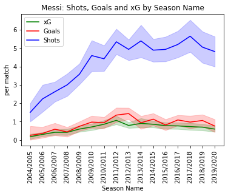
    

    
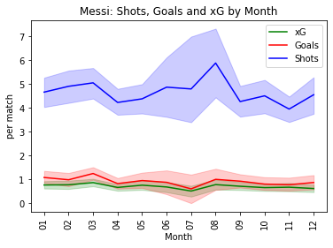
    

    
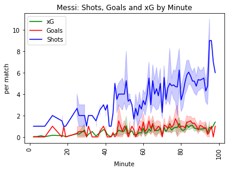
    

    
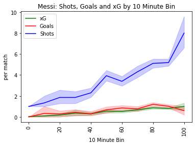
    

## Where shots are taken from

    
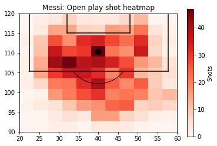
    

    
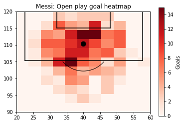
    

    
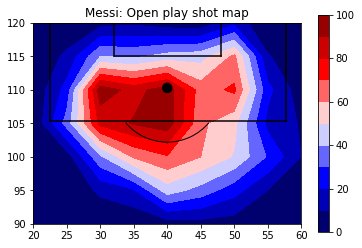
    

    
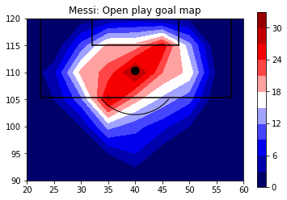
    

    
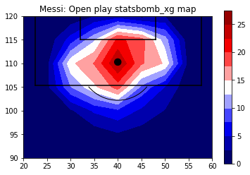
    

    
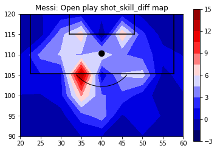
    

    
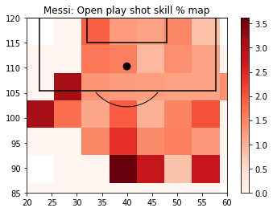
    

## Where shots end up

    
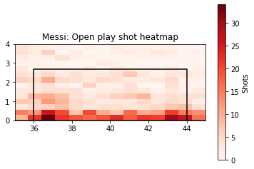
    

    
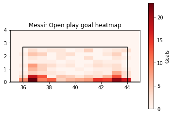
    

    
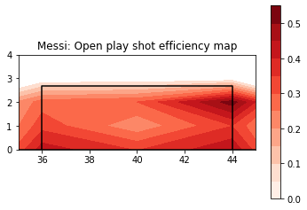
    

    
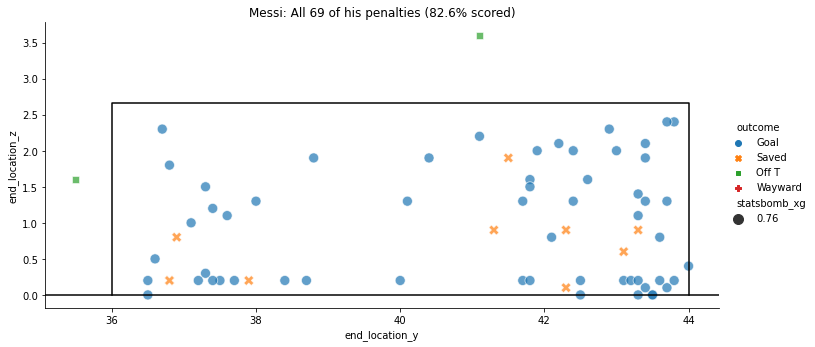
    

