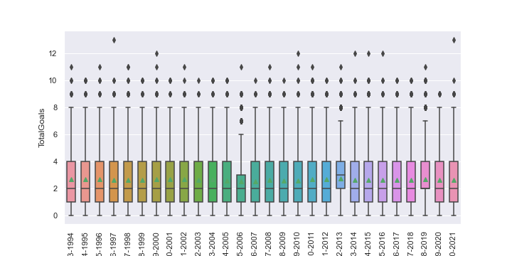

# European Club data - Analysis of goals

Computational notebook for this analysis can be found [here](../notebooks/club_01_goals_around_europe.ipynb)

## Problem

What patterns can we see in the goals scored around European club football?

Are there any inteersting outliers?

## Plan

I wanted to look at
* Overall pattern of data
* Distributions by Season, Month, Day of week, Country and Tier
* Highest and lowest values for Teams (home and away), Managers (home and away), Stadiums and Referees
* A geographic representation of goals

## Data

We have compiled 28 seasons of data on matches played in domestic club competitions.

Where possible we have included data on managers (home and away teams), referees and stadiums (name and lat/lon).

## Analysis

We can see the average (mean) number of goals scored in a match is 2.6. The most frequent (mode) and 50th percentile (median) value are both 2. Overall the data broadly follows a normal distribution. The left side is, obviously, truncated at zero and there a few very high scoring matches stretching out on the right.

There's not much variation between seasons, across months or by days of week.

We see a little variation between countries. Belgium, Germany, Holland, Scotland and Turkey see a few more goals. France, Greece and Spain a few less. England, Italy and Portugal come somewhere in the middle.

There's a little variation between tiers as well - especially 2nd tiers are a little down on goals.

I next looked at highest and lowest average (mean) goals - after a minumum of 30 games. In general, and perhaps as expected, it looks that certain teams and managers seem to have most impact on number of goals. There are a few stadiums of super clubs (Camp Nou, Santiago Bernabéu and Allianz Arena) which see more goals and a few referees (G Beaton & J Oldham on the high side, G Cain, O Yates & S Creighton on the low side) who show up in the top/bottom 30s.

The map really just shows the density of clubs in mid-Scotland and several parts of England, and also those super clubs mentioned above.

## Conclusions

Generally, the number of goals in matches is pretty consistent and follows predictable patterns however we break down the data.

When we start looking at groups with most or fewest goals, whilst not significantly far from the overall mean, we could speculate about Football Manager-esque scenarios where you are most (or least) likely to see goals...

Our fantasy gauranteed goal feast would be:

| |Home|Away|
|-----|-----|-----|
|Team|PSV Eindhoven|Erzurumspor|
|Manager|Unai Emery|Malky Mackay|
|Stadium|Camp Nou||
|Referee|G Beaton||

Our nightmare goal-free zone would be:

| |Home|Away|
|-----|-----|-----|
|Team|Badajoz*|Reus Deportiu|
|Manager|Gerhard Struber|Mikel Arteta|
|Stadium|Stade François Coty||
|Referee|G Cain||

(* this should be poor old Reus Deportiu but they can't play themselves so the next worst is Badajoz)

