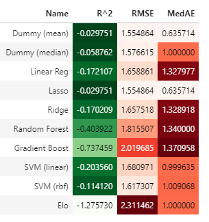
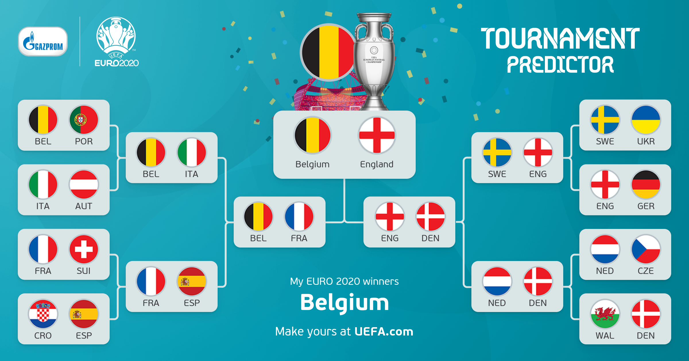

## Euro 2020 (2021) predictions

Computational notebooks for this analysis can be found [here](../notebooks/intl_02_euro_2020.ipynb) and [here](../notebooks/intl_02_euro_2020_live.ipynb)

__The challenge__

Inspired by my performance in an office World Cup predictor, I decided to take that [model](intl_01_world_cup_2018.md) and, hopefully, improve on it for Euro 2020.

I wasn't part of a similar workplace competition this time, so decided to enter UEFA's online prediction competition.

__The data__

I wanted to make this a supervised learning model. To this end I looked at past (and present) competitions and metrics for the countries involed.

I gathered fixtures/results from FBRef, stadium info from Wikipedia, Elo data from eloratings.net, and population and GDP data from the Penn tables (as now maintained by University of Groningen). The past tournaments and Elo ratings went back to 2000. Penn tables data was taken as per the end of the previous calendar year (e.g. 1999 figures for matches played in 2000).

__The method__

I focussed on what I felt were a handful of key indicators from previous work: Elo ratings and Home advantage (as used in WC 2018 predictions), and Experience, Population and GDP per capita (as used in Soccernomics by Kuper & Szymanski).

A random 20% of the past tournament matches were held for testing. This gave us 140 training samples and 35 test samples.

I opted for 2 target variables: Goal difference and Goal total. Goal diff is a metric widely used for predicting results but also capturing Goal total allows us (in theory) to simply convert into predicted match scores for both teams

Both targets were then fitted using a selection of 10 regression algorithms.

* Dummy (mean) - always predicts the mean of the training set
* Dummy (median) - always predicts the median of the training set
* Linear Regression
* Lasso
* Ridge
* Random Forest
* Gradient Boost
* Support Vector Machine (linear kernel)
* Support Vector Machine (rbf kernel)
* Custom Elo Regressor - approximates my World Cup 2018 model

(All but the EloRegressor had a standardised scaling applied to avoid any affects of differently scaled features)

From this, I selected the Elo model for Goal diff and Lasso for Goal total.

__The results__

The full dataset was assigned predictions, which could then be compared with actual results as they came in.

As part of this, "prediction points" were calculated based on the same citeria used in the World Cup comp. To recap, the original scoring system was 3 points for correct score, 2 points for correct goal difference, 1 point for correct result per game.

The predictions for Euro 2020 group matches were then entered into UEFA's Tournament and Match predictors.

<table><tr>
<td>
<table border="1">
  <thead>
    <tr><th>Group A</th></tr>
  </thead>
  <tbody>
    <tr><td>Italy</td></tr>
    <tr><td>Switzerland</td></tr>
    <tr><td>Turkey</td></tr>
    <tr><td>Wales</td></tr>
  </tbody>
</table>
</td>
<td>
<table border="1">
  <thead>
    <tr><th>Group B</th></tr>
  </thead>
  <tbody>
    <tr><td>Belgium</td></tr>
    <tr><td>Denmark</td></tr>
    <tr><td>Russia</td></tr>
    <tr><td>Finland</td></tr>
  </tbody>
</table>
</td>
<td>
<table border="1">
  <thead>
    <tr><th>Group C</th></tr>
  </thead>
  <tbody>
    <tr><td>Netherlands</td></tr>
    <tr><td>Ukraine</td></tr>
    <tr><td>Austria</td></tr>
    <tr><td>North Macedonia</td></tr>
  </tbody>
</table>
</td>
</tr><tr>
<td>
<table border="1">
  <thead>
    <tr><th>Group D</th></tr>
  </thead>
  <tbody>
    <tr><td>England</td></tr>
    <tr><td>Croatia</td></tr>
    <tr><td>Czech Republic</td></tr>
    <tr><td>Scotland</td></tr>
  </tbody>
</table>
</td>
<td>
<table border="1">
  <thead>
    <tr><th>Group E</th></tr>
  </thead>
  <tbody>
    <tr><td>Spain</td></tr>
    <tr><td>Poland</td></tr>
    <tr><td>Sweden</td></tr>
    <tr><td>Slovakia</td></tr>
  </tbody>
</table>
</td>
<td>
<table border="1">
  <thead>
    <tr><th>Group C</th></tr>
  </thead>
  <tbody>
    <tr><td>Germany</td></tr>
    <tr><td>France</td></tr>
    <tr><td>Portugal</td></tr>
    <tr><td>Hungary</td></tr>
  </tbody>
</table>
</td>
</tr><tr>
<td>
<table border="1">
  <thead>
    <tr><th>Third-placed teams</th></tr>
  </thead>
  <tbody>
    <tr><td>Portugal</td></tr>
    <tr><td>Austria</td></tr>
    <tr><td>Sweden</td></tr>
    <tr><td>Russia</td></tr>
    <tr><td>Turkey</td></tr>
    <tr><td>Czech Republic</td></tr>
  </tbody>
</table>
</td>
</tr></table>

From this I could extrapolate the knockout results as follows...

After the Group stage the knockout predictions were updated to the following...

Finally, here is a summary of all the models' predictions vs actual results...

<table border="1" class="dataframe">
  <thead>
    <tr style="text-align: right;">
      <th></th>
      <th>Matches played</th>
      <th>Points per game</th>
      <th>% correct result</th>
      <th>% correct goal diff</th>
      <th>% correct score</th>
      <th>Goals per game (predicted)</th>
      <th>Goals per game (actual)</th>
      <th>% games won (predicted)</th>
      <th>% games won (actual)</th>
    </tr>
  </thead>
  <tbody>
    <tr>
      <th>2000</th>
      <td>31</td>
      <td>0.71</td>
      <td>35%</td>
      <td>19%</td>
      <td>16%</td>
      <td>2.48</td>
      <td>2.84</td>
      <td>52%</td>
      <td>87%</td>
    </tr>
    <tr>
      <th>2004</th>
      <td>31</td>
      <td>0.74</td>
      <td>42%</td>
      <td>23%</td>
      <td>10%</td>
      <td>2.61</td>
      <td>2.74</td>
      <td>74%</td>
      <td>74%</td>
    </tr>
    <tr>
      <th>2008</th>
      <td>31</td>
      <td>0.74</td>
      <td>35%</td>
      <td>26%</td>
      <td>13%</td>
      <td>2.45</td>
      <td>2.61</td>
      <td>45%</td>
      <td>87%</td>
    </tr>
    <tr>
      <th>2012</th>
      <td>31</td>
      <td>0.84</td>
      <td>42%</td>
      <td>26%</td>
      <td>16%</td>
      <td>2.45</td>
      <td>2.58</td>
      <td>45%</td>
      <td>84%</td>
    </tr>
    <tr>
      <th>2016</th>
      <td>51</td>
      <td>0.86</td>
      <td>45%</td>
      <td>27%</td>
      <td>14%</td>
      <td>2.69</td>
      <td>2.31</td>
      <td>75%</td>
      <td>78%</td>
    </tr>
    <tr>
      <th>2021</th>
      <td>51</td>
      <td>1.04</td>
      <td>55%</td>
      <td>31%</td>
      <td>18%</td>
      <td>2.57</td>
      <td>2.78</td>
      <td>67%</td>
      <td>76%</td>
    </tr>
    <tr>
      <th>Training</th>
      <td>140</td>
      <td>0.81</td>
      <td>42%</td>
      <td>24%</td>
      <td>14%</td>
      <td>2.55</td>
      <td>2.64</td>
      <td>61%</td>
      <td>81%</td>
    </tr>
    <tr>
      <th>Testing</th>
      <td>35</td>
      <td>0.71</td>
      <td>34%</td>
      <td>26%</td>
      <td>11%</td>
      <td>2.57</td>
      <td>2.37</td>
      <td>56%</td>
      <td>86%</td>
    </tr>
    <tr>
      <th>Live</th>
      <td>51</td>
      <td>1.04</td>
      <td>55%</td>
      <td>31%</td>
      <td>18%</td>
      <td>2.57</td>
      <td>2.78</td>
      <td>67%</td>
      <td>76%</td>
    </tr>
    <tr>
      <th>Overall</th>
      <td>226</td>
      <td>0.85</td>
      <td>44%</td>
      <td>26%</td>
      <td>15%</td>
      <td>2.56</td>
      <td>2.63</td>
      <td>62%</td>
      <td>81%</td>
    </tr>
  </tbody>
</table>

I was really pleased with how the model performed. In the Uefa match predictor I placed in the top 20% of all competitors with 145 pts (vs 255 for the winner). As I didn't make any first score predictions or use the 2x boosters avaialable, I felt this was pretty reasonable. In the Uefa tournament predictor, I placed in the top 32% with 49ts, and in the top 9% with 24pts just for the knockout predictions. As with my World Cup model it under-predicted the number of goals and wins. But within a much more robust and test-able framework there's greater scope to refine this before the next tournament!