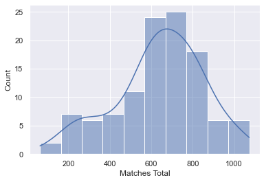

## Euro 2020 (2021) predictions

Computational notebook for this analysis can be found [here](../notebooks/intl_02_euro_2020.ipynb)

__The challenge__

Inspired by my performance in an office World Cup predictor, I decided to take that [model](intl_01_world_cup_2018.md) and, hopefully, improve on it for Euro 2020.

I used the same scoring method as 3 years ago, but because I wasn't part of a similar competition this time, I wanted to make it more real by also entering Uefa's own prediction competition.

To recap, the original scoring system was 3 points for correct score, 2 points for correct goal difference, 1 point for correct result per game.

The Uefa comp is simpler in that you just need to pick group stage positions/qualifiers and then knockout match winners, but I felt aiming for higher precision _should_ help.

__The data__

I wanted to make this more of a supervised learning model. To this end I looked at past (and present) competitions and metrics for the countries involed.

I gathered fixtures/results from FBRef, stadium info from Wikipedia, Elo data from eloratings.net, and population and GDP data from the Penn tables (as now maintained by University of Groningen). The past tournaments and Elo ratings went back to 2000. Penn tables data was taken as per the end of the previous calendar year (e.g. 1999 figures for matches played in 2000).

__The method__

I focussed on what I felt were a handful of key indicators from previous work: Elo ratings and Home advantage (as used in WC 2018 predictions), and Experience, Population and GDP per capita (as used in Soccernomics by Simon Kuper & Szymanski).

A random 20% of the past tournament matches were held for testing. This gave us 140 training samples and 35 test samples.

I opted for 2 target variables: Goal difference and Goal total. Goal diff is a metric widely used for predicting results but also capturing Goal total allows us (in theory) to simply convert into predicted match scores for both teams

Both targets were then fitted using a selection of 10 regression algorithms.

* Dummy (mean) - always predicts the mean of the training set
* Dummy (median) - always predicts the median of the training set
* Linear Regression
* Lasso
* Ridge
* Random Forest
* Gradient Boost
* Support Vector Machine (linear)
* Support Vector Machine (rbf)
* Custom Elo Regressor - approximates my WC 2018 model

(All but the EloRegressor had a standardised scaling applied to avoid any affects of differently scaled features)

From this, I selected the Elo model for Goal diff and Lasso for Goal total.

__The results__

The full dataset was assigned predictions, which could then be compared with actual results as they came in.

Before the 2021 tournament this can be summarised as follows...

<table border="1" class="dataframe">
  <thead>
    <tr style="text-align: right;">
      <th></th>
      <th>Matches played</th>
      <th>Points per game</th>
      <th>% correct result</th>
      <th>% correct goal diff</th>
      <th>% correct score</th>
      <th>Goals per game (predicted)</th>
      <th>Goals per game (actual)</th>
      <th>% games won (predicted)</th>
      <th>% games won (actual)</th>
    </tr>
  </thead>
  <tbody>
    <tr>
      <th>2000</th>
      <td>31</td>
      <td>0.71</td>
      <td>35%</td>
      <td>19%</td>
      <td>16%</td>
      <td>2.48</td>
      <td>2.84</td>
      <td>52%</td>
      <td>87%</td>
    </tr>
    <tr>
      <th>2004</th>
      <td>31</td>
      <td>0.74</td>
      <td>42%</td>
      <td>23%</td>
      <td>10%</td>
      <td>2.61</td>
      <td>2.74</td>
      <td>74%</td>
      <td>74%</td>
    </tr>
    <tr>
      <th>2008</th>
      <td>31</td>
      <td>0.74</td>
      <td>35%</td>
      <td>26%</td>
      <td>13%</td>
      <td>2.45</td>
      <td>2.61</td>
      <td>45%</td>
      <td>87%</td>
    </tr>
    <tr>
      <th>2012</th>
      <td>31</td>
      <td>0.84</td>
      <td>42%</td>
      <td>26%</td>
      <td>16%</td>
      <td>2.45</td>
      <td>2.58</td>
      <td>45%</td>
      <td>84%</td>
    </tr>
    <tr>
      <th>2016</th>
      <td>51</td>
      <td>0.86</td>
      <td>45%</td>
      <td>27%</td>
      <td>14%</td>
      <td>2.69</td>
      <td>2.31</td>
      <td>75%</td>
      <td>78%</td>
    </tr>
    <tr>
      <th>Training</th>
      <td>140</td>
      <td>0.81</td>
      <td>42%</td>
      <td>24%</td>
      <td>14%</td>
      <td>2.55</td>
      <td>2.64</td>
      <td>61%</td>
      <td>81%</td>
    </tr>
    <tr>
      <th>Testing</th>
      <td>35</td>
      <td>0.71</td>
      <td>34%</td>
      <td>26%</td>
      <td>11%</td>
      <td>2.57</td>
      <td>2.37</td>
      <td>56%</td>
      <td>86%</td>
    </tr>
    <tr>
      <th>Overall</th>
      <td>175</td>
      <td>0.79</td>
      <td>41%</td>
      <td>25%</td>
      <td>14%</td>
      <td>2.55</td>
      <td>2.58</td>
      <td>60%</td>
      <td>82%</td>
    </tr>
  </tbody>
</table>

TODO - UEFA PREDICTOR
