# Messi event data

Computational notebook for this analysis can be found [here](../notebooks/messi_01_finding_leo.ipynb)

## Problem

Where does Lionel Messi take his shots from? Where do they go? Does he differ from the average player? Has his shooting changed over time?

## Plan

I wanted to look at
* Shots, goals and expected goals
* General trends over time
* Plots of start and end locations

## Data

I have compiled 16 seasons of data on 485 matches played by Lionel Messi for Barcelona in La Liga.

I have performed some simple binning of the data and calculated metrics for shot efficiency (goals per shots) and skill (goals vs expected goals)

## Analysis

<table border="1" class="dataframe">
  <thead>
    <tr style="text-align: right;">
      <th> </th>
      <th>Messi</th>
      <th>Other players</th>
    </tr>
  </thead>
  <tbody>
    <tr>
      <th>shot</th>
      <td>4.457732</td>
      <td>20.290722</td>
    </tr>
    <tr>
      <th>goal</th>
      <td>0.915464</td>
      <td>2.476289</td>
    </tr>
    <tr>
      <th>statsbomb_xg</th>
      <td>0.700319</td>
      <td>2.392000</td>
    </tr>
    <tr>
      <th>shot_skill_diff</th>
      <td>0.215145</td>
      <td>0.084289</td>
    </tr>
    <tr>
      <th>shot_skill_%</th>
      <td>1.307210</td>
      <td>1.035238</td>
    </tr>
    <tr>
      <th>shot_efficiency_%</th>
      <td>0.205365</td>
      <td>0.122040</td>
    </tr>
  </tbody>
</table>

Messi take 18.0% of all shots taken in these matches

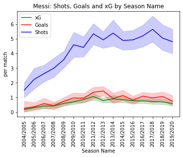
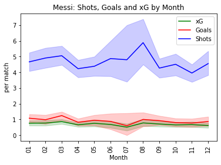
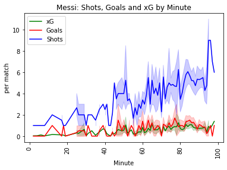

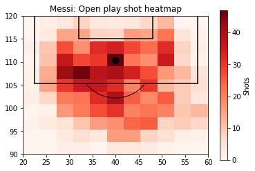
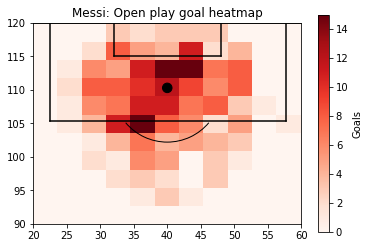

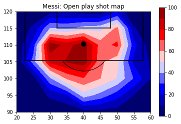
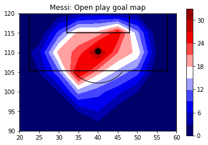

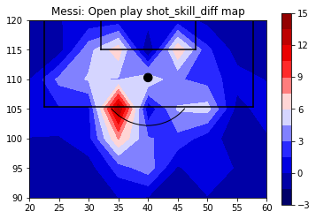
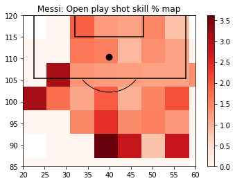

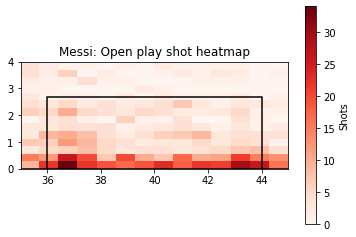
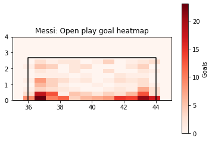

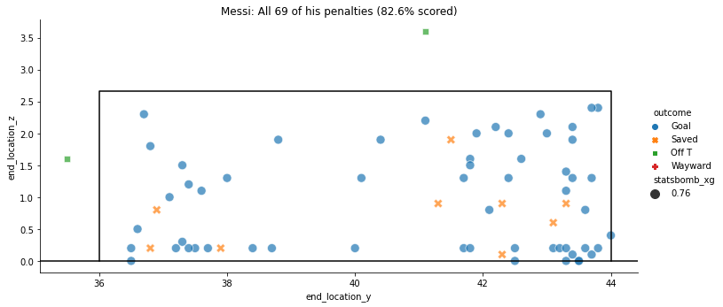

## Conclusions

